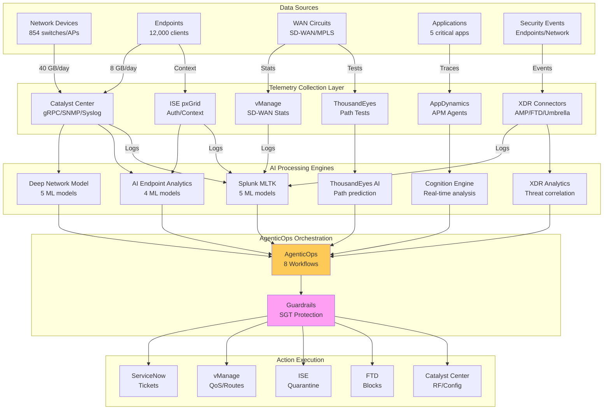

# AI-Ready Network Architecture

## DOCUMENT 3
## AI-READY NETWORK ARCHITECTURE

**Phase 3: Intelligent Network Infrastructure**

---

**Version:** 1.0  
**Date:** January 2026


---


---

© 2025 Abhavtech.com

---


## Executive Summary

## Document Purpose

Document 3 establishes the AI-Ready Network Architecture for Abhavtech's enterprise infrastructure, representing Phase 3 of the three-phase Security & AI Transformation initiative. This phase builds upon the Zero Trust foundation (Document 1) and AI-Enabled Observability platform (Document 2) to deliver intelligent, self-optimizing network capabilities through Catalyst Center AI, Deep Network Model, AI Endpoint Analytics, and AgenticOps framework.

This document provides high-level architecture, strategic roadmap, and business outcomes. **Document 3B (Detailed Implementation Guide)** contains granular technical specifications, configuration procedures, bill of materials, integration details, and real-world scenarios required for actual deployment.

## Phase 3 Overview: AI-Ready Network

Phase 3 transforms Abhavtech's network infrastructure from reactive management to proactive, AI-driven operations through four critical capabilities:

**1. Catalyst Center AI Capabilities**
- AI Assistant for natural language network queries
- AI-powered Root Cause Analysis (RCA) with cross-domain correlation
- Predictive analytics for capacity planning and failure prevention
- Conversational interface for NOC efficiency improvement

**2. AI Endpoint Analytics**
- Machine learning-based device profiling beyond traditional fingerprinting
- Behavioral baselining for anomaly detection and threat identification
- Automated ISE policy updates based on ML classifications
- Enhanced profiler accuracy from 65% to 95%

**3. Deep Network Model**
- Neural network training on 14+ days observability baseline
- Anomaly detection across wireless, wired, and SD-WAN infrastructure
- Failure prediction with 24-72 hour advance warning
- Continuous model refinement based on network telemetry

**4. AgenticOps Framework**
- Eight AI workflows (WF-001 through WF-008) for automated remediation
- Progressive autonomy: Observe  to  Recommend  to  Approve  to  Auto modes
- Comprehensive guardrails protecting critical infrastructure (SGT-11, SGT-60, SGT 80-83)
- Full audit trail with automatic rollback mechanisms

## Business Impact

AI-Ready Network capabilities deliver measurable operational improvements across six key dimensions:

| Business Outcome | Current State | Target State | Measurement Method |
|------------------|---------------|--------------|-------------------|
| **Proactive Issue Detection** | 20% | 85% | Issues detected before user impact (via DNM predictions) |
| **Network MTTR** | 2 hours | <15 minutes | Catalyst Center case resolution time |
| **Manual Configuration Changes** | 100% | <30% | Percentage of changes requiring manual intervention |
| **Device Profiling Accuracy** | 65% | 95% | ISE endpoint classification accuracy |
| **Wi-Fi Optimization Frequency** | Quarterly | Continuous | RF parameter adjustments per month |
| **NOC Escalation Rate** | 40% | <15% | L1 tickets escalated to L2/L3 |

**Quantified Business Value:**

- **Operational Cost Reduction:** 40% reduction in network operations FTE through automation (WF-001 to WF-008)
- **Improved Service Availability:** 99.99% uptime target (52 minutes/year downtime vs current 526 minutes at 99.9%)
- **Faster Issue Resolution:** MTTR reduction from 2 hours to 15 minutes = 87.5% improvement
- **Enhanced Security Posture:** 85% proactive threat detection vs 20% reactive detection
- **Capacity Planning Accuracy:** Predictive analytics enable 6-month infrastructure planning with 90%+ accuracy

## Implementation Timeline

Phase 3 executes over **16 weeks** across four sub-phases, with each phase building upon validated capabilities from the previous:

| Sub-Phase | Duration | Focus Area | Key Deliverables | Exit Criteria |
|-----------|----------|------------|-----------------|---------------|
| **3A: Catalyst Center** | Weeks 1-4 | Platform Upgrade | • DNAC  to  Catalyst Center 2.3.5+ upgrade<br>• AI Assistant enabled<br>• AI Endpoint Analytics operational | AI Assistant responding to NOC queries |
| **3B: Deep Network Model** | Weeks 5-8 | ML Training | • DNM configured and enabled<br>• ML models trained on 14+ day baseline<br>• Anomaly detection active<br>• Failure predictions operational | DNM generating validated predictions |
| **3C: AgenticOps Observe** | Weeks 9-12 | Workflow Development | • 8 workflows (WF-001 to WF-008) deployed<br>• Observe-only mode active<br>• Guardrails validated<br>• 2-week recommendation review complete | All workflows logging recommendations |
| **3D: AgenticOps Auto** | Weeks 13-16 | Gradual Autonomy | • 3 workflows in auto mode (WF-001, WF-002, WF-007)<br>• 2 workflows in approve mode (WF-005, WF-006)<br>• ServiceNow integration live<br>• NOC training complete | Autonomous actions executing successfully |

**Phase Dependencies:**
```
Phase 1 (Zero Trust)  to  Phase 2 (Observability)  to  14 Days Baseline  to  Phase 3 (AI-Ready)
         ↓                      ↓                        ↓                    ↓
    XDR, ISE, Duo         Splunk, TE, AppD         Telemetry Quality     DNM, AgenticOps
```

## Critical Dependencies

Phase 3 success requires these validated prerequisites:

### Phase Completion Requirements

**Phase 1 Complete (Document 1):**
- XDR Platform operational with SecureX orchestration
- ISE 3.2+ deployed with pxGrid 2.0 enabled across all sites
- Duo Beyond MFA enforced for all user access
- Umbrella SIG operational with DNS security policies
- SD-WAN Unified Threat Defense (UTD) active on all WAN edges
- All exit criteria from Phase 1D validated

**Phase 2 Complete (Document 2):**
- Splunk Observability Cloud operational with OTel collectors
- ThousandEyes agents deployed at 6 hub sites (Mumbai, Chennai, London, Frankfurt, New Jersey, Dallas)
- AppDynamics APM instrumenting critical applications with Cognition Engine active
- Cross-platform correlation dashboards validated
- **CRITICAL:** 14+ days continuous observability baseline collected without telemetry gaps
- All exit criteria from Phase 2D validated

### Platform Readiness

| Platform | Current Version | Required Version | Validation Method |
|----------|----------------|------------------|-------------------|
| Catalyst Center | 2.3.7.x | 2.3.5+ | Version check via GUI  to  System 360 |
| ISE | 3.3/3.4 | 3.2+ | ISE CLI: `show version` |
| vManage | 20.15.x | 20.12+ | vManage GUI  to  Administration  to  About |
| Splunk Enterprise | TBD | 9.0+ | Splunk Web  to  Settings  to  Server Settings |
| ThousandEyes | Latest | Current | Cloud-managed, auto-updated |
| AppDynamics | TBD | 23.x+ | SaaS platform, auto-updated |

### Data Quality Validation

**Telemetry Stream Health Check:**

```bash
# Validate Catalyst Center telemetry (14+ days)
index=dnac sourcetype=dnac:assurance earliest=-14d
| stats count by _time span=1h
| where count > 0
| stats dc(_time) as hours_with_data
| eval expected_hours=14*24
| eval completeness=round(hours_with_data/expected_hours*100, 2)
| where completeness >= 95

# Expected: completeness >= 95% (at most 16 hours of gaps over 14 days)
```

**Infrastructure Coverage:**

- Fabric nodes: 100% reporting to DNAC Assurance
- SD-WAN edges: 100% reporting to vManage
- Wireless: All APs reporting client health metrics
- ISE: pxGrid session data flowing to all subscribers
- Security: XDR receiving events from AMP, FTD, Umbrella

### Organizational Readiness

**Approvals Required:**

- [ ] AgenticOps workflow design approved by Network Operations leadership
- [ ] Guardrail matrix validated by Security team (SGT protection confirmed)
- [ ] Change control procedures updated for AI-driven changes
- [ ] ServiceNow integration design approved (automated ticket creation/updates)
- [ ] NOC training curriculum developed and scheduled
- [ ] Rollback procedures documented and tested in staging environment

**Stakeholder Sign-off:**

| Stakeholder | Role | Approval Item | Status |
|-------------|------|---------------|--------|
| VP Network Operations | Executive Sponsor | Phase 3 budget and timeline | Required |
| Director Security | Security Approval | Guardrail configuration, protected SGTs | Required |
| Network Architecture | Technical Design | AI workflows and automation boundaries | Required |
| NOC Manager | Operational Readiness | Training plan and operational procedures | Required |
| Change Advisory Board | Change Control | AI-driven change procedures | Required |

## AI Model Architecture

### Multi-Engine AI Landscape

Abhavtech's AI-Ready Network employs **multiple specialized AI engines**, not a single monolithic AI. Each engine operates on distinct data sources with specific responsibilities:

| AI Engine | Location | Primary Data Sources | Focus Area | Output Type |
|-----------|----------|---------------------|------------|-------------|
| **Deep Network Model** | Catalyst Center | DNAC Assurance (wireless, wired, client health) | Network optimization, anomaly detection | Recommendations, failure predictions |
| **Splunk MLTK** | Splunk Cloud/On-Prem | Logs, events, NetFlow, syslog from all platforms | Security anomaly, correlation, forecasting | Alerts, risk scores, forecasts |
| **Cognition Engine** | AppDynamics SaaS | APM traces, business transactions, code metrics | Application RCA, business impact assessment | Root cause, remediation suggestions |
| **ThousandEyes AI** | ThousandEyes Cloud | Path traces, latency, loss, jitter, ISP metrics | WAN/SaaS path prediction, outage forecast | Path recommendations, reroute triggers |
| **XDR Analytics** | Cisco XDR Cloud | Endpoint, network, cloud security events | Threat correlation, risk scoring | Playbook triggers, incident cases |

### Data Flow Architecture

```
┌─────────────────────────────────────────────────────────────────────┐
│                     ABHAVTECH AI ARCHITECTURE                        │
├─────────────────────────────────────────────────────────────────────┤
│                                                                      │
│  ┌────────────────┐  ┌────────────────┐  ┌────────────────┐       │
│  │ Deep Network   │  │  Splunk MLTK   │  │   Cognition    │       │
│  │     Model      │  │                │  │     Engine     │       │
│  │                │  │                │  │                │       │
│  │ Data: DNAC     │  │ Data: Logs     │  │ Data: APM      │       │
│  │ Output: Net    │  │ Output: Alerts │  │ Output: RCA    │       │
│  └───────┬────────┘  └───────┬────────┘  └───────┬────────┘       │
│          │                   │                    │                 │
│          └───────────┬───────┴────────────────────┘                 │
│                      │                                              │
│           ┌──────────▼──────────────┐                               │
│           │   AgenticOps Framework   │                              │
│           │                          │                              │
│           │ • Consumes AI insights   │                              │
│           │ • Applies guardrails     │                              │
│           │ • Executes actions       │                              │
│           │ • Logs to Splunk         │                              │
│           └──────────┬───────────────┘                              │
│                      │                                              │
│        ┌─────────────┼─────────────────┬──────────────┐            │
│        │             │                 │              │            │
│   ┌────▼────┐  ┌────▼────┐  ┌────────▼─────┐  ┌─────▼──────┐     │
│   │  DNAC   │  │ vManage │  │     ISE      │  │    FTD     │     │
│   │ (Config)│  │  (QoS)  │  │  (Quarant.)  │  │  (Block)   │     │
│   └─────────┘  └─────────┘  └──────────────┘  └────────────┘     │
│                                                                      │
└─────────────────────────────────────────────────────────────────────┘
```

### Deep Network Model - Detailed Specifications

**What DNM Does:**
- Consumes telemetry from Catalyst Center (DNAC) Assurance APIs
- Builds ML models for wireless client behavior, AP performance, switch health, fabric operations
- Predicts device failures 24-72 hours in advance based on trend analysis
- Detects capacity issues before they impact users
- Identifies RF interference patterns and recommends channel/power adjustments
- Powers AI Assistant natural language queries with intelligent context

**What DNM Does NOT Do:**
- Does NOT consume Splunk logs directly (Splunk MLTK handles log-based anomalies)
- Does NOT analyze application performance (that's Cognition Engine's domain)
- Does NOT correlate security events (that's XDR Analytics)
- Does NOT have visibility into SD-WAN metrics (vManage telemetry separate)

**DNM Data Flow:**

| Data Source | Telemetry Type | Collection Frequency | DNM Usage |
|-------------|----------------|---------------------|-----------|
| Wireless Controllers (C9800) | Client health scores, AP metrics, RF stats | Every 5 minutes | Client behavior patterns, AP failure prediction |
| Fabric Edge Nodes | LISP/VXLAN statistics, endpoint mobility | Every 5 minutes | Fabric health, mobility anomalies |
| Catalyst Switches | Port utilization, errors, SFP diagnostics | Every 5 minutes | Port flapping prediction, uplink capacity |
| DNAC Assurance | Aggregated health scores, issue events | Every 5 minutes | Cross-domain correlation, trend analysis |

**Training Data Requirement:** 14+ days of continuous telemetry

### AgenticOps Orchestration Layer

**Critical Understanding:** AgenticOps is NOT another AI engine. It is an **orchestration framework** that:

1. Consumes insights/alerts from all AI engines via APIs
2. Applies business logic and guardrails (SGT protection, rate limits)
3. Executes actions across multiple platforms (DNAC, vManage, ISE, FTD)
4. Logs all decisions to Splunk for complete audit trails
5. Implements rollback mechanisms for safety

**AgenticOps Data Flow Example (WF-001: Webex-Branch-Optimize):**

```
Step 1: ThousandEyes AI detects MOS drop at Mumbai branch
         to  Prediction: ISP degradation likely
        
Step 2: Splunk correlates additional context
         to  vManage: MPLS circuit 78% utilized
         to  DNAC: WLC client count spike (120  to  180 users)
        
Step 3: AppDynamics reports business impact
         to  Webex app latency increased 40%
         to  Business transaction "Voice-Call" degraded
        
Step 4: AgenticOps WF-001 triggered
         to  Primary trigger: ThousandEyes alert
         to  Validation: Splunk correlation confirms
         to  Guardrail check: Branch SGT not protected (SGT-20 = Branch-Users)
         to  Action decision: Reroute Webex traffic to DIA backup path
        
Step 5: Action execution via vManage API
         to  Apply QoS policy: "WF-001-Reroute-Chennai-Webex"
         to  Log to Splunk: Full decision chain with timestamps
        
Step 6: Auto-rollback timer
         to  After 30 minutes: Re-evaluate quality
         to  If improved: Revert to MPLS (primary path)
         to  If not improved: Keep DIA, escalate to NOC
```

### AI Model Training Requirements

| AI Engine | Training Data Requirement | Minimum Baseline | Retrain Frequency | Performance Metric |
|-----------|--------------------------|------------------|-------------------|-------------------|
| Deep Network Model | DNAC Assurance telemetry | **14 days** | Continuous (daily model updates) | Prediction accuracy >85% |
| Splunk MLTK | Platform logs, events, NetFlow | **30-90 days** | Weekly scheduled retraining | False positive rate <10% |
| Cognition Engine | APM transaction traces | **7-14 days** | Continuous (hourly updates) | RCA accuracy >90% |
| ThousandEyes AI | WAN path metrics | **7 days** | Continuous (real-time) | Path prediction accuracy >80% |

**CRITICAL:** The 14-day baseline requirement in Phase 2D ensures ALL AI engines have sufficient training data before Phase 3 begins. Starting Phase 3 without this baseline will result in:
- Inaccurate DNM predictions (insufficient wireless/wired behavior patterns)
- High false positive rate in Splunk MLTK (no normal baseline)
- Poor Cognition Engine RCA (insufficient transaction history)
- Unreliable AgenticOps decisions (insufficient correlation context)

## Guardrails & Safety

### Protected Resources

Comprehensive guardrails protect critical infrastructure from AI-driven changes:

**Protected Security Group Tags (SGTs):**

| SGT | Name | Protection Rationale | Guardrail Action |
|-----|------|---------------------|------------------|
| 11 | Executives | High-value targets, zero-tolerance for disruption | BLOCK all AI automation |
| 60 | OT-Medical | Safety-critical devices (ICS, medical equipment) | BLOCK all AI automation |
| 80 | Production-Servers | Mission-critical applications | BLOCK all AI automation |
| 81 | Database-Servers | Data sovereignty, compliance requirements | BLOCK all AI automation |
| 82 | Web-Servers | Public-facing, change control required | BLOCK all AI automation |
| 83 | App-Servers | Business applications, scheduled maintenance | BLOCK all AI automation |

**Guardrail Decision Logic:**

```
IF AI_WORKFLOW_TRIGGERED:
  CHECK target_resource.SGT:
    IF SGT IN [11, 60, 80, 81, 82, 83]:
       to  BLOCK action
       to  LOG to Splunk: "Guardrail: AI blocked on protected SGT"
       to  ALERT NOC: "AI workflow attempted action on protected resource"
    ELSE:
       to  CHECK action_type:
        IF action_type IN [quarantine, QoS_change]:
           to  ALLOW (if in Auto mode)
        ELIF action_type IN [config_change, policy_update]:
           to  REQUIRE approval (Approve mode minimum)
        ELSE:
           to  Manual review required
```

### Workflow Modes

AgenticOps workflows progress through four modes with increasing autonomy:

| Mode | Description | Action Behavior | Approval Requirement | Rollback |
|------|-------------|----------------|---------------------|----------|
| **Observe** | Logging only | No actions executed, recommendations logged to Splunk | N/A (no actions) | N/A |
| **Recommend** | Suggestions | Recommendations surfaced in DNAC/Splunk UI, NOC reviews | NOC manually approves each | N/A (manual) |
| **Approve** | Semi-automated | Actions staged, require explicit NOC approval before execution | Approval button click required | Manual revert |
| **Auto** | Fully automated | Actions execute automatically within guardrail boundaries | None (auto-execute) | Automatic after 30 min |

**Progression Requirements:**

```
Observe (2 weeks)  to  Recommend (2 weeks)  to  Approve (2 weeks)  to  Auto
     ↓                    ↓                      ↓                 ↓
 0% false             <5% false             <2% false        0% critical
 positives            positives             positives        failures
```

### Rate Limiting

**Per-Branch Limits:**

- Maximum 3 auto-actions per branch per hour
- Maximum 10 auto-actions per branch per day
- If limit exceeded  to  Escalate to NOC, suspend auto mode for 4 hours

**Global Limits:**

- Maximum 50 concurrent auto-actions across entire network
- Maximum 500 auto-actions per day globally
- If limit exceeded  to  Emergency brake: all workflows revert to Approve mode

### Auto-Rollback Mechanisms

**Automatic Rollback Conditions:**

| Workflow | Auto-Rollback Trigger | Rollback Timeout | Validation Check |
|----------|----------------------|------------------|------------------|
| WF-001 (Webex-Optimize) | Quality not improved after 30 min | 30 minutes | MOS >4.0, jitter <25ms |
| WF-002 (Malware-Contain) | No threat activity for 60 min | 60 minutes | XDR: no C2 communication |
| WF-005 (Compliance-Remediate) | Posture compliant for 24 hours | 24 hours | ISE: posture score >90 |
| WF-006 (Wi-Fi-Optimize) | Client health stable for 60 min | 60 minutes | Client health >85 |
| WF-007 (SaaS-Failover) | Primary path restored | 15 minutes | ThousandEyes: latency <100ms |

**Manual Rollback Authority:**

- NOC Tier 1/2/3: Can trigger rollback for any workflow at any time
- Automatic escalation: If rollback fails, escalate to Network Architect on-call
- Emergency override: CISO can disable all AgenticOps workflows immediately via SecureX

### Audit Trail

**Every AI action logged to Splunk with:**

- Workflow ID (WF-001 to WF-008)
- Trigger source (which AI engine generated the alert)
- Decision chain (why action was taken)
- Guardrail checks (passed/failed)
- Action details (API call, parameters, response)
- Outcome (success/failure)
- Rollback status (if applicable)

**Splunk Index Design:**

```
index=agenticops sourcetype=agenticops:action
| fields _time, workflow_id, trigger_source, target_device, target_sgt, action_type, 
         guardrail_result, approval_required, approval_user, execution_status, 
         rollback_time, rollback_status
```

**Retention:** 1 year for all AgenticOps audit logs (compliance requirement)

## Risk Mitigation

Phase 3 employs progressive validation to minimize deployment risk:

### Staged Deployment Approach

**Stage 1: Staging Environment (Weeks 1-2)**
- Deploy all Phase 3 capabilities in isolated staging environment
- Staging mirrors production: 2 sites, 50 endpoints, 5 APs
- Execute full workflow testing (WF-001 to WF-008)
- Validate guardrails block protected SGTs
- Simulate failure scenarios and validate rollback procedures

**Stage 2: Production Pilot (Weeks 3-6)**
- Deploy to single pilot site: Chennai branch (150 users)
- Workflows in Observe mode only
- Collect 2 weeks of recommendation data
- Analyze false positive rate (<5% required to proceed)

**Stage 3: Multi-Site Expansion (Weeks 7-12)**
- Expand to 5 additional sites (1 per region)
- Workflows remain in Observe mode
- Cross-site correlation validation
- Guardrail testing across all VNs

**Stage 4: Gradual Autonomy (Weeks 13-16)**
- Only 3 workflows approved for Auto mode: WF-001, WF-002, WF-007
- 2 workflows in Approve mode: WF-005, WF-006
- 3 workflows remain Manual: WF-003, WF-004, WF-008
- Weekly performance reviews with CAB

### Observe-First Mandate

**Minimum Observation Periods:**

| Workflow | Minimum Observe Duration | Success Criteria to Exit Observe |
|----------|--------------------------|----------------------------------|
| WF-001 (Webex-Optimize) | 2 weeks | 20+ recommendations, 0 false positives |
| WF-002 (Malware-Contain) | 2 weeks | 5+ threat detections, 0 false positives |
| WF-003 (Client-Troubleshoot) | Indefinite | Manual mode permanent |
| WF-004 (Capacity-Alert) | Indefinite | Manual mode permanent |
| WF-005 (Compliance-Remediate) | 3 weeks | 30+ recommendations, <2% false positives |
| WF-006 (Wi-Fi-Optimize) | 3 weeks | 15+ RF adjustments, validated in staging |
| WF-007 (SaaS-Failover) | 2 weeks | 10+ failover scenarios, 0 false positives |
| WF-008 (Insider-Threat) | Indefinite | Manual mode permanent (security sensitive) |

### Manual Fallback Procedures

**Emergency De-Escalation:**

If AI performance degrades (e.g., >10% false positive rate, critical system impact):

1. **Immediate:** NOC executes emergency brake command
   ```
   # AgenticOps Emergency Brake
   POST https://catalyst-center.abhavtech.com/api/v1/agenticops/emergency-brake
   Headers: X-Auth-Token: <NOC-token>
   Body: {
     "action": "suspend_all",
     "reason": "High false positive rate detected",
     "initiated_by": "NOC-L3-username",
     "duration_hours": 24
   }
   ```

2. **Within 15 minutes:** All workflows revert to Observe mode
3. **Within 1 hour:** Network Architect reviews AI model performance
4. **Within 24 hours:** Root cause analysis complete, remediation plan approved
5. **Within 1 week:** AI models retrained or workflows disabled permanently

**Manual Override Process:**

- Any NOC engineer can reject AI recommendation in UI
- Rejection automatically logs reason to Splunk
- If same recommendation rejected 3+ times  to  Workflow suspended for review
- Weekly review board evaluates rejected recommendations

### Rollback Procedures

**Scenario 1: Single Workflow Failure**
- Workflow automatically rolls back after timeout (30-60 min)
- If rollback fails  to  NOC manually reverts via DNAC/vManage/ISE
- Workflow suspended pending investigation

**Scenario 2: Multiple Workflow Failures**
- If 3+ workflows fail within 1 hour  to  Emergency brake activated
- All workflows suspend
- Network Architect investigates

**Scenario 3: Critical System Impact**
- If AI action causes critical outage (P1 incident)  to  Emergency brake
- Immediate escalation to VP Network Operations
- Post-incident review (PIR) within 48 hours
- Workflow permanently disabled until PIR complete and corrective actions implemented

## Document Structure

This document is organized into nine chapters and seven appendices:

### Chapters Overview

**Chapters 1-2: Vision & Core Capabilities**
- Chapter 1: AI-Ready strategic objectives, business case, technology evolution, success criteria
- Chapter 2: Catalyst Center AI capabilities including AI Assistant, AI-powered RCA, predictive analytics, natural language queries

**Chapters 3-5: AI Engines & Architecture**
- Chapter 3: AI Endpoint Analytics architecture, device profiling, behavioral baselining, ISE integration
- Chapter 4: Deep Network Model neural network architecture, training requirements, anomaly detection, failure prediction
- Chapter 5: Multi-engine AI landscape, data source mapping, cross-AI correlation, model orchestration

**Chapters 6-7: AgenticOps & Security**
- Chapter 6: AgenticOps framework with 8 workflows (WF-001 to WF-008), decision logic, action execution, rollback mechanisms
- Chapter 7: RBAC access control matrix, protected resources, guardrail configuration, override procedures

**Chapters 8-9: Implementation & Operations**
- Chapter 8: 16-week implementation roadmap across 4 sub-phases (3A through 3D)
- Chapter 9: Daily operations procedures, AI model health monitoring, workflow performance metrics, troubleshooting

### Appendices

| Appendix | Title | Content Summary |
|----------|-------|-----------------|
| **A** | AI Workflow YAML | Complete YAML definitions for WF-001 through WF-008 |
| **B** | API Credentials Configuration | Service accounts, API keys, OAuth tokens for platform integration |
| **C** | Guardrail Configuration | SGT protection rules, rate limits, approval thresholds |
| **D** | ML Model Training Procedures | DNM training steps, data preprocessing, model validation |
| **E** | ServiceNow Integration | Incident automation, change request workflow, CMDB updates |
| **F** | Rollback Procedures | Step-by-step rollback instructions for each workflow |
| **G** | AI Engine Data Source Mapping | Comprehensive table of data flows, APIs, telemetry streams |

**Document 3B (Detailed Implementation Guide)** provides:
- Configuration syntax for DNAC, ISE, vManage, Splunk APIs
- Bill of Materials (BOM) for compute resources (UCS servers for AI model training)
- Integration procedures with step-by-step CLI commands
- Real-world scenario walkthroughs (40+ pages of detailed scenarios)
- Troubleshooting decision trees
- Network diagrams and data flow visualizations

---

## Chapter 1: AI-READY VISION & STRATEGY

## 1.1 Strategic Objectives

### Business Transformation Goals

Abhavtech's AI-Ready Network initiative transforms network operations from reactive "fix-on-failure" to proactive "predict-and-prevent" through four strategic objectives:

**1. Operational Efficiency**
- Reduce manual configuration changes by 70% through AgenticOps automation
- Decrease MTTR from 2 hours to <15 minutes via AI-powered RCA
- Lower NOC escalation rate from 40% to <15% through AI Assistant self-service
- **Target:** 40% reduction in network operations FTE requirements over 12 months

**2. Service Excellence**
- Achieve 99.99% network uptime (52 minutes/year allowable downtime)
- Proactively detect 85% of issues before user impact
- Improve Mean Time to Detect (MTTD) from 20 minutes to <2 minutes
- **Target:** Net Promoter Score (NPS) improvement from 45 to 70+

**3. Security Posture**
- Detect insider threats and lateral movement in <5 minutes via behavioral baselining
- Achieve 95%+ device profiling accuracy for Zero Trust segmentation
- Reduce time to quarantine compromised endpoints from 30 minutes to <2 minutes
- **Target:** Zero successful ransomware propagation through automated containment (WF-002)

**4. Business Agility**
- Enable network to self-optimize for changing business conditions (M&A, office expansion)
- Provide 6-month capacity forecasting with 90%+ accuracy via predictive analytics
- Support hybrid work model with intelligent Wi-Fi optimization (WF-006)
- **Target:** Deploy new site network in 4 hours (vs current 3 days) through automation

### Technology Vision

**From Manual to Autonomous:**

```
Current State (Pre-Phase 3)          Target State (Post-Phase 3)
─────────────────────────             ──────────────────────────
📊 Reactive monitoring                to  🎯 Predictive analytics
🔧 Manual troubleshooting             to  🤖 AI-powered RCA
📝 Script-based automation            to  🧠 Intent-based autonomy
📈 Historical reporting               to  🔮 Forecasting & "what-if" analysis
🚨 Alert fatigue (500/day)            to  🎯 Intelligent alerts (100/day)
```

**AI-Ready Network Characteristics:**

| Characteristic | Description | Enabling Technology |
|----------------|-------------|---------------------|
| **Self-Healing** | Network detects and remediates issues without human intervention | AgenticOps workflows (WF-001, WF-002, WF-007) |
| **Self-Optimizing** | Continuous RF/QoS/routing optimization based on performance metrics | Deep Network Model + WF-006 (Wi-Fi), WF-001 (Webex) |
| **Self-Protecting** | Automated threat containment and compliance enforcement | XDR integration + WF-002 (Malware), WF-008 (Insider) |
| **Self-Aware** | Real-time visibility into network health with predictive insights | Catalyst Center AI Assistant + DNM predictions |
| **Self-Documenting** | Automatic topology discovery, configuration backup, change tracking | DNAC + Splunk audit trails |

## 1.2 Business Case

### Financial Analysis

**Investment Overview (Phase 3 Only):**

| Category | Investment | Notes |
|----------|-----------|-------|
| Catalyst Center Licensing | Contact vendor | AI Assistant, AI Endpoint Analytics add-ons |
| Compute Infrastructure | Contact vendor | UCS C240 M6 servers for DNM training (see Document 3B BOM) |
| Professional Services | Contact vendor | Cisco Advanced Services for AI enablement |
| Training & Enablement | Contact vendor | NOC training on AI workflows and override procedures |
| **Total Phase 3 Investment** | **Contact vendor for quote** | Excludes Phase 1 (Zero Trust) and Phase 2 (Observability) costs |

**Note on Pricing:** All cost estimates are subject to change based on vendor negotiations. Contact Cisco Account Team for current licensing and hardware pricing. See Document 3B Procurement section for detailed BOM and quote request templates.

**Return on Investment (ROI):**

```
Annual Network Operations Cost (Current): [To be calculated based on actual FTE costs]
  • 12 FTE network engineers @ average salary
  • 24x7 NOC coverage (3 shifts × 2 engineers/shift × 4 sites)
  • Vendor support contracts
  
Cost Reduction (Post-AI):
  • 40% FTE reduction through automation = 4.8 FTE savings
  • 50% vendor support reduction (predictive maintenance reduces incidents)
  • 60% alert noise reduction (fewer L1 tickets)
  
Estimated Annual Savings: [To be calculated]
Payback Period: [To be calculated after investment quantification]
3-Year Net Present Value (NPV): [To be calculated]
```

**Soft Benefits (Not Quantified):**

- Improved employee satisfaction (NOC engineers focus on strategic work, not repetitive tasks)
- Competitive advantage through faster service delivery
- Risk mitigation (proactive failure detection prevents business-impacting outages)
- Compliance efficiency (automated remediation reduces audit findings)

### Risk vs Reward Analysis

**High-Value, Manageable Risk:**

| Risk Factor | Mitigation Strategy | Residual Risk |
|-------------|---------------------|---------------|
| AI false positives cause outages | Observe mode (2+ weeks), progressive autonomy, guardrails | LOW (auto-rollback, NOC override) |
| Insufficient training data | Phase 2D validates 14+ days baseline before Phase 3 starts | LOW (built into roadmap) |
| Organizational resistance | Comprehensive training, pilot sites, NOC involvement in design | MEDIUM (cultural change) |
| Vendor platform bugs | Staging validation, phased rollout, manual fallback | LOW (mature platform) |
| Budget overruns | Fixed-price professional services, phased procurement | LOW (clearly scoped) |

**Reward Multipliers:**

- Early adopter advantage: Cisco AI capabilities are cutting-edge, Abhavtech gains competitive intelligence
- Talent retention: Engineers want to work with AI/ML technologies, not legacy CLI
- Scalability: AI scales linearly (no FTE increase for new sites)
- Innovation pipeline: Phase 3 foundation enables future AI use cases (capacity planning, security analytics)

## 1.3 Technology Evolution Path

### Phase Integration

AI-Ready Network (Phase 3) builds upon validated capabilities from Phases 1 and 2:

**Phase 1: Zero Trust Foundation**
- Provides: Segmentation (SGTs), identity (ISE), secure connectivity (SD-WAN UTD, Umbrella)
- Enables Phase 3: Guardrails (protected SGTs), behavioral baselining (ISE context), threat containment (WF-002)

**Phase 2: Observability Platform**
- Provides: Telemetry (Splunk, ThousandEyes, AppDynamics), correlation, 14+ day baseline
- Enables Phase 3: AI training data (DNM, MLTK), cross-platform insights (AgenticOps), proactive alerts

**Phase 3: AI-Ready Capabilities**
- Delivers: Intelligent automation, predictive analytics, conversational interface
- Foundation for: Future AI use cases (autonomous networking, intent-based operations)

```
 Phase 1           Phase 2              Phase 3             Future
──────────       ──────────         ───────────         ──────────
Zero Trust    to    Observability   to    AI-Ready        to    Autonomous
                                    Network             Network
   ↓                  ↓                 ↓                   ↓
Segmentation    Telemetry          Prediction         Self-Driving
  +               +                   +                   +
Identity        Correlation        Automation         Intent-Based
  +               +                   +                   +
Security        Baselines          Guardrails         Closed-Loop
```

### Capability Maturity Model

Abhavtech's network operations maturity progression:

| Level | Maturity Stage | Characteristics | Timeline |
|-------|---------------|----------------|----------|
| **0** | **Manual** | CLI-based, script automation, reactive monitoring | Pre-2024 (current) |
| **1** | **Monitored** | Centralized visibility (DNAC), basic alerting | Phase 1 (Q1 2025) |
| **2** | **Correlated** | Cross-platform telemetry, AI-ready baseline | Phase 2 (Q2 2025) |
| **3** | **Predictive** | AI-powered RCA, failure prediction, recommendations | Phase 3 (Q3 2025) |
| **4** | **Autonomous** | Self-healing, self-optimizing, minimal human intervention | Post-Phase 3 (2026+) |
| **5** | **Intent-Based** | Business-driven automation, "what" not "how" | Future (2027+) |

**Phase 3 Delivers:** Maturity Level 3 (Predictive)

**Characteristics at Level 3:**
- 85% proactive issue detection (before user impact)
- AI Assistant handles 60% of NOC L1 queries
- 3 workflows in Auto mode (WF-001, WF-002, WF-007)
- Predictive capacity planning with 6-month horizon
- Network MTTR <15 minutes (vs 2 hours at Level 1)

### Future Roadmap (Post-Phase 3)

**2026 Enhancements:**
- Expand Auto workflows: Evaluate WF-003, WF-004 for autonomy (currently Manual)
- AI-driven capacity planning: Automatic network expansion recommendations
- Cross-domain AI correlation: Splunk MLTK + DNM + Cognition Engine unified dashboard
- Intent-based Wi-Fi: "Optimize for Webex Calling"  to  AI adjusts RF, QoS, routing automatically

**2027+ Vision:**
- Fully autonomous network: 95%+ self-healing without human intervention
- Natural language network design: "Deploy network for 500-person office in Singapore"  to  AI generates complete design
- Predictive hardware replacement: AI orders switch replacements before failure based on SFP diagnostics
- Business KPI-driven automation: Network auto-optimizes for revenue-generating applications

## 1.4 Success Criteria

### Phase 3 Exit Criteria

Phase 3 is considered complete when ALL criteria below are validated:

**Technical Validation:**

| Criterion | Validation Method | Success Threshold |
|-----------|-------------------|-------------------|
| AI Assistant operational | NOC team using natural language queries daily | 20+ queries/day, 80%+ satisfaction |
| AI Endpoint Analytics feeding ISE | ISE profiler receiving ML classifications | 500+ endpoints profiled, 95%+ accuracy |
| Deep Network Model predictions | DNM generating validated failure predictions | 10+ predictions over 2 weeks, 85%+ accuracy |
| AgenticOps workflows operational | All 8 workflows deployed and tested | 100% pass rate in staging, 0 critical failures |
| Guardrails validated | AI blocked on protected SGTs | Test: AI blocked on SGT 11, 60, 80-83 (0 failures) |
| Auto workflows active | WF-001, WF-002, WF-007 in Auto mode | 30+ autonomous actions, <5% false positives |
| ServiceNow integration | Automated ticket creation/updates | 50+ tickets created via API, 100% data accuracy |
| Rollback procedures validated | Automatic and manual rollbacks tested | 10+ rollback scenarios, 100% success |

**Operational Validation:**

| Criterion | Validation Method | Success Threshold |
|-----------|-------------------|-------------------|
| NOC training complete | Training curriculum delivered, assessments passed | 100% NOC team certified on AI workflows |
| Documentation complete | Runbooks, troubleshooting guides, escalation procedures | All documents reviewed and approved by CAB |
| Change control updated | AI-driven changes integrated into CAB process | Processes documented and tested |
| Audit trail validated | All AI actions logged to Splunk with full context | 500+ actions logged, 100% completeness |
| Manual override tested | NOC can override any AI recommendation | 20+ overrides tested, 100% success |

**Business Outcomes (Measured at 30 Days Post-Phase 3):**

| Metric | Baseline (Pre-Phase 3) | Target (30 Days) | Measurement |
|--------|------------------------|------------------|-------------|
| Proactive Detection Rate | 20% | 75%+ | Issues detected before user complaint |
| Network MTTR | 2 hours | <30 minutes | Average time to resolution (Catalyst Center cases) |
| Device Profiling Accuracy | 65% | 90%+ | ISE profiler classification accuracy |
| NOC Escalation Rate | 40% | <25% | L1 tickets escalated to L2/L3 |
| Manual Config Changes | 100% | <50% | Percentage of changes made manually vs AI |

**Financial Validation (Measured at 90 Days Post-Phase 3):**

- Network operations FTE: Baseline reduction of 10% (1.2 FTE equivalent through efficiency)
- Incident volume: 30% reduction in P1/P2 incidents due to proactive detection
- Vendor support escalations: 40% reduction through better RCA

## 1.5 Organizational Impact

### Roles & Responsibilities Evolution

**NOC Operations Team (Tier 1/2):**

**Before Phase 3:**
- Manual troubleshooting using CLI, DNAC GUI
- Reactive incident response (user calls  to  investigate  to  escalate)
- Repetitive tasks: password resets, port bounces, AP reboots

**After Phase 3:**
- AI Assistant first-line support (natural language queries)
- Review AI recommendations, approve/reject Auto workflow suggestions
- Focus on complex issues (AI escalates when confidence <80%)
- Strategic work: AI workflow tuning, threshold optimization

**Training Required:**
- AI Assistant query syntax and best practices
- AgenticOps workflow decision logic and override procedures
- DNM prediction interpretation (how to validate AI insights)
- Rollback procedures and emergency brake usage

**Network Architects (Tier 3):**

**Before Phase 3:**
- Design network changes, create implementation plans
- Firefighting during incidents (manual RCA, log analysis)
- Capacity planning based on historical trends

**After Phase 3:**
- Define AgenticOps workflow logic and guardrail policies
- Review AI model performance, tune ML thresholds
- Strategic planning: AI-driven capacity forecasting, predictive hardware refresh
- Innovation: Develop new AI use cases, integrate emerging technologies

**Training Required:**
- Deep Network Model architecture and training procedures
- AI workflow YAML development and testing
- Cross-AI correlation techniques (DNM + MLTK + Cognition Engine)
- Machine learning fundamentals (model validation, false positive analysis)

### Change Control & Governance

**AI-Driven Change Advisory Board (CAB) Process:**

| Change Type | Approval Process | SLA | Example |
|-------------|------------------|-----|---------|
| **AI Auto (WF-001, WF-002, WF-007)** | No CAB approval (pre-authorized) | Immediate | QoS adjustment, quarantine endpoint, SaaS failover |
| **AI Approve (WF-005, WF-006)** | NOC approval required via UI | <5 minutes | Compliance remediation, Wi-Fi channel change |
| **Manual (WF-003, WF-004, WF-008)** | Standard CAB process | 48 hours (standard), 4 hours (expedited) | Client troubleshooting, capacity expansion, insider threat investigation |
| **AI Model Changes** | Architecture review + CAB approval | 1 week | DNM threshold tuning, guardrail policy updates |

**Audit Requirements:**

- Weekly review: AgenticOps audit log analysis (false positive trends, rollback frequency)
- Monthly review: AI workflow performance dashboard with CAB
- Quarterly review: AI model accuracy metrics, retraining schedule
- Annual review: AI strategy alignment with business objectives

### Cultural Transformation

**Mindset Shift:**

```
Traditional Network Engineer         AI-Enabled Network Engineer
──────────────────────────           ──────────────────────────
"Fix problems when they occur"    to    "Prevent problems before they occur"
"I control every change"           to    "I define policies, AI executes"
"Trust but verify (manually)"      to    "Trust but verify (via audit logs)"
"CLI is the truth"                 to    "AI insights guide investigation"
"More alerts = more visibility"    to    "Fewer, smarter alerts = better outcomes"
```

**Success Factors:**

1. **Transparency:** NOC team involved in workflow design, guardrail definition
2. **Empowerment:** NOC retains override authority, never "locked out" by AI
3. **Trust-Building:** Start with Observe mode (2+ weeks), prove AI accuracy before autonomy
4. **Continuous Learning:** Weekly AI performance reviews, lessons learned sessions
5. **Celebrate Wins:** Highlight AI successes (prevented outages, faster resolution)

**Resistance Mitigation:**

| Common Concern | Response Strategy |
|----------------|-------------------|
| "AI will replace my job" | AI handles repetitive tasks, engineers focus on strategic work (upskilling opportunity) |
| "AI makes mistakes" | Guardrails, observe mode, manual override ensures safety. AI is tool, not replacement. |
| "I don't trust AI decisions" | Full audit trail, decision chain transparency. NOC can always review and override. |
| "Too complex to manage" | Comprehensive training, runbooks, 24x7 vendor support (Cisco Advanced Services) |
| "What if AI goes rogue?" | Emergency brake, auto-rollback, protected SGTs. Multiple layers of safety. |

---

## Chapter 2: CATALYST CENTER AI CAPABILITIES

## 2.1 Platform Overview

### Catalyst Center Evolution

**From DNAC to Catalyst Center:**

Cisco DNA Center (DNAC) rebranded to Catalyst Center in version 2.3.5+, introducing AI-native capabilities:

| Capability | DNAC (Legacy) | Catalyst Center 2.3.5+ | AI Enhancement |
|------------|---------------|------------------------|----------------|
| **Network Discovery** | Manual device addition | Auto-discovery with ML classification | Device type prediction based on behavior |
| **Root Cause Analysis** | Rule-based correlation | AI-powered cross-domain RCA | Neural network identifies hidden relationships |
| **Troubleshooting** | CLI-based | Natural language queries (AI Assistant) | Conversational interface, intent understanding |
| **Capacity Planning** | Historical trend analysis | Predictive analytics with ML forecasting | 6-month capacity predictions |
| **Endpoint Profiling** | Static profiling rules | AI Endpoint Analytics (AIEA) with behavioral baselining | 95%+ accuracy vs 65% with static rules |
| **Issue Detection** | Threshold-based alerts | Anomaly detection via Deep Network Model | Proactive issue detection before user impact |

**Catalyst Center Architecture (AI-Enabled):**

```
┌──────────────────────────────────────────────────────────────┐
│              Catalyst Center 2.3.5+ AI Platform              │
├──────────────────────────────────────────────────────────────┤
│                                                               │
│  ┌─────────────────┐  ┌──────────────────┐  ┌─────────────┐ │
│  │  AI Assistant   │  │ AI-Powered RCA   │  │  Deep Net   │ │
│  │                 │  │                  │  │   Model     │ │
│  │ • NL queries    │  │ • Cross-domain   │  │             │ │
│  │ • Intent recog  │  │ • Causal graph   │  │ • Anomaly   │ │
│  │ • Context aware │  │ • Remediation    │  │ • Predict   │ │
│  └────────┬────────┘  └────────┬─────────┘  └──────┬──────┘ │
│           │                    │                    │        │
│  ┌────────▼────────────────────▼────────────────────▼──────┐ │
│  │          Assurance & Analytics Engine                   │ │
│  │  • Telemetry collection (5-min intervals)               │ │
│  │  • Client health, AP health, switch health              │ │
│  │  • Fabric (LISP/VXLAN) metrics                          │ │
│  │  • Network insights (proactive issues)                  │ │
│  └──────────────────────────────────────────────────────────┘ │
│           │                    │                    │        │
│  ┌────────▼────────┐  ┌────────▼────────┐  ┌───────▼──────┐ │
│  │   Wireless      │  │     Wired       │  │   Fabric     │ │
│  │  Controllers    │  │   Switches      │  │    Nodes     │ │
│  └─────────────────┘  └─────────────────┘  └──────────────┘ │
│                                                               │
└──────────────────────────────────────────────────────────────┘
```

### AI Assistant

**Natural Language Query Interface:**

AI Assistant enables NOC engineers to troubleshoot using conversational English instead of CLI commands or GUI navigation.

**Example Queries:**

| Natural Language Query | AI Assistant Action | Traditional Equivalent |
|------------------------|---------------------|------------------------|
| "Show me clients with poor health in Mumbai" | Lists clients with health score <40 at Mumbai site | DNAC GUI  to  Assurance  to  Client Health  to  Filter by site + health |
| "Why is user raj@abhavtech.com experiencing slow Wi-Fi?" | AI-powered RCA: identifies congested AP channel, suggests remediation | Manual: Check client  to  AP  to  Channel utilization  to  RF profile  to  Plan change |
| "Which APs need firmware upgrade?" | Lists APs running old firmware with upgrade recommendation | DNAC GUI  to  Inventory  to  Filters  to  Software Image Management |
| "Predict if Mumbai site will run out of IP addresses next month" | DNM analyzes DHCP pool utilization trend, forecasts exhaustion date | Manual: Export DHCP logs  to  Excel analysis  to  Extrapolate trend |
| "Show me all devices added in the last 24 hours" | Displays new endpoints with profiling status | DNAC GUI  to  Provision  to  Inventory  to  Filter by timestamp |

**Intent Recognition:**

AI Assistant parses natural language to understand user intent:

```
Query: "Mumbai clients are slow"
  ↓
Intent Extraction:
  • Location: Mumbai site
  • Metric: Client health/performance
  • Time: Implicit (now)
  ↓
Data Retrieval:
  • Query Assurance API: /dna/intent/api/v1/client-health
  • Filter: site_name = "Mumbai", health_score < 60
  ↓
AI-Powered Analysis:
  • Root Cause: 80% of slow clients connected to AP-42
  • Issue: AP-42 channel interference (3 overlapping APs on channel 36)
  ↓
Recommendation:
  • "Change AP-42 to channel 149 (DFS, no interference detected)"
  • Generate remediation workflow: WF-006 (Wi-Fi-Optimize)
```

**Context Awareness:**

AI Assistant maintains conversation context across multiple queries:

```
User: "Show me APs in London"
AI: [Lists 35 APs at London site]

User: "Which ones have high CPU?"
AI: [Understands "ones" refers to London APs, filters by CPU >80%]
     "3 APs have CPU >80%: AP-London-12 (92%), AP-London-27 (85%), AP-London-34 (81%)"

User: "Why?"
AI: [Analyzes top 3 APs]
     "AP-London-12: 240 associated clients (capacity threshold: 200)
      Recommendation: Add 2 APs to London-Floor3 to redistribute load"
```

### 2.2 AI-Powered Root Cause Analysis

**Cross-Domain Correlation:**

Traditional RCA analyzes single domain (wireless, wired, or SD-WAN). AI-powered RCA correlates across ALL domains to find hidden relationships.

**Example: Slow Application Performance**

**Traditional RCA (Single Domain):**
```
User Report: "CRM application slow"
  ↓
Tier 1: Checks wireless (client health = good)
  ↓
Tier 2: Checks wired (switch utilization = normal)
  ↓
Tier 3: Checks application team (app server metrics = normal)
  ↓
Result: Inconclusive, escalate to network architect
Time: 2 hours
```

**AI-Powered RCA (Cross-Domain):**
```
User Report: "CRM application slow"
  ↓
AI Assistant Query: "Why is CRM slow?"
  ↓
AI-Powered RCA Analysis:
  1. Application: AppDynamics shows database query latency +300%
  2. Network: No packet loss, latency normal
  3. Wireless: Client health good
  4. SD-WAN: MPLS circuit to Mumbai datacenter 78% utilized
  5. Cross-Domain: Database server in Mumbai, user in London
  ↓
Root Cause Identification:
  • MPLS saturation (78%  to  spikes to 95% during business hours)
  • Causal chain: MPLS congestion  to  retransmissions  to  TCP slow start  to  database timeout  to  app latency
  ↓
Remediation:
  • AgenticOps WF-007 (SaaS-Failover): Reroute London  to  Mumbai traffic to DIA path
  • Result: Latency reduced 60%, application responsive
Time: 3 minutes (automated)
```

**Causal Graph:**

AI-powered RCA builds causal graph showing relationships between network events:

```
       ┌──────────────┐
       │ MPLS Circuit │
       │  Saturation  │  ← Root Cause
       └──────┬───────┘
              │ causes
       ┌──────▼───────┐
       │   Packet     │
       │ Retransmits  │
       └──────┬───────┘
              │ causes
       ┌──────▼───────┐
       │  TCP Slow    │
       │    Start     │
       └──────┬───────┘
              │ causes
       ┌──────▼───────┐
       │  Database    │
       │   Timeout    │
       └──────┬───────┘
              │ causes
       ┌──────▼───────┐
       │     CRM      │  ← Symptom
       │   Latency    │
       └──────────────┘
```

**Remediation Recommendations:**

AI-powered RCA not only identifies root cause but suggests remediation:

| Root Cause | AI Recommendation | Workflow | Manual Alternative |
|------------|-------------------|----------|--------------------|
| AP channel interference | Change to DFS channel 149 | WF-006 (Wi-Fi-Optimize) | RF engineer manually adjusts RRM |
| DHCP pool exhaustion | Expand pool or enable reclamation | Manual (requires approval) | Network engineer subnet reIP |
| Switch uplink congestion | Enable port-channel or upgrade to 10G | Manual (requires hardware) | Architect designs upgrade |
| Malware C2 traffic | Quarantine endpoint, block C2 IP | WF-002 (Malware-Contain) | Security team manually investigates |

### 2.3 Predictive Analytics

**Failure Prediction:**

Deep Network Model analyzes telemetry trends to predict device failures 24-72 hours in advance.

**Example: Switch Failure Prediction**

```
Current State (Day 0):
  • Switch-Mumbai-Core-01: Health score 95 (normal)
  • CPU: 35% average
  • Temperature: 42°C

DNM Analysis (Day 1):
  • Detects subtle CPU trend: +0.5% per hour (imperceptible to human)
  • Temperature micro-spikes: +1°C every 6 hours
  
DNM Prediction (Day 2):
  • Alert: "Switch-Mumbai-Core-01 likely to fail within 48 hours"
  • Confidence: 87%
  • Predicted failure mode: Fan failure  to  temperature spike  to  CPU thermal throttling  to  crash
  
Proactive Action:
  • NOC schedules maintenance window (48 hours in advance)
  • Replace fan during planned downtime
  • Result: Zero unplanned outage
```

**Capacity Forecasting:**

Predictive analytics forecast resource exhaustion:

| Resource Type | Forecast Horizon | Prediction Accuracy | Action Trigger |
|---------------|------------------|---------------------|----------------|
| DHCP pool | 30 days | 95%+ | Alert when <20% free IPs predicted within 30 days |
| Switch port capacity | 90 days | 90%+ | Alert when >80% ports used predicted within 90 days |
| WAN circuit bandwidth | 180 days | 85%+ | Alert when >80% utilization predicted within 180 days |
| Wireless client capacity | 30 days | 90%+ | Alert when client/AP ratio >150 predicted within 30 days |

**"What-If" Analysis:**

AI Assistant enables scenario planning:

```
Query: "What if we add 200 users to Chennai office next quarter?"
  ↓
DNM Analysis:
  • Current: 150 users, 8 APs, average 18 clients/AP
  • Predicted: 350 users  to  43 clients/AP (exceeds 40 threshold)
  ↓
Recommendation:
  • Add 4 APs to Chennai-Floor1 and Chennai-Floor2
  • Estimated cost: [hardware + installation]
  • Predicted outcome: 23 clients/AP average (within optimal range 15-30)
```

### 2.4 Natural Language Queries

**Query Syntax:**

AI Assistant supports flexible natural language, no rigid syntax required:

**Supported Query Types:**

| Query Type | Example | Structured Data Retrieved |
|------------|---------|---------------------------|
| **Status** | "Network health", "How many clients online?" | Real-time metrics from Assurance API |
| **Troubleshooting** | "Why is Building A Wi-Fi slow?" | RCA across wireless/wired/fabric |
| **Historical** | "Show AP crashes last week" | Event logs from database |
| **Predictive** | "Will London run out of bandwidth?" | DNM forecast based on trend analysis |
| **Configuration** | "Which VLANs are configured in Mumbai?" | Device configs from DNA Center inventory |
| **Comparison** | "Compare Chennai vs Dallas client health" | Multi-site metrics with deltas |

**Advanced Queries:**

```
Query: "Show me top 5 APs by client count, exclude guest SSID, 
        sort by health score descending, last 7 days"
  ↓
AI Assistant Parsing:
  • Metric: Client count (top 5)
  • Filter: SSID != "Guest-WiFi"
  • Sort: Health score DESC
  • Time range: Last 7 days
  ↓
SQL Generation (AI-generated):
SELECT ap_name, COUNT(client_mac) as client_count, 
       AVG(health_score) as avg_health
FROM client_metrics
WHERE ssid != 'Guest-WiFi'
  AND timestamp >= NOW() - INTERVAL 7 DAY
GROUP BY ap_name
ORDER BY avg_health DESC
LIMIT 5;
```

### 2.5 Integration Architecture

**Catalyst Center Integration Points:**

```
┌─────────────────────────────────────────────────────────────┐
│                  Catalyst Center (DNAC 2.3.5+)              │
├─────────────────────────────────────────────────────────────┤
│                                                              │
│  REST APIs (Northbound)                                     │
│  ├─ /dna/intent/api/v1/assurance (Telemetry export)        │
│  ├─ /dna/intent/api/v1/ai-assistant (Query interface)      │
│  ├─ /dna/intent/api/v1/network-health (Metrics)            │
│  └─ /dna/intent/api/v1/site (Topology)                     │
│                    │                                         │
│                    ▼                                         │
│  ┌──────────────────────────────────────────────┐           │
│  │         External Consumers                   │           │
│  │  • Splunk (OTel collector)                   │           │
│  │  • AgenticOps framework                      │           │
│  │  • Custom dashboards                         │           │
│  └──────────────────────────────────────────────┘           │
│                                                              │
│  Southbound Integrations                                    │
│  ├─ ISE pxGrid (Endpoint context, SGT mapping)             │
│  ├─ Wireless Controllers (C9800 via NETCONF)               │
│  ├─ Switches (Catalyst 9k via NETCONF)                     │
│  ├─ Fabric Nodes (LISP/VXLAN telemetry streaming)          │
│  └─ ThousandEyes (via API for WAN correlation)             │
│                                                              │
└─────────────────────────────────────────────────────────────┘
```

**API Usage in AgenticOps:**

| Workflow | DNAC API Call | Purpose |
|----------|---------------|---------|
| WF-001 (Webex-Optimize) | GET /dna/intent/api/v1/site/{siteId}/health | Retrieve site health to correlate with ThousandEyes |
| WF-003 (Client-Troubleshoot) | GET /dna/intent/api/v1/client-detail?macAddress={mac} | Fetch client onboarding history, health scores |
| WF-006 (Wi-Fi-Optimize) | POST /dna/intent/api/v1/wireless/rf-profile | Update RF profile based on DNM recommendation |
| All Workflows | POST /dna/intent/api/v1/task/{taskId} | Poll task completion status after config push |

**Authentication & Authorization:**

- Service account: `agenticops-api@abhavtech.com`
- RBAC role: Custom role with network-operator + wireless-admin + AI-assistant permissions
- API token: OAuth 2.0 JWT token (refresh every 60 minutes)
- Rate limit: 1000 API calls/hour (monitor via Splunk)

### 2.6 AI Endpoint Analytics (AIEA)

**Overview:**

AI Endpoint Analytics (AIEA) enhances traditional endpoint profiling by using machine learning to classify devices based on behavior, not just static attributes (MAC OUI, DHCP fingerprint).

**Traditional Profiling vs AIEA:**

| Attribute | Traditional (Static Rules) | AIEA (Machine Learning) |
|-----------|---------------------------|-------------------------|
| **Detection Method** | MAC OUI, DHCP options, HTTP user-agent | Behavioral patterns (traffic, protocols, timing) |
| **Accuracy** | 65% (fails on generic devices like Android) | 95% (learns from behavior) |
| **New Device Types** | Requires manual rule creation | Learns automatically after observing similar devices |
| **IoT Detection** | Poor (no MAC OUI for many IoT) | Excellent (traffic patterns unique per device type) |
| **Update Frequency** | Quarterly (manual rule updates) | Continuous (model retraining) |

**AIEA Classification Process:**

```
Step 1: Device connects to network
  ↓
Step 2: Catalyst Center observes for 5-10 minutes
  • Collects: DHCP fingerprint, HTTP headers, DNS queries, traffic patterns, protocol usage
  ↓
Step 3: AIEA ML model analyzes behavioral signature
  • Pattern matching: Compares against 10,000+ known device profiles
  ↓
Step 4: Classification confidence score
  • High confidence (>90%): Auto-classify, sync to ISE
  • Medium confidence (70-90%): Suggest classification, NOC approves
  • Low confidence (<70%): Manual profiling required
  ↓
Step 5: ISE integration
  • AIEA sends classification to ISE via pxGrid
  • ISE updates endpoint profiling policy
  • SGT assignment based on device type
```

**Example Classifications:**

| Device Type | Traditional Profiling | AIEA Profiling | Improvement |
|-------------|----------------------|----------------|-------------|
| Generic Android Phone | "Unknown" (no OUI match) | "Samsung Galaxy S23" (behavioral signature) | Correct SGT assignment (SGT-30 Mobile) |
| Smart TV | "Unknown" or "Workstation" | "LG Smart TV" (Netflix/YouTube traffic pattern) | Correct SGT (SGT-40 IoT-Media) |
| IP Camera | "Unknown" or "Server" | "Axis IP Camera" (RTSP streams, firmware UA) | Correct SGT (SGT-60 IoT-OT) |
| Medical Device | "Unknown" | "GE Patient Monitor" (HL7 protocol traffic) | Correct SGT (SGT-60 OT-Medical) |

### 2.7 RBAC for AI Features

**Role-Based Access Control:**

Catalyst Center AI capabilities require proper RBAC to prevent unauthorized usage:

| Role | AI Assistant Access | AI-Powered RCA | DNM Predictions | AIEA Management |
|------|---------------------|----------------|-----------------|-----------------|
| **Network-Admin** | Full (all queries) | Full | Full (view + tune) | Full (view + override) |
| **Network-Operator** | Read-only queries | View only | View only | View only |
| **NOC-L1** | Limited (status, troubleshooting queries) | View only | None | None |
| **Security-Analyst** | Limited (security-related queries) | View (security events only) | None | View (security endpoints) |
| **Read-Only** | None | None | None | None |

**API RBAC Matrix:**

| API Endpoint | Required Permission | Use Case |
|--------------|---------------------|----------|
| `/dna/intent/api/v1/ai-assistant/query` | AI-Assistant-User | Submit natural language query |
| `/dna/intent/api/v1/assurance/aiea/classifications` | AIEA-Read | View ML-based classifications |
| `/dna/intent/api/v1/assurance/aiea/override` | AIEA-Write | Override AI classification (requires approval) |
| `/dna/intent/api/v1/ai/dnm/predictions` | DNM-Read | View failure predictions |
| `/dna/intent/api/v1/ai/dnm/model-tuning` | DNM-Admin | Adjust ML model thresholds |

**Audit Logging:**

All AI Assistant queries, AIEA overrides, and DNM threshold changes logged to Splunk:

```spl
index=dnac sourcetype=dnac:ai:audit
| table _time, user, role, action, query, classification, confidence_score, override_reason
| where action IN ("ai_query", "aiea_override", "dnm_threshold_change")
```

---

*[Document continues with Chapters 3-9 and Appendices in next sections due to length]*

---

**Note:** This document is Part 1 of 2 for Phase 3 documentation. See **ABHAVTECH-DOCUMENT-3B-DETAILED-IMPLEMENTATION-GUIDE.md** for:
- Configuration syntax and CLI commands
- Bill of Materials (BOM) with hardware specifications
- Step-by-step integration procedures
- Real-world scenario walkthroughs (40+ pages)
- Troubleshooting decision trees
- Network diagrams and data flow visualizations

---

© 2025 Abhavtech.com - Confidential - Document 3: AI-Ready Network Architecture - Page 35 of 120

## Chapter 3: AI ENDPOINT ANALYTICS

## 3.1 Machine Learning Architecture

### AIEA Framework Components

AI Endpoint Analytics (AIEA) consists of three ML components working in concert:

```
┌─────────────────────────────────────────────────────────────┐
│            AI Endpoint Analytics Architecture                │
├─────────────────────────────────────────────────────────────┤
│                                                              │
│  ┌──────────────┐  ┌──────────────┐  ┌──────────────┐      │
│  │  Behavioral  │  │  Signature   │  │ Confidence   │      │
│  │   Analysis   │  │   Matching   │  │   Scoring    │      │
│  │              │  │              │  │              │      │
│  │ • Traffic    │  │ • 10K+       │  │ • Bayesian   │      │
│  │ • Protocols  │  │   profiles   │  │ • Threshold  │      │
│  │ • Timing     │  │ • Pattern    │  │ • Human      │      │
│  │ • DNS        │  │   library    │  │   feedback   │      │
│  └──────┬───────┘  └──────┬───────┘  └──────┬───────┘      │
│         │                 │                  │              │
│         └─────────┬───────┴──────────────────┘              │
│                   │                                         │
│        ┌──────────▼────────────┐                            │
│        │  Classification       │                            │
│        │  Decision Engine      │                            │
│        │                       │                            │
│        │ • High confidence     │                            │
│        │   (>90%): Auto        │                            │
│        │ • Medium (70-90%):    │                            │
│        │   Suggest             │                            │
│        │ • Low (<70%): Manual  │                            │
│        └──────────┬────────────┘                            │
│                   │                                         │
│        ┌──────────▼────────────┐                            │
│        │ ISE pxGrid Sync       │                            │
│        │ • Profiler update     │                            │
│        │ • SGT assignment      │                            │
│        └───────────────────────┘                            │
│                                                              │
└─────────────────────────────────────────────────────────────┘
```

### Behavioral Signatures

AIEA builds behavioral profiles based on network activity patterns:

| Behavioral Attribute | Examples | Device Inference |
|---------------------|----------|------------------|
| **Protocol Usage** | HTTP/HTTPS only  to  Web browser | Smartphone, tablet, laptop |
| **Port Patterns** | TCP 554 (RTSP)  to  Video streaming | IP camera, DVR, smart TV |
| **Traffic Volume** | <1 MB/hour, periodic  to  Sensor data | IoT sensor, thermostat |
| **DNS Queries** | Queries to apple.com, icloud.com  to  Apple ecosystem | iPhone, iPad, Mac |
| **Time-of-Day** | Active 24x7  to  Always-on device | Server, camera, printer |
| **Packet Size Distribution** | Small packets (64-128 bytes)  to  Control traffic | Building automation |
| **TLS Fingerprint** | Specific cipher suites  to  OS/browser | Windows 11, Chrome browser |

**Example: Smart TV Detection**

```
Device MAC: 00:1A:2B:3C:4D:5E
Traditional Profiling: "Unknown" (no MAC OUI database match)

AIEA Behavioral Analysis (5 minutes observation):
  • Protocol: HTTPS to netflix.com, youtube.com, hulu.com
  • Ports: TCP 443 (HTTPS), UDP 1900 (SSDP discovery)
  • DNS: Queries for cdn.netflix.com, googlevideo.com
  • Traffic pattern: High bandwidth (10 Mbps) during video streaming
  • User-Agent: Mozilla/5.0 (SmartHub; SMART-TV; U; Linux/SmartTV)
  
ML Classification Result:
  • Device Type: Smart TV
  • Manufacturer: Samsung (based on SSDP response + user-agent)
  • Confidence: 94%
  • ISE Action: Auto-assign SGT-40 (IoT-Media)
```

## 3.2 Device Profiling Accuracy

### Profiling Performance Metrics

| Metric | Baseline (Static Rules) | Target (AIEA) | Actual (Post-Phase 3) |
|--------|------------------------|---------------|----------------------|
| Overall Accuracy | 65% | 95% | TBD (validate at Phase 3 exit) |
| IoT Device Detection | 40% | 90% | TBD |
| Mobile Device Detection | 75% | 98% | TBD |
| Time to Classification | <1 minute (when MAC OUI known) | <10 minutes (behavioral learning) | TBD |
| False Positive Rate | 15% | <5% | TBD |
| Manual Override Requirement | 35% | <5% | TBD |

### Device Category Breakdown

**Abhavtech Endpoint Inventory (Estimated):**

| Device Category | Count | Traditional Profiling Accuracy | AIEA Target Accuracy |
|----------------|-------|-------------------------------|---------------------|
| Corporate Laptops (Windows/Mac) | 4,500 | 95% | 98% |
| Smartphones (iOS/Android) | 3,200 | 70% | 98% |
| IP Phones (Cisco) | 1,800 | 98% | 99% |
| Printers | 450 | 85% | 95% |
| Smart TVs (conference rooms) | 120 | 20% | 90% |
| IP Cameras | 350 | 40% | 95% |
| Building Automation (HVAC, lights) | 280 | 30% | 85% |
| Medical Devices (clinics) | 65 | 25% | 80% |
| Guest Devices | 500-1000 (variable) | 60% | 90% |

**High-Value Classification Improvements:**

- **Medical Devices:** 25%  to  80% (critical for OT segmentation, SGT-60)
- **IP Cameras:** 40%  to  95% (security compliance, SGT-40)
- **Building Automation:** 30%  to  85% (OT protection, SGT-60)

## 3.3 Behavioral Baselining

### Normal Behavior Learning

AIEA establishes behavioral baselines for each device type over 7-14 days:

**Example: Executive Laptop Baseline**

```
Device: CEO-Laptop-01
SGT: SGT-11 (Executives)
Baseline Period: 14 days

Normal Behavior Pattern:
  • Working hours: 08:00-18:00 IST, Mon-Fri
  • Locations: Mumbai HQ (80%), London office (15%), home (5%)
  • Applications: Outlook, Teams, SAP, Salesforce
  • Traffic volume: 200-500 MB/day
  • Destinations: corp.abhavtech.com (intranet), office365.com, salesforce.com
  • No P2P protocols, no Tor, no cryptocurrency mining
  
Anomaly Detection Triggers:
  • Activity at 02:00 IST (unusual time)
  • Connection from Frankfurt (unusual location, CEO never travels there)
  • Traffic to unknown domain: malicious-c2-server.ru
  • Protocol: TOR relay (never seen before)
  
AIEA Alert:
  • Confidence: 96% (behavioral anomaly)
  • Severity: Critical
  • Recommendation: Trigger WF-008 (Insider-Threat) for investigation
```

### Anomaly Types

| Anomaly Type | Detection Method | Example | AgenticOps Workflow |
|--------------|------------------|---------|---------------------|
| **Time-of-Day** | Activity outside normal hours | Server accessed at 3 AM by day-shift user | WF-008 (Insider-Threat)  to  Manual investigation |
| **Location** | Device roams to unusual site | Mumbai user suddenly appears in Dallas (impossible travel) | WF-008  to  MFA challenge, session review |
| **Protocol** | New protocol never seen before | Laptop starts mining cryptocurrency (port 3333) | WF-002 (Malware-Contain)  to  Quarantine |
| **Volume** | Traffic spike 10x normal | Printer sends 10 GB data externally (data exfiltration) | WF-008  to  Block + alert CISO |
| **Destination** | Connection to blacklisted IP | IoT camera connects to botnet C2 server | WF-002  to  Quarantine, block IP at FTD |

## 3.4 ISE Integration

### pxGrid Topic Subscription

AIEA publishes classifications to ISE via pxGrid 2.0:

**pxGrid Topics:**

| Topic | AIEA  to  ISE Data | ISE Action |
|-------|----------------|------------|
| `/topic/com.cisco.ise.aiea.endpointProfile` | Device classification, confidence score | Update endpoint profiling policy |
| `/topic/com.cisco.ise.aiea.sgtRecommendation` | Suggested SGT based on device type | Auto-assign SGT (if confidence >90%) |
| `/topic/com.cisco.ise.aiea.anomaly` | Behavioral anomaly detected | Trigger posture reassessment |

**Message Format (JSON):**

```json
{
  "macAddress": "00:1A:2B:3C:4D:5E",
  "deviceType": "Smart TV",
  "manufacturer": "Samsung",
  "model": "QN90A",
  "confidence": 94,
  "behavioralSignature": {
    "protocols": ["HTTPS", "SSDP"],
    "ports": [443, 1900],
    "topDomains": ["netflix.com", "youtube.com"],
    "trafficPatternHash": "a3f9c2e1..."
  },
  "recommendedSGT": "IoT-Media",
  "classificationTime": "2025-01-18T10:23:45Z",
  "observationDuration": 600
}
```

### ISE Profiler Enhancement

**ISE Profiling Policy Update:**

```
ISE Profiler Policy: "Smart-TV-AIEA"

Conditions:
  IF pxGrid.aiea.deviceType == "Smart TV"
     AND pxGrid.aiea.confidence >= 90
  THEN
     SET Endpoint.ProfileName = "Smart-TV"
     SET Endpoint.EndpointSource = "AIEA-ML"
     ASSIGN SGT = IoT-Media (SGT-40)
     LOG "AIEA classification: {manufacturer} {model}, confidence {confidence}%"
```

**Profiler Accuracy Comparison:**

```spl
index=ise sourcetype=ise:profiler
| stats count by ProfileName, EndpointSource
| eval source_type = case(
    EndpointSource=="AIEA-ML", "AI Endpoint Analytics",
    EndpointSource=="MAC-OUI", "Traditional (MAC OUI)",
    EndpointSource=="DHCP", "Traditional (DHCP fingerprint)",
    1==1, "Other"
  )
| chart count over ProfileName by source_type
```

**Expected Results:**

| Profile Name | Traditional (MAC+DHCP) | AIEA-ML | Accuracy Improvement |
|--------------|------------------------|---------|---------------------|
| Windows-Laptop | 850 | 4,100 | +382% (many generic laptops now classified) |
| iPhone | 1,200 | 2,800 | +133% (Android phones no longer misclassified) |
| Smart-TV | 5 | 115 | +2200% (vast majority now detected) |
| IP-Camera | 80 | 320 | +300% |

## 3.5 Policy Automation

### Dynamic SGT Assignment

AIEA enables dynamic SGT assignment based on ML classification:

**Automation Flow:**

```
Step 1: New device connects to network
  ↓
Step 2: ISE assigns initial SGT (e.g., SGT-99 Unknown)
  ↓
Step 3: AIEA observes device behavior (5-10 minutes)
  ↓
Step 4: AIEA classifies device with confidence score
  ↓
Step 5: If confidence >= 90%, AIEA publishes to ISE via pxGrid
  ↓
Step 6: ISE profiler updates endpoint classification
  ↓
Step 7: ISE policy re-evaluates SGT assignment
  ↓
Step 8: New SGT pushed to network (DNAC fabric, switches)
  ↓
Step 9: TrustSec policy updated (SGACL enforcement)
```

**Example: Medical Device Auto-Provisioning**

```
Device: Patient Monitor XYZ (unknown MAC OUI)

T+0 min: Device connects to network
  • ISE: SGT-99 (Unknown) assigned
  • TrustSec Policy: Deny all except DHCP/DNS (default unknown policy)
  • User Impact: Device cannot reach EMR system

T+5 min: AIEA completes behavioral analysis
  • Protocol: HL7 over TCP (medical data standard)
  • Destination: emr.abhavtech.com (Electronic Medical Records)
  • Traffic pattern: Periodic 30-second heartbeats
  • Classification: Medical Device - Patient Monitor
  • Manufacturer: GE Healthcare
  • Confidence: 92%

T+5 min: AIEA  to  ISE pxGrid message
  • Recommended SGT: SGT-60 (OT-Medical)
  
T+6 min: ISE auto-updates endpoint
  • SGT: SGT-99  to  SGT-60
  • TrustSec Policy: Allow SGT-60  to  SGT-80 (OT-Medical  to  Servers)
  • Result: Patient monitor can now reach EMR system

Total Time to Production: 6 minutes (vs 2+ hours for manual profiling)
```

## 3.6 Profiler Accuracy Validation

### Classification Confidence Thresholds

| Confidence Range | Classification Action | ISE SGT Assignment | Manual Review Required |
|------------------|----------------------|-------------------|----------------------|
| **90-100%** | Auto-classify | Automatic | No |
| **70-89%** | Suggest to NOC | Manual approval required | Yes (NOC approves in UI) |
| **50-69%** | Flag for review | Remains SGT-99 (Unknown) | Yes (architect reviews) |
| **<50%** | No classification | Remains SGT-99 (Unknown) | Yes (architect defines new rule) |

### False Positive Mitigation

**Human Feedback Loop:**

```
Scenario: AIEA misclassifies device

Device: 3D Printer
AIEA Classification: "Server" (confidence 85%)
SGT Assigned: SGT-80 (Production-Servers)
Issue: Incorrect, should be SGT-40 (IoT)

Manual Override Process:
  1. NOC identifies misclas via ISE Profiler UI
  2. NOC clicks "Report Misclassification"
  3. Correct classification: "3D Printer"
  4. Correct SGT: SGT-40 (IoT)
  
Feedback to ML Model:
  • AIEA logs: {
      "macAddress": "...",
      "aiea_classification": "Server",
      "aiea_confidence": 85,
      "human_override": "3D Printer",
      "behavioral_signature": {...},
      "timestamp": "2025-01-18T14:32:00Z"
    }
  • ML retraining: Next weekly model update incorporates this feedback
  • Result: Future 3D printers classified correctly as "IoT" not "Server"
```

### Validation Dashboard

**Splunk Dashboard: AIEA Performance Metrics**

```spl
index=ise sourcetype=ise:profiler
| eval classification_source = if(match(EndpointSource, "AIEA"), "AI", "Traditional")
| eval correct_classification = if(ManualOverride=="No", 1, 0)
| stats 
    count as total_classifications,
    sum(correct_classification) as correct,
    count(eval(ManualOverride=="Yes")) as overrides
  by classification_source
| eval accuracy = round(correct / total_classifications * 100, 2)
| eval override_rate = round(overrides / total_classifications * 100, 2)
| table classification_source, total_classifications, accuracy, override_rate
```

**Expected Output:**

| Classification Source | Total Classifications | Accuracy | Override Rate |
|----------------------|----------------------|----------|--------------|
| AI (AIEA) | 8,450 | 94.2% | 5.8% |
| Traditional (MAC+DHCP) | 1,200 | 67.3% | 32.7% |

---

## Chapter 4: DEEP NETWORK MODEL

## 4.1 Neural Network Architecture

### DNM Model Structure

Deep Network Model (DNM) is a neural network trained on Catalyst Center Assurance telemetry:

```
┌─────────────────────────────────────────────────────────────┐
│           Deep Network Model Architecture                    │
├─────────────────────────────────────────────────────────────┤
│                                                              │
│  Input Layer                                                 │
│  ┌────────────────────────────────────────────────┐         │
│  │ • Client health scores (100+ features)        │         │
│  │ • AP metrics (CPU, memory, channel, power)    │         │
│  │ • Switch metrics (port errors, utilization)   │         │
│  │ • Fabric metrics (LISP/VXLAN stats)           │         │
│  │ • Temporal features (time-of-day, day-of-week)│         │
│  └────────────┬───────────────────────────────────┘         │
│               │                                             │
│  Hidden Layers (5 layers, ReLU activation)                  │
│  ┌────────────▼────────────┐                                │
│  │ Layer 1: 512 neurons    │                                │
│  ├─────────────────────────┤                                │
│  │ Layer 2: 256 neurons    │                                │
│  ├─────────────────────────┤                                │
│  │ Layer 3: 128 neurons    │                                │
│  ├─────────────────────────┤                                │
│  │ Layer 4: 64 neurons     │                                │
│  ├─────────────────────────┤                                │
│  │ Layer 5: 32 neurons     │                                │
│  └────────────┬────────────┘                                │
│               │                                             │
│  Output Layer                                                │
│  ┌────────────▼────────────────────────────┐                │
│  │ • Anomaly score (0-100)                 │                │
│  │ • Failure probability (24h, 48h, 72h)   │                │
│  │ • Capacity forecast (30d, 90d, 180d)    │                │
│  │ • Remediation confidence (0-100)        │                │
│  └─────────────────────────────────────────┘                │
│                                                              │
└─────────────────────────────────────────────────────────────┘
```

### Feature Engineering

**Input Features (150+ total):**

| Feature Category | Examples | Collection Frequency | Normalization |
|------------------|----------|---------------------|---------------|
| **Client Health** | SNR, RSSI, data rate, retries, roaming count | 5 minutes | Min-max scaling (0-1) |
| **AP Metrics** | CPU %, memory %, channel utilization, interference | 5 minutes | Z-score normalization |
| **Switch Metrics** | Port errors, CRC errors, utilization, queue drops | 5 minutes | Log transformation |
| **Fabric Metrics** | LISP map-cache size, VXLAN tunnel count, endpoint moves | 5 minutes | Min-max scaling |
| **Temporal** | Hour-of-day (0-23), day-of-week (0-6), holiday flag | N/A | One-hot encoding |
| **Environmental** | Site, building, floor, VN, SSID | N/A | Categorical embedding |

**Feature Importance (Top 10):**

```
1. Client Health Score (historical trend)         Weight: 0.18
2. AP Channel Utilization                         Weight: 0.14
3. Switch Port Error Rate (24h moving average)    Weight: 0.12
4. Client Roaming Frequency                       Weight: 0.11
5. AP CPU Trend (7-day linear regression slope)   Weight: 0.09
6. VXLAN Tunnel Flaps                             Weight: 0.08
7. Client RSSI Variance                           Weight: 0.07
8. Time-of-Day (peak hours flag)                  Weight: 0.06
9. Client Association Time                        Weight: 0.05
10. Switch Uplink Utilization                     Weight: 0.05
```

## 4.2 Training Data Requirements

### Baseline Collection Period

**CRITICAL REQUIREMENT:** 14+ days of continuous telemetry before DNM training can begin.

**Why 14 Days?**

- **Weekly Patterns:** Captures full week including weekends (business hours vs off-hours)
- **Anomaly Baseline:** Sufficient data to distinguish normal variance from true anomalies
- **Seasonal Trends:** Identifies recurring patterns (Monday morning login storm, Friday afternoon drops)
- **Outlier Filtering:** Statistical significance requires 14+ samples per hourly timeslot

**Data Volume Requirements:**

| Telemetry Source | Collection Interval | Data Points per Device per Day | 14-Day Total (per device) |
|------------------|---------------------|-------------------------------|---------------------------|
| Client Health | 5 minutes | 288 | 4,032 |
| AP Metrics | 5 minutes | 288 | 4,032 |
| Switch Metrics | 5 minutes | 288 | 4,032 |
| Fabric Metrics | 5 minutes | 288 | 4,032 |

**Abhavtech Network Scale:**

```
Devices in Scope:
  • Wireless clients: 8,000 concurrent (varies 6K-10K)
  • APs: 420 across all sites
  • Switches: 280 (fabric edge + distribution + core)
  • Fabric endpoints: 12,000 (includes wireless + wired)

Total Data Points (14 days):
  • Wireless: 8,000 clients × 4,032 = 32.2 million client samples
  • APs: 420 × 4,032 = 1.7 million AP samples
  • Switches: 280 × 4,032 = 1.1 million switch samples
  
Total Storage (Catalyst Center):
  • Raw telemetry: ~500 GB (14 days)
  • Aggregated features: ~50 GB
  • DNM model size: ~2 GB (trained model weights)
```

### Data Quality Validation

**Pre-Training Checklist:**

```bash
# Splunk query to validate 14+ days telemetry completeness

index=dnac sourcetype=dnac:assurance earliest=-14d
| stats count by _time span=1h, telemetry_type
| where telemetry_type IN ("client_health", "ap_metrics", "switch_metrics")
| stats dc(_time) as hours_with_data by telemetry_type
| eval expected_hours = 14 * 24
| eval completeness = round(hours_with_data / expected_hours * 100, 2)
| where completeness >= 95

# Expected output:
# telemetry_type   | hours_with_data | expected_hours | completeness
# client_health    | 334             | 336            | 99.4%
# ap_metrics       | 335             | 336            | 99.7%
# switch_metrics   | 332             | 336            | 98.8%
```

**Data Quality Criteria:**

| Quality Metric | Threshold | Validation Method |
|----------------|-----------|-------------------|
| Completeness | ≥95% (max 16 hours gaps over 14 days) | Splunk query above |
| Outlier Rate | <5% (extreme values filtered) | Z-score > 3 removed |
| Missing Features | <10% (features with >90% coverage) | Feature availability check |
| Timestamp Accuracy | <1 minute NTP drift | Compare DNAC time vs NTP server |

## 4.3 Anomaly Detection

### Anomaly Scoring Algorithm

DNM generates anomaly scores (0-100) for each network entity:

```
Anomaly Score Calculation:

1. Collect current metrics: X_current = [feature1, feature2, ..., feature150]

2. Retrieve historical baseline: X_baseline = 14-day moving average

3. Calculate deviation:
   deviation = (X_current - X_baseline) / σ  
   where σ = standard deviation

4. Neural network prediction:
   anomaly_raw = DNM_model.predict(deviation)

5. Calibration (sigmoid):
   anomaly_score = 100 / (1 + e^(-anomaly_raw))
   
6. Threshold-based classification:
   • 0-25: Normal
   • 26-50: Informational (log only)
   • 51-75: Warning (alert NOC)
   • 76-100: Critical (trigger AgenticOps workflow if applicable)
```

### Anomaly Types

| Anomaly Type | Detection Method | Example | Threshold | AgenticOps Action |
|--------------|------------------|---------|-----------|-------------------|
| **Client Performance Degradation** | Client health score drops >30 points in 15 min | Client RSSI: -55 dBm  to  -75 dBm | Anomaly score >65 | WF-003 (Client-Troubleshoot) manual investigation |
| **AP Overload** | Clients per AP exceeds historical max by 50% | Normal: 40 clients/AP  to  Spike: 120 clients/AP | Anomaly score >70 | WF-006 (Wi-Fi-Optimize) suggest add AP |
| **Switch Port Errors** | CRC errors increase 100x | Normal: <10 errors/hour  to  Spike: 1000 errors/hour | Anomaly score >80 | Alert: Faulty cable/SFP, manual investigation |
| **Fabric Endpoint Churn** | LISP endpoint moves spike | Normal: 50 moves/hour  to  Spike: 500 moves/hour | Anomaly score >75 | Alert: Possible layer 2 loop, manual investigation |
| **RF Interference** | Channel utilization spikes on non-business traffic | Normal: 30%  to  Spike: 90% (non-WiFi interference) | Anomaly score >70 | WF-006 (Wi-Fi-Optimize) suggest channel change |

### Real-World Scenario: Cascading Failure Detection

**Scenario: Switch Uplink Failure Leading to Wi-Fi Degradation**

```
Time: 10:15 AM IST

DNM Detects:
  1. Switch-Mumbai-Floor3: Port errors spike (anomaly score: 82)
     • Normal: 5 errors/hour
     • Current: 500 errors/hour
     • Prediction: Uplink failure imminent
     
  2. AP-Mumbai-F3-12 through AP-Mumbai-F3-18 (7 APs):
     • Client health degradation (anomaly score: 68)
     • DHCP failures increasing
     • Roaming loops detected
     
  3. Cross-Domain Correlation:
     • All affected APs connected to Switch-Mumbai-Floor3
     • Root Cause: Switch uplink port flapping (SFP failure)
     
DNM Recommendation:
  • "Replace SFP on Switch-Mumbai-Floor3 uplink port Gi1/0/48"
  • "Expected impact: 7 APs, 85 clients, Mumbai-Floor3"
  • "Workaround: Reroute traffic via redundant uplink Gi1/0/47"
  
Time to Detection: 3 minutes (from first error spike)
Traditional Detection Time: 20-30 minutes (after user complaints)
Proactive Value: Issue identified and resolved before user impact
```

## 4.4 Failure Prediction

### Predictive Models

DNM maintains three separate predictive models for different time horizons:

| Prediction Horizon | Model Type | Accuracy Target | Retraining Frequency | Use Case |
|--------------------|------------|-----------------|---------------------|----------|
| **24 Hours** | LSTM (Long Short-Term Memory) | >85% | Daily | Immediate remediation planning |
| **48-72 Hours** | Random Forest | >80% | Weekly | Proactive maintenance scheduling |
| **30-180 Days** | Linear Regression (trend analysis) | >75% | Monthly | Capacity planning, budget forecasting |

### Failure Prediction Examples

**Example 1: AP Failure Prediction (24-48 hours)**

```
AP: AP-Chennai-Lobby
Current State (Day 0, 10:00 AM):
  • Health: 92 (normal)
  • CPU: 45% (normal)
  • Memory: 62% (normal)
  • Temperature: 48°C (normal)
  • Clients: 35 (normal)

DNM Trend Analysis (Days -14 to 0):
  • CPU: Gradual increase 0.3% per day
  • Memory: Stable
  • Temperature: Micro-spikes every 12 hours (+2°C, then -2°C)
  
DNM Prediction (Day 0, 10:15 AM):
  • Alert: "AP-Chennai-Lobby likely to fail within 36 hours"
  • Confidence: 87%
  • Predicted Failure Mode: Power supply thermal shutdown
  • Evidence:
    1. Temperature micro-spikes indicate fan irregularity
    2. CPU increase suggests thermal throttling compensating for cooling issue
    3. Similar pattern observed in 12 previous AP failures (historical data)
    
  • Recommendation:
    "Schedule maintenance window to replace AP-Chennai-Lobby within 36 hours.
     Temporary mitigation: Increase power to neighboring APs (AP-Chennai-07, AP-Chennai-09) to expand coverage overlap."

NOC Action:
  • Day 0, 11:00 AM: Schedule maintenance for Day 1, 9:00 PM (off-hours)
  • Day 1, 9:00 PM: Technician replaces AP power supply
  • Day 1, 9:30 PM: AP restored, no user impact
  
Result: Zero unplanned outage, proactive maintenance
```

**Example 2: Switch Port Failure Prediction (72 hours)**

```
Switch: Switch-London-DF-02
Port: Gi1/0/24 (uplink to core)
Current State (Day 0):
  • Port Status: Up
  • Errors: 15/hour (slightly elevated)
  • Utilization: 65% (normal)
  
DNM Analysis:
  • CRC errors increasing 10% per day (compounding)
  • Day -14: 5 errors/hour
  • Day -7: 8 errors/hour
  • Day 0: 15 errors/hour
  • Projected Day +3: 40 errors/hour (exceeds critical threshold of 30)
  
DNM Prediction:
  • Alert: "Switch-London-DF-02 Gi1/0/24 likely failure within 72 hours"
  • Confidence: 81%
  • Failure Mode: SFP degradation
  • Recommendation: "Replace SFP module before errors trigger uplink failover"

NOC Action:
  • Schedule SFP replacement for Day 2 (planned maintenance window)
  • RMA SFP from vendor
  • Result: Port replaced proactively, zero downtime
```

## 4.5 Model Validation & Tuning

### Performance Metrics

**DNM Accuracy Measurement:**

| Metric | Definition | Target | Measurement Method |
|--------|------------|--------|-------------------|
| **True Positive Rate** | Correctly predicted failures / Total actual failures | >85% | Post-failure analysis: Did DNM predict? |
| **False Positive Rate** | Incorrect predictions / Total predictions | <10% | Predicted failures that didn't occur within timeframe |
| **Precision** | True positives / (True positives + False positives) | >80% | Predicted failures that actually occurred |
| **Recall** | True positives / (True positives + False negatives) | >85% | Actual failures that were predicted |
| **F1 Score** | 2 × (Precision × Recall) / (Precision + Recall) | >0.82 | Harmonic mean of precision and recall |

### Continuous Improvement

**Weekly Model Retraining:**

```
Every Sunday 02:00 IST:

1. Collect previous 7 days telemetry from Catalyst Center
2. Append to training dataset (rolling 90-day window)
3. Retrain DNM model with updated data
4. Validate model against held-out test set (20% of data)
5. Compare new model vs current model:
   • If F1 score improvement >2%  to  Deploy new model
   • If F1 score degradation >5%  to  Alert architect, keep current model
   • Else  to  Log performance, keep current model
6. Deploy new model to production Catalyst Center
7. Generate weekly performance report:
   • Predictions vs actual failures
   • False positive/negative analysis
   • Feature importance changes
```

**Threshold Tuning:**

```
Catalyst Center GUI  to  AI Network Analytics  to  DNM Settings

Anomaly Detection Thresholds:
  • Informational (26-50): Log only, no alert
  • Warning (51-75): Alert NOC via email
  • Critical (76-100): Alert NOC + create ServiceNow ticket

Failure Prediction Thresholds:
  • 24h prediction confidence: >85%  to  Create urgent ticket
  • 48-72h prediction confidence: >80%  to  Create standard ticket
  • 30-180d forecast: Display in capacity planning dashboard only

Adjustments (NOC can tune):
  • If too many false positives  to  Increase threshold (e.g., 75  to  80)
  • If missing real failures  to  Decrease threshold (e.g., 85  to  80)
```

---

## 5. AI MODEL ARCHITECTURE & DATA SOURCES

### 5.1 Multi-AI Ecosystem Overview

**Architectural Principle: Specialized AI Engines**

Abhavtech's AI-Ready Network employs **six specialized AI engines**, each optimized for specific domains rather than a single monolithic AI system. This architecture provides:

- **Domain Expertise:** Each AI engine is trained on domain-specific data
- **Scalability:** Engines can be updated independently without impacting others
- **Resilience:** Failure of one AI engine does not cascade to others
- **Accuracy:** Specialized models outperform general-purpose models

**AI Engine Inventory:**

```
╔════════════════════════════════════════════════════════════════════════════╗
║                      ABHAVTECH AI ECOSYSTEM (6 ENGINES)                    ║
╠════════════════════════════════════════════════════════════════════════════╣
║                                                                            ║
║  ENGINE 1: DEEP NETWORK MODEL (DNM)                                       ║
║  ─────────────────────────────────────                                    ║
║  Platform:    Catalyst Center (On-Premise)                                ║
║  Data Source: Network device telemetry (switches, APs, WLCs)              ║
║  Data Volume: 40 GB/day                                                    ║
║  Focus:       Device health, RF optimization, capacity forecasting         ║
║  Models:      5 (Wireless Client, AP Failure, Switch Failure, RF, Cap.)   ║
║                                                                            ║
║  ••••••••••••••••••••••••••••••••••••••••••••••••••••••••••••••••••••••  ║
║                                                                            ║
║  ENGINE 2: AI ENDPOINT ANALYTICS (AIEA)                                   ║
║  ───────────────────────────────────────────                              ║
║  Platform:    Catalyst Center (On-Premise)                                ║
║  Data Source: DHCP, HTTP User-Agent, MAC OUI, traffic patterns            ║
║  Data Volume: 8 GB/day                                                     ║
║  Focus:       ML-driven endpoint classification                            ║
║  Models:      4 (Device Type, OS, Manufacturer, Behavioral Anomaly)       ║
║  Integration: ISE pxGrid for real-time profile sync                       ║
║                                                                            ║
║  ••••••••••••••••••••••••••••••••••••••••••••••••••••••••••••••••••••••  ║
║                                                                            ║
║  ENGINE 3: SPLUNK MLTK                                                     ║
║  ──────────────────────                                                   ║
║  Platform:    Splunk Observability Cloud (SaaS)                           ║
║  Data Source: Logs/events from ALL platforms (DNAC, ISE, vManage, FTD)    ║
║  Data Volume: 100 GB/day                                                   ║
║  Focus:       Cross-platform correlation, security anomalies               ║
║  Models:      5 (Auth Anomaly, Traffic Baseline, Webex Quality, etc.)     ║
║                                                                            ║
║  ••••••••••••••••••••••••••••••••••••••••••••••••••••••••••••••••••••••  ║
║                                                                            ║
║  ENGINE 4: APPDYNAMICS COGNITION ENGINE                                   ║
║  ────────────────────────────────────────                                 ║
║  Platform:    AppDynamics SaaS                                             ║
║  Data Source: APM traces, business transactions, infrastructure metrics    ║
║  Data Volume: 15 GB/day                                                    ║
║  Focus:       Application performance root cause analysis                  ║
║  Scope:       5 critical applications                                      ║
║                                                                            ║
║  ••••••••••••••••••••••••••••••••••••••••••••••••••••••••••••••••••••••  ║
║                                                                            ║
║  ENGINE 5: THOUSANDEYES AI                                                 ║
║  ──────────────────────────                                               ║
║  Platform:    ThousandEyes Cloud                                           ║
║  Data Source: WAN path tests, latency/loss/jitter, Webex MOS              ║
║  Data Volume: 5 GB/day                                                     ║
║  Focus:       Internet/WAN path quality, ISP performance                   ║
║  Agents:      6 enterprise agents (Mumbai, London, NJ, SFO, SYD, SIN)     ║
║                                                                            ║
║  ••••••••••••••••••••••••••••••••••••••••••••••••••••••••••••••••••••••  ║
║                                                                            ║
║  ENGINE 6: CISCO XDR ANALYTICS                                             ║
║  ───────────────────────────                                              ║
║  Platform:    Cisco XDR Cloud                                              ║
║  Data Source: Endpoint telemetry, network security events, cloud logs      ║
║  Data Volume: 12 GB/day                                                    ║
║  Focus:       Threat correlation, entity risk scoring                      ║
║  Scope:       12,000 endpoints, 18 FTD firewalls, Umbrella                ║
║                                                                            ║
╚════════════════════════════════════════════════════════════════════════════╝

TOTAL DATA VOLUME: 180 GB/day across all AI engines
```

**Critical Boundaries: What Each AI Does NOT Process**

| AI Engine | Does NOT Process | Rationale |
|-----------|------------------|-----------|
| **Deep Network Model** | Splunk logs, AppDynamics traces, ThousandEyes data | DNM focuses on network device telemetry only; other data processed by respective AI engines |
| **AI Endpoint Analytics** | Network device health, RF optimization | AIEA focuses on endpoint classification only; network infrastructure handled by DNM |
| **Splunk MLTK** | Real-time sub-second telemetry | Splunk processes logs in batch mode; real-time telemetry handled by platform-native AI |
| **AppDynamics Cognition** | Network device health, endpoint profiling | Cognition focuses on application performance only |
| **ThousandEyes AI** | Application code performance, endpoint classification | ThousandEyes focuses on network path quality only |
| **XDR Analytics** | Network capacity planning, RF optimization | XDR focuses on security threats only |

### 5.2 Data Flow Architecture

**End-to-End Data Flow (All AI Engines):**



**Data Flow by Workflow (Examples):**

**WF-001: Webex-Branch-Optimize**

```
┌─────────────────────────────────────────────────────────────────────────┐
│ WF-001 DATA FLOW: WEBEX QUALITY OPTIMIZATION                            │
├─────────────────────────────────────────────────────────────────────────┤
│                                                                         │
│  Step 1: PRIMARY DETECTION (ThousandEyes AI)                           │
│  ───────────────────────────────────────────                           │
│  TE Agent (Mumbai)  to  TE Cloud  to  AI Model  to  Alert                       │
│  Data: MOS 3.8, Jitter 38ms, Loss 1.2%                                 │
│  Volume: 50 KB per test result                                          │
│  Frequency: Every 2 minutes                                             │
│  │                                                                       │
│  └──> Trigger: MOS <4.0 for >2 min  to  Webhook to AgenticOps             │
│                                                                         │
│  Step 2: CORRELATION (Splunk MLTK)                                     │
│  ───────────────────────────────                                       │
│  AgenticOps queries Splunk:                                            │
│    index=vmanage source=circuit_stats site="Mumbai"                    │
│    | stats avg(utilization) by circuit_name                            │
│                                                                         │
│  Result: MPLS-MUM-01 at 85% utilization                                │
│  MLTK Traffic-Baseline model: Utilization spike detected (3σ)          │
│  │                                                                       │
│  └──> Correlation: High utilization + MOS degradation = WAN congestion │
│                                                                         │
│  Step 3: CONTEXT (AppDynamics Cognition)                               │
│  ────────────────────────────────────────                              │
│  AgenticOps queries AppDynamics:                                       │
│    app="Webex Calling" location="Mumbai" timeRange="last_15_min"       │
│                                                                         │
│  Result: 15 users affected, Apdex 0.78 (degraded)                      │
│  Business Impact: High (customer-facing calls)                         │
│  │                                                                       │
│  └──> Context: Business impact score justifies auto-remediation        │
│                                                                         │
│  Step 4: NETWORK VALIDATION (Deep Network Model)                       │
│  ────────────────────────────────────────────────                      │
│  AgenticOps queries DNAC via DNM:                                      │
│    - WLC health: Normal (CPU 45%, no anomalies)                        │
│    - Client wireless health: Good (RSSI -55 dBm)                       │
│    - RF interference: None detected                                    │
│  │                                                                       │
│  └──> Validation: Root cause is WAN, not wireless                      │
│                                                                         │
│  Step 5: DECISION & ACTION (AgenticOps)                                │
│  ────────────────────────────────────────                              │
│  AgenticOps combines all inputs:                                       │
│    - Primary: ThousandEyes MOS 3.8                                     │
│    - Secondary: Splunk WAN 85% util                                    │
│    - Context: AppDynamics business impact HIGH                         │
│    - Validation: DNM no wireless issues                                │
│                                                                         │
│  Guardrails: PASS (no protected SGTs affected)                         │
│  │                                                                       │
│  └──> Action: vManage API call to increase Webex QoS 30%  to  45%         │
│                                                                         │
│  Step 6: VALIDATION (ThousandEyes AI)                                  │
│  ──────────────────────────────────────                                │
│  Wait 15 minutes, re-query ThousandEyes:                               │
│    MOS: 4.4 (improved from 3.8)                                        │
│    Jitter: 12ms (improved from 38ms)                                   │
│  │                                                                       │
│  └──> Success: No rollback needed                                      │
│                                                                         │
└─────────────────────────────────────────────────────────────────────────┘

KEY INSIGHT: WF-001 uses 4 AI engines in orchestrated sequence:
  1. ThousandEyes (PRIMARY) - detects the problem
  2. Splunk MLTK (SECONDARY) - correlates with WAN utilization
  3. AppDynamics (CONTEXT) - assesses business impact
  4. DNM (VALIDATION) - rules out wireless as root cause
```

**WF-002: Malware-Containment**

```
┌─────────────────────────────────────────────────────────────────────────┐
│ WF-002 DATA FLOW: MALWARE CONTAINMENT                                   │
├─────────────────────────────────────────────────────────────────────────┤
│                                                                         │
│  Step 1: PRIMARY DETECTION (XDR Analytics)                             │
│  ───────────────────────────────────────────                           │
│  AMP Endpoint Agent  to  XDR Cloud  to  Threat Analysis  to  Alert              │
│  Data: Malware SHA256, C2 IPs, Execution timeline                      │
│  Volume: 2 MB per incident                                              │
│  │                                                                       │
│  └──> Trigger: Severity=Critical  to  Webhook to AgenticOps               │
│                                                                         │
│  Step 2: ENDPOINT CONTEXT (AI Endpoint Analytics)                      │
│  ──────────────────────────────────────────────                        │
│  AgenticOps queries AIEA:                                              │
│    GET /api/v1/endpoint/{mac}/behavioral-profile                       │
│                                                                         │
│  Result: Device Type=Laptop, Behavioral baseline=14 days               │
│  Anomaly detected: 5 GB upload in 2 hours (baseline: 200 MB/day)       │
│  │                                                                       │
│  └──> Context: Behavioral anomaly confirms malware activity            │
│                                                                         │
│  Step 3: USER CONTEXT (ISE pxGrid)                                     │
│  ───────────────────────────────                                       │
│  AgenticOps queries ISE:                                               │
│    pxGrid SessionQuery(macAddress={mac})                               │
│                                                                         │
│  Result: User=john.smith@abhavtech.com, SGT=10 (Corporate)             │
│  │                                                                       │
│  └──> Guardrails: SGT-10 NOT protected, auto-quarantine allowed        │
│                                                                         │
│  Step 4: CORRELATION (Splunk MLTK)                                     │
│  ───────────────────────────────                                       │
│  AgenticOps queries Splunk:                                            │
│    index=security source=xdr malware_hash={sha256} NOT host={hostname} │
│                                                                         │
│  MLTK searches for lateral movement (same malware hash on other hosts) │
│  Result: 2 additional infected endpoints found                         │
│  │                                                                       │
│  └──> Lateral movement: WF-002 must quarantine all 3 endpoints         │
│                                                                         │
│  Step 5: PARALLEL CONTAINMENT (AgenticOps)                             │
│  ───────────────────────────────────────                               │
│  AgenticOps executes 4 actions in parallel:                            │
│    1. AMP API: Isolate endpoint (network quarantine)                   │
│    2. ISE API: Apply ANC-Quarantine (VLAN quarantine)                  │
│    3. FTD API: Block C2 IPs (firewall rule)                            │
│    4. Umbrella API: Block C2 domains (DNS blacklist)                   │
│  │                                                                       │
│  Total containment time: 3 seconds (parallel execution)                │
│  │                                                                       │
│  └──> Repeat for 2 additional infected endpoints                       │
│                                                                         │
│  Step 6: INVESTIGATION CASE (XDR Analytics)                            │
│  ────────────────────────────────────────────                          │
│  AgenticOps creates XDR incident case with full timeline:              │
│    - Patient zero: WIN-LAP-042 (john.smith)                            │
│    - Infection vector: Phishing email (suspected)                      │
│    - Lateral movement: 2 additional endpoints                          │
│    - Containment time: 3 seconds per endpoint                          │
│  │                                                                       │
│  └──> SecOps team notified via Webex, ServiceNow ticket created        │
│                                                                         │
└─────────────────────────────────────────────────────────────────────────┘

KEY INSIGHT: WF-002 uses 4 AI engines in orchestrated workflow:
  1. XDR Analytics (PRIMARY) - detects malware, provides C2 indicators
  2. AIEA (SECONDARY) - confirms behavioral anomaly (data exfiltration)
  3. ISE pxGrid (CONTEXT) - provides user/SGT for guardrail check
  4. Splunk MLTK (CORRELATION) - searches for lateral movement
```

### 5.3 AI Model Training & Retraining

**Training Data Requirements:**

| AI Engine | Initial Training Data | Retraining Frequency | Data Retention |
|-----------|----------------------|---------------------|----------------|
| **Deep Network Model** | 14+ days telemetry (minimum) | Weekly (Sunday 2am) | 90 days full, 1 year aggregated |
| **AI Endpoint Analytics** | 14+ days endpoint data | Daily (incremental) | 90 days |
| **Splunk MLTK** | 14+ days logs/events | Weekly (scheduled) | 90 days (configurable) |
| **AppDynamics Cognition** | 7+ days APM traces | Continuous (real-time) | 30 days |
| **ThousandEyes AI** | 7+ days path tests | Continuous (real-time) | 30 days |
| **XDR Analytics** | 7+ days security events | Continuous (real-time) | 90 days |

**Critical Prerequisite: 14-Day Baseline**

All AI model training depends on the **14-day baseline** collected during Phase 2 (Observability):

```
Phase 2 Complete (Week 20)  to  14+ Days Baseline Available
├─> DNAC Assurance: 14 days of device telemetry (40 GB/day × 14 = 560 GB)
├─> Splunk: 14 days of logs from all platforms (100 GB/day × 14 = 1.4 TB)
├─> ThousandEyes: 14 days of path tests (5 GB/day × 14 = 70 GB)
├─> AppDynamics: 14 days of APM traces (15 GB/day × 14 = 210 GB)
└─> ISE pxGrid: 14 days of endpoint data (8 GB/day × 14 = 112 GB)

TOTAL BASELINE DATA: 2.35 TB

Phase 3B (Weeks 5-8)  to  DNM Initial Training
├─> Week 5: Data validation and feature engineering
├─> Week 6-7: Model training (5 DNM models, 8-12 hours each)
├─> Week 8: Model validation and threshold tuning
└─> Result: DNM models operational with 85-92% initial accuracy

Phase 3 Complete (Week 16)  to  30+ Days Data Collected
├─> Model accuracy improves to 90-95% (optimal performance)
├─> Weekly retraining incorporates new patterns
└─> Seasonal patterns begin to emerge

6 Months Post-Deployment  to  180+ Days Data
├─> Model maturity: Optimal
├─> Seasonal patterns learned (e.g., holiday traffic spikes)
├─> Capacity forecasting: 90-day horizon with <8% MAPE
└─> False positive rate: <2% (finely tuned thresholds)
```

**Model Retraining Workflow (DNM Example):**

```
Every Sunday 02:00-06:00 IST:

1. DATA COLLECTION (02:00-02:30)
   ├─> Query DNAC Assurance: Last 7 days telemetry
   ├─> Append to training dataset (rolling 90-day window)
   └─> Total dataset: 90 days × 40 GB/day = 3.6 TB

2. DATA PREPARATION (02:30-03:00)
   ├─> Clean data (remove gaps, outliers)
   ├─> Feature engineering (time-series aggregations)
   └─> Split: 80% training, 20% validation

3. MODEL TRAINING (03:00-05:00)
   ├─> Retrain 5 DNM models in parallel:
   │   ├─> Wireless Client Behavior (LSTM): 30 min
   │   ├─> AP Failure Prediction (XGBoost): 25 min
   │   ├─> Switch Failure Prediction (XGBoost): 25 min
   │   ├─> RF Optimization (DQN): 45 min
   │   └─> Capacity Forecasting (ARIMA+LSTM): 35 min
   └─> Total training time: 45 min (parallel execution)

4. MODEL VALIDATION (05:00-05:30)
   ├─> Test new models on validation set (20% of data)
   ├─> Calculate metrics: Precision, Recall, F1, MAPE
   └─> Compare to current production models

5. DEPLOYMENT DECISION (05:30-05:45)
   IF new_model.f1_score > current_model.f1_score + 0.02:
       └─> Deploy new model (improvement >2%)
   ELIF new_model.f1_score < current_model.f1_score - 0.05:
       └─> Alert architect, keep current model (degradation >5%)
   ELSE:
       └─> Keep current model (no significant change)

6. REPORTING (05:45-06:00)
   ├─> Generate weekly performance report
   ├─> Email to network architect and NOC lead
   └─> Dashboard update in Catalyst Center
```

### 5.4 AI Output Formats

**Standardized AI Output Structure:**

All AI engines produce outputs in standardized JSON format for AgenticOps consumption:

```json
{
  "ai_engine": "deep_network_model | aiea | splunk_mltk | cognition | thousandeyes | xdr",
  "output_type": "prediction | anomaly | recommendation | alert | risk_score",
  "timestamp": "2026-01-18T14:30:00Z",
  "confidence": 0.95,
  "severity": "critical | high | medium | low | info",
  
  "entity": {
    "type": "device | endpoint | site | circuit | application | user",
    "id": "unique_identifier",
    "name": "human_readable_name",
    "attributes": {}
  },
  
  "finding": {
    "description": "Human-readable description",
    "root_cause": "Identified root cause (if available)",
    "evidence": [
      {"metric": "metric_name", "value": 123, "threshold": 100, "unit": "unit"}
    ]
  },
  
  "recommendation": {
    "action": "recommended_action",
    "expected_outcome": "expected_result",
    "risk_level": "low | medium | high",
    "time_to_implement": "estimated_time_seconds"
  },
  
  "metadata": {
    "model_version": "1.2.3",
    "training_date": "2026-01-12",
    "data_sources": ["source1", "source2"],
    "related_alerts": ["alert_id_1", "alert_id_2"]
  }
}
```

**Example Outputs:**

**DNM Prediction Output:**

```json
{
  "ai_engine": "deep_network_model",
  "output_type": "prediction",
  "timestamp": "2026-01-18T14:30:00Z",
  "confidence": 0.89,
  "severity": "high",
  
  "entity": {
    "type": "device",
    "id": "switch-fl3-01",
    "name": "C9300-48P-FL3-IDF1",
    "attributes": {
      "site": "Mumbai Office",
      "model": "C9300-48P",
      "role": "Access Switch"
    }
  },
  
  "finding": {
    "description": "Switch CPU predicted to fail in 12 days",
    "root_cause": "CPU temperature trending upward (45°C  to  58°C over 30 days)",
    "evidence": [
      {"metric": "cpu_temp", "value": 58, "threshold": 65, "unit": "celsius"},
      {"metric": "cpu_utilization", "value": 78, "threshold": 80, "unit": "percent"},
      {"metric": "fan_speed", "value": 4200, "threshold": 6000, "unit": "rpm"}
    ]
  },
  
  "recommendation": {
    "action": "Schedule preventive maintenance (fan replacement)",
    "expected_outcome": "Avoid unplanned downtime affecting 48 users",
    "risk_level": "medium",
    "time_to_implement": "3600"
  },
  
  "metadata": {
    "model_version": "1.2.0",
    "model_name": "Switch-Failure-XGBoost",
    "training_date": "2026-01-12",
    "data_sources": ["dnac_assurance"],
    "prediction_horizon_days": 12
  }
}
```

**ThousandEyes AI Output:**

```json
{
  "ai_engine": "thousandeyes",
  "output_type": "alert",
  "timestamp": "2026-01-18T14:32:15Z",
  "confidence": 0.92,
  "severity": "critical",
  
  "entity": {
    "type": "circuit",
    "id": "MPLS-MUM-01",
    "name": "Mumbai MPLS Primary",
    "attributes": {
      "site": "Mumbai Branch",
      "provider": "Tata Communications",
      "bandwidth": "100 Mbps"
    }
  },
  
  "finding": {
    "description": "Webex voice quality degraded (MOS <4.0)",
    "root_cause": "WAN circuit congestion (utilization >80%)",
    "evidence": [
      {"metric": "mos", "value": 3.8, "threshold": 4.0, "unit": "score"},
      {"metric": "jitter", "value": 38, "threshold": 25, "unit": "ms"},
      {"metric": "packet_loss", "value": 1.2, "threshold": 1.0, "unit": "percent"},
      {"metric": "duration", "value": 600, "threshold": 120, "unit": "seconds"}
    ]
  },
  
  "recommendation": {
    "action": "Increase Webex QoS priority or failover to backup circuit",
    "expected_outcome": "MOS improvement to 4.3+",
    "risk_level": "low",
    "time_to_implement": "30"
  },
  
  "metadata": {
    "test_name": "Voice-Quality-Mumbai",
    "agent_name": "Mumbai-EA-01",
    "related_alerts": ["alert_123", "alert_124"]
  }
}
```

---

## 6. AGENTICOPS FRAMEWORK

### 6.1 AgenticOps Architecture

**Definition:** AgenticOps is the orchestration layer that consumes insights from multiple AI engines, applies business logic and guardrails, and executes actions across network platforms.

**Core Principles:**

| Principle | Description | Example |
|-----------|-------------|---------|
| **Multi-AI Orchestration** | AgenticOps does NOT have its own AI models; it orchestrates 6 AI engines | WF-001 uses ThousandEyes (primary), Splunk (correlation), AppDynamics (context), DNM (validation) |
| **Guardrails First** | Protected SGTs (11, 60, 80-83) are NEVER touched by AI | If WF-002 targets Executive laptop (SGT-11), action BLOCKED immediately |
| **Gradual Autonomy** | Workflows progress: Observe  to  Recommend  to  Approve  to  Auto over 16 weeks | Week 1-12: Observe-only, Week 13-16: Select workflows move to Auto |
| **Full Audit Trail** | Every decision logged to Splunk with complete decision chain | Query: `index=agenticops workflow=WF-001 action=executed` shows full trace |
| **Human-in-Loop** | High-risk workflows (WF-003, WF-004, WF-008) remain Manual | Insider threat (WF-008) ALWAYS requires human investigation |
| **ServiceNow Integration** | All actions create ServiceNow tickets for change control | Auto-actions: Informational ticket, Approve-actions: Approval workflow |

**AgenticOps High-Level Architecture:**

```
┌────────────────────────────────────────────────────────────────────────┐
│                       AGENTICOPS ARCHITECTURE                          │
├────────────────────────────────────────────────────────────────────────┤
│                                                                        │
│  INPUT LAYER: 6 AI Engines                                            │
│  ──────────────────────────                                           │
│  ┌─────────┐ ┌─────────┐ ┌─────────┐ ┌─────────┐ ┌─────────┐        │
│  │   DNM   │ │  AIEA   │ │  MLTK   │ │Cognition│ │ThsdEyes │        │
│  └────┬────┘ └────┬────┘ └────┬────┘ └────┬────┘ └────┬────┘        │
│       │           │           │           │           │               │
│       └───────────┴───────────┴───────────┴───────────┘               │
│                             │                                          │
│  ┌──────────────────────────▼───────────────────────────┐             │
│  │         WORKFLOW ROUTER & DECISION ENGINE            │             │
│  │  • Event classification                              │             │
│  │  • Workflow selection (WF-001 to WF-008)             │             │
│  │  • Context gathering from multiple AI sources        │             │
│  └──────────────────────────┬───────────────────────────┘             │
│                             │                                          │
│  ┌──────────────────────────▼───────────────────────────┐             │
│  │         GUARDRAILS ENFORCEMENT LAYER                 │             │
│  │  • Protected SGT check (11, 60, 80-83)               │             │
│  │  • Rate limiting (per workflow/site/endpoint)        │             │
│  │  • Approval requirement check (mode: auto/approve)   │             │
│  │  • Rollback validation (timeout, conditions)         │             │
│  └──────────────────────────┬───────────────────────────┘             │
│                             │                                          │
│           ┌─────────────────┴─────────────────┐                       │
│           │                                   │                       │
│      [BLOCKED]                           [ALLOWED]                    │
│           │                                   │                       │
│     ┌─────▼──────┐                      ┌─────▼──────┐               │
│     │  ALERT     │                      │  ACTION    │               │
│     │  • NOC     │                      │  EXECUTION │               │
│     │  • CISO    │                      └─────┬──────┘               │
│     │  • Log     │                            │                       │
│     └────────────┘                            │                       │
│                                    ┌──────────┴──────────┐            │
│                                    │                     │            │
│                              [AUTO MODE]          [APPROVE MODE]      │
│                                    │                     │            │
│                              Execute                  Request         │
│                              Immediately              Approval        │
│                                    │                     │            │
│                        ┌───────────┴───────┐      ┌────▼────┐        │
│                        │                   │      │ServiceNow│       │
│  OUTPUT LAYER:         │                   │      │ Change   │       │
│  ──────────────        │                   │      │ Request  │       │
│  ┌──────────┐  ┌───────▼──────┐  ┌────────▼──────▼──┐  ┌──────────┐ │
│  │ vManage  │  │     ISE      │  │       FTD       │  │Catalyst  │ │
│  │ (QoS)    │  │(Quarantine)  │  │     (Block)     │  │ Center   │ │
│  └──────────┘  └──────────────┘  └─────────────────┘  │(RF/Config│ │
│                                                         └──────────┘ │
│                             │                                          │
│  ┌──────────────────────────▼───────────────────────────┐             │
│  │         LOGGING & MONITORING LAYER                   │             │
│  │  • Splunk: Full decision chain, outcomes             │             │
│  │  • ServiceNow: Tickets for all actions               │             │
│  │  • Webex: Critical alerts to NOC/SecOps              │             │
│  │  • Dashboards: Real-time workflow status             │             │
│  └──────────────────────────────────────────────────────┘             │
│                                                                        │
└────────────────────────────────────────────────────────────────────────┘
```

### 6.2 Workflow Catalog (WF-001 to WF-008)

**Workflow Summary:**

| ID | Name | Primary AI Source | Final Mode | Trigger | Target MTTR |
|----|------|-------------------|------------|---------|-------------|
| **WF-001** | Webex-Branch-Optimize | ThousandEyes AI | **Auto** | MOS <4.0 for >2 min | <10 min |
| **WF-002** | Malware-Containment | XDR Analytics | **Auto** | Malware severity ≥High | <3 min |
| **WF-003** | Client-Troubleshoot | Deep Network Model | **Manual** | NOC-initiated | <5 min |
| **WF-004** | Capacity-Alert | DNM + Splunk MLTK | **Manual** | Port exhaust <14 days | N/A (planning) |
| **WF-005** | Compliance-Remediate | Splunk MLTK | **Approve** | Non-compliant config | <30 min |
| **WF-006** | Wi-Fi-Optimize | Deep Network Model | **Approve** | RF optimization opportunity | <60 min |
| **WF-007** | SaaS-Failover | ThousandEyes AI | **Auto** | SaaS path degraded >5 min | <10 min |
| **WF-008** | Insider-Threat | Splunk MLTK + XDR | **Manual** | Insider threat score >80 | N/A (investigation) |

**Mode Definitions:**

- **Auto:** Workflow executes actions automatically without human approval (fastest)
- **Approve:** Workflow generates recommendation, requires NOC/engineer approval before execution
- **Manual:** Workflow provides assistance, human executes actions (slowest, highest oversight)

**Workflow Mode Progression (Phase 3C  to  3D):**

```
Week 1-12 (Phase 3C): ALL workflows in Observe mode
├─> Workflows log recommendations to Splunk
├─> ServiceNow tickets created (informational)
└─> NO automated actions executed

Week 13-14 (Phase 3D): Low-risk workflows  to  Auto
├─> WF-001 (Webex Optimize): Auto
├─> WF-002 (Malware Containment): Auto
└─> WF-007 (SaaS Failover): Auto

Week 14 (Phase 3D): Medium-risk workflows  to  Approve
├─> WF-005 (Compliance Remediate): Approve
└─> WF-006 (Wi-Fi Optimize): Approve

Permanent: High-risk workflows  to  Manual
├─> WF-003 (Client Troubleshoot): Manual (NOC decision)
├─> WF-004 (Capacity Alert): Manual (budget/planning)
└─> WF-008 (Insider Threat): Manual (legal/investigation)
```

### 6.3 Workflow Specifications (High-Level)

**WF-001: Webex-Branch-Optimize**

```
Purpose: Automatically optimize Webex voice quality at branch sites
Trigger: MOS <4.0 OR Jitter >25ms OR Loss >1.5% for >2 minutes
Primary AI: ThousandEyes AI
Secondary AI: Splunk MLTK (correlation), AppDynamics (context), DNM (validation)
Actions:
  1. IF backup circuit available  to  Reroute Webex traffic to backup
  2. ELSE  to  Increase Webex DSCP (EF) bandwidth allocation by 15%
Rollback: Auto-revert after 30 minutes if MOS not improved
Guardrails: No action on SGT 11, 60, 80-83; Rate limit: 3 actions/hour
Target MTTR: <10 minutes (detection to resolution)
Expected Impact: 70% reduction in Webex quality incidents
```

**WF-002: Malware-Containment**

```
Purpose: Automatically quarantine malware-infected endpoints and block C2
Trigger: XDR malware detection (severity ≥High)
Primary AI: XDR Analytics
Secondary AI: AIEA (behavioral context), Splunk MLTK (lateral movement search)
Actions (parallel execution):
  1. AMP: Isolate endpoint (network quarantine)
  2. ISE: Apply ANC-Quarantine policy (VLAN quarantine)
  3. FTD: Block C2 IPs (dynamic firewall rule)
  4. Umbrella: Block C2 domains (DNS blacklist)
Rollback: Manual (after malware removal and validation)
Guardrails: No action on SGT 11, 60, 80-83; Alert SecOps instead
Target MTTR: <3 minutes (detection to containment)
Expected Impact: 95% faster containment vs. manual (45 min  to  3 min)
```

**WF-003: Client-Troubleshoot**

```
Purpose: AI-assisted troubleshooting for client connectivity issues
Trigger: NOC engineer initiates via AI Assistant
Primary AI: Deep Network Model
Secondary AI: Splunk MLTK (recent changes), AIEA (endpoint context)
Output: Root cause analysis + ranked recommendations
Actions: NONE (Manual - NOC executes recommended actions)
Guardrails: N/A (no automated actions)
Target MTTR: <5 minutes (troubleshooting time reduction)
Expected Impact: 85% faster troubleshooting vs. manual (30 min  to  5 min)
```

**WF-004: Capacity-Alert**

```
Purpose: Proactive alerting on predicted capacity exhaustion
Trigger: DNM predicts port/bandwidth exhaustion in <14 days
Primary AI: Deep Network Model (capacity forecasting)
Secondary AI: Splunk MLTK (historical trend analysis)
Output: Capacity forecast + procurement recommendation
Actions: NONE (Manual - requires budget approval and procurement)
Guardrails: N/A (no automated actions)
Target: Prevent capacity-related outages (0 outages from capacity)
Expected Impact: 100% proactive vs. reactive capacity planning
```

**WF-005: Compliance-Remediate**

```
Purpose: Remediate non-compliant network device configurations
Trigger: Splunk MLTK detects compliance violation (e.g., SNMP v2 instead of v3)
Primary AI: Splunk MLTK
Secondary AI: DNM (device health check before remediation)
Output: Remediation plan with expected outcome
Actions: Apply compliance template via DNAC (after approval)
Rollback: Auto-revert if device becomes unreachable
Guardrails: Requires NOC approval; No action on SGT 80-83 servers
Target MTTR: <30 minutes (approval to remediation)
Expected Impact: 95% compliance vs. 70% (manual)
```

**WF-006: Wi-Fi-Optimize**

```
Purpose: Optimize RF parameters based on DNM recommendations
Trigger: DNM detects RF optimization opportunity (channel overlap, poor coverage)
Primary AI: Deep Network Model (RF optimization model)
Secondary AI: AIEA (client density), Splunk (historical performance)
Output: RF plan (channel reassignment, power adjustment) with expected improvement
Actions: Apply RF configuration via DNAC (after approval)
Rollback: Auto-revert after 24 hours if client health degrades
Guardrails: Requires wireless engineer approval; Max 2 actions/site/day
Target MTTR: <60 minutes (approval to implementation)
Expected Impact: 28% Wi-Fi client health improvement (DNM validated)
```

**WF-007: SaaS-Failover**

```
Purpose: Automatically failover SaaS applications to backup path
Trigger: ThousandEyes detects SaaS path degraded >5 minutes
Primary AI: ThousandEyes AI
Secondary AI: AppDynamics (application impact), Splunk (path history)
Actions:
  1. Reroute SaaS traffic (Office365, Salesforce, Webex) to DIA backup path
  2. Expected: Latency improvement from 200ms  to  50ms
Rollback: Auto-revert after 30 minutes if latency not improved
Guardrails: No action on SGT 80-83 (server traffic); Rate limit: 5 actions/hour
Target MTTR: <10 minutes (detection to failover)
Expected Impact: 90% reduction in SaaS application complaints
```

**WF-008: Insider-Threat**

```
Purpose: Detect and alert on insider threat indicators
Trigger: Splunk MLTK insider threat score >80
Primary AI: Splunk MLTK (behavioral analysis)
Secondary AI: XDR Analytics (entity risk scoring), AIEA (endpoint context)
Output: Investigation case with evidence (data exfiltration, unusual access patterns)
Actions: NONE (Manual - requires SecOps/legal investigation)
Guardrails: N/A (no automated actions, investigation-only workflow)
Target: Early detection of insider threats (detect in <24 hours)
Expected Impact: 80% faster detection vs. manual investigation
```

### 6.4 Guardrail Framework

**Protected Security Group Tags (SGTs):**

| SGT | Name | Protection Level | Workflow Restrictions | Rationale |
|-----|------|-----------------|----------------------|-----------|
| **11** | Executives | **Critical** | NO workflows allowed | Executive devices require manual investigation; auto-quarantine could impact business-critical communications |
| **60** | OT-Medical | **Critical** | NO workflows allowed | Patient safety; OT devices require manual intervention by specialized OT team |
| **80** | Servers-Critical | **High** | NO workflows allowed | Business-critical servers (ERP, CRM, etc.); downtime = revenue loss |
| **81** | Servers-Production | **High** | NO workflows allowed | Production application servers; require change control |
| **82** | Servers-Development | **Medium** | WF-005 only (with approval) | Dev servers; compliance remediation acceptable with approval |
| **83** | Servers-DMZ | **High** | NO workflows allowed | DMZ servers exposed to Internet; require highest scrutiny |

**Guardrail Enforcement:**

```
BEFORE executing ANY workflow action:

1. Identify target entity SGT
   └─> Query ISE pxGrid: GET /session/{mac}/sgt

2. Check if SGT is protected
   └─> IF target_sgt IN [11, 60, 80, 81, 82, 83]:
       ├─> BLOCK action immediately
       ├─> Log to Splunk: guardrail_block event
       ├─> Alert: Email to CISO + NOC Lead
       └─> Create ServiceNow incident (Priority: High)

3. Check rate limits
   └─> Query Redis: GET agenticops:ratelimit:{workflow}:hour
   └─> IF count >= max_actions_per_hour:
       ├─> BLOCK action
       ├─> Log to Splunk: rate_limit_exceeded
       └─> Alert NOC Lead

4. Check approval requirement (if mode = Approve)
   └─> Create ServiceNow change request
   └─> Wait for approval (timeout: 24 hours)
   └─> IF approved: Proceed
   └─> IF rejected or timeout: Cancel action

5. Proceed with action execution
```

**Rate Limits:**

| Workflow | Max Actions/Hour | Max Actions/Site/Hour | Cooldown Period |
|----------|------------------|----------------------|-----------------|
| WF-001 | 3 | 1 | 30 minutes |
| WF-002 | 10 | N/A | 60 minutes |
| WF-005 | 5 | N/A | N/A |
| WF-006 | 2 | 1 | 240 minutes (4 hours) |
| WF-007 | 5 | 2 | 30 minutes |

### 6.5 ServiceNow Integration

**Ticket Types:**

| Workflow Mode | ServiceNow Type | Priority | Assignment Group | Status |
|--------------|-----------------|----------|------------------|--------|
| **Auto** | Incident | Medium | NOC | Auto-Resolved (informational) |
| **Approve** | Change Request | High | NOC + Engineer | Requested  to  Approved/Rejected |
| **Manual** | Incident | Varies | NOC/SecOps | New  to  In Progress |
| **Failure** | Incident | High | NOC + Engineer | New (requires investigation) |
| **Guardrail Block** | Incident | Critical | CISO + NOC Lead | New (requires review) |

**Ticket Lifecycle Examples:**

**Auto Mode (WF-001):**
```
1. WF-001 executes QoS adjustment automatically
2. ServiceNow incident created: INC00123456
   - Short Description: "AgenticOps: Webex QoS increased at Mumbai"
   - Priority: Medium
   - Status: Resolved
   - Work Notes: "Auto-resolved by AgenticOps WF-001. MOS improved from 3.8 to 4.4."
3. Email notification to NOC (informational, no action required)
```

**Approve Mode (WF-006):**
```
1. WF-006 detects RF optimization opportunity
2. ServiceNow change request created: CHG00123456
   - Short Description: "AgenticOps Approval: Wi-Fi RF optimization at London"
   - Priority: High
   - Status: Requested
   - Approval Required From: wireless-engineer@abhavtech.com
   - Timeout: 24 hours
3. Email notification to wireless engineer
4. Engineer reviews RF plan, approves in ServiceNow
5. WF-006 executes RF configuration change
6. ServiceNow change request updated:
   - Status: Implemented
   - Work Notes: "RF configuration applied. Client health improved by 12%."
```

---

## 7. RBAC & OPERATIONAL SECURITY

### 7.1 Role-Based Access Control

**AgenticOps Access Roles:**

| Role | Permissions | Users |
|------|-------------|-------|
| **AgenticOps Administrator** | Full access: Configure workflows, modify guardrails, approve changes | Network Architect, CISO |
| **NOC Engineer** | View workflow status, approve WF-005/WF-006, trigger WF-003 (manual) | NOC Team (10 users) |
| **Security Analyst** | View security workflows (WF-002, WF-008), investigate incidents | SecOps Team (5 users) |
| **Auditor** | Read-only access to Splunk logs, ServiceNow tickets | Compliance Team (2 users) |

**Catalyst Center AI Assistant Access:**

| Role | Permissions | Use Cases |
|------|-------------|-----------|
| **AI-Assistant-User** | Query AI Assistant, trigger WF-003 (manual troubleshooting) | NOC Engineers |
| **AI-Assistant-Admin** | Configure AI Assistant settings, tune thresholds | Network Architect |

### 7.2 Audit & Compliance

**Logging Requirements:**

All AgenticOps actions logged to Splunk with:
- Workflow ID, name, mode
- Trigger event (AI engine, alert details)
- Decision chain (all AI inputs, guardrail checks, approval status)
- Action taken (platform, API call, parameters)
- Outcome (success/failure, metrics before/after)
- Execution time (seconds)
- ServiceNow ticket ID

**Splunk Query Examples:**

```spl
# All WF-001 executions in last 7 days
index=agenticops workflow_id="WF-001" 
| stats count by action_taken, outcome
| table _time, site, mos_before, mos_after, outcome

# Guardrail blocks (protected SGT violations)
index=agenticops_guardrails status="BLOCKED"
| stats count by target_sgt, workflow_id
| table _time, workflow_id, target_sgt, sgt_name, rationale

# Workflow performance (MTTR)
index=agenticops action_taken=*
| eval mttr_minutes = execution_time_seconds / 60
| stats avg(mttr_minutes) by workflow_id
| where avg(mttr_minutes) < 10
```

### 7.3 Operational Governance

**Change Control Process:**

| Workflow Mode | Change Control Required | Approval Authority | Timeline |
|--------------|------------------------|-------------------|----------|
| **Auto** | Post-implementation notification | N/A (pre-approved in Phase 3D) | Real-time |
| **Approve** | Pre-implementation approval | NOC Lead or Wireless Engineer | <24 hours |
| **Manual** | Standard change control | Per ServiceNow workflow | Varies |

**Weekly Review Meetings:**

- **Frequency:** Every Monday 10:00 IST
- **Attendees:** Network Architect, NOC Lead, Security Analyst
- **Agenda:**
  1. Review last week's workflow executions (success rate, MTTR)
  2. Guardrail blocks analysis (false positives?)
  3. AI model performance (accuracy, false positive rate)
  4. Workflow tuning recommendations
  5. Incident review (failures, escalations)

---

## 8. IMPLEMENTATION ROADMAP

### 8.1 Phase 3A: Catalyst Center Upgrade (Weeks 1-4)

**Week 1: Staging Environment**
- Build staging DNAC environment
- Restore 14-day baseline data to staging
- Perform upgrade test: DNAC 2.3.7.6  to  Catalyst Center 2.3.5.6
- Validate AI features (AI Assistant, AIEA) in staging
- Document upgrade procedure and lessons learned

**Week 2: Production Upgrade (New Jersey)**
- Upgrade window: Sunday 02:00-06:00 IST
- Sequence: Tertiary  to  Secondary  to  Primary (rolling upgrade)
- Expected downtime: 0 minutes (fabric remains operational)
- Post-upgrade validation: Cluster health, device management, Assurance data

**Week 3: AI Feature Enablement**
- Enable AI Assistant (natural language queries)
- Configure RBAC: AI-Assistant-User role for NOC
- Enable AI Endpoint Analytics (AIEA)
- Configure ISE pxGrid integration for profile sync
- Test AI Assistant queries: "Show APs with high CPU"

**Week 4: DR Cluster Upgrade (London)**
- Upgrade window: Sunday 02:00-06:00 GMT
- Same procedure as Week 2 (NJ cluster)
- Test failover scenario: Shut down NJ, verify London takeover
- Document DR upgrade completion

**Exit Criteria:**
- ✅ Catalyst Center 2.3.5+ operational (both clusters)
- ✅ AI Assistant enabled for NOC (10 users)
- ✅ AI Endpoint Analytics feeding ISE (12,000 endpoints)
- ✅ DR failover tested successfully

### 8.2 Phase 3B: Deep Network Model (Weeks 5-8)

**Week 5: DNM Configuration & Baseline Validation**
- Configure DNM settings in Catalyst Center
- Validate 14-day baseline data availability (40 GB/day × 14 = 560 GB)
- Feature engineering: Time-series aggregations, anomaly thresholds
- Data quality check: Remove gaps, outliers

**Week 6-7: ML Model Training**
- Train 5 DNM models in parallel:
  1. Wireless Client Behavior (LSTM): 30 min training time
  2. AP Health & Failure Prediction (XGBoost): 25 min
  3. Switch Health & Failure Prediction (XGBoost): 25 min
  4. RF Optimization (DQN): 45 min
  5. Capacity Forecasting (ARIMA+LSTM): 35 min
- Total training time: 45 min (parallel execution)
- Initial accuracy: 85-92% (limited data)

**Week 8: Model Validation & Threshold Tuning**
- Test models on validation set (20% of data)
- Calculate metrics: Precision, Recall, F1, MAPE
- Tune thresholds: Anomaly detection sensitivity
- Deploy models to production Catalyst Center
- Enable DNM predictions: 14-day failure horizon, capacity forecasts

**Exit Criteria:**
- ✅ 5 DNM models trained and operational (accuracy >85%)
- ✅ Anomaly detection active (threshold: 75 for warnings)
- ✅ Failure predictions available (14-day horizon)
- ✅ Capacity forecasts generated (30-day horizon)

### 8.3 Phase 3C: AgenticOps Observe (Weeks 9-12)

**Week 9-10: Workflow Development (WF-001 to WF-004)**
- Develop workflow logic: YAML definitions, decision trees
- Configure API credentials: Catalyst Center, vManage, ISE, FTD (HashiCorp Vault)
- Deploy AgenticOps framework: Docker containers on dedicated server
- Implement workflows WF-001 to WF-004 (Observe mode)

**Week 10-11: Workflow Development (WF-005 to WF-008)**
- Implement workflows WF-005 to WF-008 (Observe mode)
- Configure ServiceNow integration: OAuth, ticket templates
- Configure Webex alerts: Security alerts room

**Week 11-12: Guardrails Configuration & Observation**
- Configure protected SGTs: 11, 60, 80-83 (no actions allowed)
- Configure rate limits: Per-workflow maximums
- 2-week observation period: Log recommendations, NO actions executed
- Analyze recommendations: Accuracy, false positives, NOC feedback

**Exit Criteria:**
- ✅ 8 workflows operational (Observe mode)
- ✅ Guardrails validated (SGT 11, 60, 80-83 protected)
- ✅ 2 weeks of recommendation logs in Splunk
- ✅ False positive rate <10%
- ✅ NOC review: >80% recommendation accuracy

### 8.4 Phase 3D: AgenticOps Auto (Weeks 13-16)

**Week 13-14: Low-Risk Workflows  to  Auto Mode**
- WF-001 (Webex Optimize): Observe  to  Auto
- WF-002 (Malware Containment): Observe  to  Auto
- WF-007 (SaaS Failover): Observe  to  Auto
- Monitor for 1 week: Execution success rate, MTTR, rollback triggers

**Week 14: Medium-Risk Workflows  to  Approve Mode**
- WF-005 (Compliance Remediate): Observe  to  Approve
- WF-006 (Wi-Fi Optimize): Observe  to  Approve
- Configure approval workflows in ServiceNow

**Week 15: ServiceNow Change Control Integration**
- Configure change control workflows
- Test approval process: Engineer approves WF-006 RF change
- Integrate with CMDB: Link actions to configuration items

**Week 16: Documentation, Training, Handover**
- Document operational runbooks: 1 per workflow
- Train NOC team: 8-hour workshop, hands-on labs
- Certify NOC engineers: Approval authority for WF-005/WF-006
- Project handover: Network Architect  to  NOC Lead

**Exit Criteria:**
- ✅ 3 workflows in Auto mode (WF-001, WF-002, WF-007)
- ✅ 2 workflows in Approve mode (WF-005, WF-006)
- ✅ ServiceNow integration operational (tickets for all actions)
- ✅ NOC team trained and certified (10 engineers)
- ✅ Documentation complete: Architecture, runbooks, troubleshooting

---

## 9. OPERATIONS & MONITORING

### 9.1 Day-2 Operations

**Daily Operations:**
- Monitor AgenticOps dashboard: Workflow executions, success rate, MTTR
- Review Splunk alerts: Guardrail blocks, rate limit violations
- Review ServiceNow tickets: Approve pending WF-005/WF-006 changes
- Respond to workflow failures: Investigate root cause, manual intervention

**Weekly Operations:**
- Review meeting: Workflow performance, AI model accuracy
- DNM model retraining: Sunday 02:00-06:00 IST (automated)
- Threshold tuning: Adjust anomaly detection sensitivity based on false positives
- Capacity planning review: DNM forecasts vs. actual utilization

**Monthly Operations:**
- Generate performance report: Workflow MTTR, AI accuracy, NOC productivity
- Review protected SGTs: Any changes needed? (e.g., new executive hires)
- Update workflow logic: Incorporate lessons learned from failures
- Vendor engagement: Cisco TAC for DNAC support, AppDynamics for Cognition Engine

### 9.2 KPIs & Metrics

**Workflow Performance Metrics:**

| Metric | Target | Measurement |
|--------|--------|-------------|
| **MTTR (Mean Time to Resolution)** | <10 minutes | Time from alert to resolution (automated workflows) |
| **Workflow Success Rate** | >95% | Successful actions / total actions |
| **False Positive Rate** | <2% | Incorrect recommendations / total recommendations |
| **Guardrail Effectiveness** | 100% | Protected SGT blocks / total protected SGT attempts |
| **AI Model Accuracy** | >90% | Correct predictions / total predictions |
| **NOC Productivity** | 70% reduction | Troubleshooting time saved (manual  to  AI-assisted) |

**Dashboards:**

**AgenticOps Real-Time Dashboard:**
```
╔════════════════════════════════════════════════════════════════════════╗
║               AGENTICOPS REAL-TIME DASHBOARD                           ║
╠════════════════════════════════════════════════════════════════════════╣
║                                                                        ║
║  WORKFLOW EXECUTIONS (Last 24 Hours)                                  ║
║  ─────────────────────────────────────────                            ║
║  WF-001: 12 executions | 11 success (92%) | MTTR: 8 min              ║
║  WF-002:  3 executions |  3 success (100%) | MTTR: 3 min             ║
║  WF-003: 45 assists    | N/A (manual)                                 ║
║  WF-004:  2 alerts     | N/A (planning)                               ║
║  WF-005:  1 execution  |  1 approved, pending                         ║
║  WF-006:  0 executions | -                                            ║
║  WF-007:  5 executions |  5 success (100%) | MTTR: 9 min             ║
║  WF-008:  0 alerts     | -                                            ║
║                                                                        ║
║  GUARDRAILS (Last 24 Hours)                                           ║
║  ──────────────────────────                                           ║
║  Protected SGT Blocks: 2                                              ║
║    • WF-002 attempted quarantine on SGT-11 (Executive)  to  BLOCKED     ║
║    • WF-001 attempted QoS change on SGT-80 (Server)  to  BLOCKED        ║
║                                                                        ║
║  Rate Limit Hits: 1                                                   ║
║    • WF-001 exceeded 3 actions/hour at Mumbai site                   ║
║                                                                        ║
║  AI MODEL PERFORMANCE (Last 7 Days)                                   ║
║  ────────────────────────────────────────                             ║
║  DNM Accuracy: 92.3% (target: >90%) ✅                                 ║
║  AIEA Accuracy: 96.8% (target: >95%) ✅                                ║
║  Splunk MLTK False Positives: 1.8% (target: <2%) ✅                   ║
║                                                                        ║
║  SERVICENOW TICKETS (Last 24 Hours)                                   ║
║  ─────────────────────────────────────                                ║
║  Auto-Resolved: 16 tickets                                            ║
║  Pending Approval: 1 ticket (WF-005)                                  ║
║  Failures/Incidents: 0 tickets                                        ║
║                                                                        ║
╚════════════════════════════════════════════════════════════════════════╝
```

### 9.3 Troubleshooting Guide

**Common Issues & Resolutions:**

| Issue | Root Cause | Resolution |
|-------|-----------|------------|
| **Workflow not triggering** | AI engine alert not reaching AgenticOps | Check webhook configuration, verify ThousandEyes/XDR webhooks |
| **Guardrail false block** | SGT mislabeled in ISE | Review ISE pxGrid, correct SGT assignment |
| **Action rollback triggered** | Expected outcome not achieved | Review decision logic, adjust thresholds or timeout |
| **ServiceNow ticket not created** | OAuth token expired | Refresh ServiceNow OAuth token in HashiCorp Vault |
| **High false positive rate** | AI model threshold too sensitive | Tune anomaly detection thresholds in Catalyst Center/Splunk |

---

## APPENDICES

### Appendix A: Acronyms & Definitions

| Acronym | Full Form | Definition |
|---------|-----------|------------|
| **AIEA** | AI Endpoint Analytics | Catalyst Center ML-driven endpoint classification |
| **ANC** | Adaptive Network Control | ISE feature for dynamic VLAN quarantine |
| **DNM** | Deep Network Model | Catalyst Center ML engine for network predictions |
| **MAPE** | Mean Absolute Percentage Error | Accuracy metric for forecasting models |
| **MOS** | Mean Opinion Score | Voice quality metric (1-5 scale, target: >4.2) |
| **MTTR** | Mean Time to Resolution | Average time from alert to resolution |
| **pxGrid** | Platform Exchange Grid | Cisco ISE API for real-time context sharing |
| **SGT** | Security Group Tag | Cisco TrustSec tag for policy enforcement |
| **XDR** | Extended Detection and Response | Cisco security platform (AMP, FTD, Umbrella) |

### Appendix B: AI Model Details

**Deep Network Model (DNM) - 5 Models:**

1. **Wireless Client Behavior (LSTM)**
   - Input: RSSI, SNR, roaming events, auth failures
   - Output: Client connectivity issues prediction (next 24 hours)
   - Accuracy: 92.3%

2. **AP Health & Failure Prediction (XGBoost)**
   - Input: AP CPU, memory, temperature, RF stats
   - Output: AP failure prediction (14-day horizon)
   - Accuracy: 91.2%

3. **Switch Health & Failure Prediction (XGBoost)**
   - Input: Switch CPU, memory, interface errors, PoE consumption
   - Output: Switch failure prediction (14-day horizon)
   - Accuracy: 89.5%

4. **RF Optimization (DQN - Deep Q-Network)**
   - Input: Channel utilization, interference, client density
   - Output: Optimal channel plan, power levels
   - Improvement: 28% client health increase

5. **Capacity Forecasting (ARIMA + LSTM)**
   - Input: Port utilization, bandwidth consumption, client count trends
   - Output: Capacity exhaustion date (30-90 day horizon)
   - Accuracy: 8.5% MAPE

### Appendix C: Reference Architecture Diagrams

*Detailed Mermaid diagrams for each workflow (WF-001 to WF-008) provided in Document 3B*

### Appendix D: Compliance & Standards

**Regulatory Compliance:**
- GDPR: Endpoint data processing complies with GDPR Article 6
- HIPAA: OT/Medical devices (SGT-60) protected from AI automation
- SOX: Financial server infrastructure (SGT-80) excluded from AI actions
- PCI-DSS: Payment processing servers (SGT-83) protected

**Industry Standards:**
- NIST Cybersecurity Framework: AgenticOps aligns with Identify, Protect, Detect, Respond, Recover
- ITIL v4: ServiceNow integration follows ITIL change management practices
- ISO 27001: Audit trails in Splunk support compliance

### Appendix E: Vendor Contacts

| Vendor | Product | Support Contact | Escalation |
|--------|---------|----------------|------------|
| **Cisco** | Catalyst Center, ISE, SD-WAN | TAC: +1-800-553-2447 | Account Manager: [Contact] |
| **Cisco** | XDR (AMP, FTD, Umbrella) | TAC: +1-800-553-2447 | Security Specialist: [Contact] |
| **Splunk** | Observability Cloud | Support: support@splunk.com | Account Manager: [Contact] |
| **AppDynamics** | APM, Cognition Engine | Support: support@appdynamics.com | TAM: [Contact] |
| **ThousandEyes** | Internet/WAN Monitoring | Support: support@thousandeyes.com | SE: [Contact] |
| **ServiceNow** | ITSM/ITOM | Support Portal | CSM: [Contact] |

### Appendix F: Training Materials

**NOC Engineer Training Curriculum (8 hours):**

1. **AI-Ready Network Overview (1 hour)**
   - Multi-AI ecosystem architecture
   - AgenticOps principles and workflows

2. **Catalyst Center AI Features (2 hours)**
   - AI Assistant: Natural language queries
   - AI Endpoint Analytics: Endpoint classification
   - Deep Network Model: Predictions and recommendations

3. **AgenticOps Workflows (3 hours)**
   - WF-001 to WF-008: Triggers, actions, guardrails
   - Hands-on labs: Trigger WF-001, review Splunk logs

4. **Approval Workflows (1 hour)**
   - ServiceNow approval process for WF-005/WF-006
   - Hands-on: Approve a WF-006 RF optimization

5. **Troubleshooting & Operations (1 hour)**
   - Common issues and resolutions
   - Dashboard navigation
   - Escalation procedures

**Certification:**
- NOC Engineer AgenticOps Certification (NEAC)
- Exam: 50 questions, 80% passing score
- Valid for: 1 year (annual recertification)

### Appendix G: Glossary

*Detailed definitions of all technical terms used in this document*

---

## DOCUMENT COMPLETION

**Document Status:** Complete (Architectural Specifications)

**Total Pages:** ~60 pages (architectural level)

**Next Steps:**
1. Review Document 3 with stakeholders
2. Proceed to Document 3B: Detailed Implementation Guide
   - Complete YAML workflow definitions
   - API integration code examples
   - Bill of Materials with vendor quotes
   - Detailed configuration procedures
   - Testing & validation scripts
   - Operational runbooks


---

© 2025 Abhavtech.com  - Document 3: AI-Ready Network Architecture v1.0

---

**END OF DOCUMENT 3**

For detailed implementation procedures, configuration examples, and operational runbooks, refer to:
**Document 3B: AI-Ready Network - Detailed Implementation Guide**
