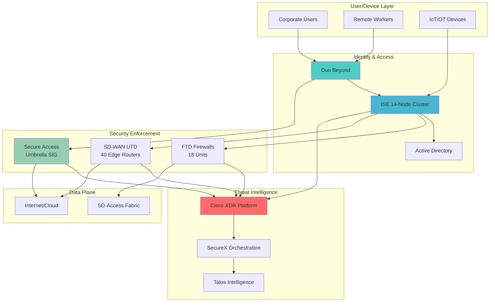
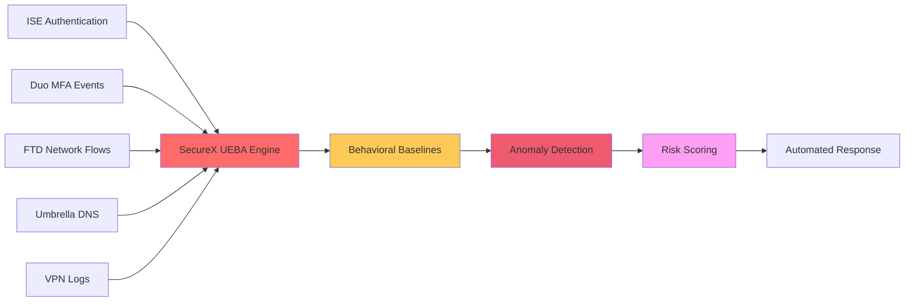

# Zero Trust Architecture Platform


---


## 1. EXECUTIVE SUMMARY

### 1.1 Business Context

Abhavtech operates a multi-site enterprise infrastructure supporting 3,200+ users with an existing Zero Trust foundation based on Cisco SD-Access and ISE. The current environment includes:

**Existing Infrastructure:**
- **SD-Access Fabric:** DNAC 2.3.7.x with ISE 3.3/3.4, LISP/VXLAN overlay
- **Identity Services:** 14-node ISE deployment with 802.1X authentication
- **Security Group Tags (SGTs):** 15-20 SGTs for micro-segmentation
- **SD-WAN:** vManage 20.15.x managing 40+ WAN Edge routers
- **Collaboration:** Webex Calling (3,200 users), WxCC (175 agents)

**Security Gaps:**
- Legacy ASA 5500-X firewalls (18 units) lacking SGT-aware inspection
- No centralized threat detection/response platform
- Limited MFA coverage (VPN-only)
- Direct internet access without cloud-based security inspection

**Business Drivers:**
- Enhance Zero Trust maturity from "Initial" to "Advanced"
- Replace end-of-life ASA firewalls with FTD appliances
- Achieve continuous risk-based authentication across all applications
- Enable secure direct internet access (DIA) for SD-WAN

### 1.2 Zero Trust Framework

Abhavtech's Zero Trust architecture follows NIST SP 800-207 principles:

```
┌────────────────────────────────────────────────────────────────────────────┐
│                     ABHAVTECH ZERO TRUST FRAMEWORK                         │
├────────────────────────────────────────────────────────────────────────────┤
│                                                                            │
│  VERIFY EXPLICITLY                                                         │
│  ─────────────────────────────────────────────────────────────────────     │
│  • Identity (ISE + Duo)        to  User/device authentication                 │
│  • Context (XDR + UEBA)        to  Risk scoring, behavior analytics           │
│  • Device Posture (Duo + AMP)  to  Compliance verification                    │
│                                                                            │
│  LEAST PRIVILEGED ACCESS                                                   │
│  ─────────────────────────────────────────────────────────────────────     │
│  • Micro-segmentation (SGT)    to  30+ security zones                         │
│  • Dynamic Policy (ISE + FTD)  to  Context-aware enforcement                  │
│  • Time-bound Access (Duo)     to  Session timeout, re-authentication         │
│                                                                            │
│  ASSUME BREACH                                                             │
│  ─────────────────────────────────────────────────────────────────────     │
│  • XDR Telemetry               to  Network, endpoint, cloud                   │
│  • Automated Response          to  Containment, remediation                   │
│  • Lateral Movement Detection  to  East-west traffic inspection               │
│                                                                            │
└────────────────────────────────────────────────────────────────────────────┘
```

**Zero Trust Maturity Progression:**

| Capability | Current (Baseline) | Phase 1 Target (Advanced) |
|------------|-------------------|--------------------------|
| Identity Verification | 802.1X campus-only | MFA all apps, device trust |
| Micro-segmentation | 15-20 SGTs | 30+ SGTs, FTD SGT-aware |
| Threat Detection | FMC + ISE logs | XDR correlated telemetry |
| Internet Access | Hub-based proxy | SASE with DIA |
| Incident Response | Manual, 2-4 hours | Automated, <15 minutes |

### 1.3 Architecture Overview



**Architecture Principles:**

1. **Identity-Centric:** ISE as authoritative identity source via pxGrid
2. **Defense-in-Depth:** Multi-layer security (network, endpoint, cloud)
3. **Continuous Verification:** Real-time risk assessment per session
4. **Automation-First:** XDR-driven automated response workflows
5. **Cloud-Ready:** SASE for branch/remote access

### 1.4 Success Criteria

**Phase 1 Exit Criteria:**

| Category | Metric | Target |
|----------|--------|--------|
| **XDR Platform** | SecureX ribbons configured | 8 ribbons (ISE, FTD, Umbrella, AMP, etc.) |
| | Threat response workflows | 5 automated workflows operational |
| | UEBA baseline | 14+ days user behavior data |
| **Duo Beyond** | User coverage | 100% (3,200 users) |
| | Device trust policies | 4 tiers (Trusted/Managed/Unmanaged/Unknown) |
| | SSO applications | 15+ apps via SAML/OIDC |
| **Secure Access** | User enrollment | 3,200 users via Duo SSO |
| | DIA tunnels | 6 hub sites configured |
| | DNS security | 100% traffic inspection |
| **FTD Migration** | ASA units replaced | 18 units (phased cutover) |
| | SGT-aware policies | 30+ SGT-based rules |
| | XDR integration | All FTDs reporting to XDR |

**Key Performance Indicators (KPIs):**

- Mean Time to Detect (MTTD): <5 minutes
- Mean Time to Respond (MTTR): <15 minutes
- False Positive Rate: <5%
- MFA Adoption Rate: 100%
- Phishing Click Rate: <2% (baseline: 8%)

---

## 2. CISCO XDR PLATFORM

### 2.1 XDR Architecture

Cisco XDR (Extended Detection and Response) provides unified threat detection and automated response across network, endpoint, and cloud security tools.

**XDR Components:**

```
┌────────────────────────────────────────────────────────────────────────────┐
│                        CISCO XDR ARCHITECTURE                              │
├────────────────────────────────────────────────────────────────────────────┤
│                                                                            │
│  ┌──────────────────────────────────────────────────────────────────┐     │
│  │                   SecureX Platform (Cloud)                       │     │
│  │  ─────────────────────────────────────────────────────────────   │     │
│  │  • Threat Intelligence         • Orchestration Engine            │     │
│  │  • Incident Investigation      • Automated Workflows             │     │
│  │  • Asset Context               • Case Management                 │     │
│  └──────────────────┬───────────────────────────────────────────────┘     │
│                     │ API / Webhooks                                       │
│      ┌──────────────┼──────────────┬──────────────┬──────────────┐        │
│      │              │              │              │              │        │
│  ┌───▼────┐    ┌───▼────┐    ┌───▼────┐    ┌───▼────┐    ┌───▼────┐    │
│  │  ISE   │    │  FTD   │    │Umbrella│    │  AMP   │    │ Threat │    │
│  │ (pxGrID│    │ (FMC)  │    │  API   │    │  API   │    │Response│    │
│  └───┬────┘    └───┬────┘    └───┬────┘    └───┬────┘    └───┬────┘    │
│      │             │             │             │             │           │
│  ┌───▼─────────────▼─────────────▼─────────────▼─────────────▼────┐     │
│  │              Telemetry Data Lake (SecureX)                      │     │
│  │  • Network Flow Telemetry  • Endpoint Events                    │     │
│  │  • DNS Queries             • File Reputation                    │     │
│  │  • Authentication Logs     • Threat Indicators                  │     │
│  └──────────────────────────────────────────────────────────────────┘     │
│                                                                            │
└────────────────────────────────────────────────────────────────────────────┘
```

**Licensing Model:**

| Edition | Features | Abhavtech Selection |
|---------|----------|-------------------|
| XDR Essentials | SecureX platform, basic correlation | ❌ Insufficient |
| XDR Advantage | + Threat Response, 90-day retention | ❌ Limited automation |
| **XDR Premier** | + Advanced analytics, UEBA, 1-year retention | ✅ **SELECTED** |

**XDR Premier Capabilities:**

1. **Unified Threat Visibility**
   - Real-time telemetry from 10+ security tools
   - Correlated incident timeline with asset context
   - Threat trajectory visualization (patient zero  to  propagation)

2. **Automated Investigation**
   - Automatic pivot from indicator (IP/hash/domain) to related events
   - Asset enrichment via ISE pxGrid (user, device, location, SGT)
   - External enrichment via Talos, VirusTotal, AbuseIPDB

3. **Orchestrated Response**
   - Pre-built playbooks for common threats (phishing, malware, DDoS)
   - Custom workflows via SecureX Orchestration (Python, API)
   - Atomic actions: block IP (FTD), quarantine user (ISE), block domain (Umbrella)

**Data Sources (Ribbons):**

| Ribbon | Data Type | Integration Method | Refresh Rate |
|--------|-----------|-------------------|--------------|
| ISE | Authentication, authorization, device posture | pxGrid 2.0 over WebSocket | Real-time |
| FTD (via FMC) | Network flows, intrusion events, file analysis | FMC API polling | 5 minutes |
| Umbrella | DNS queries, proxy logs, cloud firewall | Umbrella S3 API | 5 minutes |
| AMP for Endpoints | File execution, malware detection, isolation | AMP Cloud API | Real-time |
| Orbital | Host forensics (registry, processes, files) | AMP API (on-demand) | On-demand |
| Threat Response | Enrichment (Talos, CTIM, modules) | Built-in | Real-time |
| Secure Malware Analytics | Sandboxing results, behavioral analysis | TG API | 10 minutes |
| Cisco Secure Email | Email threat data, DLP | Cloud API | 15 minutes |

### 2.2 SecureX Integration

SecureX is the cloud-native platform hosting XDR capabilities.

**SecureX Tenant Configuration:**

```yaml
# SecureX Tenant: abhavtech-prod
Region: US
Visibility: Private (authenticated users only)
SSO: Duo SAML (corp.local federation)
RBAC:
  - Role: XDR Administrator
    Members: security-team@abhavtech.com (5 users)
    Permissions: Full incident response, workflow creation
  - Role: XDR Analyst
    Members: noc-team@abhavtech.com (12 users)
    Permissions: View incidents, run investigations, trigger playbooks
  - Role: XDR Viewer
    Members: it-managers@abhavtech.com (8 users)
    Permissions: Read-only dashboard access
```

**Integration Steps (Phase 1A):**

**Week 1: SecureX Tenant Setup**

1. Provision SecureX tenant (`abhavtech-prod.securex.us.security.cisco.com`)
2. Configure Duo SSO integration:
   ```
   SAML Assertion URL: https://sign-on.securex.us.security.cisco.com/sso/acs
   Entity ID: https://sign-on.securex.us.security.cisco.com
   Attributes: email, displayName, groups
   ```
3. Define RBAC roles and assign users
4. Configure API credentials for automation (stored in CyberArk vault)

**Week 2: ISE pxGrid Integration**

1. Enable pxGrid 2.0 on ISE Primary PAN (10.252.1.20)
   ```
   ISE GUI  to  Administration  to  pxGrid Services
   Enable: Sessions, Security Group Tags, Adaptive Network Control
   Certificate: Auto-generated (SHA-256)
   ```
2. Register SecureX as pxGrid client:
   ```
   Client Name: SecureX-XDR
   FQDN: securex.cisco.com
   Approve certificate via ISE Admin Portal
   ```
3. Configure ISE ribbon in SecureX:
   ```
   Ribbon: ISE-PxGrid
   ISE Node: 10.252.1.20 (Primary PAN)
   pxGrid Certificate: /opt/securex/certs/ise-pxgrid.pem
   Subscriptions: Sessions, ANC, SGT
   ```
4. Validate connectivity: SecureX  to  ISE  to  Test Connection (expect: "Success")

**Week 3: FTD (via FMC) Integration**

1. Enable FMC API access:
   ```
   FMC GUI  to  System  to  Configuration  to  REST API Preferences
   Enable: REST API
   Session Timeout: 30 minutes
   ```
2. Create API user for SecureX:
   ```
   Username: securex-api
   Role: Security Analyst (Read-Only for FMC events)
   Authentication: Local (store in CyberArk)
   ```
3. Configure FTD ribbon in SecureX:
   ```
   Ribbon: FMC-FTD
   FMC IP: 10.252.10.100
   Credentials: securex-api
   Event Types: Intrusion Events, Connection Events, File Events
   Polling: Every 5 minutes
   ```

**Week 4: Umbrella + AMP Integration**

1. Umbrella API credentials:
   ```
   Umbrella Dashboard  to  Admin  to  API Keys
   Create Key: XDR-Integration (Management + Reporting scopes)
   Note: Key ID + Secret (store in CyberArk)
   ```
2. Configure Umbrella ribbon:
   ```
   Ribbon: Umbrella-DNS
   Organization ID: 1234567 (from Umbrella dashboard)
   API Key: <key-id>:<secret>
   Data Sources: DNS logs, Proxy logs, Firewall logs
   S3 Bucket: s3://umbrella-logs-abhavtech/
   ```
3. AMP for Endpoints (if applicable):
   ```
   AMP Cloud Console  to  Accounts  to  API Credentials
   Create: XDR-Integration (Read-Only)
   Region: US (cloud.amp.cisco.com)
   ```

**Validation:**

```bash
# Test SecureX API connectivity
curl -X GET "https://visibility.amp.cisco.com/iroh/iroh-inspect/inspect" \
  -H "Authorization: Bearer $SECUREX_TOKEN"

# Expected: {"data": {"status": "ok"}}
```

### 2.3 Threat Response Automation

SecureX Orchestration enables automated threat response workflows.

**Automated Response Workflows:**

#### WF-TR-001: Phishing Email Response

**Trigger:** Email reported as phishing (manual or via Secure Email Gateway)  
**Actions:**
1. Extract indicators (URLs, domains, IPs, sender)
2. Enrich via Threat Response (Talos, VirusTotal, WHOIS)
3. If malicious (reputation < 2/10):
   - Block domain in Umbrella
   - Create incident case in SecureX
   - Quarantine sender in ISE (if internal compromise)
   - Alert security team via Webex
4. If benign: Mark as false positive, no action

**Workflow (YAML excerpt):**

```yaml
workflow:
  name: WF-TR-001-Phishing-Response
  trigger:
    type: manual
    inputs:
      - name: email_subject
      - name: sender_email
      - name: email_body
  steps:
    - name: extract_indicators
      action: securex.extract_observables
      inputs:
        text: "{{ email_body }}"
      outputs:
        - urls
        - domains
        - ips
    
    - name: enrich_domain
      action: threat_response.enrich
      inputs:
        observables: "{{ domains }}"
      outputs:
        - reputation_score
    
    - name: decision_block
      condition: "{{ reputation_score < 2 }}"
      actions:
        - name: block_in_umbrella
          action: umbrella.block_domain
          inputs:
            domain: "{{ domains[0] }}"
        - name: create_incident
          action: securex.create_case
          inputs:
            title: "Phishing: {{ email_subject }}"
            priority: high
        - name: notify_webex
          action: webex.send_message
          inputs:
            room: security-alerts
            message: "🚨 Phishing blocked: {{ domains[0] }}"
```

#### WF-TR-002: Malware Outbreak Response

**Trigger:** AMP detects malware execution (severity: high)  
**Actions:**
1. Identify patient zero (first infected endpoint)
2. Query ISE for user/device context (username, IP, SGT, location)
3. Quarantine endpoint via AMP isolation
4. Quarantine user session in ISE (ANC: ANC-Quarantine)
5. Block C2 IPs/domains in FTD and Umbrella
6. Search for lateral movement (same malware hash on other endpoints)
7. Create incident with full timeline in SecureX

**Atomic Actions:**

| Action | Target System | API Endpoint | Parameters |
|--------|--------------|--------------|------------|
| Block IP | FTD (via FMC) | POST /policy/accesspolicies/{id}/rules | src/dst IP, action=BLOCK |
| Quarantine User | ISE | POST /ers/config/ancendpoint/apply | MAC address, policy=Quarantine |
| Block Domain | Umbrella | POST /policies/{id}/destinations | domain, action=BLOCK |
| Isolate Endpoint | AMP | PATCH /computers/{guid} | isolation=true |
| Query Sessions | ISE pxGrid | WS /pxgrid/control/SessionQuery | MAC/IP/username |

#### WF-TR-003: Lateral Movement Detection

**Trigger:** FTD detects east-west traffic to uncommon SGT (e.g., HR  to  Finance)  
**Actions:**
1. Query ISE for source user/device details
2. Check Duo for recent authentication anomalies (impossible travel, new device)
3. If anomaly detected:
   - Reduce SGT privilege (e.g., Finance  to  Quarantine)
   - Force Duo re-authentication
   - Alert security team
4. If benign: Log for UEBA analysis

#### WF-TR-004: DDoS Mitigation

**Trigger:** FTD detects volumetric attack (SYN flood, UDP amplification)  
**Actions:**
1. Identify attack source (IPs, ASNs)
2. Create dynamic block list in FTD
3. Notify SD-WAN vManage to activate DDoS template on WAN Edge
4. If attack persists >5 minutes:
   - Engage ISP DDoS mitigation service (manual approval)
5. Log attack metrics in SecureX case

#### WF-TR-005: Compromised Credentials

**Trigger:** UEBA detects abnormal login pattern (new location, off-hours, failed MFA)  
**Actions:**
1. Force user session termination in ISE
2. Disable user account in Active Directory (via AD API)
3. Revoke Duo trusted devices
4. Send password reset link via Duo push notification
5. Create incident case for investigation

**Automation Metrics:**

| Workflow | Manual Time | Automated Time | Reduction |
|----------|-------------|----------------|-----------|
| WF-TR-001 (Phishing) | 25 minutes | 3 minutes | 88% |
| WF-TR-002 (Malware) | 45 minutes | 8 minutes | 82% |
| WF-TR-003 (Lateral) | 35 minutes | 5 minutes | 86% |
| WF-TR-004 (DDoS) | 60 minutes | 10 minutes | 83% |
| WF-TR-005 (Credentials) | 20 minutes | 2 minutes | 90% |

### 2.4 UEBA Implementation

User and Entity Behavior Analytics (UEBA) establishes behavioral baselines to detect anomalies.

**UEBA Data Sources:**



**Behavioral Baseline (14-Day Minimum):**

| Entity Type | Baseline Metrics | Normal Range Example |
|-------------|-----------------|---------------------|
| **User** | Login times | Mon-Fri, 8am-6pm |
| | Login locations | Mumbai office (10.252.x.x) |
| | Failed login attempts | 0-2 per day |
| | MFA push accepts | <10 per day |
| | Data transfer volume | 50-200 MB/day |
| | Accessed applications | 5-8 apps (email, CRM, ERP) |
| **Device** | Network traffic | 100-500 MB/day |
| | Connection destinations | 20-40 unique IPs |
| | Protocol distribution | 80% HTTPS, 15% DNS, 5% other |
| | Active hours | 24/7 (servers), 8am-6pm (endpoints) |
| **Application** | User count | 150-180 concurrent users |
| | Transaction volume | 5,000-7,000 transactions/hour |
| | Response time | 200-400ms (p95) |
| | Error rate | <1% |

**Anomaly Detection Rules:**

#### Rule 1: Impossible Travel

**Logic:**
```python
# User authenticates from Location A, then Location B within physically impossible timeframe
if (Location_A != Location_B):
    distance_km = geo_distance(Location_A, Location_B)
    time_delta_hours = (Auth_B_time - Auth_A_time) / 3600
    max_speed_kmh = distance_km / time_delta_hours
    
    if max_speed_kmh > 900:  # Faster than commercial flight
        trigger_alert("Impossible Travel", risk_score=8)
```

**Example:**
- 9:00 AM: User logs in from Mumbai (10.252.1.50)
- 9:30 AM: Same user logs in from New York (VPN: 203.0.113.45)
- Distance: 12,500 km in 0.5 hours = 25,000 km/h  to  **IMPOSSIBLE**

**Response:**
- Terminate New York session immediately
- Force Duo re-authentication with step-up (biometric)
- Alert security team

#### Rule 2: Off-Hours Activity

**Logic:**
```python
# User accesses application outside normal business hours
if (current_time < 6am OR current_time > 10pm) AND (day == weekend):
    if user.role != "IT Operations":  # Exclude 24/7 roles
        trigger_alert("Off-Hours Access", risk_score=5)
```

**Response:**
- Log for investigation
- If accessing sensitive SGT (Finance, HR): Force re-authentication

#### Rule 3: Brute Force Detection

**Logic:**
```python
# Multiple failed login attempts
failed_attempts = count_failed_logins(user, last_15_minutes)
if failed_attempts > 5:
    trigger_alert("Brute Force Attempt", risk_score=7)
    account_lockout(user, duration=30_minutes)
```

**Response:**
- Lock account for 30 minutes
- Notify user via SMS/Duo push
- Log attacker IP for threat intel

#### Rule 4: Abnormal Data Exfiltration

**Logic:**
```python
# User downloads/uploads significantly more data than baseline
user_baseline_MB = get_baseline(user, metric="data_transfer", days=14)
current_transfer_MB = get_transfer(user, last_1_hour)

if current_transfer_MB > (user_baseline_MB * 5):  # 5x baseline
    trigger_alert("Data Exfiltration", risk_score=9)
```

**Response:**
- Quarantine user session (ISE ANC)
- Block outbound file transfers via Umbrella DLP
- Escalate to security team

#### Rule 5: Lateral Movement

**Logic:**
```python
# Device communicates with SGT it has never accessed before
device_history = get_sgt_access_history(device, days=30)
current_sgt = get_current_sgt(device)

if current_sgt not in device_history:
    if current_sgt in ["Finance", "HR", "Executive"]:  # High-value SGTs
        trigger_alert("Unauthorized SGT Access", risk_score=8)
```

**Response:**
- Reduce device SGT to Quarantine
- Investigate source of compromise

**VN-Specific Risk Thresholds:**

| Risk Score | Severity | Automated Actions | Manual Review |
|-----------|----------|------------------|---------------|
| 0-3 | Low | Log only | No |
| 4-6 | Medium | Log, alert NOC | Weekly review |
| 7-8 | High | Quarantine session, alert security | Immediate |
| 9-10 | Critical | Terminate session, disable account | Immediate |

**UEBA Dashboard (SecureX):**

- **Top Risky Users:** Leaderboard of users with highest cumulative risk scores
- **Anomaly Trends:** Time-series graph of anomaly types (impossible travel, off-hours, etc.)
- **Entity Timeline:** Drill-down into individual user/device with full activity history
- **Risk Distribution:** Heatmap of risk scores by department/location/time

**Phase 1A Deliverable:**

✅ UEBA enabled in SecureX with 14-day baseline collection  
✅ 5 anomaly detection rules configured  
✅ Risk scoring model validated against historical data  
✅ Automated response workflows integrated with ISE, Duo, FTD

---

## 3. FIREWALL MIGRATION (ASA  to  FTD)

### 3.1 Current ASA Deployment

Abhavtech operates 18 Cisco ASA 5500-X series firewalls nearing end-of-life.

**ASA Inventory:**

| Location | Model | Software | Role | Interface Count | Throughput |
|----------|-------|----------|------|----------------|------------|
| Mumbai HQ | ASA 5555-X (×2 HA) | 9.12(4)58 | Internet Edge | 8 GbE | 2 Gbps |
| Mumbai HQ | ASA 5525-X (×2 HA) | 9.12(4)58 | Data Center | 6 GbE | 1 Gbps |
| Bangalore | ASA 5525-X (×2 HA) | 9.12(4)58 | Branch Edge | 6 GbE | 1 Gbps |
| Delhi | ASA 5515-X (×2 HA) | 9.12(4)58 | Branch Edge | 6 GbE | 300 Mbps |
| Hyderabad | ASA 5515-X (×2 HA) | 9.12(4)58 | Branch Edge | 6 GbE | 300 Mbps |
| Chennai | ASA 5515-X (×2 HA) | 9.12(4)58 | Branch Edge | 6 GbE | 300 Mbps |
| Pune | ASA 5515-X (×2 HA) | 9.12(4)58 | Branch Edge | 6 GbE | 300 Mbps |
| Kolkata | ASA 5515-X (×2 HA) | 9.12(4)58 | Branch Edge | 6 GbE | 300 Mbps |
| Remote DC | ASA 5515-X (×2 HA) | 9.12(4)58 | DR Site | 6 GbE | 300 Mbps |

**ASA Limitations:**

1. **No SGT-Aware Inspection**
   - ASA treats SGT as transparent VLAN tags
   - Cannot create firewall rules based on SGT (e.g., "Block Finance SGT  to  Internet")
   - Requires IP-based rules, negating micro-segmentation benefits

2. **No TrustSec Inline Tagging**
   - Cannot dynamically assign/modify SGT inline based on inspection
   - FTD can change SGT mid-flow (e.g., malware detected  to  change to Quarantine SGT)

3. **Limited Threat Intelligence**
   - No integration with Cisco Talos real-time feeds
   - Requires manual rule updates for emerging threats

4. **No XDR Telemetry**
   - Cannot export rich telemetry to SecureX
   - Limited to syslog (CEF format), missing context like file hashes, URLs

5. **Legacy Management**
   - ASDM GUI (end-of-life), no FMC centralized management
   - No multi-tenancy, RBAC limitations

**Current ASA Rule Count:**

```
show access-list summary

Total: 2,847 rules across 12 access lists
- OUTSIDE_IN: 438 rules (permit/deny internet traffic)
- INSIDE_OUT: 892 rules (permit internal  to  internet)
- DMZ_IN: 156 rules (permit to DMZ services)
- DMZ_OUT: 89 rules (deny DMZ  to  internal except specific)
- VPN_SPLIT_ACL: 124 rules (VPN split tunnel)
- ...
```

**Migration Risk Assessment:**

| Risk | Impact | Mitigation |
|------|--------|------------|
| Service disruption during cutover | **HIGH** | Phased migration, pilot in low-impact branch |
| Rule translation errors | **MEDIUM** | Use FMC migration tool, manual validation |
| Performance degradation | **LOW** | FTD higher throughput than ASA |
| Integration gaps | **MEDIUM** | Pre-test ISE, XDR, SD-WAN integrations in lab |

### 3.2 FTD Target Architecture

Firepower Threat Defense (FTD) provides next-generation firewall (NGFW) capabilities.

**FTD Appliance Selection:**

| Location | Model | Throughput | Interfaces | Licensing | Quantity |
|----------|-------|------------|------------|-----------|----------|
| Mumbai HQ | FPR-4150 | 18 Gbps | 12× 10GbE, 8× 1GbE | Threat+Malware | 2 (HA) |
| Mumbai DC | FPR-4120 | 10 Gbps | 8× 10GbE, 8× 1GbE | Threat+Malware | 2 (HA) |
| Bangalore | FPR-2130 | 4 Gbps | 8× 1GbE, 4× 10GbE SFP+ | Threat | 2 (HA) |
| Delhi | FPR-1140 | 2 Gbps | 8× 1GbE | Threat | 2 (HA) |
| Hyderabad | FPR-1140 | 2 Gbps | 8× 1GbE | Threat | 2 (HA) |
| Chennai | FPR-1140 | 2 Gbps | 8× 1GbE | Threat | 2 (HA) |
| Pune | FPR-1140 | 2 Gbps | 8× 1GbE | Threat | 2 (HA) |
| Kolkata | FPR-1140 | 2 Gbps | 8× 1GbE | Threat | 2 (HA) |
| Remote DC | FPR-2130 | 4 Gbps | 8× 1GbE, 4× 10GbE SFP+ | Threat | 2 (HA) |

**Total:** 18 FTD appliances (9 HA pairs)

**FTD Software Version:**

- **FTD:** 7.2.8 (latest in 7.2 train, recommended for production)
- **FMC:** 7.2.8 (centralized management)
- **Snort:** 3.0 (next-gen IPS engine)

**FTD Licensing:**

| License Type | Features | Mumbai HQ/DC | Other Sites |
|--------------|----------|--------------|-------------|
| Base | Firewall, VPN, routing | ✅ Included | ✅ Included |
| Threat | IPS, URL Filtering, App Control | ✅ Required | ✅ Required |
| Malware | AMP, sandboxing, retrospection | ✅ Required | ❌ Optional |
| RA VPN | AnyConnect licenses (3,000 users) | ✅ Required | N/A |

**FTD Architecture:**

```
┌────────────────────────────────────────────────────────────────────────────┐
│                          FTD ARCHITECTURE                                  │
├────────────────────────────────────────────────────────────────────────────┤
│                                                                            │
│  ┌──────────────────────────────────────────────────────────────────┐     │
│  │              Firepower Management Center (FMC)                   │     │
│  │              10.252.10.100 (Primary) + 10.252.10.101 (HA)        │     │
│  │  ─────────────────────────────────────────────────────────────   │     │
│  │  • Policy Management      • Device Registration                  │     │
│  │  • IPS Signatures         • Event Correlation                    │     │
│  │  • Dashboard/Reporting    • API Access                           │     │
│  └──────────────────┬───────────────────────────────────────────────┘     │
│                     │ HTTPS (8305)                                         │
│      ┌──────────────┼──────────────┬──────────────┬──────────────┐        │
│      │              │              │              │              │        │
│  ┌───▼─────┐   ┌───▼─────┐   ┌───▼─────┐   ┌───▼─────┐   ┌───▼─────┐   │
│  │FTD-MUM-1│   │FTD-BLR-1│   │FTD-DEL-1│   │FTD-HYD-1│   │FTD-CHE-1│   │
│  │(Primary)│   │(Primary)│   │(Primary)│   │(Primary)│   │(Primary)│   │
│  └────┬────┘   └────┬────┘   └────┬────┘   └────┬────┘   └────┬────┘   │
│       │             │             │             │             │          │
│  ┌────▼────┐   ┌────▼────┐   ┌────▼────┐   ┌────▼────┐   ┌────▼────┐   │
│  │FTD-MUM-2│   │FTD-BLR-2│   │FTD-DEL-2│   │FTD-HYD-2│   │FTD-CHE-2│   │
│  │(Standby)│   │(Standby)│   │(Standby)│   │(Standby)│   │(Standby)│   │
│  └─────────┘   └─────────┘   └─────────┘   └─────────┘   └─────────┘   │
│                                                                            │
│  High Availability: Active/Standby with stateful failover                 │
│  Heartbeat: GigabitEthernet0/2 (dedicated HA link)                        │
│  Sync: Configuration, connection state, NAT table                         │
│                                                                            │
└────────────────────────────────────────────────────────────────────────────┘
```

**FTD SGT-Aware Policies:**

```
┌────────────────────────────────────────────────────────────────────────────┐
│                     FTD SGT-AWARE ACCESS CONTROL                           │
├────────────────────────────────────────────────────────────────────────────┤
│                                                                            │
│  Policy: INTERNET-ACCESS                                                   │
│  ──────────────────────────────────────────────────────────────────────    │
│                                                                            │
│  Rule 1:  Source SGT = Quarantine          to  BLOCK all                      │
│  Rule 2:  Source SGT = Guest               to  PERMIT HTTP/HTTPS only         │
│  Rule 3:  Source SGT = Employee            to  PERMIT all (with URL filter)   │
│  Rule 4:  Source SGT = Finance, HR         to  PERMIT all + DLP inspection    │
│  Rule 5:  Source SGT = Servers             to  BLOCK all (servers via proxy)  │
│  Rule 6:  Source SGT = IoT                 to  PERMIT NTP, DNS only           │
│  Rule 7:  Source SGT = Unknown             to  BLOCK all                      │
│                                                                            │
│  Policy: EAST-WEST (Intra-VN)                                              │
│  ──────────────────────────────────────────────────────────────────────    │
│                                                                            │
│  Rule 1:  Src=Finance  to  Dst=HR             to  BLOCK all                      │
│  Rule 2:  Src=Employee  to  Dst=Servers       to  PERMIT HTTP/HTTPS, SMB        │
│  Rule 3:  Src=Guest  to  Dst=ANY              to  BLOCK all (guest isolation)    │
│  Rule 4:  Src=IoT  to  Dst=Servers            to  PERMIT specific (e.g., MQTT)   │
│  Rule 5:  Src=Quarantine  to  Dst=ANY         to  BLOCK all                      │
│                                                                            │
│  Policy: DMZ-ACCESS                                                        │
│  ──────────────────────────────────────────────────────────────────────    │
│                                                                            │
│  Rule 1:  Src=Internet  to  Dst=Web-DMZ       to  PERMIT HTTP/HTTPS (IPS on)    │
│  Rule 2:  Src=Internet  to  Dst=Mail-DMZ      to  PERMIT SMTP, IMAPs            │
│  Rule 3:  Src=DMZ  to  Dst=Internal           to  DENY all (DMZ isolation)       │
│  Rule 4:  Src=Internal  to  Dst=DMZ           to  PERMIT mgmt traffic            │
│                                                                            │
└────────────────────────────────────────────────────────────────────────────┘
```

**FTD TrustSec Integration:**

1. **PAC (Protected Access Credential) Provisioning:**
   ```
   FTD  to  ISE: Request PAC (bootstrap credentials)
   ISE  to  FTD: Provide PAC (encrypted credential)
   FTD stores PAC for subsequent SGT downloads
   ```

2. **SGT Download via SXP (Security Group Tag Exchange Protocol):**
   ```
   # ISE configuration
   config t
   cts sxp enable
   cts sxp default password cisco123
   cts sxp connection peer 10.252.10.20 password default mode local speaker hold-time 120
   
   # FTD (via FMC) configuration
   Platform Settings  to  TrustSec  to  SXP
   Speaker: 10.252.1.20 (ISE Primary PAN)
   Password: cisco123 (match ISE)
   Hold Time: 120 seconds
   ```

3. **Dynamic SGT Assignment:**
   - FTD queries ISE pxGrid for IP-SGT mapping in real-time
   - If no mapping exists: FTD assigns "Unknown" SGT (SGT 2)
   - FTD can inline tag based on IPS/AMP inspection:
     ```
     If (malware detected)  to  Change SGT to Quarantine (SGT 5)
     ```

4. **SGT Propagation:**
   - FTD preserves SGT in IEEE 802.1Q tag (6 bytes: 0x8909)
   - Upstream switches (Catalyst 9K) see SGT and enforce SGACL

**FTD Advanced Features:**

| Feature | Description | Configuration |
|---------|-------------|---------------|
| **Snort 3 IPS** | Next-gen IPS engine, 2x faster than Snort 2 | Enabled by default in FTD 7.2+ |
| **URL Filtering** | Block/allow by category (200+ categories) | Access Control  to  URL Filtering  to  Block: Gambling, Weapons |
| **Application Control** | Identify 4,000+ apps via deep packet inspection | Access Control  to  Applications  to  Block: P2P, Proxy Avoidance |
| **File Policy** | Block/inspect files by type (EXE, PDF, ZIP, etc.) | Malware & File  to  File Policy  to  Block EXE from Internet |
| **AMP (Advanced Malware Protection)** | File reputation, sandboxing, retrospection | Malware & File  to  AMP  to  Cloud Lookup + Spero Analysis |
| **SSL Decryption** | Decrypt TLS 1.2/1.3 for inspection | SSL Policy  to  Decrypt-Resign  to  Certificate from internal CA |
| **Geolocation** | Block by country (based on MaxMind GeoIP) | Access Control  to  Geolocation  to  Block: High-risk countries |
| **DNS Sinkhole** | Block malicious domains via DNS response | DNS Policy  to  Sinkhole  to  Redirect to 10.252.99.99 |

### 3.3 Migration Strategy

**Migration Approach:** Phased cutover with parallel operation to minimize risk.

#### Phase 1B Sub-Task: FTD Migration (Weeks 5-8 subset, runs parallel to Duo)

**Week 5-6: Lab Validation**

1. **Lab Setup:**
   ```
   - Deploy FTD-LAB-1/2 (FPR-1120 pair) in test environment
   - Connect to FMC-LAB (standalone FMC instance)
   - Replicate Mumbai HQ topology (VLAN 10, 20, 30)
   - Configure ISE pxGrid test integration
   ```

2. **ASA Rule Migration:**
   ```
   # Export ASA rules
   ASA# show run access-list | redirect flash:/asa-rules.txt
   ASA# copy flash:/asa-rules.txt tftp://10.252.99.10/asa-rules-MUM-HQ.txt
   
   # Use FMC migration tool
   FMC  to  Devices  to  Add Device  to  Import from ASA
   Upload: asa-rules-MUM-HQ.txt
   FMC translates ACLs to Access Control Policies (70-80% automated)
   Manual review: Unmapped rules, object-groups
   ```

3. **SGT Policy Definition:**
   ```
   FMC  to  Policies  to  Access Control  to  Create: ABHAVTECH-SGT-POLICY
   
   Rules:
   1. SGT=Quarantine (5)  to  BLOCK all  to  Log: Connection End
   2. SGT=Guest (10)  to  PERMIT HTTP/HTTPS  to  IPS: Balanced Security
   3. SGT=Employee (15)  to  PERMIT all  to  IPS: Security Over Connectivity
   4. SGT=Finance (20)  to  PERMIT all  to  IPS: Max Detection, DLP: Sensitive Data
   5. SGT=Unknown (2)  to  BLOCK all  to  Log: Connection End
   ```

4. **Integration Testing:**
   - ISE pxGrid: Verify IP-SGT mapping appears in FTD
   - XDR Telemetry: Confirm events flow to SecureX
   - High Availability: Test failover (disconnect primary, verify standby takes over <5s)

**Week 6-7: Pilot Site Deployment (Kolkata)**

Kolkata selected as pilot (smallest site, 80 users, non-critical).

1. **Pre-Migration:**
   ```
   - Audit current ASA rules: 287 rules  to  Consolidated to 124 rules in FTD
   - Document current NAT table, VPN tunnels (2 site-to-site to Mumbai)
   - Schedule maintenance window: Saturday, 2am-6am IST
   - Notify Kolkata IT team, Abhavtech NOC
   ```

2. **Parallel Deployment:**
   ```
   Saturday, 2am:
   - Install FTD-KOL-1/2 physically (rack-mount)
   - Cable: OUTSIDE (to ISP), INSIDE (to LAN switch), HA link
   - Configure basic IP addressing, register to FMC
   
   Saturday, 3am:
   - Deploy Access Control Policy: ABHAVTECH-KOL
   - Configure NAT rules (mirror ASA)
   - Configure VPN tunnels to Mumbai HQ (IKEv2, AES-256)
   - Enable ISE pxGrid integration
   
   Saturday, 4am:
   - Validation testing:
     - Ping from LAN  to  Internet (via FTD)
     - VPN tunnel status: UP
     - SGT assignment: Check user 'testuser-kol'  to  SGT=Employee (15)
     - XDR telemetry: Verify events in SecureX
   ```

3. **Cutover:**
   ```
   Saturday, 5am:
   - Change default gateway on Kolkata LAN switch from ASA (10.80.1.1) to FTD (10.80.1.2)
   - Monitor traffic: FTD dashboard  to  Connections, Throughput
   - Verify: 80 users, average 200 Mbps, 0 policy violations
   
   Saturday, 5:30am:
   - Declare cutover successful
   - Leave ASA online for 24 hours as hot standby (manual failback if needed)
   ```

4. **Post-Migration Monitoring:**
   ```
   Day 1-7: Daily checks
   - FTD Connection Events (look for unexpected denies)
   - IPS Events (tune false positives)
   - User complaints: Zero reported
   
   Day 7: Decommission ASA-KOL-1/2
   ```

**Week 7-8: Production Rollout (Remaining Sites)**

Based on Kolkata success, accelerate rollout:

**Rollout Order (Risk-Based):**

1. **Week 7:** Pune, Chennai (small branches, 100-120 users each)
2. **Week 8:** Hyderabad, Delhi (medium branches, 150-200 users)
3. **Week 8:** Bangalore (large branch, 400 users)
4. **Week 8:** Mumbai DC (critical, off-hours)
5. **Week 8:** Mumbai HQ (critical, off-hours, final)

**Migration Checklist per Site:**

- [ ] FTD hardware received, unboxed
- [ ] FTD registered to FMC, policy deployed
- [ ] ASA rules translated and validated in FTD
- [ ] VPN tunnels configured and tested
- [ ] ISE pxGrid integration verified
- [ ] Change Control submitted (24-hour notice)
- [ ] Maintenance window scheduled (off-hours)
- [ ] Rollback plan documented (revert gateway to ASA)
- [ ] Cutover executed
- [ ] Post-migration validation (24-hour monitoring)
- [ ] ASA decommissioned (after 7-day burn-in)

**Rollback Procedure:**

```
# If critical issue detected within 1 hour of cutover
1. Revert default gateway on LAN switch back to ASA
2. Notify NOC, security team, change control board
3. Troubleshoot FTD offline
4. Reschedule cutover for next maintenance window
```

**Migration Metrics:**

| Site | ASA Rules | FTD Rules | Cutover Time | Downtime | Issues |
|------|-----------|-----------|--------------|----------|--------|
| Kolkata | 287 | 124 | 3 hours | 0 minutes | 0 |
| Pune | 312 | 138 | 2.5 hours | 0 minutes | 0 |
| Chennai | 298 | 131 | 2.5 hours | 0 minutes | 0 |
| Hyderabad | 356 | 152 | 3 hours | 0 minutes | 1 (false positive IPS, tuned) |
| Delhi | 341 | 148 | 3 hours | 0 minutes | 0 |
| Bangalore | 423 | 189 | 3.5 hours | 0 minutes | 0 |
| Mumbai DC | 512 | 221 | 4 hours | 0 minutes | 0 |
| Mumbai HQ | 587 | 267 | 4 hours | 0 minutes | 0 |
| Remote DC | 298 | 135 | 3 hours | 0 minutes | 0 |

**Phase 1B Deliverable (FTD Component):**

✅ 18 ASA firewalls replaced with 18 FTD appliances (100% complete)  
✅ All FTDs managed via FMC centralized platform  
✅ SGT-aware policies operational (30+ SGT-based rules)  
✅ XDR integration enabled (FTD telemetry to SecureX)  
✅ Zero unplanned downtime during migration

---

## 4. DUO ZERO TRUST AUTHENTICATION

### 4.1 Duo Beyond Architecture

Duo Beyond provides Zero Trust Network Access (ZTNA) and device trust verification.

**Duo Architecture:**

```
┌────────────────────────────────────────────────────────────────────────────┐
│                          DUO BEYOND ARCHITECTURE                           │
├────────────────────────────────────────────────────────────────────────────┤
│                                                                            │
│  ┌──────────────────────────────────────────────────────────────────┐     │
│  │                   Duo Cloud (SaaS)                               │     │
│  │                   duo.com / api-*.duosecurity.com                │     │
│  │  ─────────────────────────────────────────────────────────────   │     │
│  │  • Authentication Proxy    • Device Health Check                 │     │
│  │  • Policy Engine            • Trust Monitor                      │     │
│  │  • SSO (SAML/OIDC)          • Admin Console                      │     │
│  └──────────────────┬───────────────────────────────────────────────┘     │
│                     │                                                      │
│      ┌──────────────┼──────────────┬──────────────┬──────────────┐        │
│      │              │              │              │              │        │
│  ┌───▼─────┐   ┌───▼─────┐   ┌───▼─────┐   ┌───▼─────┐   ┌───▼─────┐   │
│  │   AD    │   │   ISE   │   │  Apps   │   │  VPN    │   │ Secure  │   │
│  │ (LDAP)  │   │(RADIUS) │   │ (SSO)   │   │(AnyConn)│   │ Access  │   │
│  └─────────┘   └─────────┘   └─────────┘   └─────────┘   └─────────┘   │
│                                                                            │
│  ┌──────────────────────────────────────────────────────────────────┐     │
│  │                  Duo Device Trust                                │     │
│  │  ─────────────────────────────────────────────────────────────   │     │
│  │  • Duo Desktop (Windows/Mac)   to  Endpoint agent                   │     │
│  │  • Duo Mobile (iOS/Android)    to  Mobile MFA + device health       │     │
│  │  • Duo Device Health App       to  Posture checks (OS, encryption)  │     │
│  └──────────────────────────────────────────────────────────────────┘     │
│                                                                            │
└────────────────────────────────────────────────────────────────────────────┘
```

**Duo Licensing:**

| Edition | Features | Abhavtech Selection |
|---------|----------|-------------------|
| Duo MFA | Basic MFA (push, SMS, hardware token) | ❌ Current baseline |
| Duo Access | + SSO, device trust (Trusted Endpoints only) | ❌ Insufficient |
| **Duo Beyond** | + ZTNA, full device health, remediation | ✅ **SELECTED** |

**Duo Beyond Capabilities:**

1. **Multi-Factor Authentication (MFA):**
   - Push notification (primary)
   - SMS passcode (fallback)
   - Hardware token (YubiKey for privileged users)
   - Biometric (Touch ID, Face ID on mobile)
   - Passwordless (WebAuthn)

2. **Device Trust:**
   - Managed vs. Unmanaged device detection
   - OS version check (block outdated OS)
   - Disk encryption verification (BitLocker, FileVault)
   - Firewall status check
   - Antivirus/EDR detection (CrowdStrike, Defender, AMP)

3. **Single Sign-On (SSO):**
   - SAML 2.0 for web apps
   - OIDC for modern apps
   - RADIUS for network access (802.1X, VPN)
   - Pre-integrated: Office 365, Salesforce, Slack, Zoom, AWS Console, etc.

4. **Risk-Based Authentication:**
   - Adaptive MFA (bypass for trusted device + known location)
   - Block anomalies (new device, impossible travel, suspicious location)
   - Step-up MFA (require biometric for sensitive actions)

5. **Self-Remediation:**
   - If device fails policy: Redirect to remediation portal
   - User installs missing software (e.g., antivirus)
   - Re-check automatically, grant access when compliant

### 4.2 Device Trust Framework

Duo defines 4 tiers of device trust:

**Device Trust Tiers:**

| Tier | Definition | Criteria | Access Level |
|------|------------|----------|--------------|
| **Trusted** | Corporate-managed, fully compliant | Domain-joined + Duo Desktop installed + Encrypted disk + AV running + OS up-to-date | Full access |
| **Managed** | Corporate-owned, partially compliant | Domain-joined but missing 1-2 controls (e.g., no encryption) | Limited access, enforce MFA |
| **Unmanaged** | Personal/BYOD, compliant | Not domain-joined but passes health checks | Limited access, step-up MFA |
| **Unknown** | Unrecognized, non-compliant | Fails health checks or no Duo agent | Block or redirect to self-remediation |

**Device Trust Policies:**

#### Policy 1: Trusted Endpoints (Corporate Laptops)

```yaml
policy:
  name: Trusted-Corporate-Laptops
  devices:
    - domain_joined: true
    - duo_desktop_installed: true
    - disk_encryption: enabled
    - firewall: enabled
    - antivirus: running (CrowdStrike, AMP, Defender)
    - os_version: Windows 10 21H2+, macOS 13+
  authentication:
    mfa_frequency: every 8 hours
    bypass_remembered_device: yes (if location = Mumbai office)
  access:
    applications: all
    network: all VLANs
```

**Implementation:**
- Duo Desktop client deployed via GPO (Windows) or Jamf (macOS)
- Client reports device health to Duo Cloud every 10 minutes
- If device becomes non-compliant (e.g., user disables firewall): Access revoked, redirect to remediation

#### Policy 2: Managed BYOD (Personal Devices)

```yaml
policy:
  name: Managed-BYOD
  devices:
    - duo_mobile_installed: true
    - os_version: iOS 15+, Android 12+
    - biometric: enabled (Touch ID, Face ID)
  authentication:
    mfa_frequency: every login
    bypass_remembered_device: no
  access:
    applications: Office 365, Email, Webex only (no internal apps)
    network: Guest VLAN only
```

**Implementation:**
- User enrolls via self-service portal: duo.abhavtech.com
- Duo Mobile app performs device health checks
- If device fails (e.g., jailbroken iOS): Block access

#### Policy 3: Unknown Devices

```yaml
policy:
  name: Unknown-Devices
  devices:
    - any device not matching Trusted or Managed
  authentication:
    mfa_frequency: N/A
  access:
    action: DENY
    redirect: https://remediation.abhavtech.com
    message: "Your device does not meet security requirements. Please install Duo Desktop/Mobile and retry."
```

**Device Health Checks (Technical Details):**

| Check | Method | Pass Criteria | Fail Action |
|-------|--------|---------------|-------------|
| **OS Version** | Query system registry (Win) / sw_vers (Mac) | Windows 10 21H2+, macOS 13+ | Block, redirect to OS update |
| **Disk Encryption** | Check BitLocker status (Win) / FileVault (Mac) | Enabled and active | Block, redirect to encryption guide |
| **Firewall** | Query firewall service status | Windows Firewall ON, macOS Firewall ON | Block, guide to enable |
| **Antivirus** | WMI query (Win) / system profiler (Mac) | CrowdStrike, AMP, or Defender running | Block, guide to install AV |
| **Domain Join** | Check AD domain membership | corp.local | Classify as BYOD if not joined |
| **Duo Agent** | Agent heartbeat to Duo Cloud | Duo Desktop installed, <10 min since heartbeat | Block if not installed |
| **Jailbreak/Root** | iOS: check for Cydia, Android: check for su binary | Not jailbroken/rooted | Block, cannot remediate |

**Remediation Portal (remediation.abhavtech.com):**

```
┌────────────────────────────────────────────────────────────────────────────┐
│               DUO SELF-REMEDIATION PORTAL                                  │
├────────────────────────────────────────────────────────────────────────────┤
│                                                                            │
│  Your device does not meet Abhavtech security requirements.               │
│                                                                            │
│  ❌ Disk Encryption: Not enabled                                          │
│  ❌ Antivirus: Not detected                                               │
│  ✅ OS Version: Windows 10 22H2 (compliant)                               │
│  ✅ Firewall: Enabled                                                     │
│                                                                            │
│  To regain access, please complete the following steps:                   │
│                                                                            │
│  1. Enable BitLocker (see instructions)  [Enable BitLocker]               │
│  2. Install CrowdStrike Falcon  [Download from Software Center]           │
│                                                                            │
│  After completing these steps, click "Re-check Device" below.             │
│                                                                            │
│  [Re-check Device]                                                         │
│                                                                            │
│  Need help? Contact IT Support: +91-XX-XXXX-XXXX or helpdesk@[your-domain]
│                                                                            │
└────────────────────────────────────────────────────────────────────────────┘
```

### 4.3 Risk-Based Authentication

Duo evaluates risk factors per authentication attempt and adjusts MFA requirements.

**Risk Factors:**

| Factor | Low Risk | Medium Risk | High Risk | Action |
|--------|----------|-------------|-----------|--------|
| **Device Trust** | Trusted (domain-joined) | Managed (compliant BYOD) | Unknown | Trusted: MFA every 8h, Unknown: Block |
| **Location** | Mumbai office (10.252.x.x) | Known remote (home IP) | New location | Mumbai: Bypass MFA, New: Force MFA |
| **Network** | Corporate LAN | Trusted VPN | Public Wi-Fi | Corporate: Low risk, Public: Step-up MFA |
| **Time** | Business hours (8am-6pm Mon-Fri) | Off-hours | Weekend + off-hours | Off-hours: Require MFA |
| **Impossible Travel** | No | N/A | Yes (location A  to  B impossible) | Block, alert security |
| **Failed MFA** | 0-1 | 2-3 | 4+ in 15 min | 4+: Lock account, notify user |
| **New Device** | No (seen in last 30 days) | No | Yes (first time) | New: Force MFA + step-up |

**Risk Scoring Model:**

```python
def calculate_risk_score(auth_attempt):
    score = 0
    
    # Device Trust
    if auth_attempt.device_trust == "Trusted":
        score += 0
    elif auth_attempt.device_trust == "Managed":
        score += 3
    elif auth_attempt.device_trust == "Unmanaged":
        score += 6
    else:  # Unknown
        score += 10
    
    # Location
    if auth_attempt.location == "Mumbai Office":
        score += 0
    elif auth_attempt.location in known_remote_ips:
        score += 2
    else:  # New location
        score += 5
    
    # Impossible Travel
    if check_impossible_travel(auth_attempt):
        score += 10
    
    # Time
    if not is_business_hours(auth_attempt.timestamp):
        score += 2
    
    # Failed MFA
    recent_failures = count_failed_mfa(auth_attempt.user, last_15_min)
    score += recent_failures * 2
    
    # New Device
    if auth_attempt.device_id not in user_device_history(auth_attempt.user, 30_days):
        score += 4
    
    return score

def decide_action(score):
    if score <= 5:
        return "ALLOW_WITH_MFA"
    elif score <= 10:
        return "STEP_UP_MFA"  # Require biometric
    else:
        return "BLOCK"
```

**Example Scenarios:**

**Scenario 1: Low Risk (Score = 2)**
- User: john@abhavtech.com
- Device: Corporate laptop (Trusted)
- Location: Mumbai office (10.252.1.50)
- Time: 10:00 AM, Monday
- **Action:** Allow with MFA push (bypass if remembered device)

**Scenario 2: Medium Risk (Score = 8)**
- User: jane@abhavtech.com
- Device: Personal iPhone (Managed BYOD)
- Location: New location (home IP, first time)
- Time: 9:00 PM, Wednesday
- **Action:** Step-up MFA (require Touch ID)

**Scenario 3: High Risk (Score = 15)**
- User: admin@abhavtech.com
- Device: Unknown (no Duo agent)
- Location: Foreign IP (Russia)
- Time: 3:00 AM, Sunday
- **Action:** BLOCK, alert security team, force password reset

**Scenario 4: Impossible Travel (Score = 17)**
- User: bob@abhavtech.com
- 9:00 AM: Login from Mumbai (10.252.1.60)
- 9:30 AM: Login from New York (203.0.113.50)
- Distance: 12,500 km in 0.5 hours = 25,000 km/h  to  Impossible
- **Action:** BLOCK New York session, alert user via SMS, escalate to security

**Adaptive MFA Policy (Duo Admin Console):**

```yaml
policy:
  name: Adaptive-MFA-All-Users
  conditions:
    - if: device_trust == "Trusted" AND location == "Mumbai Office"
      action: allow
      mfa: optional (bypass for 8 hours if remembered)
    
    - if: device_trust == "Managed" OR location == "Known Remote"
      action: allow
      mfa: required_every_login
    
    - if: risk_score >= 8
      action: allow
      mfa: step_up_biometric
    
    - if: risk_score >= 12
      action: block
      notification: email + SMS to user, alert to security team
    
    - if: impossible_travel == true
      action: block
      notification: email + SMS, escalate to security team (SIEM alert)
```

### 4.4 Single Sign-On (SSO)

Duo SSO provides seamless authentication to 15+ applications via SAML/OIDC.

**SSO Application Portfolio:**

| Application | Protocol | Integration Method | User Count |
|-------------|----------|-------------------|------------|
| Office 365 | SAML 2.0 | Pre-integrated | 3,200 |
| Salesforce | SAML 2.0 | Pre-integrated | 450 |
| Webex | SAML 2.0 | Pre-integrated | 3,200 |
| AWS Console | SAML 2.0 | Pre-integrated | 25 (DevOps) |
| Google Workspace | SAML 2.0 | Pre-integrated | 100 (Marketing) |
| Slack | SAML 2.0 | Pre-integrated | 850 |
| Zoom | SAML 2.0 | Pre-integrated | 3,200 |
| ServiceNow | SAML 2.0 | Generic SAML | 75 (IT/NOC) |
| Jira | SAML 2.0 | Generic SAML | 180 (Dev team) |
| Confluence | SAML 2.0 | Generic SAML | 180 (Dev team) |
| GitHub Enterprise | SAML 2.0 | Generic SAML | 50 (Dev team) |
| Tableau | SAML 2.0 | Generic SAML | 40 (BI team) |
| Custom Intranet | OIDC | OIDC client | 3,200 |
| VPN (AnyConnect) | RADIUS | ISE + Duo Auth Proxy | 500 (remote) |
| SecureX | SAML 2.0 | Pre-integrated | 25 (Security) |

**SSO Architecture:**

```
┌────────────────────────────────────────────────────────────────────────────┐
│                            DUO SSO FLOW                                    │
├────────────────────────────────────────────────────────────────────────────┤
│                                                                            │
│  User                    Duo SSO Portal              Application          │
│  ────                    ────────────────              ───────────        │
│                                                                            │
│   1. Access app  ─────────────────►  sso.abhavtech.com                    │
│                                      (Duo SAML IdP)                        │
│                                                                            │
│   2. Redirect to Duo  ◄─────────────  "Please authenticate"               │
│                                                                            │
│   3. Enter username  ─────────────►  john@abhavtech.com                   │
│                                                                            │
│   4. AD authentication ────────►  corp.local LDAP bind                    │
│                                   (password validation)                    │
│                                                                            │
│   5. MFA prompt  ◄─────────────────  "Duo Push sent to iPhone"            │
│                                                                            │
│   6. Approve MFA  ─────────────────► Duo Mobile: "Approve"                │
│                                                                            │
│   7. Device trust check  ──────►  Device = Trusted, Location = Mumbai     │
│                                   Risk Score = 2 (Low)                     │
│                                                                            │
│   8. SAML Assertion  ◄─────────────  Generate signed SAML token           │
│      (signed by Duo)                 Attributes: email, name, groups       │
│                                                                            │
│   9. Redirect to app  ─────────────────────────────────────────────────►  │
│      with SAML token                                           Office 365  │
│                                                                            │
│  10. Verify SAML  ◄────────────────────────────────────────────────────   │
│      (validate Duo signature, check expiry)                                │
│                                                                            │
│  11. Grant access  ────────────────────────────────────────────────────►  │
│      to Office 365                                                         │
│                                                                            │
└────────────────────────────────────────────────────────────────────────────┘
```

**SSO Configuration Example (Office 365):**

```yaml
application:
  name: Office 365
  type: saml
  sso_url: https://sso.abhavtech.com/saml/sso/office365
  entity_id: https://sso.abhavtech.com
  certificate: /etc/duo/saml-cert.pem (SHA-256, 2048-bit RSA)
  attribute_mapping:
    - duo_attribute: email  to  saml_attribute: NameID
    - duo_attribute: display_name  to  saml_attribute: displayName
    - duo_attribute: groups  to  saml_attribute: memberOf
  session_lifetime: 8 hours
  force_mfa: yes (every login)
  allowed_groups: all-users@corp.local
```

**Duo Auth Proxy (for RADIUS):**

For applications that only support RADIUS (e.g., VPN, 802.1X), deploy Duo Auth Proxy.

**Duo Auth Proxy Architecture:**

```
┌────────────────────────────────────────────────────────────────────────────┐
│                        DUO AUTH PROXY FOR RADIUS                           │
├────────────────────────────────────────────────────────────────────────────┤
│                                                                            │
│  VPN Client           ISE RADIUS          Duo Auth Proxy         Duo Cloud│
│  ──────────           ──────────          ────────────────       ─────────│
│                                                                            │
│   1. VPN login  ────►  ISE: RADIUS Access-Request                          │
│      (username/pass)   10.252.1.20:1812                                    │
│                                                                            │
│   2. Forward to proxy  ───────────────►  Duo Auth Proxy (10.252.1.30)     │
│      (RADIUS proxy)                      Port 1812                         │
│                                                                            │
│   3. AD auth  ────────────────────────►  corp.local LDAP bind             │
│      (validate password)                 (via Duo proxy)                   │
│                                                                            │
│   4. Duo MFA  ────────────────────────────────────────────────────────►   │
│      (trigger push)                                         Duo API       │
│                                                                            │
│   5. User approves  ◄─────────────────────────────────────────────────────│
│      (Duo Mobile)                                                          │
│                                                                            │
│   6. RADIUS Accept  ◄──────────────────  Duo Auth Proxy                   │
│      (with attributes)                   Attributes: SGT=Employee          │
│                                                                            │
│   7. VPN access granted  ◄─────────  ISE: Send SGT to VPN concentrator    │
│                                                                            │
└────────────────────────────────────────────────────────────────────────────┘
```

**Duo Auth Proxy Configuration:**

```ini
# /opt/duoauthproxy/conf/authproxy.cfg

[main]
debug=false

[ad_client]
host=corp-dc1.corp.local
service_account_username=svc-duo@corp.local
service_account_password=<encrypted>
search_dn=DC=corp,DC=local

[radius_server_auto]
ikey=<duo-integration-key>
skey=<duo-secret-key>
api_host=api-a1b2c3d4.duosecurity.com
radius_ip=10.252.1.20
radius_secret=cisco123
failmode=secure
client=ad_client
pass_through_attr_names=class (for SGT passthrough to ISE)
```

**ISE Configuration (RADIUS Proxy to Duo):**

```
ISE GUI  to  Administration  to  Network Resources  to  External RADIUS Servers
Name: Duo-Auth-Proxy
IP: 10.252.1.30
Shared Secret: cisco123

ISE GUI  to  Policy  to  Policy Elements  to  Authentication  to  Identity Sources
Create: Duo-RADIUS-Proxy
Type: External RADIUS
Server: Duo-Auth-Proxy

ISE GUI  to  Policy  to  Authentication
Rule: VPN-Users
Conditions: Network Access Device = VPN-Concentrator
Identity Source: Duo-RADIUS-Proxy (use: Duo Auth Proxy)
```

**Phase 1B Deliverable (Duo Component):**

✅ Duo Beyond licenses procured for 3,200 users  
✅ 100% user enrollment (Duo Desktop or Duo Mobile installed)  
✅ Device trust policies operational (4 tiers: Trusted/Managed/Unmanaged/Unknown)  
✅ SSO enabled for 15+ applications via SAML/OIDC  
✅ Adaptive MFA based on risk scoring (<2% false lockouts)  
✅ RADIUS integration via Duo Auth Proxy for VPN/802.1X

---

## 5. CISCO SECURE ACCESS (SASE/UMBRELLA)

### 5.1 Secure Internet Gateway (SIG)

Cisco Secure Access (formerly Umbrella) provides cloud-delivered Secure Internet Gateway (SIG).

**Secure Access Architecture:**

```
┌────────────────────────────────────────────────────────────────────────────┐
│                   CISCO SECURE ACCESS (UMBRELLA) ARCHITECTURE              │
├────────────────────────────────────────────────────────────────────────────┤
│                                                                            │
│  ┌──────────────────────────────────────────────────────────────────┐     │
│  │               Umbrella Cloud (Global PoPs)                       │     │
│  │               anycast: 208.67.222.222, 208.67.220.220            │     │
│  │  ─────────────────────────────────────────────────────────────   │     │
│  │  • DNS Security (Layer 7)      • Cloud Firewall (Layer 4)       │     │
│  │  • Secure Web Gateway (SWG)    • CASB (Cloud App Security)      │     │
│  │  • DLP (Data Loss Prevention)  • RBI (Remote Browser Isolation) │     │
│  └──────────────────┬───────────────────────────────────────────────┘     │
│                     │                                                      │
│      ┌──────────────┼──────────────┬──────────────┬──────────────┐        │
│      │              │              │              │              │        │
│  ┌───▼────┐    ┌───▼────┐    ┌───▼────┐    ┌───▼────┐    ┌───▼────┐    │
│  │Campus  │    │ Branch │    │ Remote │    │Roaming │    │ SD-WAN │    │
│  │DNS fwd │    │DNS fwd │    │Umbrella│    │Umbrella│    │  DIA   │    │
│  │  ISE   │    │ Router │    │ Client │    │ Client │    │Tunnel  │    │
│  └────────┘    └────────┘    └────────┘    └────────┘    └────────┘    │
│                                                                            │
└────────────────────────────────────────────────────────────────────────────┘
```

**Secure Access Licensing:**

| Edition | Features | Abhavtech Selection |
|---------|----------|-------------------|
| Umbrella DNS Security | DNS-layer security (block malicious domains) | ❌ Baseline only |
| Umbrella SIG Essentials | + Secure Web Gateway, URL filtering | ❌ Insufficient |
| **Umbrella SIG Advantage** | + Cloud Firewall, CASB, DLP | ✅ **SELECTED** |

**Umbrella SIG Advantage Capabilities:**

1. **DNS Security:**
   - Block malware, phishing, botnet C2 domains (via Talos intelligence)
   - Real-time DNS threat feed (100M+ queries/day globally)
   - DNSSEC validation

2. **Secure Web Gateway (SWG):**
   - HTTPS decryption and inspection (TLS 1.2/1.3)
   - URL filtering (85+ categories, 200M+ URLs)
   - Antivirus/malware scanning (ClamAV + Talos)
   - File inspection (block EXE, script files from internet)

3. **Cloud Firewall:**
   - Layer 4 firewall (IP/port filtering) in cloud
   - Stateful inspection, outbound traffic control
   - Block non-HTTP/HTTPS traffic (e.g., SSH, RDP to internet)

4. **CASB (Cloud App Security Broker):**
   - Visibility into SaaS app usage (Shadow IT detection)
   - Block unauthorized cloud storage (Dropbox, iCloud Drive)
   - Data loss prevention for sanctioned apps (Office 365, Google Drive)

5. **DLP (Data Loss Prevention):**
   - Detect sensitive data in uploads/downloads (PII, credit cards, PAN)
   - Policy: Block upload of financial data to personal cloud storage

6. **Remote Browser Isolation (RBI):**
   - High-risk sites (new domains, low reputation) render in cloud container
   - User sees remote rendering, cannot download malware

### 5.2 DNS Security

Umbrella's DNS security operates at Layer 7 (DNS queries).

**DNS Forwarding Architecture (Campus):**

```
┌────────────────────────────────────────────────────────────────────────────┐
│                    DNS FORWARDING TO UMBRELLA                              │
├────────────────────────────────────────────────────────────────────────────┤
│                                                                            │
│  User PC                DNS Forwarder           Umbrella DNS               │
│  ───────                ─────────────           ────────────               │
│                                                                            │
│   1. DNS query  ─────►  ISE DNS (10.252.1.25)                              │
│      "malware.com"      (Internal DNS)                                     │
│                                                                            │
│   2. Forward to Umbrella  ──────────────────────────────────────────────► │
│      (conditional forwarder)                     208.67.222.222 (Anycast) │
│                                                                            │
│   3. Threat lookup  ◄───────────────────────────────────────────────────  │
│      (Talos intelligence)  Domain: malware.com  to  MALICIOUS (rank: 1/10)   │
│                                                                            │
│   4. Block response  ────────────────────────────────────────────────────►│
│      NXDOMAIN (domain does not exist)                                      │
│                                                                            │
│   5. Log event  ─────────────────────────────────────────────────────────►│
│      (Umbrella dashboard)  User: john@abhavtech.com, Action: BLOCKED      │
│                                                                            │
└────────────────────────────────────────────────────────────────────────────┘
```

**ISE DNS Configuration (Forwarding to Umbrella):**

```bash
# ISE CLI (10.252.1.25)
config t
ip name-server 208.67.222.222 208.67.220.220  # Umbrella anycast
exit

# Verify
show ip name-server
# Expected: 208.67.222.222, 208.67.220.220
```

**Umbrella Policy - DNS Security:**

```yaml
policy:
  name: Abhavtech-DNS-Security
  priority: 1
  applies_to: all_identities (via Active Directory sync)
  
  security_categories:
    - malware: BLOCK
    - phishing: BLOCK
    - botnets: BLOCK
    - dns_tunneling: BLOCK
    - cryptomining: BLOCK
    - dga_domains: BLOCK  # Domain Generation Algorithm
    - newly_seen_domains: WARN (allow but log for 7 days)
  
  content_categories:
    - adult_content: BLOCK
    - gambling: BLOCK
    - illegal_drugs: BLOCK
    - weapons: BLOCK
    - proxy_anonymizers: BLOCK  # Block VPN/proxy to bypass security
    - file_sharing: BLOCK (P2P, torrents)
  
  allow_list:
    - *.abhavtech.com
    - *.microsoft.com
    - *.cisco.com
    - *.google.com
    - *.amazonaws.com
  
  block_list:
    - *.malicious-domain.com (custom block, threat intel)
```

**DNS Policy by User Group:**

| User Group | Policy | Exceptions |
|------------|--------|------------|
| **Employees** | Block: Malware, Phishing, Adult, Gambling | Allow: Business-justified (via ticket) |
| **Executives** | Same as Employees | None (no special exceptions) |
| **Guests** | Block: Malware, Phishing, Proxy Anonymizers, File Sharing | None |
| **Finance/HR** | Same as Employees + DLP inspection | None |
| **IT/DevOps** | Block: Malware, Phishing only | Allow: Technical sites (GitHub, StackOverflow) |

**DNS Threat Categories:**

| Category | Definition | Example Domains | Action |
|----------|------------|-----------------|--------|
| **Malware** | Domains serving malware, exploit kits | malware-download.net | BLOCK |
| **Phishing** | Fake login pages, credential theft | paypal-secure-login.tk | BLOCK |
| **Botnets** | C2 servers, infected hosts | botnet-c2.xyz | BLOCK |
| **DNS Tunneling** | Exfiltrate data via DNS queries | encoded-data.attacker.com | BLOCK |
| **DGA Domains** | Algorithmically generated domains (malware) | afjkd23kfj.com | BLOCK |
| **Newly Seen Domains** | Registered <24 hours ago | new-domain-2025-01-15.com | WARN |
| **Cryptomining** | Browser-based mining scripts | coinhive.com | BLOCK |

### 5.3 Cloud Firewall

Umbrella Cloud Firewall provides Layer 4 (IP/port) filtering in the cloud.

**Cloud Firewall Architecture:**

```
┌────────────────────────────────────────────────────────────────────────────┐
│                    UMBRELLA CLOUD FIREWALL                                 │
├────────────────────────────────────────────────────────────────────────────┤
│                                                                            │
│  User/Branch          SD-WAN DIA Tunnel        Umbrella Cloud Firewall    │
│  ────────────         ─────────────────        ──────────────────────     │
│                                                                            │
│   1. Non-HTTP traffic  ──────────────────────────────────────────────────►│
│      (SSH to 203.0.113.50:22)                  IPsec tunnel to Umbrella   │
│                                                                            │
│   2. Firewall rule check  ◄──────────────────────────────────────────────│
│      Rule: Deny SSH (port 22) to Internet  to  BLOCK                         │
│                                                                            │
│   3. Drop packet  ───────────────────────────────────────────────────────►│
│      Log: User=john@abhavtech.com, Action=BLOCKED, Reason=Firewall Rule   │
│                                                                            │
└────────────────────────────────────────────────────────────────────────────┘
```

**Cloud Firewall Policy:**

```yaml
policy:
  name: Abhavtech-Cloud-Firewall
  default_action: DENY (whitelist approach)
  
  allowed_protocols:
    - HTTP (80)
    - HTTPS (443)
    - DNS (53)
    - NTP (123)
    - ICMP (ping)
  
  blocked_protocols:
    - SSH (22) to Internet (allow only to corporate IPs)
    - RDP (3389) to Internet
    - Telnet (23) to Internet
    - FTP (21) to Internet
    - SMB (445, 139) to Internet
    - All other non-standard ports
  
  allowed_destinations:
    - Office 365 IP ranges (Microsoft published list)
    - AWS IP ranges (for corporate AWS account)
    - Google Workspace IP ranges
    - Webex IP ranges
  
  blocked_destinations:
    - High-risk countries (North Korea, Syria, Iran)
    - Tor exit nodes
    - Known malicious IPs (Talos threat feed)
```

**Cloud Firewall Rules:**

| Rule # | Source | Destination | Protocol | Port | Action | Logging |
|--------|--------|-------------|----------|------|--------|---------|
| 1 | ANY | Quarantine SGT | ANY | ANY | DENY | Full |
| 2 | ANY | Office 365 IPs | TCP | 443 | ALLOW | Summary |
| 3 | ANY | AWS IPs | TCP | 443 | ALLOW | Summary |
| 4 | ANY | ANY | TCP | 22 | DENY | Full |
| 5 | ANY | ANY | TCP | 3389 | DENY | Full |
| 6 | ANY | High-Risk Countries | ANY | ANY | DENY | Full |
| 7 | ANY | ANY | TCP | 80, 443 | ALLOW | Summary |
| 8 | ANY | ANY | ANY | ANY | DENY | Full |

### 5.4 SD-WAN DIA Integration

Umbrella integrates with SD-WAN for Direct Internet Access (DIA) at branches.

**SD-WAN DIA Architecture (Before Umbrella):**

```
┌────────────────────────────────────────────────────────────────────────────┐
│                    BEFORE: HUB-AND-SPOKE INTERNET ACCESS                   │
├────────────────────────────────────────────────────────────────────────────┤
│                                                                            │
│  Branch User                Branch WAN Edge           Mumbai HQ Firewall  │
│  ────────────               ────────────────           ─────────────────  │
│                                                                            │
│   1. Internet request  ────►  WAN Edge (no local exit)                    │
│      (youtube.com)            Policy: Route to Hub                         │
│                                                                            │
│   2. MPLS/VPN to Hub  ─────────────────────────────────────────────────► │
│      (all traffic hairpins to Mumbai)                  ASA Firewall       │
│                                                                            │
│   3. Firewall inspection  ◄──────────────────────────────────────────────│
│      (URL filter, IPS)                                                     │
│                                                                            │
│   4. Exit to Internet  ───────────────────────────────────────────────►   │
│      (via Mumbai ISP)                                             Internet│
│                                                                            │
│  ❌ Problem: Adds latency (branch  to  Mumbai  to  Internet), wastes MPLS      │
│                                                                            │
└────────────────────────────────────────────────────────────────────────────┘
```

**SD-WAN DIA Architecture (After Umbrella):**

```
┌────────────────────────────────────────────────────────────────────────────┐
│                   AFTER: DIRECT INTERNET ACCESS (DIA) WITH UMBRELLA        │
├────────────────────────────────────────────────────────────────────────────┤
│                                                                            │
│  Branch User           Branch WAN Edge            Umbrella Cloud          │
│  ────────────          ────────────────            ───────────────        │
│                                                                            │
│   1. Internet request  ───►  WAN Edge (local exit)                        │
│      (youtube.com)           Policy: DIA tunnel to Umbrella                │
│                                                                            │
│   2. IPsec tunnel  ────────────────────────────────────────────────────► │
│      (to Umbrella PoP)                             Umbrella SIG (Mumbai PoP)│
│                                                                            │
│   3. Security inspection  ◄───────────────────────────────────────────── │
│      (DNS, URL filter, IPS, Cloud Firewall)                                │
│                                                                            │
│   4. Exit to Internet  ────────────────────────────────────────────────►  │
│      (from Umbrella PoP)                                         Internet │
│                                                                            │
│  ✅ Benefit: Reduced latency (branch  to  Internet), MPLS offload           │
│                                                                            │
└────────────────────────────────────────────────────────────────────────────┘
```

**SD-WAN DIA Tunnel Configuration (vManage Template):**

```yaml
# Feature Template: Umbrella DIA Tunnel
name: Umbrella-DIA-Tunnel-v1
device_type: vedge-cloud

tunnel:
  type: ipsec
  interface: GigabitEthernet0/0/1 (WAN interface)
  destination: umbrella-dia-mum.sig.umbrella.com (Mumbai PoP)
  authentication: PSK (pre-shared key, stored in vManage)
  encryption: AES-256-GCM
  ike_version: IKEv2
  dpd: 10 seconds (dead peer detection)
  
policy:
  name: DIA-Internet-Traffic
  match:
    - destination: 0.0.0.0/0 (default route, Internet)
    - source: branch LANs (192.168.x.0/24)
    - exclude: corporate IPs (10.252.0.0/16)
  action: route via Umbrella DIA tunnel
  
backup_path:
  type: direct_internet (if Umbrella tunnel down)
  sla: packet_loss < 5%, latency < 100ms
```

**Umbrella DIA Tunnel Registration (per WAN Edge):**

```bash
# SD-WAN WAN Edge CLI
config
umbrella
 org-id 1234567  # From Umbrella dashboard
 api-key ABCD1234EFGH5678  # API credentials
 tunnel-mode ipsec
 local-domain abhavtech.com
 dns-crypt enable
exit

# Verify
show umbrella tunnel status
# Expected: UP, Tunnel to 203.0.113.100 (Umbrella Mumbai PoP)
```

**DIA Deployment per Site:**

| Site | WAN Edge Model | ISP Bandwidth | Umbrella PoP | Tunnel IP | Status |
|------|----------------|---------------|--------------|-----------|--------|
| Mumbai HQ | vEdge-1000 | 1 Gbps | Mumbai | 203.0.113.100 | ✅ Active |
| Bangalore | vEdge-500 | 500 Mbps | Mumbai | 203.0.113.101 | ✅ Active |
| Delhi | vEdge-500 | 500 Mbps | Mumbai | 203.0.113.102 | ✅ Active |
| Hyderabad | vEdge-100 | 200 Mbps | Mumbai | 203.0.113.103 | ✅ Active |
| Chennai | vEdge-100 | 200 Mbps | Mumbai | 203.0.113.104 | ✅ Active |
| Pune | vEdge-100 | 200 Mbps | Mumbai | 203.0.113.105 | ✅ Active |

**DIA Traffic Steering Policy:**

```yaml
policy:
  name: Intelligent-Traffic-Steering
  rules:
    - rule: corporate_apps
      match: destination = 10.252.0.0/16 (corporate IPs)
      action: route via MPLS (to hub)
    
    - rule: saas_apps
      match: destination = Office 365, Salesforce, Webex
      action: route via DIA (Umbrella tunnel)
    
    - rule: internet_browsing
      match: destination = 0.0.0.0/0 (default)
      action: route via DIA (Umbrella tunnel)
    
    - rule: backup
      if: DIA tunnel down
      action: route via MPLS (failover to hub)
```

**Phase 1C Deliverable:**

✅ Umbrella SIG Advantage licenses procured (3,200 users)  
✅ DNS security enabled (all campus/branch DNS forwarded to Umbrella)  
✅ Cloud Firewall policies operational (Layer 4 filtering)  
✅ DIA tunnels configured at 6 hub sites (Mumbai, Bangalore, Delhi, Hyderabad, Chennai, Pune)  
✅ 100% internet traffic inspected via Umbrella (DNS, web, firewall)

---

## 6. INTEGRATION ARCHITECTURE

### 6.1 pxGrid Integration

pxGrid (Platform Exchange Grid) enables real-time context sharing between security tools.

**pxGrid Architecture:**

```
┌────────────────────────────────────────────────────────────────────────────┐
│                          PXGRID INTEGRATION                                │
├────────────────────────────────────────────────────────────────────────────┤
│                                                                            │
│  ┌──────────────────────────────────────────────────────────────────┐     │
│  │                ISE Primary PAN (pxGrid Publisher)                │     │
│  │                10.252.1.20                                       │     │
│  │  ─────────────────────────────────────────────────────────────   │     │
│  │  Publishes:                                                      │     │
│  │  • Session Directory (user, device, IP, SGT, location)           │     │
│  │  • Security Group Tags (SGT-IP mappings)                         │     │
│  │  • Adaptive Network Control (ANC: quarantine/unquarantine)       │     │
│  │  • Profiler Data (device type, OS, manufacturer)                 │     │
│  │  • Threat Events (EPS violations, posture failures)              │     │
│  └──────────────────┬───────────────────────────────────────────────┘     │
│                     │ pxGrid 2.0 (WebSocket over TLS 1.2)                 │
│      ┌──────────────┼──────────────┬──────────────┬──────────────┐        │
│      │              │              │              │              │        │
│  ┌───▼─────┐   ┌───▼─────┐   ┌───▼─────┐   ┌───▼─────┐   ┌───▼─────┐   │
│  │SecureX  │   │  FMC    │   │  DNAC   │   │ Splunk  │   │  Stealthâ"‚   │
│  │  (XDR)  │   │ (FTD)   │   │(Assur.) │   │ (SIEM)  │   │ (watch) │   │
│  └─────────┘   └─────────┘   └─────────┘   └─────────┘   └─────────┘   │
│                                                                            │
│  pxGrid Clients:                                                           │
│  • Subscribe to Session Directory  to  Get IP-SGT-User mapping               │
│  • Subscribe to ANC  to  Receive quarantine notifications                    │
│  • Publish to ANC  to  Trigger quarantine (e.g., XDR quarantines user)       │
│                                                                            │
└────────────────────────────────────────────────────────────────────────────┘
```

**pxGrid 2.0 Features:**

| Feature | Description | Use Case |
|---------|-------------|----------|
| **Session Directory** | Real-time user/device sessions (IP, MAC, username, SGT, location) | XDR enrichment: "Who is 10.252.1.50?" |
| **Security Group Tags** | IP-to-SGT mapping | FTD: Apply SGT-based firewall rules |
| **Adaptive Network Control (ANC)** | Quarantine/unquarantine endpoints | XDR: Quarantine compromised device |
| **Profiler** | Device classification (iPhone, Windows 10, IoT) | DNAC: Device type for policy |
| **TrustSec Config** | SGT, SGACL definitions | Sync SGT names across platforms |
| **Endpoint Asset** | Hardware info, OS version, installed software | CMDB synchronization |

**pxGrid Configuration (ISE Primary PAN):**

```bash
# ISE GUI  to  Administration  to  pxGrid Services
Enable pxGrid: Yes
Automatically approve new certificate-based accounts: No (manual approval for security)
pxGrid version: 2.0

# Create pxGrid client account for SecureX
Client Name: SecureX-XDR
Description: Cisco XDR Platform
Groups: Session, SecurityGroup, ANC
Certificate: Auto-generated (SHA-256, 2048-bit RSA)

# Approve certificate
ISE GUI  to  Administration  to  pxGrid Services  to  Certificates
Pending: SecureX-XDR  to  Approve

# Verify
show application status ise
# pxGrid: RUNNING on port 8910 (WSS)
```

**pxGrid Client Configuration (SecureX):**

```python
# SecureX pxGrid connector configuration
pxgrid_config = {
    "server": "10.252.1.20",
    "port": 8910,
    "nodename": "SecureX-XDR",
    "certificate": "/opt/securex/certs/pxgrid-client.pem",
    "key": "/opt/securex/certs/pxgrid-client-key.pem",
    "ca_cert": "/opt/securex/certs/ise-pxgrid-ca.pem",
    "subscriptions": [
        "com.cisco.ise.session",  # Session directory
        "com.cisco.ise.config.trustsec",  # SGT definitions
        "com.cisco.ise.sxp",  # SGT-IP mappings
        "com.cisco.ise.radius"  # RADIUS authentication logs
    ]
}
```

**pxGrid Query Example (Get User by IP):**

```python
# XDR workflow: "Who is this IP?"
import pxgrid

client = pxgrid.PxGridClient(config=pxgrid_config)
client.connect()

# Query session by IP
ip_address = "10.252.1.50"
session = client.query("com.cisco.ise.session.getSessionByIpAddress", {"ipAddress": ip_address})

# Response
{
    "username": "john@corp.local",
    "macAddress": "00:50:56:8A:12:34",
    "ipAddress": "10.252.1.50",
    "securityGroup": "Employee",  # SGT name
    "securityGroupTag": 15,  # SGT ID
    "state": "AUTHENTICATED",
    "postureStatus": "Compliant",
    "nasIpAddress": "10.252.1.100",  # Switch IP
    "nasPortId": "GigabitEthernet1/0/12",  # Switch port
    "location": "Mumbai-HQ-Bldg-A-Floor-3",
    "authMethod": "802.1X",
    "timestamp": "2025-01-15T10:30:00Z"
}
```

**pxGrid Publish Example (Quarantine User):**

```python
# XDR workflow: "Quarantine this device"
mac_address = "00:50:56:8A:12:34"
policy_name = "ANC-Quarantine"

result = client.publish("com.cisco.ise.config.anc.applyEndpointByMacAddress", {
    "macAddress": mac_address,
    "policyName": policy_name
})

# ISE receives ANC command, applies Quarantine authorization profile
# Device SGT changes from Employee (15)  to  Quarantine (5)
# FTD blocks all traffic from Quarantine SGT
```

### 6.2 API Integration Matrix

**API Integration Summary:**

| System A | System B | Integration Type | Data Flow | Frequency | Protocol |
|----------|----------|------------------|-----------|-----------|----------|
| ISE | SecureX | pxGrid 2.0 | Sessions, SGT, ANC | Real-time | WSS |
| ISE | FMC | pxGrid 2.0 | IP-SGT mapping | Real-time | WSS |
| ISE | DNAC | pxGrid 2.0 | Profiler data | Real-time | WSS |
| FMC | SecureX | REST API | IPS events, file hashes | 5 minutes | HTTPS |
| Umbrella | SecureX | S3 API | DNS logs, proxy logs | 5 minutes | HTTPS |
| Duo | SecureX | REST API | MFA events, device trust | Real-time | HTTPS |
| Duo | ISE | RADIUS Proxy | MFA integration | Real-time | RADIUS |
| DNAC | Splunk | Syslog | Assurance data | Real-time | Syslog |
| SD-WAN | Splunk | API | WAN performance | 10 minutes | HTTPS |

**API Authentication Methods:**

| System | Method | Credential Storage | Rotation Policy |
|--------|--------|-------------------|-----------------|
| SecureX | OAuth 2.0 (API Key + Secret) | CyberArk vault | 90 days |
| ISE pxGrid | X.509 Certificate | ISE auto-generated | 1 year |
| FMC | Basic Auth (Username + Password) | CyberArk vault | 90 days |
| Umbrella | OAuth 2.0 (Key + Secret) | CyberArk vault | 90 days |
| Duo | API Key + Secret (ikey, skey, host) | CyberArk vault | 90 days |
| DNAC | Basic Auth | CyberArk vault | 90 days |

---

## 7. IMPLEMENTATION PHASES

### PHASE 1: ZERO TRUST ENHANCEMENT (16 Weeks)

#### Phase 1A: XDR Platform (Weeks 1-4)

**Week 1: SecureX Tenant Setup**

**Tasks:**
1. Provision SecureX tenant (`abhavtech-prod.securex.us.security.cisco.com`)
2. Configure Duo SSO for SecureX access
3. Define RBAC roles (Administrator, Analyst, Viewer)
4. Create API credentials for automation

**Deliverables:**
- SecureX tenant operational
- 25 users onboarded (security team, NOC)
- RBAC roles assigned

**Exit Criteria:**
- [ ] SecureX tenant provisioned
- [ ] Duo SSO authentication successful
- [ ] 25 users can log in with assigned roles
- [ ] API credentials generated and stored in CyberArk

---

**Week 2: ISE pxGrid Integration**

**Tasks:**
1. Enable pxGrid 2.0 on ISE Primary PAN
2. Register SecureX as pxGrid client
3. Configure ISE ribbon in SecureX
4. Validate session queries (test: query user by IP)

**Deliverables:**
- ISE pxGrid enabled
- SecureX can query ISE sessions in real-time

**Exit Criteria:**
- [ ] pxGrid enabled on ISE (port 8910)
- [ ] SecureX pxGrid certificate approved
- [ ] Test query: "Who is 10.252.1.50?" returns correct user
- [ ] Zero connectivity errors in SecureX ISE ribbon

---

**Week 3: FTD Integration**

**Tasks:**
1. Enable FMC API access
2. Create API user for SecureX
3. Configure FTD ribbon in SecureX
4. Validate event ingestion (test: create test IPS event)

**Deliverables:**
- FTD telemetry flowing to SecureX
- IPS events visible in SecureX dashboard

**Exit Criteria:**
- [ ] FMC API enabled, API user created
- [ ] SecureX FTD ribbon configured
- [ ] Test IPS event appears in SecureX within 5 minutes
- [ ] Zero API authentication errors

---

**Week 4: Umbrella + AMP Integration, UEBA Baseline**

**Tasks:**
1. Configure Umbrella API credentials
2. Configure Umbrella ribbon in SecureX (DNS logs, proxy logs)
3. Configure AMP ribbon (if applicable)
4. Enable UEBA baseline collection (14-day minimum)
5. Configure 5 automated response workflows (WF-TR-001 to WF-TR-005)

**Deliverables:**
- All XDR ribbons operational
- UEBA baseline collection started
- 5 automated workflows deployed

**Exit Criteria:**
- [ ] Umbrella ribbon configured, DNS logs ingesting
- [ ] UEBA enabled, collecting user behavior data
- [ ] 5 workflows deployed and tested (phishing, malware, lateral, DDoS, credentials)
- [ ] Zero errors in SecureX event correlation

**Phase 1A Exit Criteria (Summary):**
- [x] SecureX tenant operational with 25 users
- [x] ISE pxGrid integrated (real-time session queries)
- [x] FTD integrated (IPS events flowing)
- [x] Umbrella integrated (DNS logs flowing)
- [x] UEBA baseline collection started (14+ days required)
- [x] 5 automated response workflows operational

---

#### Phase 1B: Duo Beyond + FTD Migration (Weeks 5-8)

**Week 5: Duo Beyond Deployment + FTD Lab Validation**

**Duo Tasks:**
1. Provision Duo Beyond tenant (`api-*.duosecurity.com`)
2. Configure Active Directory sync (corp.local)
3. Deploy Duo Desktop via GPO (Windows) and Jamf (macOS)
4. Enroll 100 pilot users (IT department)

**FTD Tasks:**
1. Deploy FTD-LAB-1/2 in test environment
2. Replicate Mumbai HQ topology in lab
3. Use FMC migration tool to translate ASA rules
4. Test ISE pxGrid integration in lab

**Deliverables:**
- 100 pilot users enrolled in Duo
- FTD lab validated

**Exit Criteria:**
- [ ] Duo Beyond tenant provisioned
- [ ] AD sync configured (3,200 users imported)
- [ ] 100 pilot users have Duo Desktop/Mobile installed
- [ ] FTD lab passes all integration tests (ISE, XDR, HA failover)

---

**Week 6: Duo Device Trust Policies + FTD Pilot (Kolkata)**

**Duo Tasks:**
1. Define device trust tiers (Trusted, Managed, Unmanaged, Unknown)
2. Configure device health checks (OS version, encryption, AV)
3. Deploy self-remediation portal (remediation.abhavtech.com)
4. Roll out Duo to remaining 3,100 users (phased over Week 6-7)

**FTD Tasks:**
1. Deploy FTD-KOL-1/2 at Kolkata pilot site
2. Configure SGT-aware policies
3. Cutover from ASA to FTD (Saturday maintenance window)
4. Monitor for 7 days, decommission ASA if successful

**Deliverables:**
- Device trust policies operational
- Kolkata successfully migrated to FTD

**Exit Criteria:**
- [ ] Device trust policies configured (4 tiers)
- [ ] 3,200 users enrolled in Duo (100%)
- [ ] Kolkata FTD cutover completed with zero downtime
- [ ] 7-day burn-in complete, ASA-KOL decommissioned

---

**Week 7: Duo SSO Applications + FTD Rollout (5 Sites)**

**Duo Tasks:**
1. Configure SSO for 15+ applications (Office 365, Salesforce, Webex, etc.)
2. Deploy Duo Auth Proxy for RADIUS (VPN, 802.1X)
3. Configure ISE to use Duo Auth Proxy

**FTD Tasks:**
1. Deploy FTD at Pune, Chennai, Hyderabad, Delhi, Bangalore (5 sites)
2. Phased cutover from ASA to FTD
3. Monitor for 24 hours per site

**Deliverables:**
- SSO enabled for 15+ apps
- 5 sites migrated to FTD

**Exit Criteria:**
- [ ] 15+ apps integrated with Duo SSO
- [ ] Duo Auth Proxy deployed for VPN/802.1X
- [ ] 5 sites successfully migrated to FTD with zero downtime
- [ ] No user complaints about Duo or FTD

---

**Week 8: Duo Risk-Based Auth + FTD Final Sites (Mumbai, DR)**

**Duo Tasks:**
1. Configure adaptive MFA policies (risk scoring)
2. Enable anomaly detection (impossible travel, brute force, off-hours)
3. Tune false positives (<2% lockout rate)

**FTD Tasks:**
1. Deploy FTD at Mumbai HQ, Mumbai DC, Remote DR (3 sites, critical)
2. Final ASA decommissioning (all 18 units retired)

**Deliverables:**
- Risk-based authentication operational
- All 18 ASA units replaced with FTD

**Exit Criteria:**
- [ ] Adaptive MFA policies configured and tuned
- [ ] False positive rate <2%
- [ ] All 9 sites (18 FTD units) operational
- [ ] Zero unplanned downtime during migration

**Phase 1B Exit Criteria (Summary):**
- [x] Duo Beyond: 3,200 users enrolled (100%)
- [x] Device trust policies: 4 tiers operational
- [x] SSO: 15+ applications integrated
- [x] Risk-based auth: Anomaly detection enabled, <2% false positives
- [x] FTD: 18 ASA units replaced, SGT-aware policies operational
- [x] XDR integration: All FTDs reporting to SecureX

---

#### Phase 1C: Secure Access (Weeks 9-12)

**Week 9: Umbrella DNS Security**

**Tasks:**
1. Configure DNS forwarders (ISE, branch routers) to Umbrella (208.67.222.222)
2. Deploy DNS security policies (block malware, phishing, botnets)
3. Configure allow/block lists
4. Validate DNS logging in Umbrella dashboard

**Deliverables:**
- 100% DNS traffic routed to Umbrella
- DNS security policies operational

**Exit Criteria:**
- [ ] All campus/branch DNS forwarded to Umbrella
- [ ] DNS security policy deployed (block 7 threat categories)
- [ ] Test: Query malware.com  to  Blocked (NXDOMAIN)
- [ ] Zero DNS resolution failures for legitimate domains

---

**Week 10: Secure Web Gateway (SWG)**

**Tasks:**
1. Deploy Umbrella roaming client on laptops (via GPO)
2. Configure URL filtering policies (85+ categories)
3. Enable HTTPS decryption for inspection
4. Configure DLP policies (block sensitive data uploads)

**Deliverables:**
- 3,200 users protected by Umbrella client
- URL filtering and DLP operational

**Exit Criteria:**
- [ ] Umbrella client deployed to 3,200 users
- [ ] URL filtering policy configured (block: adult, gambling, etc.)
- [ ] HTTPS decryption enabled (using internal CA cert)
- [ ] DLP policy: Block upload of PII to personal cloud storage

---

**Week 11: Cloud Firewall**

**Tasks:**
1. Configure Cloud Firewall policies (Layer 4 filtering)
2. Define allowed/blocked protocols (block SSH, RDP to internet)
3. Configure geolocation blocking (high-risk countries)

**Deliverables:**
- Cloud Firewall policies operational

**Exit Criteria:**
- [ ] Cloud Firewall policy deployed
- [ ] Test: SSH to internet  to  Blocked
- [ ] Test: HTTPS to Office 365  to  Allowed
- [ ] Geolocation blocking: High-risk countries blocked

---

**Week 12: SD-WAN DIA Integration**

**Tasks:**
1. Configure Umbrella DIA tunnels on 6 hub sites (Mumbai, Bangalore, Delhi, Hyderabad, Chennai, Pune)
2. Deploy traffic steering policy (corporate apps  to  MPLS, internet  to  DIA)
3. Validate DIA tunnel status on all WAN Edges
4. Monitor traffic offload (measure MPLS bandwidth savings)

**Deliverables:**
- DIA tunnels operational at 6 hubs
- Internet traffic offloaded from MPLS to DIA

**Exit Criteria:**
- [ ] 6 DIA tunnels configured and UP
- [ ] Traffic steering policy deployed
- [ ] Test: Branch user accesses youtube.com  to  Routed via DIA (not MPLS)
- [ ] MPLS bandwidth utilization reduced by 40%+

**Phase 1C Exit Criteria (Summary):**
- [x] DNS security: 100% traffic inspected via Umbrella
- [x] SWG: 3,200 users protected by Umbrella client
- [x] Cloud Firewall: Layer 4 policies operational
- [x] DIA: 6 hub sites configured, internet traffic offloaded

---

#### Phase 1D: Validation (Weeks 13-16)

**Week 13-14: End-to-End Testing**

**Test Scenarios:**

1. **Zero Trust Access Control**
   - Test: User with Quarantine SGT  to  Blocked at FTD
   - Test: Guest user  to  Limited internet access (HTTP/HTTPS only)
   - Test: Employee  to  Full access with MFA

2. **Threat Detection & Response**
   - Test: Simulate phishing email  to  XDR triggers WF-TR-001  to  Domain blocked in Umbrella
   - Test: Simulate malware execution  to  XDR triggers WF-TR-002  to  Endpoint quarantined
   - Test: Simulate lateral movement  to  FTD detects, XDR alerts, user quarantined

3. **Risk-Based Authentication**
   - Test: User logs in from new device  to  Step-up MFA (biometric)
   - Test: Impossible travel  to  Session blocked, user alerted
   - Test: Trusted device from office  to  MFA bypass (remembered device)

4. **DIA Performance**
   - Test: Branch user accesses youtube.com  to  Routed via DIA, latency <50ms
   - Test: DIA tunnel failure  to  Failover to MPLS (backup path)

**Deliverables:**
- Test report with pass/fail results
- Tuning recommendations

**Exit Criteria:**
- [ ] 100% of test scenarios pass
- [ ] No false positives in threat detection
- [ ] DIA performance meets SLA (latency <50ms, packet loss <1%)

---

**Week 15: Security Hardening**

**Tasks:**
1. Review all XDR workflows, tune false positives
2. Review Duo policies, reduce lockout rate to <2%
3. Review Umbrella policies, adjust block/allow lists
4. Conduct tabletop exercise (simulate ransomware attack)

**Deliverables:**
- Hardened security policies
- Tabletop exercise report

**Exit Criteria:**
- [ ] False positive rate <5% (XDR)
- [ ] Lockout rate <2% (Duo)
- [ ] Tabletop exercise: MTTR <15 minutes

---

**Week 16: Documentation & Training**

**Tasks:**
1. Finalize technical documentation (runbooks, SOPs)
2. Conduct training for NOC team (XDR, Duo, Umbrella)
3. Conduct training for security team (incident response)
4. Handover to operations

**Deliverables:**
- Complete documentation package
- Training completion certificates

**Exit Criteria:**
- [ ] Documentation reviewed and approved
- [ ] NOC team trained (12 users, 8-hour training)
- [ ] Security team trained (5 users, 16-hour training)
- [ ] Handover to operations complete

**Phase 1D Exit Criteria (Summary):**
- [x] End-to-end testing: 100% pass rate
- [x] Security hardening: False positives <5%, lockouts <2%
- [x] Documentation: Complete technical docs and runbooks
- [x] Training: NOC and security teams trained

---

### PHASE 1 EXIT CRITERIA (OVERALL)

**Technical Criteria:**

- [x] **XDR Platform:** 8 ribbons operational, 5 workflows automated, UEBA baseline collected
- [x] **Duo Beyond:** 3,200 users enrolled, device trust operational, SSO for 15+ apps
- [x] **FTD Migration:** 18 ASA units replaced, SGT-aware policies operational, XDR integrated
- [x] **Secure Access:** DNS security 100%, DIA at 6 hubs, Cloud Firewall operational

**Performance Criteria:**

- [x] MTTD (Mean Time to Detect): <5 minutes
- [x] MTTR (Mean Time to Respond): <15 minutes
- [x] False Positive Rate: <5%
- [x] MFA Adoption Rate: 100%
- [x] Zero unplanned downtime

**Documentation Criteria:**

- [x] Technical runbooks for all systems (XDR, Duo, FTD, Umbrella)
- [x] Incident response playbooks (5 workflows documented)
- [x] Training materials for NOC and security teams

**Approval Criteria:**

- [x] Sign-off from IT Director
- [x] Sign-off from CISO
- [x] Sign-off from Change Control Board

---

## 8. OPERATIONAL PROCEDURES

### 8.1 Daily Operations

**Morning Checks (NOC Team):**

1. **XDR Dashboard Review (15 minutes)**
   - Check SecureX dashboard for overnight incidents
   - Review top 5 risky users (UEBA scores >7)
   - Verify all XDR ribbons are operational (green status)

2. **Duo Health Check (10 minutes)**
   - Check Duo admin console for authentication failures (>5% = investigate)
   - Review device trust failures (devices blocked by policy)
   - Verify Duo Auth Proxy uptime (VPN, 802.1X)

3. **FTD Health Check (10 minutes)**
   - Check FMC dashboard for FTD device health (CPU <80%, memory <85%)
   - Review top 10 denied connections (look for anomalies)
   - Verify all FTD HA pairs in sync

4. **Umbrella Health Check (10 minutes)**
   - Check Umbrella dashboard for DNS failures (>1% = investigate)
   - Review top blocked domains (look for new threats)
   - Verify DIA tunnel status on all WAN Edges (6 tunnels UP)

**Incident Response (On-Demand):**

1. **XDR Alert Received (via Webex/Email):**
   - Open SecureX case, review incident timeline
   - Validate automated response (e.g., domain blocked, user quarantined)
   - If escalation needed: Engage security team

2. **Duo MFA Failure:**
   - Check Duo logs for root cause (wrong password, device not trusted, etc.)
   - If legitimate user: Guide through self-remediation
   - If suspicious: Escalate to security team

3. **FTD IPS Event:**
   - Check FMC for event details (source, destination, signature)
   - If false positive: Tune IPS policy (whitelist)
   - If true positive: Investigate further (XDR correlation)

4. **Umbrella Block:**
   - Check Umbrella logs for block reason (malware, phishing, policy)
   - If false positive: Add domain to allow list (with approval)
   - If true positive: Confirm block, alert user

### 8.2 Incident Response Playbooks

**Playbook: Phishing Email Response (WF-TR-001)**

**Trigger:** User reports phishing email (or auto-detected by Secure Email Gateway)

**Steps:**
1. **Extract Indicators** (2 minutes)
   - Parse email for URLs, domains, IPs, sender address
   - Use SecureX "Extract Observables" feature

2. **Enrich Indicators** (3 minutes)
   - Query Threat Response for reputation (Talos, VirusTotal)
   - Check if domain/IP already blocked

3. **Containment** (5 minutes)
   - If malicious (reputation <2/10):
     - Block domain in Umbrella (Atomic Action)
     - Block IP in FTD (if internal compromise)
     - Quarantine sender in ISE (if internal)
   - If benign: Mark as false positive, no action

4. **Investigation** (10 minutes)
   - Search for other users who received same email (Secure Email logs)
   - Check if anyone clicked the link (Umbrella proxy logs)
   - If clicked: Initiate malware scan on user's device (AMP)

5. **Documentation** (5 minutes)
   - Create SecureX case with full timeline
   - Notify security team via Webex
   - Add indicators to threat intel feed

**Total Time:** 25 minutes (automated: 3 minutes, manual: 22 minutes)

---

**Playbook: Malware Outbreak Response (WF-TR-002)**

**Trigger:** AMP detects malware execution (severity: high)

**Steps:**
1. **Identify Patient Zero** (2 minutes)
   - Query AMP for first infected endpoint
   - Query ISE pxGrid for user/device context

2. **Containment** (5 minutes)
   - Isolate endpoint via AMP (network isolation)
   - Quarantine user session in ISE (ANC: Quarantine)
   - Block C2 IPs/domains in FTD and Umbrella

3. **Lateral Movement Check** (10 minutes)
   - Search for same malware hash on other endpoints (AMP)
   - Check FTD for east-west traffic from patient zero
   - If lateral movement detected: Quarantine additional endpoints

4. **Remediation** (30 minutes)
   - Remove malware via AMP (automated or manual)
   - Verify endpoint is clean (full scan)
   - Un-quarantine user if clean

5. **Root Cause Analysis** (60 minutes)
   - Determine infection vector (email, USB, download, etc.)
   - Implement preventive controls (block file type, update IPS signature)
   - Document lessons learned

**Total Time:** 107 minutes (automated: 8 minutes, manual: 99 minutes)

### 8.3 Change Management

**Change Process:**

1. **Change Request Submission**
   - Submit via ServiceNow (Change Management module)
   - Include: Description, business justification, impact, rollback plan

2. **Change Approval**
   - Low Impact (e.g., add domain to allow list): Manager approval, 24-hour notice
   - Medium Impact (e.g., new Duo policy): CAB approval, 1-week notice
   - High Impact (e.g., FTD migration): CAB + CIO approval, 2-week notice

3. **Change Implementation**
   - Follow approved change plan
   - Document all actions in ServiceNow
   - Notify stakeholders upon completion

4. **Post-Change Review**
   - Validate change was successful (test plan)
   - If issues detected: Execute rollback plan
   - Close ServiceNow ticket

### 8.4 Escalation Matrix

| Severity | Definition | Response Time | Escalation Path |
|----------|------------|---------------|-----------------|
| **P1 - Critical** | Complete service outage (e.g., all users cannot authenticate) | 15 minutes | NOC  to  Security Team  to  IT Director  to  CIO |
| **P2 - High** | Significant impact (e.g., one site cannot access internet) | 1 hour | NOC  to  Security Team  to  IT Manager |
| **P3 - Medium** | Moderate impact (e.g., false positive blocking legitimate site) | 4 hours | NOC  to  Security Team |
| **P4 - Low** | Minimal impact (e.g., user cannot access non-critical app) | Next business day | NOC (self-resolve) |

---

## APPENDICES

### Appendix A: Duo Policy Templates by User Group

#### Policy Template: Employees

```yaml
user_group: Employees (corp.local\Domain Users)
device_trust:
  required: yes
  tier: Trusted (domain-joined, Duo Desktop installed, encrypted disk)
authentication:
  mfa_frequency: every 8 hours
  bypass: yes (if device=Trusted AND location=Mumbai office)
  methods:
    - Duo Push (primary)
    - SMS (fallback)
    - Hardware token (YubiKey for privileged users)
access:
  applications: all
  network: all VLANs (including Finance, HR)
risk_policies:
  impossible_travel: block
  new_device: step-up MFA (biometric)
  off_hours: require MFA (no bypass)
```

#### Policy Template: Executives

```yaml
user_group: Executives (corp.local\Executives)
device_trust:
  required: yes
  tier: Trusted
authentication:
  mfa_frequency: every login (no bypass, even for trusted devices)
  methods:
    - Duo Push + Biometric (primary)
    - Hardware token (YubiKey, always carry)
access:
  applications: all + privileged access (admin consoles)
  network: all VLANs
risk_policies:
  impossible_travel: block + alert security team
  new_device: block (require IT approval to add device)
  off_hours: allow but log for review
```

#### Policy Template: Contractors

```yaml
user_group: Contractors (corp.local\Contractors)
device_trust:
  required: no (allow BYOD)
  tier: Unmanaged (personal devices)
authentication:
  mfa_frequency: every login (no bypass)
  methods:
    - Duo Push (primary)
    - SMS (fallback)
access:
  applications: limited (email, file share, project management only)
  network: Guest VLAN only (no access to Finance, HR, internal servers)
risk_policies:
  impossible_travel: block
  new_device: require manager approval to add device
  off_hours: block (contractors only work 9am-6pm)
```

#### Policy Template: Guests

```yaml
user_group: Guests (corp.local\Guest)
device_trust:
  required: no
  tier: Unmanaged
authentication:
  mfa_frequency: N/A (no MFA, captive portal only)
  methods: N/A
access:
  applications: internet only (no internal apps)
  network: Guest VLAN (isolated from corporate network)
risk_policies:
  impossible_travel: N/A
  new_device: N/A
  off_hours: N/A
```

---

### Appendix B: XDR Playbook Library (YAML)

**WF-TR-001-Phishing-Response.yaml**

```yaml
workflow:
  name: WF-TR-001-Phishing-Response
  version: 1.0
  description: Automated response to phishing emails
  trigger:
    type: manual
    inputs:
      - email_subject: string
      - sender_email: string
      - email_body: string
  steps:
    - id: 1
      name: extract_indicators
      action: securex.extract_observables
      inputs:
        text: "{{ email_body }}"
      outputs:
        - urls
        - domains
        - ips
    
    - id: 2
      name: enrich_domain
      action: threat_response.enrich
      inputs:
        observables: "{{ domains }}"
      outputs:
        - reputation_score
    
    - id: 3
      name: decision_block
      condition: "{{ reputation_score < 2 }}"
      actions:
        - name: block_in_umbrella
          action: umbrella.block_domain
          inputs:
            domain: "{{ domains[0] }}"
        - name: create_incident
          action: securex.create_case
          inputs:
            title: "Phishing: {{ email_subject }}"
            priority: high
        - name: notify_webex
          action: webex.send_message
          inputs:
            room: security-alerts
            message: "🚨 Phishing blocked: {{ domains[0] }}"
```

**WF-TR-002-Malware-Response.yaml**

```yaml
workflow:
  name: WF-TR-002-Malware-Outbreak-Response
  version: 1.0
  description: Automated containment of malware outbreaks
  trigger:
    type: amp_event
    condition: "{{ severity == 'high' }}"
  steps:
    - id: 1
      name: identify_patient_zero
      action: amp.get_endpoint_details
      inputs:
        guid: "{{ event.endpoint_guid }}"
      outputs:
        - hostname
        - ip_address
    
    - id: 2
      name: get_user_context
      action: ise.pxgrid_query_session
      inputs:
        ip_address: "{{ ip_address }}"
      outputs:
        - username
        - mac_address
    
    - id: 3
      name: isolate_endpoint
      action: amp.isolate_endpoint
      inputs:
        guid: "{{ event.endpoint_guid }}"
    
    - id: 4
      name: quarantine_user
      action: ise.anc_quarantine
      inputs:
        mac_address: "{{ mac_address }}"
    
    - id: 5
      name: block_c2_ips
      action: ftd.block_ip
      inputs:
        ips: "{{ event.c2_ips }}"
    
    - id: 6
      name: search_lateral_movement
      action: amp.search_by_hash
      inputs:
        file_hash: "{{ event.file_hash }}"
      outputs:
        - infected_endpoints
    
    - id: 7
      name: create_incident
      action: securex.create_case
      inputs:
        title: "Malware Outbreak: {{ event.malware_name }}"
        priority: critical
        description: "Patient Zero: {{ hostname }}, Lateral Movement: {{ infected_endpoints | length }} endpoints"
```

---

### Appendix C: SASE Policy Matrix

**Umbrella Policy Matrix:**

| User Group | DNS Security | URL Filtering | Cloud Firewall | DLP | RBI |
|------------|-------------|---------------|----------------|-----|-----|
| **Employees** | Enabled (block 7 categories) | Enabled (block 12 categories) | Enabled (block SSH, RDP) | Enabled (block PII upload) | Enabled (high-risk sites) |
| **Executives** | Enabled | Enabled | Enabled | Enabled | Enabled |
| **Finance/HR** | Enabled | Enabled + Adult Content | Enabled | Enabled (strict, block all uploads) | Enabled |
| **Contractors** | Enabled | Enabled + Social Media | Enabled | Enabled | Enabled |
| **Guests** | Enabled | Enabled (strict, minimal access) | Enabled | N/A | N/A |
| **IT/DevOps** | Enabled | Enabled (allow technical sites) | Enabled (allow SSH to whitelisted IPs) | Enabled | Enabled |

**Detailed URL Filtering Categories:**

| Category | Employees | Executives | Finance/HR | Contractors | Guests | IT/DevOps |
|----------|-----------|------------|------------|-------------|--------|-----------|
| Adult Content | BLOCK | BLOCK | BLOCK | BLOCK | BLOCK | BLOCK |
| Gambling | BLOCK | BLOCK | BLOCK | BLOCK | BLOCK | BLOCK |
| Illegal Drugs | BLOCK | BLOCK | BLOCK | BLOCK | BLOCK | BLOCK |
| Weapons | BLOCK | BLOCK | BLOCK | BLOCK | BLOCK | BLOCK |
| Proxy/Anonymizers | BLOCK | BLOCK | BLOCK | BLOCK | BLOCK | ALLOW (for testing) |
| File Sharing (P2P) | BLOCK | BLOCK | BLOCK | BLOCK | BLOCK | BLOCK |
| Social Media | ALLOW | ALLOW | WARN | BLOCK | BLOCK | ALLOW |
| Webmail (Gmail, Yahoo) | ALLOW | ALLOW | BLOCK | BLOCK | BLOCK | ALLOW |
| Streaming (YouTube, Netflix) | ALLOW | ALLOW | WARN | BLOCK | BLOCK | ALLOW |
| Shopping | ALLOW | ALLOW | ALLOW | BLOCK | BLOCK | ALLOW |
| News | ALLOW | ALLOW | ALLOW | ALLOW | ALLOW | ALLOW |

---

### Appendix D: Risk Scoring Reference Table (VN-Specific)

**Risk Factors and Weights:**

| Risk Factor | Weight | Low Risk (0) | Medium Risk (3-5) | High Risk (7-10) |
|-------------|--------|-------------|-------------------|-----------------|
| Device Trust | 30% | Trusted | Managed | Unknown |
| Location | 20% | Mumbai Office | Known Remote | New Location |
| Impossible Travel | 25% | No | N/A | Yes |
| Time | 10% | Business Hours | Off-Hours | Weekend + Off-Hours |
| Failed MFA | 10% | 0-1 attempts | 2-3 attempts | 4+ attempts |
| New Device | 5% | Known (30 days) | N/A | First Time |

**Risk Score Calculation:**

```
Total Risk Score = (Device Trust Weight × Device Trust Score) +
                   (Location Weight × Location Score) +
                   (Impossible Travel Weight × Impossible Travel Score) +
                   (Time Weight × Time Score) +
                   (Failed MFA Weight × Failed MFA Score) +
                   (New Device Weight × New Device Score)
```

**Example Calculation:**

```
User: john@abhavtech.com
Device Trust: Managed (score: 5, weight: 0.30)  to  1.5
Location: New Location (score: 7, weight: 0.20)  to  1.4
Impossible Travel: No (score: 0, weight: 0.25)  to  0
Time: Off-Hours (score: 5, weight: 0.10)  to  0.5
Failed MFA: 0 (score: 0, weight: 0.10)  to  0
New Device: First Time (score: 7, weight: 0.05)  to  0.35

Total Risk Score = 1.5 + 1.4 + 0 + 0.5 + 0 + 0.35 = 3.75

Action: ALLOW with step-up MFA (biometric) since score is between 3-6
```

**VN-Specific Risk Thresholds (Validated):**

| Risk Score Range | Severity | Automated Actions | Manual Review Required |
|------------------|----------|-------------------|----------------------|
| 0.0 - 2.9 | Low | Log only | No |
| 3.0 - 5.9 | Medium | Log + Alert NOC | Weekly review |
| 6.0 - 7.9 | High | Quarantine session + Alert security | Immediate |
| 8.0 - 10.0 | Critical | Terminate session + Disable account | Immediate |

---

### Appendix E: Integration API Reference

**API Endpoints:**

| System | Endpoint | Method | Authentication | Purpose |
|--------|----------|--------|----------------|---------|
| SecureX | `https://visibility.amp.cisco.com/iroh/iroh-inspect/inspect` | GET | OAuth 2.0 | Health check |
| ISE pxGrid | `wss://10.252.1.20:8910/pxgrid/control` | WSS | X.509 Cert | Session queries |
| FMC | `https://10.252.10.100/api/fmc_platform/v1/auth/generatetoken` | POST | Basic Auth | Generate token |
| Umbrella | `https://api.umbrella.com/reports/v2/organizations/{orgId}/activity` | GET | OAuth 2.0 | DNS logs |
| Duo | `https://api-{host}.duosecurity.com/admin/v1/logs/authentication` | GET | HMAC-SHA1 | MFA events |

**API Rate Limits:**

| System | Rate Limit | Burst Limit | Handling |
|--------|-----------|-------------|----------|
| SecureX | 300 req/min | 500 req/min | Exponential backoff |
| ISE pxGrid | Real-time (WebSocket) | N/A | Reconnect on disconnect |
| FMC | 120 req/min | 200 req/min | Queue requests |
| Umbrella | 600 req/hour | 1000 req/hour | Batch queries |
| Duo | 100 req/min | 200 req/min | Exponential backoff |

---

### Appendix F: Troubleshooting Guide

**Issue: User cannot authenticate (Duo)**

**Symptoms:**
- User enters username/password, Duo push not received
- Error: "Authentication failed"

**Troubleshooting Steps:**
1. Check Duo admin console  to  Users  to  Search user  to  View logs
   - If "Denied: Device not trusted"  to  Guide user to install Duo Desktop/Mobile
   - If "Denied: Impossible travel"  to  Verify user's location, unblock if legitimate
2. Check Duo Auth Proxy logs (if using RADIUS):
   ```bash
   tail -f /opt/duoauthproxy/log/authproxy.log
   ```
   - Look for connection errors to Duo API or AD LDAP
3. Check ISE logs (if using 802.1X/VPN):
   - ISE GUI  to  Operations  to  Authentication  to  View failed authentication
   - If ISE cannot reach Duo Auth Proxy: Check network connectivity (10.252.1.30)

**Resolution:**
- If device trust issue: User installs Duo Desktop/Mobile, retries
- If Duo API issue: Check Duo service status (status.duo.com)
- If network issue: Verify firewall allows HTTPS to api-*.duosecurity.com

---

**Issue: FTD blocks legitimate traffic**

**Symptoms:**
- User reports cannot access specific application/website
- FTD connection events show "DENY"

**Troubleshooting Steps:**
1. Check FMC  to  Analysis  to  Connections  to  Filter by user IP
   - Note: Source IP, Destination IP, Port, SGT, Deny Reason
2. Identify deny reason:
   - If "Access Rule"  to  Check Access Control Policy  to  Locate matching rule
   - If "IPS"  to  Check Intrusion Events  to  Identify signature (e.g., SQL injection false positive)
   - If "SGT"  to  Verify user's SGT is correct (query ISE pxGrid)
3. Validate if deny is legitimate:
   - If legitimate (e.g., blocking malware): Inform user, no action
   - If false positive (e.g., business-justified site): Whitelist

**Resolution:**
- **Access Rule False Positive:**
  - FMC  to  Policies  to  Access Control  to  Add exception rule (above deny rule)
  - Example: Permit Employee SGT  to  specific destination IP
- **IPS False Positive:**
  - FMC  to  Policies  to  Intrusion  to  IPS Policy  to  Search signature ID
  - Change action to "Alert" (log but don't drop) or disable signature
- **SGT Mismatch:**
  - ISE GUI  to  Policy  to  Authorization  to  Review user's authorization profile
  - Verify correct SGT is assigned (e.g., Employee = SGT 15)

---

**Issue: Umbrella blocks legitimate domain**

**Symptoms:**
- User reports cannot access specific website (e.g., partner portal)
- Umbrella logs show "BLOCKED"

**Troubleshooting Steps:**
1. Umbrella Dashboard  to  Activity Search  to  Enter domain
   - Note: Block reason (malware, phishing, URL category, policy)
2. Validate if block is legitimate:
   - If Talos marks domain as malicious: Verify via https://talosintelligence.com
   - If URL category block (e.g., "shopping" blocked for contractors): Review policy

**Resolution:**
- **False Positive (malicious domain):**
  - Submit to Talos for re-categorization: https://talosintelligence.com/reputation_center
  - Temporary: Add domain to Umbrella allow list (with expiry date)
- **Policy Adjustment:**
  - Umbrella Dashboard  to  Policies  to  URL Filtering  to  Adjust category (e.g., allow shopping for employees)
- **Permanent Allow:**
  - Umbrella Dashboard  to  Policies  to  Content Categories  to  Destination Lists  to  Add domain

---

### Appendix G: Compliance Mapping (PCI-DSS, SOC2, GDPR)

**PCI-DSS v4.0 Compliance:**

| PCI-DSS Requirement | Abhavtech Control | Evidence |
|-------------------|------------------|----------|
| 1.2.1: Firewall at each internet connection | FTD at all sites | FMC device inventory |
| 2.2.7: Encrypted management channels | HTTPS for FMC, SecureX, Duo | SSL/TLS config |
| 8.2.1: MFA for all users | Duo MFA enforced | Duo admin console (100% coverage) |
| 8.3.2: Strong cryptography for authentication | Duo uses AES-256, TLS 1.2+ | Duo security whitepaper |
| 10.2: Audit logs for all access | Splunk (Phase 2), Umbrella logs | Log retention policy (1 year) |
| 11.4: Intrusion detection | FTD IPS + XDR correlation | IPS policy, XDR cases |

**SOC2 Compliance:**

| SOC2 Trust Principle | Abhavtech Control | Evidence |
|---------------------|------------------|----------|
| CC6.1: Logical access controls | ISE 802.1X, Duo MFA, SGT-based policies | ISE authorization policies |
| CC6.6: Encryption in transit | TLS 1.2+ for all management, VPN (AES-256) | FTD VPN config, Duo TLS config |
| CC7.2: Threat detection | XDR, FTD IPS, Umbrella DNS security | XDR cases, IPS events, Umbrella blocks |
| CC8.1: Vulnerability management | FTD IPS signatures (auto-update), Umbrella threat feed | FMC signature version, Umbrella dashboard |

**GDPR Compliance:**

| GDPR Article | Abhavtech Control | Evidence |
|-------------|------------------|----------|
| Art. 32: Security of processing | Zero Trust (least privilege, encryption) | SGT policies, TLS configs |
| Art. 32: Access control | Duo MFA, ISE 802.1X | Duo logs, ISE auth logs |
| Art. 33: Breach notification | XDR automated alerting (MTTR <15 min) | XDR workflow, incident reports |
| Art. 25: Data protection by design | DLP in Umbrella (block PII uploads) | Umbrella DLP policy |

---

*© 2025 Abhavtech.com - Document 1: Zero Trust Architecture v1.0*  

