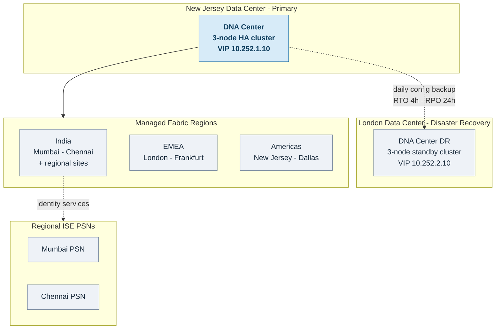

# 2.7 DNA Center Design

### 2.7.1 DNAC Cluster Architecture

```
┌─────────────────────────────────────────────────────────────────────────────┐
│                    DNA CENTER CLUSTER DESIGN                                │
├─────────────────────────────────────────────────────────────────────────────┤
│                                                                             │
│  PRIMARY CLUSTER (New Jersey Data Center):                                  │
│  ──────────────────────────────────────────                                 │
│                                                                             │
│      ┌──────────────────────────────────────────────────────────┐           │
│      │              DNAC 3-NODE HA CLUSTER                      │           │
│      │                                                          │           │
│      │  ┌──────────────┐ ┌──────────────┐ ┌──────────────┐      │           │
│      │  │   NODE 1     │ │   NODE 2     │ │   NODE 3     │      │           │
│      │  │  DN2-HW-APL  │ │  DN2-HW-APL  │ │  DN2-HW-APL  │      │           │
│      │  │     -XL      │ │     -XL      │ │     -XL      │      │           │
│      │  │              │ │              │ │              │      │           │
│      │  │ IP: .11      │ │ IP: .12      │ │ IP: .13      │      │           │
│      │  └──────────────┘ └──────────────┘ └──────────────┘      │           │
│      │           │              │              │                │           │
│      │           └──────────────┼──────────────┘                │           │
│      │                          │                               │           │
│      │              Cluster VIP: 10.252.1.10                    │           │
│      │              FQDN: dnac.company.local                    │           │
│      │                                                          │           │
│      └──────────────────────────────────────────────────────────┘           │
│                                                                             │
│  DISASTER RECOVERY (London Data Center):                                    │
│  ─────────────────────────────────────────                                  │
│                                                                             │
│      ┌──────────────────────────────────────────────────────────┐           │
│      │              DNAC DR CLUSTER (Standby)                   │           │
│      │                                                          │           │
│      │  ┌──────────────┐ ┌──────────────┐ ┌──────────────┐      │           │
│      │  │   NODE 1     │ │   NODE 2     │ │   NODE 3     │      │           │
│      │  │  DN2-HW-APL  │ │  DN2-HW-APL  │ │  DN2-HW-APL  │      │           │
│      │  │     -XL      │ │     -XL      │ │     -XL      │      │           │
│      │  │              │ │              │ │              │      │           │
│      │  │ IP: .21      │ │ IP: .22      │ │ IP: .23      │      │           │
│      │  └──────────────┘ └──────────────┘ └──────────────┘      │           │
│      │                                                          │           │
│      │              Cluster VIP: 10.252.2.10                    │           │
│      │              FQDN: dnac-dr.company.local                 │           │
│      │                                                          │           │
│      └──────────────────────────────────────────────────────────┘           │
│                                                                             │
│  REPLICATION:                                                               │
│  ────────────                                                               │
│  • Active/Passive configuration                                             │
│  • Configuration backup: Daily to DR                                        │
│  • RTO: 4 hours | RPO: 24 hours                                             │
│                                                                             │
└─────────────────────────────────────────────────────────────────────────────┘
```

**Global Management Topology**

At a glance, a single centralised DNA Center cluster in New Jersey manages the entire global fabric, with a standby DR cluster in London. All regions — including India — are managed centrally; regional resilience for identity services is provided by ISE PSNs in Mumbai and Chennai. (Click the diagram to open full size.)



### 2.7.2 DNAC Appliance Specifications

| Specification | DN2-HW-APL-XL (Selected) |
|---------------|--------------------------|
| **Network Devices** | Up to 8,000 |
| **Endpoints** | Up to 200,000 |
| **Access Points** | Up to 16,000 |
| **Cores** | 56 cores |
| **Memory** | 512 GB RAM |
| **Storage** | 12 TB SSD (RAID) |
| **Network Interfaces** | 4 × 10 GbE, 2 × 1 GbE |
| **High Availability** | 3-node cluster |

### 2.7.3 DNAC Network Requirements

| Interface | Purpose | VLAN | IP Range |
|-----------|---------|------|----------|
| **Enterprise** | Device management, southbound | 100 | 10.252.1.0/24 |
| **Management** | GUI access, northbound | 101 | 10.252.2.0/24 |
| **Cluster** | Inter-node communication | 102 | 10.252.3.0/24 |
| **Services** | ISE, AAA, NTP, DNS | 100 | Same as Enterprise |

---
