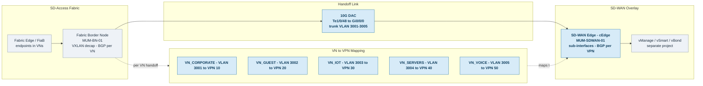

# 4.8.5 SD-WAN Handoff Implementation

**Note**: This section covers the SD-Access to SD-WAN integration points. Full SD-WAN deployment (vManage, vSmart, vBond, transport policies) is covered in a separate project document.

### 4.8.5.1 SD-WAN Deployment Coordination

The SD-WAN deployment runs in parallel with SD-Access. The following milestones must be coordinated:

| SD-Access Milestone | SD-WAN Milestone | Coordination |
|---------------------|------------------|--------------|
| Phase 1: DNAC/ISE deployed | vManage/vSmart/vBond deployed | Joint infrastructure validation |
| Phase 2: Mumbai pilot fabric | Mumbai SD-WAN edge (cEdge) | Handoff testing |
| Phase 3: Hub fabric sites | Hub SD-WAN edges | Per-site cutover coordination |
| Phase 4: Branch fabric sites | Branch SD-WAN edges | Combined branch migration |
| Phase 5: Optimization | Transport optimization | End-to-end path validation |

**Handoff Topology Overview**

The following diagram shows how the SD-Access fabric border connects to the SD-WAN edge at a hub site, and how fabric Virtual Networks (VNs) map to SD-WAN VPNs across the handoff. (Click the diagram to open full size.)



### 4.8.5.2 Border-to-SD-WAN Physical Connectivity

**Hub Site Handoff Cabling**

| Hub Site | Fabric Border | Interface | SD-WAN Edge | Interface | Cable |
|----------|---------------|-----------|-------------|-----------|-------|
| Mumbai | MUM-BN-01 | Te1/0/48 | MUM-SDWAN-01 | Gi0/0/0 | 10G DAC |
| Mumbai | MUM-BN-02 | Te1/0/48 | MUM-SDWAN-02 | Gi0/0/0 | 10G DAC |
| Chennai | CHN-BN-01 | Te1/0/48 | CHN-SDWAN-01 | Gi0/0/0 | 10G DAC |
| Chennai | CHN-BN-02 | Te1/0/48 | CHN-SDWAN-02 | Gi0/0/0 | 10G DAC |
| London | LON-BN-01 | Te1/0/48 | LON-SDWAN-01 | Gi0/0/0 | 10G DAC |
| London | LON-BN-02 | Te1/0/48 | LON-SDWAN-02 | Gi0/0/0 | 10G DAC |
| Frankfurt | FRA-BN-01 | Te1/0/48 | FRA-SDWAN-01 | Gi0/0/0 | 10G DAC |
| Frankfurt | FRA-BN-02 | Te1/0/48 | FRA-SDWAN-02 | Gi0/0/0 | 10G DAC |
| New Jersey | NJ-BN-01 | Te1/0/48 | NJ-SDWAN-01 | Gi0/0/0 | 10G DAC |
| New Jersey | NJ-BN-02 | Te1/0/48 | NJ-SDWAN-02 | Gi0/0/0 | 10G DAC |
| Dallas | DAL-BN-01 | Te1/0/48 | DAL-SDWAN-01 | Gi0/0/0 | 10G DAC |
| Dallas | DAL-BN-02 | Te1/0/48 | DAL-SDWAN-02 | Gi0/0/0 | 10G DAC |

### 4.8.5.3 Border Node Handoff Configuration

**Step 1: Create Handoff VLANs on Border Node**

```cisco
! Border Node SD-WAN Handoff Configuration
! Example: MUM-BN-01

! Create handoff VLANs (one per VN/VRF)
vlan 3001
 name SDWAN-HANDOFF-CORPORATE
vlan 3002
 name SDWAN-HANDOFF-GUEST
vlan 3003
 name SDWAN-HANDOFF-IOT
vlan 3004
 name SDWAN-HANDOFF-SERVERS
vlan 3005
 name SDWAN-HANDOFF-VOICE

! Trunk to SD-WAN Edge
interface TenGigabitEthernet1/0/48
 description TO-MUM-SDWAN-01
 switchport mode trunk
 switchport trunk allowed vlan 3001-3005
 no shutdown
```

**Step 2: Create Handoff SVIs**

```cisco
! Handoff SVI - Corporate VN
interface Vlan3001
 description SDWAN-HANDOFF-VN_CORPORATE
 vrf forwarding VN_CORPORATE
 ip address 10.240.1.2 255.255.255.252
 no shutdown

! Handoff SVI - Guest VN  
interface Vlan3002
 description SDWAN-HANDOFF-VN_GUEST
 vrf forwarding VN_GUEST
 ip address 10.240.2.2 255.255.255.252
 no shutdown

! Handoff SVI - IoT VN
interface Vlan3003
 description SDWAN-HANDOFF-VN_IOT
 vrf forwarding VN_IOT
 ip address 10.240.3.2 255.255.255.252
 no shutdown

! Handoff SVI - Servers VN
interface Vlan3004
 description SDWAN-HANDOFF-VN_SERVERS
 vrf forwarding VN_SERVERS
 ip address 10.240.4.2 255.255.255.252
 no shutdown

! Handoff SVI - Voice VN
interface Vlan3005
 description SDWAN-HANDOFF-VN_VOICE
 vrf forwarding VN_VOICE
 ip address 10.240.5.2 255.255.255.252
 no shutdown
```

**Step 3: Configure BGP Peering with SD-WAN Edge**

```cisco
! BGP Configuration for SD-WAN Handoff
router bgp 65001
 !
 ! Corporate VN peering
 address-family ipv4 vrf VN_CORPORATE
  redistribute lisp metric 100
  neighbor 10.240.1.1 remote-as 65100
  neighbor 10.240.1.1 description MUM-SDWAN-01-CORP
  neighbor 10.240.1.1 activate
  neighbor 10.240.1.1 send-community both
  neighbor 10.240.1.1 route-map FABRIC-TO-SDWAN out
  neighbor 10.240.1.1 route-map SDWAN-TO-FABRIC in
 exit-address-family
 !
 ! Guest VN peering
 address-family ipv4 vrf VN_GUEST
  redistribute lisp metric 100
  neighbor 10.240.2.1 remote-as 65100
  neighbor 10.240.2.1 description MUM-SDWAN-01-GUEST
  neighbor 10.240.2.1 activate
 exit-address-family
 !
 ! IoT VN peering
 address-family ipv4 vrf VN_IOT
  redistribute lisp metric 100
  neighbor 10.240.3.1 remote-as 65100
  neighbor 10.240.3.1 description MUM-SDWAN-01-IOT
  neighbor 10.240.3.1 activate
 exit-address-family
 !
 ! Servers VN peering
 address-family ipv4 vrf VN_SERVERS
  redistribute lisp metric 100
  neighbor 10.240.4.1 remote-as 65100
  neighbor 10.240.4.1 description MUM-SDWAN-01-SRV
  neighbor 10.240.4.1 activate
 exit-address-family
 !
 ! Voice VN peering
 address-family ipv4 vrf VN_VOICE
  redistribute lisp metric 100
  neighbor 10.240.5.1 remote-as 65100
  neighbor 10.240.5.1 description MUM-SDWAN-01-VOICE
  neighbor 10.240.5.1 activate
 exit-address-family

! Route maps for prefix filtering
route-map FABRIC-TO-SDWAN permit 10
 match ip address prefix-list FABRIC-PREFIXES
 set community 65001:100
 
route-map SDWAN-TO-FABRIC permit 10
 match community SDWAN-ROUTES
 set local-preference 200

ip prefix-list FABRIC-PREFIXES seq 10 permit 10.100.0.0/16 le 24
ip prefix-list FABRIC-PREFIXES seq 20 permit 10.150.0.0/16 le 24
ip prefix-list FABRIC-PREFIXES seq 30 permit 10.190.0.0/16 le 24
ip prefix-list FABRIC-PREFIXES seq 40 permit 10.200.0.0/16 le 24
```

### 4.8.5.4 SD-WAN Edge Configuration (Reference)

**Note**: Full SD-WAN edge configuration is managed via vManage templates. This shows the handoff-side interface configuration for reference.

```cisco
! SD-WAN Edge (cEdge) - Handoff Interface Configuration
! Example: MUM-SDWAN-01 (ISR 4451 in cEdge mode)

! Service-side interface to Fabric Border
interface GigabitEthernet0/0/0
 description TO-MUM-BN-01
 no shutdown

interface GigabitEthernet0/0/0.3001
 description HANDOFF-VN_CORPORATE
 encapsulation dot1Q 3001
 vrf forwarding 10
 ip address 10.240.1.1 255.255.255.252

interface GigabitEthernet0/0/0.3002
 description HANDOFF-VN_GUEST
 encapsulation dot1Q 3002
 vrf forwarding 40
 ip address 10.240.2.1 255.255.255.252

interface GigabitEthernet0/0/0.3003
 description HANDOFF-VN_IOT
 encapsulation dot1Q 3003
 vrf forwarding 50
 ip address 10.240.3.1 255.255.255.252

! Transport interfaces (MPLS + Internet)
interface GigabitEthernet0/0/1
 description MPLS-TRANSPORT
 ip address dhcp
 tunnel-interface
  encapsulation ipsec
  color mpls
  allow-service all
  no allow-service bgp

interface GigabitEthernet0/0/2
 description INTERNET-TRANSPORT
 ip address dhcp
 tunnel-interface
  encapsulation ipsec
  color biz-internet
  allow-service all
```

### 4.8.5.5 Branch Fabric-in-a-Box SD-WAN Integration

For branch sites with Fabric-in-a-Box deployment:

```cisco
! Branch Fabric-in-a-Box to SD-WAN Edge Handoff
! Example: BLR-FIAB-01 (C9300-48UXM) to BLR-SDWAN-01 (ISR 4331)

! FiaB Border handoff interface
interface TenGigabitEthernet1/1/1
 description TO-BLR-SDWAN-01
 switchport mode trunk
 switchport trunk allowed vlan 3001-3003

! Handoff SVIs (simplified - Corporate, Guest, IoT only)
interface Vlan3001
 vrf forwarding VN_CORPORATE
 ip address 10.240.101.2 255.255.255.252
 
interface Vlan3002
 vrf forwarding VN_GUEST
 ip address 10.240.102.2 255.255.255.252

interface Vlan3003
 vrf forwarding VN_IOT
 ip address 10.240.103.2 255.255.255.252

! BGP to SD-WAN edge
router bgp 65001
 address-family ipv4 vrf VN_CORPORATE
  neighbor 10.240.101.1 remote-as 65100
  neighbor 10.240.101.1 activate
  redistribute lisp
 exit-address-family
```

### 4.8.5.6 SD-WAN Handoff Validation

**Pre-Cutover Validation Checklist**

| Check | Command | Expected Result |
|-------|---------|-----------------|
| Physical link | `show interface Te1/0/48` | Line up, protocol up |
| Trunk VLANs | `show interface trunk` | VLANs 3001-3005 allowed |
| SVI status | `show ip interface brief | inc Vlan300` | All SVIs up/up |
| BGP neighbor | `show bgp vpnv4 unicast all summary` | Neighbors established |
| Route exchange | `show ip route vrf VN_CORPORATE` | SD-WAN routes present |
| Ping test | `ping vrf VN_CORPORATE 10.240.1.1` | Success |

**Post-Cutover Validation**

```cisco
! Verify BGP adjacency
show bgp vpnv4 unicast all summary
! All SD-WAN neighbors should show state "Established"

! Verify route exchange - Fabric to SD-WAN
show ip route vrf VN_CORPORATE bgp
! Should see routes to remote sites via SD-WAN edge

! Verify route exchange - SD-WAN to Fabric
show ip route vrf VN_CORPORATE lisp
! Should see local fabric subnets

! End-to-end connectivity test
! From Mumbai client to Chennai server (via SD-WAN):
ping 10.100.2.100 source 10.100.1.10
traceroute 10.100.2.100 source 10.100.1.10
! Verify path goes through SD-WAN edge
```

### 4.8.5.7 SD-WAN Cutover Sequence

**Per-Site SD-WAN Cutover (Coordinated with SD-WAN Team)**

| Step | Time | Activity | Owner |
|------|------|----------|-------|
| 1 | T-60 min | Final backup of fabric border config | Network |
| 2 | T-45 min | Verify SD-WAN edge ready (vManage) | SD-WAN |
| 3 | T-30 min | Connect handoff cables | Network |
| 4 | T-15 min | Configure handoff VLANs/SVIs | Network |
| 5 | T-0 | Enable BGP peering | Network + SD-WAN |
| 6 | T+5 min | Verify BGP established | Both |
| 7 | T+10 min | Verify route exchange | Both |
| 8 | T+15 min | Test inter-site connectivity | Both |
| 9 | T+30 min | Monitor for 30 minutes | Both |
| 10 | T+60 min | Declare cutover complete | PM |

**Rollback Trigger Criteria**

- BGP not establishing after 15 minutes
- Route exchange incomplete after 20 minutes
- Inter-site connectivity failures >10%
- Voice quality degradation (MOS <3.5)
- Business-critical application failures

**Rollback Procedure**

```cisco
! Emergency rollback - revert to legacy MPLS
! Step 1: Disable BGP to SD-WAN edge
router bgp 65001
 address-family ipv4 vrf VN_CORPORATE
  neighbor 10.240.1.1 shutdown
 exit-address-family

! Step 2: Re-enable legacy MPLS BGP
 address-family ipv4 vrf VN_CORPORATE
  neighbor 10.240.1.5 remote-as 65000
  neighbor 10.240.1.5 activate
 exit-address-family

! Step 3: Verify legacy routing restored
show ip route vrf VN_CORPORATE
```

---
