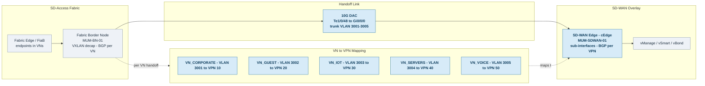

# 2.7 SD-Access Integration Design

## Document Information
| Field | Value |
|-------|-------|
| Document Title | SD-Access Integration Design |
| Section Number | 2.7 |
| Version | 1.0 |
| Last Updated | December 30, 2025 |
| Author | Network Architecture Team |
| Classification | Internal Use |
| Priority | CRITICAL |

---

## 2.7.1 Integration Architecture Overview

### Executive Summary

The SD-Access and SD-WAN integration represents a critical architectural component that enables end-to-end policy consistency, seamless traffic forwarding, and unified security posture across Abhavtech.com's campus and WAN infrastructure. This document details the Independent Domain integration model selected for the deployment.

### Integration Model Selection

| Model | Description | Complexity | Scalability | Selected |
|-------|-------------|------------|-------------|----------|
| Independent Domains | Separate control planes, L3 handoff | Medium | High | ✓ Yes |
| Unified Domain | Single Catalyst Center control | High | Limited | No |
| Hybrid | Partial integration | Medium | Medium | No |

### Rationale for Independent Domain Model

The Independent Domain model was selected based on the following criteria:

1. **Operational Separation:** Network operations teams can manage SD-Access and SD-WAN independently
2. **Failure Domain Isolation:** Issues in one domain do not cascade to the other
3. **Scalability:** Each domain can scale according to its own requirements
4. **Migration Flexibility:** SD-WAN migration can proceed independently of SD-Access operations
5. **Vendor Flexibility:** Future ability to integrate non-Cisco WAN solutions if needed

### High-Level Integration Architecture

```
                    SD-ACCESS AND SD-WAN INTEGRATION ARCHITECTURE
+==============================================================================+
|                                                                              |
|                           MANAGEMENT PLANE                                   |
|   +---------------------------+       +---------------------------+          |
|   |     CATALYST CENTER       |       |     SD-WAN MANAGER        |          |
|   |     (DNA Center)          |       |     (vManage)             |          |
|   |     2.3.7.x               |       |     20.15.x               |          |
|   |                           |       |                           |          |
|   |   - Fabric provisioning   |  API  |   - Template config       |          |
|   |   - Policy automation     |<=====>|   - Policy deployment     |          |
|   |   - Assurance/Analytics   |       |   - Analytics/Reports     |          |
|   +-------------+-------------+       +-------------+-------------+          |
|                 |                                   |                        |
|                 v                                   v                        |
|   +---------------------------+       +---------------------------+          |
|   |    CONTROL PLANE          |       |    CONTROL PLANE          |          |
|   |    LISP/SGT               |       |    OMP/vSmart             |          |
|   +-------------+-------------+       +-------------+-------------+          |
|                 |                                   |                        |
|                 v                                   v                        |
|   +==============================================================+          |
|   |                    DATA PLANE HANDOFF                        |          |
|   |                                                              |          |
|   |  +------------------+              +------------------+       |          |
|   |  |  SD-ACCESS       |              |  SD-WAN          |       |          |
|   |  |  FABRIC BORDER   |              |  WAN EDGE        |       |          |
|   |  |                  |              |                  |       |          |
|   |  |  VRF: Employee   | <-- L3 -->   |  VPN 10          |       |          |
|   |  |  VRF: Guest      | <-- L3 -->   |  VPN 20          |       |          |
|   |  |  VRF: IoT        | <-- L3 -->   |  VPN 30          |       |          |
|   |  |  VRF: Voice      | <-- L3 -->   |  VPN 40          |       |          |
|   |  |  VRF: Shared     | <-- L3 -->   |  VPN 50          |       |          |
|   |  |                  |              |                  |       |          |
|   |  |  SGT Tags -----> | CTS Inline   | <----- SGT Tags  |       |          |
|   |  +------------------+              +------------------+       |          |
|   |                                                              |          |
|   +==============================================================+          |
|                                                                              |
+==============================================================================+
```

---

### Handoff Topology Overview

The following diagram shows how an SD-Access fabric border node connects to the SD-WAN edge at a hub site, and how fabric Virtual Networks (VNs) map to SD-WAN VPNs across the handoff. Mumbai (MUM) is shown as the representative example. (Click the diagram to zoom, or open it in a new tab.)



!!! note "This pattern repeats at every hub"
    The diagram above uses Mumbai as a single representative example. The **same border-to-edge handoff pattern is deployed at all six hub sites across the three regions** — India/APAC (Mumbai, Chennai), EMEA (London, Frankfurt), and Americas (New Jersey, Dallas). Each hub runs two fabric border nodes and two co-located SD-WAN edges for high availability, giving the full 12-link handoff matrix below.

**Hub Site Handoff Cabling (all regions)**

| Hub Site | Fabric Border | Interface | SD-WAN Edge | Interface | Cable |
|----------|---------------|-----------|-------------|-----------|-------|
| Mumbai | MUM-BN-01 | Te1/0/48 | MUM-SDWAN-01 | Gi0/0/0 | 10G DAC |
| Mumbai | MUM-BN-02 | Te1/0/48 | MUM-SDWAN-02 | Gi0/0/0 | 10G DAC |
| Chennai | CHN-BN-01 | Te1/0/48 | CHN-SDWAN-01 | Gi0/0/0 | 10G DAC |
| Chennai | CHN-BN-02 | Te1/0/48 | CHN-SDWAN-02 | Gi0/0/0 | 10G DAC |
| London | LON-BN-01 | Te1/0/48 | LON-SDWAN-01 | Gi0/0/0 | 10G DAC |
| London | LON-BN-02 | Te1/0/48 | LON-SDWAN-02 | Gi0/0/0 | 10G DAC |
| Frankfurt | FRA-BN-01 | Te1/0/48 | FRA-SDWAN-01 | Gi0/0/0 | 10G DAC |
| Frankfurt | FRA-BN-02 | Te1/0/48 | FRA-SDWAN-02 | Gi0/0/0 | 10G DAC |
| New Jersey | NJ-BN-01 | Te1/0/48 | NJ-SDWAN-01 | Gi0/0/0 | 10G DAC |
| New Jersey | NJ-BN-02 | Te1/0/48 | NJ-SDWAN-02 | Gi0/0/0 | 10G DAC |
| Dallas | DAL-BN-01 | Te1/0/48 | DAL-SDWAN-01 | Gi0/0/0 | 10G DAC |
| Dallas | DAL-BN-02 | Te1/0/48 | DAL-SDWAN-02 | Gi0/0/0 | 10G DAC |

---

## 2.7.2 Physical Connectivity Design

### Handoff Topology

```
                       PHYSICAL HANDOFF TOPOLOGY - MUMBAI DC
+==============================================================================+
|                                                                              |
|   SD-ACCESS FABRIC                       SD-WAN DOMAIN                       |
|   +--------------------------+           +--------------------------+        |
|   |                          |           |                          |        |
|   |  +--------------------+  |           |  +--------------------+  |        |
|   |  |   FABRIC BORDER    |  |           |  |    WAN EDGE        |  |        |
|   |  |   C9500-48Y4C      |  |           |  |    C8500-12X4QC    |  |        |
|   |  |   (Primary)        |  |           |  |    (Primary)       |  |        |
|   |  |                    |  |           |  |                    |  |        |
|   |  | Te1/0/1 =============================== Te0/0/4           |  |        |
|   |  | Te1/0/2 =============================== Te0/0/5           |  |        |
|   |  |   (Trunk)          |  |  10GbE    |  |   (Subinterfaces)  |  |        |
|   |  +--------------------+  |           |  +--------------------+  |        |
|   |                          |           |                          |        |
|   |  +--------------------+  |           |  +--------------------+  |        |
|   |  |   FABRIC BORDER    |  |           |  |    WAN EDGE        |  |        |
|   |  |   C9500-48Y4C      |  |           |  |    C8500-12X4QC    |  |        |
|   |  |   (Secondary)      |  |           |  |    (Secondary)     |  |        |
|   |  |                    |  |           |  |                    |  |        |
|   |  | Te1/0/1 =============================== Te0/0/4           |  |        |
|   |  | Te1/0/2 =============================== Te0/0/5           |  |        |
|   |  |   (Trunk)          |  |  10GbE    |  |   (Subinterfaces)  |  |        |
|   |  +--------------------+  |           |  +--------------------+  |        |
|   |                          |           |                          |        |
|   +--------------------------+           +--------------------------+        |
|                                                                              |
|   HANDOFF DETAILS:                                                           |
|   - 2x 10GbE links per border pair for redundancy                           |
|   - 802.1Q trunking with VLAN per VRF                                       |
|   - BFD for fast failure detection                                          |
|   - eBGP for route exchange                                                 |
|   - CTS inline tagging for SGT propagation                                  |
|                                                                              |
+==============================================================================+
```

### Interface Cabling Matrix

| Site | SD-Access Border | Border Interface | WAN Edge | WAN Edge Interface | Speed | Purpose |
|------|------------------|------------------|----------|-------------------|-------|---------|
| Mumbai DC | Border-1 | Te1/0/1 | WAN-Edge-1 | Te0/0/4 | 10G | Primary handoff |
| Mumbai DC | Border-1 | Te1/0/2 | WAN-Edge-2 | Te0/0/4 | 10G | Redundant handoff |
| Mumbai DC | Border-2 | Te1/0/1 | WAN-Edge-1 | Te0/0/5 | 10G | Redundant handoff |
| Mumbai DC | Border-2 | Te1/0/2 | WAN-Edge-2 | Te0/0/5 | 10G | Redundant handoff |
| Chennai DR | Border-1 | Te1/0/1 | WAN-Edge-1 | Te0/0/4 | 10G | Primary handoff |
| Chennai DR | Border-1 | Te1/0/2 | WAN-Edge-2 | Te0/0/4 | 10G | Redundant handoff |
| Chennai DR | Border-2 | Te1/0/1 | WAN-Edge-1 | Te0/0/5 | 10G | Redundant handoff |
| Chennai DR | Border-2 | Te1/0/2 | WAN-Edge-2 | Te0/0/5 | 10G | Redundant handoff |

---

## 2.7.3 VRF-to-VPN Mapping Design

### Virtual Network Mapping Strategy

| SD-Access VN | VRF Name | VLAN ID | SD-WAN Service VPN | Subnet (Handoff) | Description |
|--------------|----------|---------|-------------------|------------------|-------------|
| Employee_VN | EMPLOYEE | 100 | VPN 10 | 10.252.10.0/30 | Corporate users |
| Guest_VN | GUEST | 200 | VPN 20 | 10.252.20.0/30 | Guest/BYOD |
| IoT_VN | IOT | 300 | VPN 30 | 10.252.30.0/30 | IoT devices |
| Voice_VN | VOICE | 400 | VPN 40 | 10.252.40.0/30 | Unified Comms |
| Shared_VN | SHARED | 500 | VPN 50 | 10.252.50.0/30 | Shared services |

### Handoff VLAN Assignment

```
                         VRF-LITE HANDOFF VLAN DESIGN
+==============================================================================+
|                                                                              |
|   SITE: MUMBAI DC                                                            |
|                                                                              |
|   SD-ACCESS BORDER (C9500)              SD-WAN WAN EDGE (C8500)             |
|   +---------------------------+         +---------------------------+        |
|   |                           |         |                           |        |
|   | VRF EMPLOYEE              |         | VPN 10 (CORPORATE)        |        |
|   | - VLAN 100 (SVI)          |         | - Subint Te0/0/4.100      |        |
|   | - 10.252.10.1/30          |         | - 10.252.10.2/30          |        |
|   |                           |         |                           |        |
|   | VRF GUEST                 |         | VPN 20 (GUEST)            |        |
|   | - VLAN 200 (SVI)          |         | - Subint Te0/0/4.200      |        |
|   | - 10.252.20.1/30          |         | - 10.252.20.2/30          |        |
|   |                           |         |                           |        |
|   | VRF IOT                   |         | VPN 30 (IOT)              |        |
|   | - VLAN 300 (SVI)          |         | - Subint Te0/0/4.300      |        |
|   | - 10.252.30.1/30          |         | - 10.252.30.2/30          |        |
|   |                           |         |                           |        |
|   | VRF VOICE                 |         | VPN 40 (VOICE)            |        |
|   | - VLAN 400 (SVI)          |         | - Subint Te0/0/4.400      |        |
|   | - 10.252.40.1/30          |         | - 10.252.40.2/30          |        |
|   |                           |         |                           |        |
|   | VRF SHARED                |         | VPN 50 (SHARED)           |        |
|   | - VLAN 500 (SVI)          |         | - Subint Te0/0/4.500      |        |
|   | - 10.252.50.1/30          |         | - 10.252.50.2/30          |        |
|   |                           |         |                           |        |
|   +---------------------------+         +---------------------------+        |
|                                                                              |
+==============================================================================+
```

### IP Addressing for Handoff Links

| Site | VRF/VPN | VLAN | Border IP | WAN Edge IP | Network |
|------|---------|------|-----------|-------------|---------|
| Mumbai | EMPLOYEE/VPN10 | 100 | 10.252.10.1/30 | 10.252.10.2/30 | 10.252.10.0/30 |
| Mumbai | GUEST/VPN20 | 200 | 10.252.20.1/30 | 10.252.20.2/30 | 10.252.20.0/30 |
| Mumbai | IOT/VPN30 | 300 | 10.252.30.1/30 | 10.252.30.2/30 | 10.252.30.0/30 |
| Mumbai | VOICE/VPN40 | 400 | 10.252.40.1/30 | 10.252.40.2/30 | 10.252.40.0/30 |
| Mumbai | SHARED/VPN50 | 500 | 10.252.50.1/30 | 10.252.50.2/30 | 10.252.50.0/30 |
| Chennai | EMPLOYEE/VPN10 | 100 | 10.253.10.1/30 | 10.253.10.2/30 | 10.253.10.0/30 |
| Chennai | GUEST/VPN20 | 200 | 10.253.20.1/30 | 10.253.20.2/30 | 10.253.20.0/30 |
| Chennai | IOT/VPN30 | 300 | 10.253.30.1/30 | 10.253.30.2/30 | 10.253.30.0/30 |
| Chennai | VOICE/VPN40 | 400 | 10.253.40.1/30 | 10.253.40.2/30 | 10.253.40.0/30 |
| Chennai | SHARED/VPN50 | 500 | 10.253.50.1/30 | 10.253.50.2/30 | 10.253.50.0/30 |

---

## 2.7.4 BGP Peering Design

### eBGP Configuration Strategy

| Parameter | SD-Access Border | SD-WAN WAN Edge |
|-----------|------------------|-----------------|
| AS Number | 65100 | 65200 |
| Router ID | Loopback0 IP | System-IP |
| Timers | 10/30 (keepalive/hold) | 10/30 |
| BFD | Enabled, 100ms | Enabled, 100ms |
| Password | MD5 Authentication | MD5 Authentication |
| Max Prefixes | 1000 | 1000 |

### BGP Topology per VRF

```
                           eBGP PEERING TOPOLOGY
+==============================================================================+
|                                                                              |
|   SD-ACCESS FABRIC BORDER                 SD-WAN WAN EDGE                   |
|   AS 65100                                AS 65200                          |
|                                                                              |
|   +--------------------------+            +--------------------------+       |
|   |                          |            |                          |       |
|   |  VRF: EMPLOYEE           |            |  VPN 10: CORPORATE       |       |
|   |  Router-ID: 10.255.100.1 |            |  Router-ID: 10.1.100.1   |       |
|   |                          |            |                          |       |
|   |  neighbor 10.252.10.2    |   eBGP    |  neighbor 10.252.10.1    |       |
|   |    remote-as 65200       |<=========>|    remote-as 65100       |       |
|   |    fall-over bfd        |            |    fall-over bfd        |       |
|   |    password cisco123     |            |    password cisco123     |       |
|   |                          |            |                          |       |
|   |  Advertises:             |            |  Advertises:             |       |
|   |  - 10.10.0.0/16 (Campus) |            |  - 10.20.0.0/16 (WAN)   |       |
|   |  - 10.100.0.0/16 (DC)    |            |  - 0.0.0.0/0 (Default)  |       |
|   |                          |            |                          |       |
|   +--------------------------+            +--------------------------+       |
|                                                                              |
|   [Same pattern repeated for VRF GUEST/VPN20, IOT/VPN30, etc.]              |
|                                                                              |
+==============================================================================+
```

### SD-Access Border BGP Configuration

```
!======================================================================
! SD-ACCESS FABRIC BORDER - BGP CONFIGURATION
!======================================================================
!
! Global BGP Configuration
router bgp 65100
 bgp router-id 10.255.100.1
 bgp log-neighbor-changes
 no bgp default ipv4-unicast
 !
 ! VRF EMPLOYEE - BGP Peering
 address-family ipv4 vrf EMPLOYEE
  bgp router-id 10.255.100.1
  redistribute connected route-map CONNECTED-TO-BGP
  redistribute lisp route-map LISP-TO-BGP
  neighbor 10.252.10.2 remote-as 65200
  neighbor 10.252.10.2 description SD-WAN-WAN-EDGE-1-VPN10
  neighbor 10.252.10.2 password 7 045802150C2E1D1C5A
  neighbor 10.252.10.2 timers 10 30
  neighbor 10.252.10.2 fall-over bfd
  neighbor 10.252.10.2 activate
  neighbor 10.252.10.2 send-community both
  neighbor 10.252.10.2 route-map SD-WAN-IN in
  neighbor 10.252.10.2 route-map SD-ACCESS-OUT out
  maximum-paths 4
  maximum-paths ibgp 4
 exit-address-family
 !
 ! VRF GUEST - BGP Peering
 address-family ipv4 vrf GUEST
  bgp router-id 10.255.100.1
  redistribute connected route-map CONNECTED-TO-BGP
  redistribute lisp route-map LISP-TO-BGP
  neighbor 10.252.20.2 remote-as 65200
  neighbor 10.252.20.2 description SD-WAN-WAN-EDGE-1-VPN20
  neighbor 10.252.20.2 password 7 045802150C2E1D1C5A
  neighbor 10.252.20.2 timers 10 30
  neighbor 10.252.20.2 fall-over bfd
  neighbor 10.252.20.2 activate
  neighbor 10.252.20.2 send-community both
  neighbor 10.252.20.2 route-map SD-WAN-IN in
  neighbor 10.252.20.2 route-map SD-ACCESS-OUT out
 exit-address-family
 !
 ! VRF IOT - BGP Peering
 address-family ipv4 vrf IOT
  bgp router-id 10.255.100.1
  redistribute connected route-map CONNECTED-TO-BGP
  redistribute lisp route-map LISP-TO-BGP
  neighbor 10.252.30.2 remote-as 65200
  neighbor 10.252.30.2 description SD-WAN-WAN-EDGE-1-VPN30
  neighbor 10.252.30.2 password 7 045802150C2E1D1C5A
  neighbor 10.252.30.2 timers 10 30
  neighbor 10.252.30.2 fall-over bfd
  neighbor 10.252.30.2 activate
 exit-address-family
 !
 ! VRF VOICE - BGP Peering
 address-family ipv4 vrf VOICE
  bgp router-id 10.255.100.1
  redistribute connected route-map CONNECTED-TO-BGP
  redistribute lisp route-map LISP-TO-BGP
  neighbor 10.252.40.2 remote-as 65200
  neighbor 10.252.40.2 description SD-WAN-WAN-EDGE-1-VPN40
  neighbor 10.252.40.2 password 7 045802150C2E1D1C5A
  neighbor 10.252.40.2 timers 10 30
  neighbor 10.252.40.2 fall-over bfd
  neighbor 10.252.40.2 activate
 exit-address-family
 !
 ! VRF SHARED - BGP Peering
 address-family ipv4 vrf SHARED
  bgp router-id 10.255.100.1
  redistribute connected route-map CONNECTED-TO-BGP
  redistribute lisp route-map LISP-TO-BGP
  neighbor 10.252.50.2 remote-as 65200
  neighbor 10.252.50.2 description SD-WAN-WAN-EDGE-1-VPN50
  neighbor 10.252.50.2 password 7 045802150C2E1D1C5A
  neighbor 10.252.50.2 timers 10 30
  neighbor 10.252.50.2 fall-over bfd
  neighbor 10.252.50.2 activate
 exit-address-family
!
! Route Maps
route-map SD-WAN-IN permit 10
 set local-preference 200
!
route-map SD-ACCESS-OUT permit 10
 match ip address prefix-list CAMPUS-NETWORKS
 set community 65100:100
!
route-map LISP-TO-BGP permit 10
 set tag 100
!
route-map CONNECTED-TO-BGP permit 10
 set tag 200
!
! Prefix Lists
ip prefix-list CAMPUS-NETWORKS seq 10 permit 10.10.0.0/16 le 24
ip prefix-list CAMPUS-NETWORKS seq 20 permit 10.100.0.0/16 le 24
ip prefix-list WAN-NETWORKS seq 10 permit 10.20.0.0/16 le 24
```

### SD-WAN WAN Edge BGP Configuration (Feature Template)

```
!======================================================================
! SD-WAN WAN EDGE - BGP CONFIGURATION (vManage Feature Template)
!======================================================================
!
! Service VPN 10 - BGP to SD-Access Border
sdwan
 service vrf VPN10
  !
  ip route 0.0.0.0/0 vpn 0
  !
  bgp
   router-id 10.1.100.1
   as-number 65200
   !
   address-family ipv4-unicast
    redistribute connected
    redistribute omp
    network 10.20.0.0/16
   !
   neighbor 10.252.10.1
    description SD-ACCESS-BORDER-EMPLOYEE
    remote-as 65100
    password cisco123
    timers
     keepalive 10
     holdtime 30
    !
    update-source interface GigabitEthernet0/0/4.100
    !
    address-family ipv4-unicast
     send-community both
     as-override
    !
    bfd
!
! BFD Configuration
bfd
 color mpls
  hello-interval 100
  multiplier 3
  pmtu-discovery
!
! Interface Configuration for BGP Peering
interface GigabitEthernet0/0/4.100
 description SD-ACCESS-HANDOFF-VPN10
 encapsulation dot1q 100
 ip address 10.252.10.2 255.255.255.252
 ip mtu 9000
 no shutdown
```

---

## 2.7.5 SGT/TrustSec Integration

### SGT Propagation Architecture

```
                        SGT PROPAGATION - END TO END
+==============================================================================+
|                                                                              |
|   ENDPOINT                SD-ACCESS               SD-WAN                    |
|   +--------+             +----------+            +----------+               |
|   |        |   802.1X    | FABRIC   |  CTS       | WAN EDGE |   CTS        |
|   | User   |============>| EDGE     |==========>|          |============>  |
|   | Device |   Auth      | (SGT=5)  |  Inline   | (SGT=5)  |   Inline     |
|   |        |             |          |  Tagging  |          |   Tagging    |
|   +--------+             +----+-----+            +----+-----+              |
|       |                       |                       |                    |
|       |                       v                       v                    |
|       |                  +----+-----+            +----+-----+              |
|       |                  | FABRIC   |            | REMOTE   |              |
|   ISE |                  | BORDER   |            | WAN EDGE |              |
|   Auth|                  | CTS SXP  |            | CTS SXP  |              |
|       |                  +----+-----+            +----+-----+              |
|       |                       |                       |                    |
|       v                       v                       v                    |
|   +--------+             +----------+            +----------+              |
|   |  ISE   |<============| SXP      |<===========| SXP      |              |
|   | Server |   SGT       | Speaker  |   SGT      | Listener |              |
|   |        |   Mapping   |          |   Mapping  |          |              |
|   +--------+             +----------+            +----------+              |
|                                                                            |
|   SGT FLOW:                                                                |
|   1. User authenticates via 802.1X/MAB                                    |
|   2. ISE assigns SGT based on policy                                      |
|   3. Fabric Edge applies SGT via CTS                                      |
|   4. SGT preserved through fabric (inline)                                |
|   5. Border maintains SGT on handoff to SD-WAN                            |
|   6. WAN Edge preserves SGT across overlay                                |
|   7. Remote WAN Edge delivers traffic with SGT intact                     |
|   8. SXP provides IP-to-SGT mapping where inline not supported            |
|                                                                            |
+==============================================================================+
```

### SGT Tag Definitions (From SD-Access Project)

| SGT Value | SGT Name | Description | Traffic Class |
|-----------|----------|-------------|---------------|
| 2 | TrustSec_Devices | Network infrastructure | Infrastructure |
| 3 | Employees | Corporate employees | User |
| 4 | Guests | Guest users | Guest |
| 5 | Contractors | Contract workers | User |
| 6 | BYOD | Personal devices | BYOD |
| 7 | IoT_Sensors | IoT sensor devices | IoT |
| 8 | IoT_Controllers | IoT control systems | IoT |
| 9 | Voice_Endpoints | IP phones, video | Voice |
| 10 | Executives | Executive staff | Privileged |
| 11 | IT_Admins | IT administrators | Privileged |
| 12 | PCI_Systems | Payment systems | Regulated |

### CTS Inline Tagging Configuration

**SD-Access Fabric Border (CTS Configuration):**

```
!======================================================================
! SD-ACCESS BORDER - CTS INLINE TAGGING
!======================================================================
!
! Global CTS Configuration
cts authorization list CTS-AUTH-LIST
!
cts role-based enforcement
cts role-based enforcement vlan-list 100,200,300,400,500
!
! CTS Credentials (from ISE)
cts credentials id BORDER-MUM-1 password 0 Cisco123
!
! CTS SXP Configuration for IP-SGT Mapping
cts sxp enable
cts sxp default source-ip 10.255.100.1
cts sxp default password 0 SxpPassword123
cts sxp connection peer 10.254.1.10 password default mode peer speaker hold-time 120 120
cts sxp connection peer 10.254.1.11 password default mode peer speaker hold-time 120 120
!
! Interface CTS Configuration - Handoff to SD-WAN
interface TenGigabitEthernet1/0/1
 description TO-SD-WAN-WAN-EDGE-1
 switchport mode trunk
 switchport trunk allowed vlan 100,200,300,400,500
 cts manual
  policy static sgt 2 trusted
  propagate sgt
!
! VRF-aware CTS
interface Vlan100
 vrf forwarding EMPLOYEE
 ip address 10.252.10.1 255.255.255.252
 cts role-based enforcement
!
interface Vlan200
 vrf forwarding GUEST
 ip address 10.252.20.1 255.255.255.252
 cts role-based enforcement
!
interface Vlan300
 vrf forwarding IOT
 ip address 10.252.30.1 255.255.255.252
 cts role-based enforcement
!
interface Vlan400
 vrf forwarding VOICE
 ip address 10.252.40.1 255.255.255.252
 cts role-based enforcement
!
interface Vlan500
 vrf forwarding SHARED
 ip address 10.252.50.1 255.255.255.252
 cts role-based enforcement
```

**SD-WAN WAN Edge (CTS Configuration):**

```
!======================================================================
! SD-WAN WAN EDGE - CTS INLINE TAGGING
!======================================================================
!
! Global CTS Configuration
cts authorization list CTS-AUTH-LIST
!
cts role-based enforcement
!
! CTS Credentials
cts credentials id WANEDGE-MUM-1 password 0 Cisco123
!
! CTS SXP Configuration
cts sxp enable
cts sxp default source-ip 10.1.100.1
cts sxp default password 0 SxpPassword123
!
! SXP Peers (ISE PSNs)
cts sxp connection peer 10.254.1.10 password default mode local listener hold-time 120 120
cts sxp connection peer 10.254.1.11 password default mode local listener hold-time 120 120
!
! Interface CTS Configuration - From SD-Access
interface GigabitEthernet0/0/4.100
 description SD-ACCESS-HANDOFF-VPN10
 encapsulation dot1q 100
 ip address 10.252.10.2 255.255.255.252
 cts role-based enforcement
 cts manual
  policy static sgt 2 trusted
  propagate sgt
!
! Tunnel Interface CTS (Propagate SGT over Overlay)
interface Tunnel100001
 description IPSEC-TUNNEL-MPLS
 cts role-based enforcement
 cts manual
  propagate sgt
!
! SGACL Enforcement
cts role-based permissions from 3 to 12 DENY-PCI
cts role-based permissions from 4 to 3 GUEST-TO-EMPLOYEE
cts role-based permissions from 7 to 8 IOT-SENSOR-TO-CONTROLLER
```

### SXP Topology

```
                              SXP TOPOLOGY
+==============================================================================+
|                                                                              |
|                              ISE CLUSTER                                     |
|   +-------------------------------------------------------------------+     |
|   |                                                                   |     |
|   |   +-------------+                      +-------------+            |     |
|   |   | ISE PSN-1   |                      | ISE PSN-2   |            |     |
|   |   | 10.254.1.10 |                      | 10.254.1.11 |            |     |
|   |   | SXP Speaker |                      | SXP Speaker |            |     |
|   |   +------+------+                      +------+------+            |     |
|   |          |                                    |                   |     |
|   +----------|------------------------------------|-----------------  +     |
|              |                                    |                         |
|              +----------------+-------------------+                         |
|                               |                                             |
|           +-------------------+-------------------+                         |
|           |                   |                   |                         |
|           v                   v                   v                         |
|   +---------------+   +---------------+   +---------------+                 |
|   | SD-Access     |   | SD-WAN        |   | SD-WAN        |                 |
|   | Border        |   | WAN Edge      |   | WAN Edge      |                 |
|   | SXP Listener/ |   | Mumbai        |   | Chennai       |                 |
|   | Speaker       |   | SXP Listener  |   | SXP Listener  |                 |
|   +---------------+   +---------------+   +---------------+                 |
|                                                                              |
|   SXP CONNECTIONS:                                                          |
|   - ISE PSN acts as SXP Speaker (master IP-SGT database)                   |
|   - SD-Access Borders: Listener from ISE, Speaker to WAN Edges             |
|   - SD-WAN WAN Edges: Listener from ISE/Borders                            |
|   - Bi-directional mode for full visibility                                |
|                                                                              |
+==============================================================================+
```

---

## 2.7.6 Route Exchange and Summarization

### Route Advertisement Strategy

| Direction | Source | Routes Advertised | Summarization |
|-----------|--------|-------------------|---------------|
| SD-Access → SD-WAN | Fabric Border | Campus networks (10.10.0.0/16) | Summarized at border |
| SD-WAN → SD-Access | WAN Edge | Remote site networks (10.20.0.0/16) | Summarized by region |
| SD-Access → SD-WAN | Fabric Border | DC networks (10.100.0.0/16) | Summarized at border |
| SD-WAN → SD-Access | WAN Edge | Internet/SaaS (DIA routes) | Default route or specific |

### Route Summarization Configuration

**SD-Access Border - Summarize Campus to SD-WAN:**

```
!======================================================================
! SD-ACCESS BORDER - ROUTE SUMMARIZATION
!======================================================================
!
! Aggregate Campus Networks Before Advertising to SD-WAN
router bgp 65100
 address-family ipv4 vrf EMPLOYEE
  aggregate-address 10.10.0.0 255.255.0.0 summary-only
  aggregate-address 10.100.0.0 255.255.0.0 summary-only
 exit-address-family
!
! Route Map for Controlled Advertisement
route-map SD-ACCESS-TO-SDWAN permit 10
 match ip address prefix-list CAMPUS-SUMMARY
 set community 65100:1000
!
route-map SD-ACCESS-TO-SDWAN deny 20
 match ip address prefix-list CAMPUS-SPECIFIC
!
ip prefix-list CAMPUS-SUMMARY seq 10 permit 10.10.0.0/16
ip prefix-list CAMPUS-SUMMARY seq 20 permit 10.100.0.0/16
ip prefix-list CAMPUS-SPECIFIC seq 10 permit 10.10.0.0/16 ge 17
```

**SD-WAN WAN Edge - Summarize WAN to SD-Access:**

```
!======================================================================
! SD-WAN WAN EDGE - ROUTE SUMMARIZATION (OMP to BGP)
!======================================================================
!
! vManage Policy - Summarize OMP Routes
policy
 data-policy SUMMARIZE-TO-SDACCESS
  vpn-list VPN-10
   sequence 10
    match
     source-ip 10.20.0.0/16
    action accept
     set
      next-hop 10.252.10.2
!
! BGP Network Statement (Summarized)
router bgp 65200
 address-family ipv4 vrf VPN10
  network 10.20.0.0 mask 255.255.0.0
  aggregate-address 10.20.0.0 255.255.0.0 summary-only
```

### Mutual Redistribution

```
                       ROUTE REDISTRIBUTION FLOW
+==============================================================================+
|                                                                              |
|   SD-ACCESS DOMAIN                         SD-WAN DOMAIN                    |
|                                                                              |
|   +------------------------+               +------------------------+        |
|   |                        |               |                        |        |
|   |  LISP (Fabric)         |               |  OMP (Overlay)         |        |
|   |  - Host routes         |               |  - Site routes         |        |
|   |  - /32 endpoints       |               |  - Summary routes      |        |
|   |                        |               |  - Service routes      |        |
|   +----------+-------------+               +----------+-------------+        |
|              |                                        |                      |
|              v                                        v                      |
|   +----------+-------------+               +----------+-------------+        |
|   |  Redistribute LISP     |               |  Redistribute OMP      |        |
|   |  into BGP              |               |  into BGP              |        |
|   |  (Summarized)          |               |  (Summarized)          |        |
|   +----------+-------------+               +----------+-------------+        |
|              |                                        |                      |
|              |          eBGP PEERING                  |                      |
|              +<======================================>+                      |
|                     VRF-aware BGP sessions                                  |
|                     Per VN/VPN mapping                                      |
|                                                                              |
|   REDISTRIBUTION CONTROLS:                                                  |
|   - Tag-based loop prevention                                               |
|   - Route-map filtering                                                     |
|   - Prefix-list restrictions                                                |
|   - Administrative distance tuning                                          |
|                                                                              |
+==============================================================================+
```

---

## 2.7.7 High Availability Design

### Redundancy Architecture

```
                    SD-ACCESS / SD-WAN HA ARCHITECTURE
+==============================================================================+
|                                                                              |
|   MUMBAI DC - PRIMARY                                                        |
|   +------------------------------------------------------------------+      |
|   |                                                                  |      |
|   |   SD-ACCESS BORDERS              SD-WAN WAN EDGES               |      |
|   |   +------------------+           +------------------+            |      |
|   |   | Border-1 (Active)|===========| WAN-Edge-1       |            |      |
|   |   | 10.255.100.1     |  eBGP     | 10.1.100.1       |            |      |
|   |   +------------------+           +------------------+            |      |
|   |           |                              |                       |      |
|   |           | vPC/VSS                      | ECMP                  |      |
|   |           |                              |                       |      |
|   |   +------------------+           +------------------+            |      |
|   |   | Border-2 (Active)|===========| WAN-Edge-2       |            |      |
|   |   | 10.255.100.2     |  eBGP     | 10.1.100.2       |            |      |
|   |   +------------------+           +------------------+            |      |
|   |                                                                  |      |
|   +------------------------------------------------------------------+      |
|                                                                              |
|   CHENNAI DR - SECONDARY                                                    |
|   +------------------------------------------------------------------+      |
|   |                                                                  |      |
|   |   [Similar architecture with Border-3/4 and WAN-Edge-3/4]       |      |
|   |                                                                  |      |
|   +------------------------------------------------------------------+      |
|                                                                              |
|   HA MECHANISMS:                                                            |
|   +------------------------------------------------------------------+      |
|   | Component      | Primary           | Failover        | Time      |      |
|   +------------------------------------------------------------------+      |
|   | BGP Session    | BFD (100ms)       | BGP reconverge  | <1 sec    |      |
|   | WAN Edge       | Active-Active     | OMP reroute     | <5 sec    |      |
|   | SD-Access Bdr  | Active-Active     | LISP reroute    | <5 sec    |      |
|   | Site Failover  | Mumbai Primary    | Chennai DR      | <30 sec   |      |
|   +------------------------------------------------------------------+      |
|                                                                              |
+==============================================================================+
```

### BFD Configuration for Fast Failover

```
!======================================================================
! BFD CONFIGURATION FOR SD-ACCESS/SD-WAN INTEGRATION
!======================================================================
!
! SD-Access Border - BFD to WAN Edge
interface Vlan100
 bfd interval 100 min_rx 100 multiplier 3
!
router bgp 65100
 address-family ipv4 vrf EMPLOYEE
  neighbor 10.252.10.2 fall-over bfd
!
! SD-WAN WAN Edge - BFD to SD-Access Border
interface GigabitEthernet0/0/4.100
 bfd interval 100 min_rx 100 multiplier 3
!
! BFD Template
bfd-template single-hop SDWAN-SDACCESS
 interval min-tx 100 min-rx 100 multiplier 3
```

---

## 2.7.8 Traffic Flow Examples

### Intra-Site Traffic (Employee to Server)

```
                    INTRA-SITE TRAFFIC FLOW
+==============================================================================+
|                                                                              |
|   MUMBAI DC                                                                  |
|                                                                              |
|   1. User at Mumbai Campus authenticates (802.1X)                           |
|   2. ISE assigns SGT=3 (Employees)                                          |
|   3. Traffic destined for Mumbai DC Server                                  |
|                                                                              |
|   +--------+     +--------+     +--------+     +--------+                   |
|   | User   |---->| Fabric |---->| Fabric |---->| Server |                   |
|   | SGT=3  |     | Edge   |     | Border |     | DC     |                   |
|   +--------+     +--------+     +--------+     +--------+                   |
|       |              |              |              |                         |
|       |   VXLAN      |    L3       |   Direct     |                         |
|       |   SGT=3      |   Handoff   |   Access     |                         |
|       |              |   SGT=3     |              |                         |
|                                                                              |
|   PATH: User -> Fabric Edge (VXLAN) -> Fabric Border -> DC Server           |
|   SGT: Preserved throughout (inline tagging)                                |
|   NO SD-WAN involvement for local traffic                                   |
|                                                                              |
+==============================================================================+
```

### Inter-Site Traffic (Mumbai to Chennai)

```
                    INTER-SITE TRAFFIC FLOW
+==============================================================================+
|                                                                              |
|   MUMBAI                              CHENNAI                                |
|                                                                              |
|   +--------+   +--------+   +--------+       +--------+   +--------+        |
|   | User   |-->| Fabric |-->| Fabric |       | Fabric |-->| Server |        |
|   | SGT=3  |   | Edge   |   | Border |       | Border |   |        |        |
|   +--------+   +--------+   +---+----+       +---+----+   +--------+        |
|                                 |                 |                          |
|                                 v                 ^                          |
|                            +----+----+       +----+----+                     |
|                            | WAN     |       | WAN     |                     |
|                            | Edge    |=======| Edge    |                     |
|                            | Mumbai  | IPsec | Chennai |                     |
|                            +---------+ Tunnel+---------+                     |
|                                                                              |
|   TRAFFIC FLOW:                                                             |
|   1. User (SGT=3) -> Fabric Edge (VXLAN, SGT inline)                       |
|   2. Fabric Edge -> Fabric Border (VXLAN, SGT inline)                      |
|   3. Fabric Border -> WAN Edge (L3 handoff, SGT inline)                    |
|   4. WAN Edge Mumbai -> WAN Edge Chennai (IPsec, SGT preserved)            |
|   5. WAN Edge Chennai -> Fabric Border (L3 handoff, SGT inline)            |
|   6. Fabric Border -> Server (Direct or via Fabric Edge)                   |
|                                                                              |
|   SGT PRESERVATION: End-to-end via CTS inline tagging                      |
|                                                                              |
+==============================================================================+
```

### Branch to DC Traffic (Bangalore to Mumbai)

```
                    BRANCH TO DC TRAFFIC FLOW
+==============================================================================+
|                                                                              |
|   BANGALORE BRANCH                    MUMBAI DC                              |
|                                                                              |
|   +--------+   +--------+            +--------+   +--------+   +--------+   |
|   | User   |-->| Switch |            | WAN    |-->| Fabric |-->| Server |   |
|   | SGT=5  |   | (Access|            | Edge   |   | Border |   |        |   |
|   +--------+   +---+----+            +---+----+   +--------+   +--------+   |
|                    |                     ^                                   |
|                    v                     |                                   |
|               +----+----+           +----+----+                              |
|               | WAN     |           | IPsec   |                              |
|               | Edge    |===========>| Tunnel  |                              |
|               | Blr     |           | MPLS/   |                              |
|               +---------+           | Internet|                              |
|                                     +---------+                              |
|                                                                              |
|   TRAFFIC FLOW:                                                             |
|   1. User authenticates at Bangalore (802.1X to ISE)                       |
|   2. ISE assigns SGT=5 (Contractors) via RADIUS                            |
|   3. Access switch applies SGT, forwards to WAN Edge                       |
|   4. WAN Edge Bangalore encapsulates in IPsec with SGT                     |
|   5. Traffic traverses SD-WAN overlay (AAR selects best path)              |
|   6. WAN Edge Mumbai decapsulates, preserves SGT                           |
|   7. L3 handoff to Fabric Border with SGT inline                           |
|   8. Fabric Border routes to server, SGACL enforced                        |
|                                                                              |
+==============================================================================+
```

---

## 2.7.9 Integration Verification

### Pre-Integration Checklist

| Item | Verification Command | Expected Result |
|------|---------------------|-----------------|
| BGP Peering | `show bgp vpnv4 unicast vrf EMPLOYEE summary` | Established state |
| Route Exchange | `show ip route vrf EMPLOYEE bgp` | Remote routes present |
| BFD Session | `show bfd neighbors vrf EMPLOYEE` | Up state |
| CTS Status | `show cts interface brief` | Propagate enabled |
| SXP Connections | `show cts sxp connections` | On (speaker/listener) |
| SGT Bindings | `show cts role-based sgt-map all` | IP-SGT mappings |

### Verification Commands

```
!======================================================================
! SD-ACCESS BORDER - INTEGRATION VERIFICATION
!======================================================================
!
! Verify BGP Peering to SD-WAN
show bgp vpnv4 unicast vrf EMPLOYEE summary
!
! Expected Output:
! Neighbor        V    AS MsgRcvd MsgSent   TblVer  InQ OutQ Up/Down  State/PfxRcd
! 10.252.10.2     4 65200    1234    5678      100    0    0 01:23:45       50
!
! Verify Routes from SD-WAN
show ip route vrf EMPLOYEE bgp
!
! Expected Output:
! B    10.20.0.0/16 [20/0] via 10.252.10.2, 01:23:45
!
! Verify BFD
show bfd neighbors vrf EMPLOYEE detail
!
! Verify CTS/SGT
show cts interface TenGigabitEthernet1/0/1
show cts role-based sgt-map vrf EMPLOYEE all
show cts role-based permissions
!
! Verify SXP
show cts sxp connections
show cts sxp sgt-map
```

```
!======================================================================
! SD-WAN WAN EDGE - INTEGRATION VERIFICATION
!======================================================================
!
! Verify BGP to SD-Access
show sdwan running-config | section router bgp
show ip bgp vpnv4 vrf 10 summary
!
! Verify Routes from SD-Access
show ip route vrf 10 bgp
!
! Verify CTS
show cts interface
show cts role-based sgt-map all
!
! Verify SXP
show cts sxp connections
!
! Verify OMP Routes (Campus Networks)
show sdwan omp routes vpn 10 | include 10.10
```

---

## 2.7.10 Integration Troubleshooting

### Common Issues and Resolutions

| Issue | Symptoms | Root Cause | Resolution |
|-------|----------|------------|------------|
| BGP not establishing | No routes exchanged | AS mismatch, password | Verify BGP config |
| Routes missing | Partial reachability | Route filtering | Check route-maps |
| SGT not preserved | Security policy fail | CTS misconfiguration | Enable propagate sgt |
| SXP down | No IP-SGT bindings | Connectivity/password | Verify SXP peers |
| BFD flapping | Intermittent failovers | MTU/physical issues | Check interface |
| Slow failover | High convergence time | BFD timers too slow | Tune BFD intervals |

### Troubleshooting Flowchart

```
                    INTEGRATION TROUBLESHOOTING FLOW
+==============================================================================+
|                                                                              |
|   START: Traffic not flowing between SD-Access and SD-WAN                   |
|                          |                                                   |
|                          v                                                   |
|   +--------------------------------------------------+                      |
|   | Step 1: Verify Physical Connectivity             |                      |
|   | - show interface status                          |                      |
|   | - show cdp neighbors                             |                      |
|   +------------------------+-------------------------+                      |
|                            |                                                 |
|              OK            |           FAIL                                  |
|              |             +---------> Fix physical/VLAN config             |
|              v                                                               |
|   +--------------------------------------------------+                      |
|   | Step 2: Verify L3 Connectivity                   |                      |
|   | - ping vrf EMPLOYEE 10.252.10.2                  |                      |
|   | - show ip interface brief vrf EMPLOYEE           |                      |
|   +------------------------+-------------------------+                      |
|                            |                                                 |
|              OK            |           FAIL                                  |
|              |             +---------> Fix IP/VLAN/VRF config               |
|              v                                                               |
|   +--------------------------------------------------+                      |
|   | Step 3: Verify BGP Session                       |                      |
|   | - show bgp vpnv4 unicast vrf EMPLOYEE summary    |                      |
|   | - debug bgp vpnv4 unicast vrf EMPLOYEE           |                      |
|   +------------------------+-------------------------+                      |
|                            |                                                 |
|              OK            |           FAIL                                  |
|              |             +---------> Fix BGP (AS, password, timers)       |
|              v                                                               |
|   +--------------------------------------------------+                      |
|   | Step 4: Verify Route Exchange                    |                      |
|   | - show ip route vrf EMPLOYEE                     |                      |
|   | - show ip bgp vpnv4 vrf EMPLOYEE                 |                      |
|   +------------------------+-------------------------+                      |
|                            |                                                 |
|              OK            |           FAIL                                  |
|              |             +---------> Fix route-maps, prefix-lists         |
|              v                                                               |
|   +--------------------------------------------------+                      |
|   | Step 5: Verify SGT/CTS                           |                      |
|   | - show cts interface                             |                      |
|   | - show cts role-based sgt-map all               |                      |
|   +------------------------+-------------------------+                      |
|                            |                                                 |
|              OK            |           FAIL                                  |
|              |             +---------> Enable CTS, verify SXP               |
|              v                                                               |
|   SUCCESS: Traffic flowing with SGT preserved                               |
|                                                                              |
+==============================================================================+
```

---

## 2.7.11 Integration Best Practices

### Design Recommendations

1. **Use Dedicated Handoff VLANs:** Separate VLAN per VRF/VPN for clear traffic separation
2. **Enable BFD:** Sub-second failover detection between Border and WAN Edge
3. **Summarize Routes:** Reduce routing table size and improve convergence
4. **Preserve SGT End-to-End:** Enable CTS inline tagging on all handoff interfaces
5. **Use Consistent Naming:** Align VRF/VPN names where possible
6. **Document Mappings:** Maintain clear VN-to-VPN mapping documentation
7. **Test Failover:** Regularly validate HA mechanisms work as designed
8. **Monitor SXP:** Ensure IP-SGT bindings are synchronized

### Operational Considerations

| Area | Recommendation | Rationale |
|------|----------------|-----------|
| Change Management | Coordinate SD-Access and SD-WAN changes | Avoid integration disruption |
| Monitoring | Alert on BGP/BFD state changes | Early issue detection |
| Capacity | Plan handoff bandwidth for growth | Avoid bottlenecks |
| Security | Audit SGT preservation regularly | Ensure policy enforcement |
| Documentation | Update integration docs quarterly | Maintain accuracy |

---

## Document Control

| Version | Date | Author | Changes |
|---------|------|--------|---------|
| 1.0 | December 30, 2025 | Network Architecture Team | Initial release |

---

*This document is part of the Abhavtech.com SD-WAN Documentation Suite*
*Confidential - Internal Use Only*
