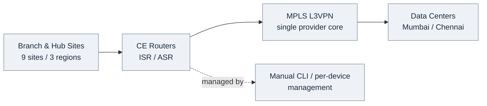
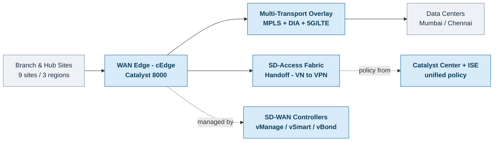

# Cisco Catalyst SD-WAN Implementation Guide

AI-Assisted Documentation

End-to-end design, security, policies, implementation, operations, and migration for an enterprise Cisco Catalyst SD-WAN fabric integrated with SD-Access, Catalyst Center (DNAC), and Identity Services Engine (ISE).

**Author:** Rajmohan M &nbsp;&nbsp; **Website:** [abhavtech.com](https://abhavtech.com)

---

**A comprehensive guide to designing, implementing, and operating Cisco Catalyst SD-WAN at enterprise scale**

---

## About This Documentation

This implementation guide provides end-to-end coverage of Cisco Catalyst SD-WAN deployment, from initial discovery through ongoing operations and automation. The documentation is organized into eight core chapters plus reference appendices, covering all aspects of SD-WAN architecture, security, policies, implementation, and advanced features.

**Target Audience:** Network architects, engineers, and operations teams implementing enterprise SD-WAN solutions

**Deployment Scenario:** Global multi-region SD-WAN deployment with 9 sites across India, EMEA, and Americas, including integration with Cisco SD-Access, Catalyst Center, and ISE

**Technology Stack:** Cisco Catalyst SD-WAN Manager 20.15.x, Controllers 20.15.x, WAN Edge IOS-XE 17.15.x, Catalyst Center 2.3.7.x

---

## Documentation Structure

### [Chapter 1: Discovery & Assessment](chapter-01-discovery/README.md)
Infrastructure inventory, traffic analysis, application requirements, readiness assessment, and risk analysis

### [Chapter 2: SD-WAN Architecture Design](chapter-02-architecture/README.md)
Control plane, data plane, overlay topology, multi-region fabric, SD-Access integration, cloud onramp, SASE, and modern SD-WAN features

### [Chapter 3: Security Architecture](chapter-03-security/README.md)
Control/data plane security, segmentation, TrustSec, enterprise firewall, threat detection, DDoS protection, Zero Trust WAN, and compliance

### [Chapter 4: Policies & Traffic Engineering](chapter-04-policies/README.md)
Application-aware routing, QoS, data/control policies, ACLs, DIA, service insertion, FEC, TCP optimization, and multicast

### [Chapter 5: Implementation & Deployment](chapter-05-implementation/README.md)
Controller deployment, WAN edge onboarding, device templates, configuration groups, hub/branch deployment, Catalyst Center integration, testing, and cutover procedures

### [Chapter 6: Operations & Monitoring](chapter-06-operations/README.md)
Monitoring, alerting, analytics, troubleshooting, backup/restore, upgrades, change/incident management, SLA monitoring, and NOC operations

### [Chapter 7: Migration & Business Case](chapter-07-migration/README.md)
MPLS migration strategies, site-by-site procedures, rollback planning, TCO/ROI analysis, business case development, and post-migration optimization

### [Chapter 8: Advanced Features & Automation](chapter-08-advanced/README.md)
AI/ML integration, Python SDK, REST APIs, Terraform/Ansible, event-driven automation, SIEM, digital twin, GitOps, and CI/CD pipelines

### [Appendices](appendices/README.md)
Glossary, CLI reference, templates, troubleshooting guides, API examples, compliance mapping, and lab setup procedures

---

## Key Features of This Documentation

**Comprehensive Coverage:** 108 detailed sections covering all aspects of SD-WAN deployment  
**Real-World Scenarios:** Based on actual enterprise deployment patterns  
**Integration Focus:** Deep coverage of SD-Access, Catalyst Center, ISE, and SASE integration  
**Operational Excellence:** Extensive operations, monitoring, and automation content  
**Code Examples:** CLI commands, API samples, Terraform/Ansible code throughout  
**Best Practices:** Enterprise-grade design patterns and operational procedures

---

## Technology Highlights

This guide covers modern SD-WAN capabilities including:

- **Cisco Catalyst SD-WAN** (formerly Viptela) - Full overlay architecture
- **SD-Access Integration** - Fabric handoff and VN mapping
- **Catalyst Center** - Unified management and orchestration
- **Zero Trust WAN** - Identity-based segmentation with TrustSec
- **SASE Integration** - Security Service Edge connectivity
- **Network Automation** - Python SDK, REST APIs, Terraform, Ansible
- **Digital Twin** - Virtual network testing and validation
- **AI/ML Analytics** - Predictive insights and automated remediation

---

## Deployment Topology

**Global Sites:**
- **India Region:** Mumbai (Primary DC), Chennai (DR DC), Bangalore, Delhi, Noida
- **EMEA Region:** London (Regional HQ), Frankfurt
- **Americas Region:** New Jersey (US HQ), Dallas

**Architecture Patterns:**
- Multi-region hub-and-spoke with regional full-mesh
- Dual WAN edge at hub sites for high availability
- Hybrid transport: MPLS, dual Internet, LTE backup
- SD-Access fabric handoff at data centers
- Catalyst Center unified management

---

## Architecture at a Glance

The pair below shows the transition at a glance. Grey blocks are existing infrastructure that is reused; blue blocks are what the SD-WAN migration adds. (Click a diagram to zoom, or open it in a new tab.)

**Before — Existing MPLS WAN**

**After — SD-WAN Migration Completed**

---

## AI-Assisted Documentation Disclaimer

**This documentation was created with assistance from Claude (Anthropic) to demonstrate comprehensive technical content generation capabilities.** It is intended for knowledge-sharing and illustrative purposes as part of the AbhavTech portfolio. It is not production-ready, has not undergone formal technical review, and should not be treated as validated engineering guidance. Any use in a live environment must be independently verified and tested by qualified engineers against current vendor documentation and your own requirements.

While the deployment scenario references "Abhavtech.com" as the organization, the architectural patterns and design decisions reflect real-world enterprise SD-WAN deployment approaches presented for educational purposes.

---

## Getting Started

1. **New to SD-WAN?** Start with [Chapter 1: Discovery & Assessment](chapter-01-discovery/README.md)
2. **Planning a deployment?** Review [Chapter 2: Architecture Design](chapter-02-architecture/README.md)
3. **Security-focused?** Jump to [Chapter 3: Security Architecture](chapter-03-security/README.md)
4. **Ready to implement?** Follow [Chapter 5: Implementation](chapter-05-implementation/README.md)
5. **Automation engineer?** Explore [Chapter 8: Advanced Features](chapter-08-advanced/README.md)

---

**Document Version:** 1.0  
**Last Updated:** March 2026  
**Author:** AbhavTech Network Architecture Team  
**Platform:** Cisco Catalyst SD-WAN 20.15.x / IOS-XE 17.15.x  
**Website:** [abhavtech.com](https://abhavtech.com)

---

*© 2025-2026 AbhavTech | Part of the AbhavTech technical documentation portfolio*
