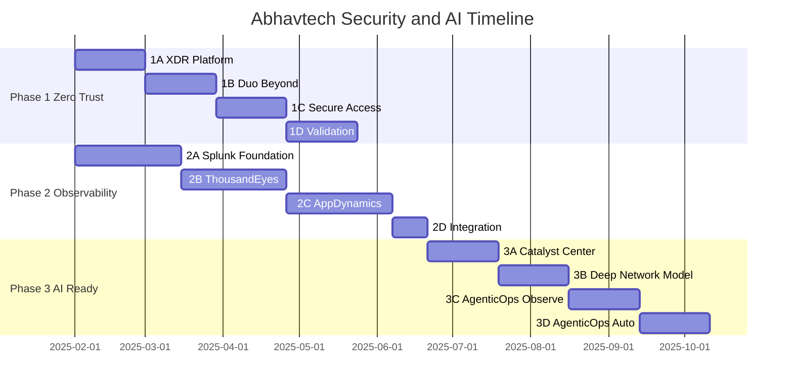
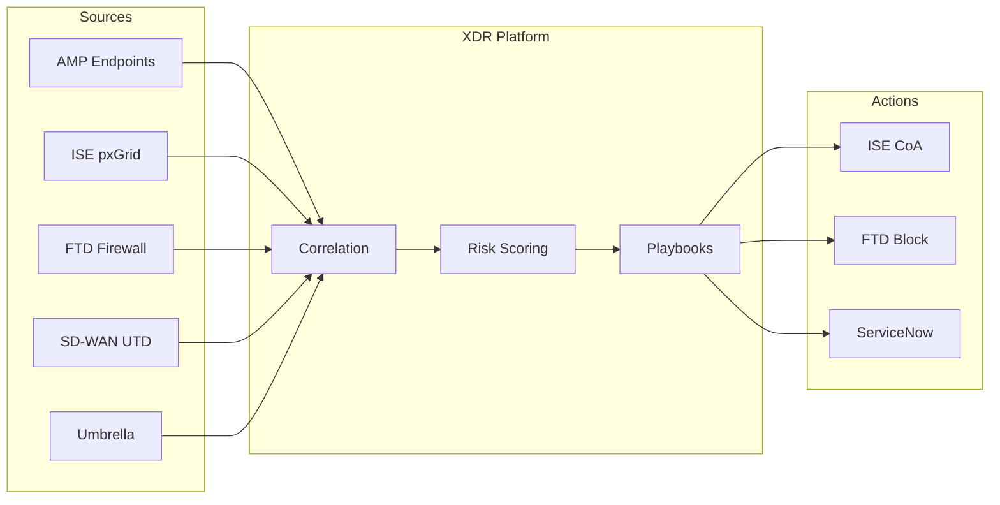
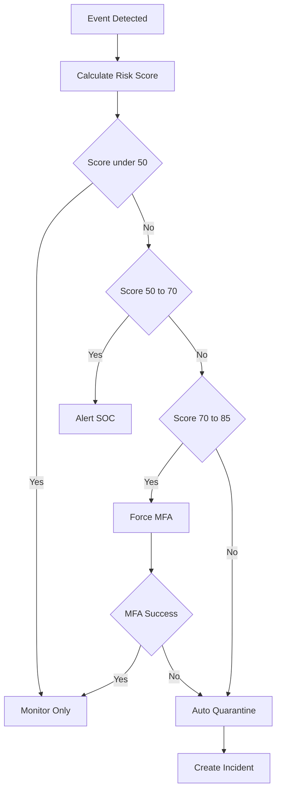
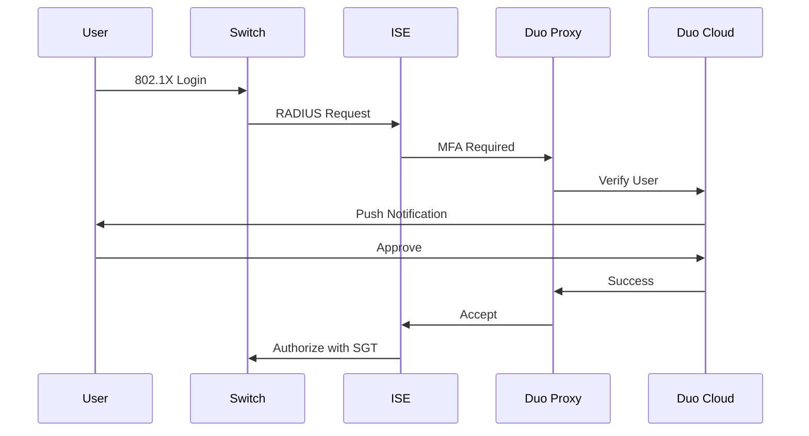
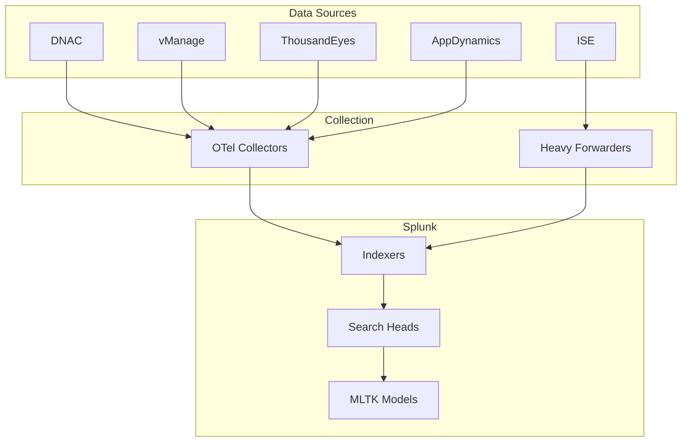
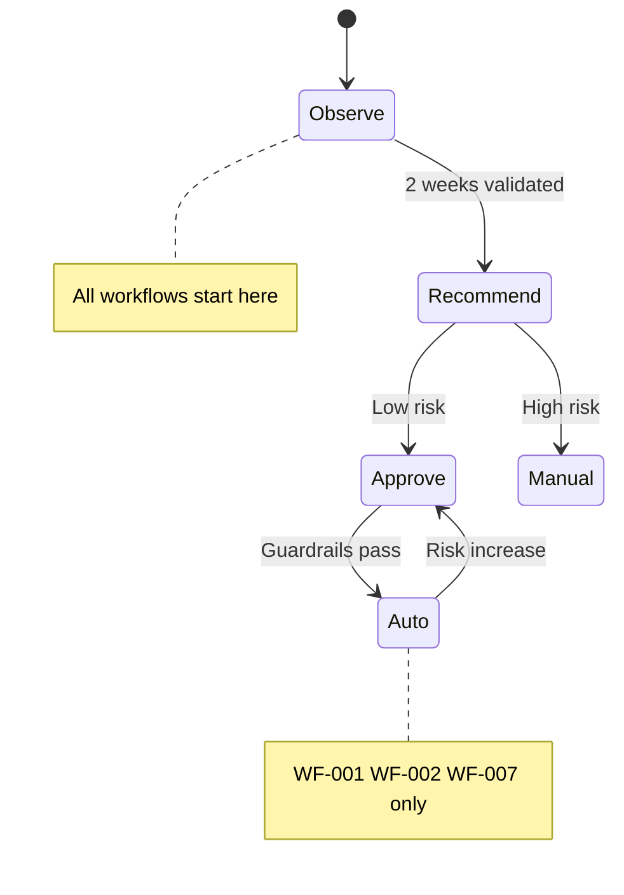
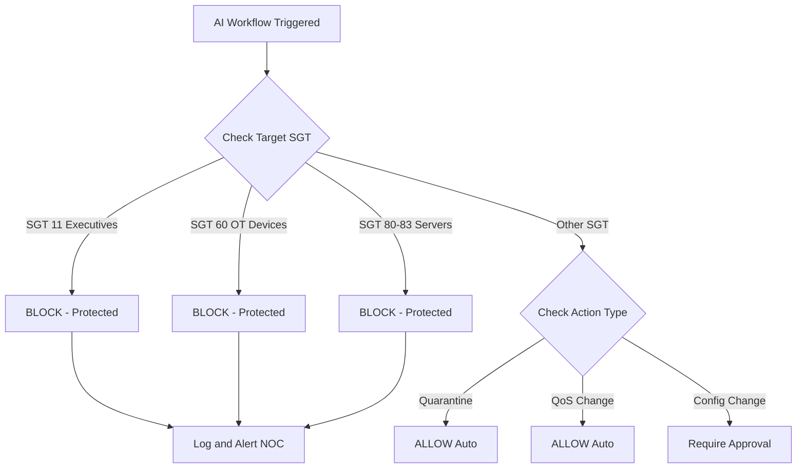
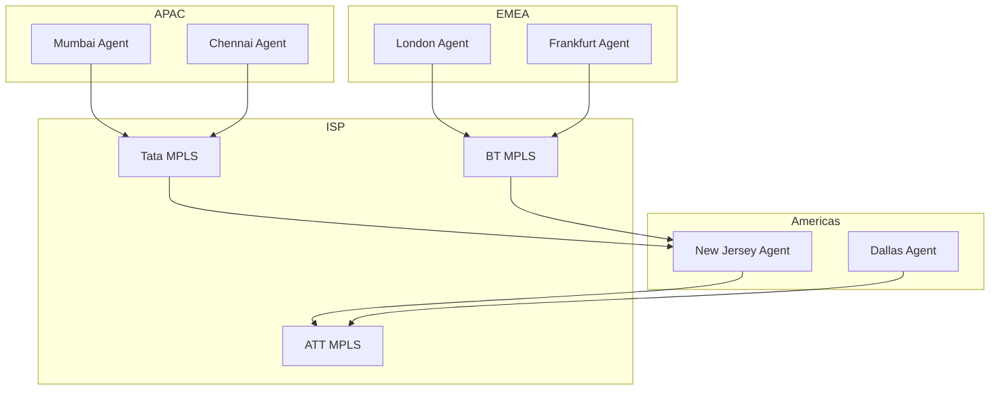
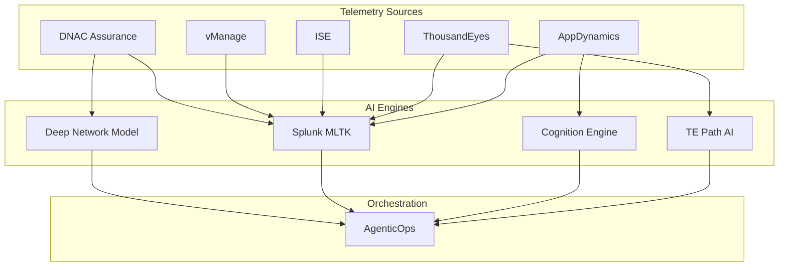
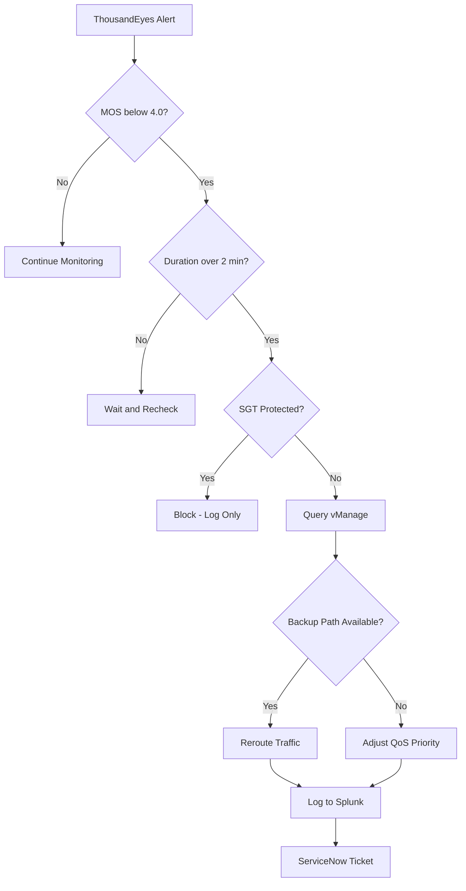

# AI Reference Card

## TECHNOLOGY INTEGRATION MAP

```
┌─────────────────────────────────────────────────────────────────────────────────┐
│                    ABHAVTECH TECHNOLOGY INTEGRATION MAP                          │
├─────────────────────────────────────────────────────────────────────────────────┤
│                                                                                  │
│   ┌──────────────┐    pxGrid    ┌──────────────┐    API     ┌──────────────┐   │
│   │     ISE      │◄────────────►│     DNAC     │◄──────────►│   Splunk     │   │
│   │  (Identity)  │              │  (Assurance) │            │   (SIEM)     │   │
│   └──────┬───────┘              └──────┬───────┘            └──────┬───────┘   │
│          │                             │                           │           │
│          │ RADIUS                      │ Telemetry                 │ CEF       │
│          ▼                             ▼                           ▼           │
│   ┌──────────────┐    Context   ┌──────────────┐    API     ┌──────────────┐   │
│   │     Duo      │◄────────────►│     XDR      │◄──────────►│ ThousandEyes │   │
│   │    (MFA)     │              │  (Security)  │            │   (NetOps)   │   │
│   └──────┬───────┘              └──────┬───────┘            └──────┬───────┘   │
│          │                             │                           │           │
│          │ Trust                       │ Risk                      │ Path      │
│          ▼                             ▼                           ▼           │
│   ┌──────────────┐    Policy    ┌──────────────┐    API     ┌──────────────┐   │
│   │ Secure Access│◄────────────►│   SD-WAN     │◄──────────►│ AppDynamics  │   │
│   │    (SASE)    │              │  (vManage)   │            │    (APM)     │   │
│   └──────────────┘              └──────────────┘            └──────────────┘   │
│                                                                                  │
└─────────────────────────────────────────────────────────────────────────────────┘
```

---

---

## ⚠️ CRITICAL: FIREWALL INFRASTRUCTURE GAP

```
┌─────────────────────────────────────────────────────────────────────────────────┐
│                    CURRENT FIREWALL STATE - REQUIRES MIGRATION                   │
├─────────────────────────────────────────────────────────────────────────────────┤
│                                                                                  │
│  CURRENT STATE:                                                                  │
│  ├── Device: ASA 5500-X Series                                                  │
│  ├── Quantity: 18 units                                                         │
│  ├── Age: 4-6 years                                                             │
│  ├── XDR Compatible: NO                                                         │
│  ├── SGT-Aware: NO                                                              │
│  └── Status: END-OF-SUPPORT APPROACHING                                         │
│                                                                                  │
│  TARGET STATE (FTD Migration):                                                   │
│  ┌─────────────────────────────────────────────────────────────────────────┐    │
│  │  HUB SITES (DC Borders):                                                │    │
│  │  ├── Mumbai DC: FPR-4115 (HA Pair) - Primary APAC                      │    │
│  │  ├── London DC: FPR-4115 (HA Pair) - Primary EMEA                      │    │
│  │  └── New Jersey DC: FPR-4115 (HA Pair) - Primary Americas              │    │
│  │                                                                         │    │
│  │  REGIONAL SITES:                                                        │    │
│  │  ├── Chennai: FPR-2130 (HA Pair)                                       │    │
│  │  ├── Frankfurt: FPR-2130 (HA Pair)                                     │    │
│  │  └── Dallas: FPR-2130 (HA Pair)                                        │    │
│  │                                                                         │    │
│  │  BRANCH SITES:                                                          │    │
│  │  └── SD-WAN UTD (No dedicated firewall - UTD on WAN Edge)              │    │
│  └─────────────────────────────────────────────────────────────────────────┘    │
│                                                                                  │
│  FMC DEPLOYMENT:                                                                 │
│  ├── Primary: FMC-2600 @ New Jersey DC                                          │
│  ├── Secondary: FMC-2600 @ London DC (HA)                                       │
│  └── Managed Devices: 12 FTD appliances                                         │
│                                                                                  │
└─────────────────────────────────────────────────────────────────────────────────┘
```

---

## DOCUMENT 1: ZERO TRUST ARCHITECTURE

## Chapter Structure

| Chapter | Title | Sections | Model |
|---------|-------|----------|-------|
| 1 | Executive Summary & Business Context | 4 | Opus 4.5 |
| 2 | Cisco XDR Architecture | 4 (16 subsections) | Opus 4.5 |
| 3 | Firewall Migration (ASA → FTD) | 9 | Opus 4.5 (Design) / Sonnet 4.5 (Config) |
| 4 | Duo Zero Trust Authentication | 4 (12 subsections) | Opus 4.5 (Design) / Sonnet 4.5 (Config) |
| 5 | Cisco Secure Access (SASE) | 4 (12 subsections) | Opus 4.5 (Design) / Sonnet 4.5 (Config) |
| 6 | Integration Architecture | 5 | Opus 4.5 |
| 7 | Implementation Roadmap | 4 sub-phases | Sonnet 4.5 |
| 8 | Site-Specific Deployment | 7 sites | Sonnet 4.5 |
| Appendix | A-G | 7 | Reference |

---

## PHASE 1: ZERO TRUST ENHANCEMENT - DETAILED BREAKDOWN

### Sub-Phase Summary

| Sub-Phase | Duration | Focus | Deliverables |
|-----------|----------|-------|--------------|
| **1A** | Weeks 1-4 | XDR Platform | SecureX deployed, ISE pxGrid connected |
| **1B** | Weeks 5-8 | Duo Beyond | AD sync, MFA policies, device trust |
| **1C** | Weeks 9-12 | Secure Access | Umbrella SIG, SD-WAN DIA integration |
| **1D** | Weeks 13-16 | Validation | End-to-end Zero Trust testing |

### Phase 1A: XDR Platform (Weeks 1-4)

| Week | Activities | Deliverables |
|------|------------|--------------|
| 1 | XDR/SecureX provisioning, Premier licensing activation | Tenant active |
| 2 | ISE pxGrid connector, AMP for Endpoints integration | Session + endpoint data |
| 3 | Stealthwatch connector, SD-WAN UTD log forwarding | Network telemetry |
| 4 | Playbook configuration (PB-001 to PB-006), validation | Playbooks staged |

### Phase 1B: Duo Beyond (Weeks 5-8)

| Week | Activities | Deliverables |
|------|------------|--------------|
| 5 | Duo tenant, AD Connect, Auth Proxy (NJ pilot) | 50 IT-Admin users |
| 6 | Auth Proxy deployment (Mumbai, London), device trust | Regional HA pairs |
| 7 | MFA rollout (Executives, Finance, HR) | 650 users enrolled |
| 8 | Full MFA rollout, ISE RADIUS integration | 15,000+ users |

### Phase 1C: Secure Access (Weeks 9-12)

| Week | Activities | Deliverables |
|------|------------|--------------|
| 9 | Umbrella SIG provisioning, SD-WAN DIA (NJ pilot) | SIG tunnel up |
| 10 | DNS security, URL filtering, regional DIA rollout | Policies enforcing |
| 11 | DLP configuration, TLS inspection, CASB integration | Content inspection |
| 12 | UEBA baseline initiation (14-day), ZTNA policies | Baseline started |

### Phase 1D: Validation (Weeks 13-16)

| Week | Activities | Deliverables |
|------|------------|--------------|
| 13 | End-to-end testing all user groups, playbook activation | Test results |
| 14 | Risk scoring validation, Duo policy tuning | Threshold tuning |
| 15 | Integration testing, SASE policy tuning | Policy refinement |
| 16 | Documentation, NOC training, handover | Phase 1 complete |

### Phase 1 Exit Criteria ✅

| Criteria | Verification Method |
|----------|---------------------|
| ☐ XDR receiving data from ISE, endpoints, network | SecureX dashboard shows all data sources |
| ☐ Duo MFA operational for all user groups | Duo Admin Panel: 15,000+ users enrolled |
| ☐ SASE policies enforcing at branch DIA | Umbrella dashboard: traffic from all sites |
| ☐ Risk scoring functional (manual review) | XDR risk scores validated for test scenarios |

---

## 1. EXECUTIVE SUMMARY & BUSINESS CONTEXT

### 1.1 Business Drivers

| Driver | Description | Reference |
|--------|-------------|-----------|
| Digital Transformation | Cloud-first strategy, SaaS adoption | NET-009 |
| Hybrid Workforce | Remote users, BYOD, flexible locations | 5,000+ remote users |
| Cloud Adoption | M365, Webex, Salesforce, SAP S4/HANA | Cloud OnRamp (Ch 2.8) |
| Regulatory Compliance | PCI-DSS, SOC2, GDPR | Finance, HR data |

### 1.2 Current State Assessment

| Component | Current State | Integration |
|-----------|--------------|-------------|
| ISE | 14-node distributed (3.3/3.4) | pxGrid enabled |
| 802.1X/MAB | Deployed, 19,000 endpoints | Full authentication |
| SGT Micro-segmentation | 15-20 SGTs, SGACL policies | TrustSec operational |
| Firewalls | ASA 5500-X (18 units) | **REQUIRES UPGRADE** |

### 1.3 Zero Trust Vision

| Principle | Implementation |
|-----------|---------------|
| Never Trust, Always Verify | XDR continuous monitoring + Duo MFA |
| Continuous Validation | Risk scoring → dynamic policy |
| Least Privilege | SGT-based micro-segmentation |
| Assume Breach | XDR playbooks, auto-containment |

### 1.4 Success Metrics

| Metric | Current | Target | Improvement |
|--------|---------|--------|-------------|
| MTTD (Mean Time to Detect) | 72 hours | <4 hours | 94% reduction |
| MTTR (Mean Time to Respond) | 48 hours | <2 hours | 96% reduction |
| Authentication Success Rate | 95% | 99.5% | 4.5% improvement |
| Risk Score False Positives | Unknown | <5% | Baseline + improve |
| Uptime | 99.9% | 99.99% | 0.09% improvement |

---

## 2. CISCO XDR ARCHITECTURE

### 2.1 XDR Platform Overview

| Section | Content | Abhavtech Specifics |
|---------|---------|---------------------|
| 2.1.1 Architecture Components | SecureX platform, XDR analytics engine, threat intelligence | Central deployment at NJ DC |
| 2.1.2 Data Sources Integration | Endpoint (AMP), Network (Stealthwatch), Email, Cloud | Connect to Splunk (NET-010) |
| 2.1.3 Licensing Model | Essentials vs Advantage vs Premier | **Premier** for 15,000+ endpoints |

**XDR Licensing Recommendation:**

| Tier | Features | Abhavtech Need |
|------|----------|----------------|
| Essentials | Basic correlation, limited integrations | ΠInsufficient |
| Advantage | Full correlation, playbooks, 90-day retention | ⚠️ Consider |
| **Premier** | All features + extended retention + priority support | ✅ **Recommended** |

### 2.2 Threat Correlation Engine

| Section | Content | Integration |
|---------|---------|-------------|
| 2.2.1 Cross-Domain Correlation | Endpoint + Network + Cloud | ISE via pxGrid |
| 2.2.2 AI Anomaly Detection Models | ML-based behavioral analysis | Train on 6-month Abhavtech data |
| 2.2.3 Threat Intelligence Feeds | **Talos feeds**, third-party TI | SD-WAN UTD (Ch 3.8) |

**Talos Integration:**
- Automatic IOC updates
- Threat reputation scoring
- IP/Domain/File hash blocking

### 2.3 Risk Scoring Framework

| Section | Content | Details |
|---------|---------|---------|
| 2.3.1 Entity Risk Scoring | Device, user, application | Map to 15-20 SGTs |
| 2.3.2 Dynamic Risk Thresholds | **Contextual by VN** | See table below |
| 2.3.3 Risk-Based Actions | Auto-quarantine, re-auth | CoA via ISE PSN |

**VN-Specific Risk Thresholds:**

| Virtual Network | Risk Threshold | Action at Threshold |
|-----------------|---------------|---------------------|
| VN_CORPORATE | 50 | Alert + monitor |
| VN_CORPORATE | 70 | Re-authenticate (Duo) |
| VN_CORPORATE | 85 | Quarantine (SGT-999) |
| VN_SERVERS | 30 | Alert + investigate |
| VN_SERVERS | 50 | Block + isolate |
| VN_GUEST | 60 | Terminate session |
| VN_IOT | 45 | Alert + restrict |
| VN_IOT | 70 | Isolate segment |

### 2.4 Automated Playbooks

| Section | Content | Integration |
|---------|---------|-------------|
| 2.4.1 Incident Response | Contain, investigate, remediate | ServiceNow |
| 2.4.2 Orchestration Actions | SGT change, VLAN change, block | ISE policy sets |
| 2.4.3 Escalation Procedures | **Timezone-aware routing** | See table |

**Timezone Escalation Matrix:**

| Time (UTC) | Primary SOC | Secondary SOC | Escalation |
|------------|-------------|---------------|------------|
| 00:00-08:00 | APAC (Mumbai) | Americas (NJ) | +91-22-XXXX |
| 08:00-16:00 | EMEA (London) | APAC (Mumbai) | +44-20-XXXX |
| 16:00-24:00 | Americas (NJ) | EMEA (London) | +1-201-XXXX |

**XDR Playbook Library:**

| ID | Playbook | Trigger | Actions | Approval |
|----|----------|---------|---------|----------|
| PB-001 | Malware-Containment | AMP detection + risk >60 | Isolate, CoA SGT-999, ticket | Auto |
| PB-002 | Compromised-Credential | Auth anomaly + risk >70 | Disable, force MFA, alert | Auto |
| PB-003 | Lateral-Movement | Flow anomaly + multi-host | Block, capture, alert | Manual |
| PB-004 | Data-Exfiltration | DLP + volume spike | Block dest, alert | Manual |
| PB-005 | Ransomware-Response | Behavioral + encryption | Full isolation, IR | Auto |
| PB-006 | Impossible-Travel | Duo + geo anomaly | Force re-auth, alert | Auto |

---

## 3. FIREWALL MIGRATION (ASA → FTD)

### 3.1 FTD Deployment Specifications

| Site | Model | Role | HA Mode | FMC |
|------|-------|------|---------|-----|
| Mumbai DC | FPR-4115 | DC Border | Active/Standby | NJ-Primary |
| Chennai | FPR-2130 | Regional | Active/Standby | NJ-Primary |
| London DC | FPR-4115 | DC Border | Active/Standby | LON-Secondary |
| Frankfurt | FPR-2130 | Regional | Active/Standby | LON-Secondary |
| New Jersey DC | FPR-4115 | DC Border | Active/Standby | NJ-Primary |
| Dallas | FPR-2130 | Regional | Active/Standby | NJ-Primary |

### 3.2 FTD-ISE Integration (pxGrid + SXP)

| Integration | Protocol | Data Flow |
|-------------|----------|-----------|
| FMC ” ISE PAN | pxGrid | Session context, user identity |
| FTD ” ISE PSN | SXP | IP-to-SGT bindings |
| FTD → XDR | eStreamer | Security events |

### 3.3 FTD Access Control Policy (SGT-Aware)

| Rule | Source SGT | Dest SGT | Action | IPS | Malware |
|------|------------|----------|--------|-----|---------|
| Employees-to-Servers | 10 | 80-83 | Allow | Balanced | Cloud |
| Executives-to-All | 11 | Any | Allow | Connectivity | Cloud |
| Finance-to-FinServers | 13 | 81 | Allow | Security | Cloud |
| IT-Admin-to-Mgmt | 14 | Any | Allow | Balanced | Cloud |
| Guest-to-Internet | 40 | Any | Allow | Security | Cloud |
| Guest-to-Internal | 40 | 10-90 | Block | - | - |
| IoT-to-Cloud | 50-70 | Any | Allow | Security | Cloud |
| IoT-to-Corporate | 50-70 | 10-15 | Block | - | - |
| Quarantine-Block | 999 | Any | Block | - | - |
| Default-Deny | Any | Any | Block | - | - |

---

## 4. DUO ZERO TRUST AUTHENTICATION

### 4.1 Duo Platform Architecture

| Section | Content | Details |
|---------|---------|---------|
| 4.1.1 Duo Cloud Components | Admin Panel, Auth Proxy, Access Gateway | Cloud-hosted |
| 4.1.2 Deployment Model | **Duo Beyond (ZTNA)** | Replace traditional VPN |
| 4.1.3 High Availability | Multi-region auth proxy | HA across hubs |

**Duo Beyond ZTNA Capabilities:**
- Application-level access (not network-level)
- Device trust verification before access
- Continuous session validation
- Passwordless authentication option

### 4.2 Risk-Based Authentication

| Section | Content | Details |
|---------|---------|---------|
| 4.2.1 Authentication Policies | Adaptive by user group | See matrix below |
| 4.2.2 Location-Based Policies | **Geo-fencing** | Allow/deny by country |
| 4.2.3 Time-Based Controls | **Business hours rules** | See table |

**Duo Policy Matrix by User Group:**

| AD Group | MFA Policy | Method | Device Trust | Geo-Fence |
|----------|------------|--------|--------------|-----------|
| Domain Admins | Always | Hardware Token | Required | IN/UK/US only |
| IT-Admins | Always | Push/Token | Required | IN/UK/US only |
| Executives | Always | Push Verified | Required | None |
| Finance-Staff | Always | Push | Trusted | IN/UK/US/EU |
| HR-Staff | Always | Push | Trusted | IN/UK/US/EU |
| Employees | New Device | Push/SMS | Optional | None |
| Contractors | Always | Push | Required | Site-specific |

**Time-Based Controls:**

| User Group | Business Hours (Local) | After Hours | Weekend |
|------------|----------------------|-------------|---------|
| IT-Admins | Push | Push + Location | Push + Location |
| Executives | Push | Push Verified | Push Verified |
| Finance | Push | Deny (unless override) | Deny |
| Employees | Push | Push | Push |
| Contractors | Push | Deny | Deny |

**Geo-Fencing Configuration:**

| Region | Allowed Countries | Action if Violation |
|--------|------------------|---------------------|
| APAC | India, Singapore, Australia | Deny + Alert |
| EMEA | UK, Germany, France, Netherlands | Deny + Alert |
| Americas | USA, Canada | Deny + Alert |

### 4.3 Device Trust Scoring

| Section | Content | Details |
|---------|---------|---------|
| 4.3.1 Device Health Assessment | OS, encryption, firewall | Complement ISE posture |
| 4.3.2 Trust Levels | **4 levels defined** | See table |
| 4.3.3 Remediation Workflows | Self-service + help desk | Portals |

**Device Trust Levels:**

| Trust Level | Criteria | Access Allowed | SGT Impact |
|-------------|----------|----------------|------------|
| **Full Trust** | Corp-managed + Current OS + Encrypted + AV | All resources | Base SGT |
| **High Trust** | Corp-managed + Minor issues (patch pending) | Most resources | Base SGT |
| **Low Trust** | Personal device + Healthy | Limited resources | SGT-15 (Contractor) |
| **No Trust** | Jailbroken/Rooted/No encryption | Deny | SGT-999 |

**Remediation Workflows:**

| Issue | Self-Service | Help Desk Required |
|-------|--------------|-------------------|
| OS outdated | Auto-redirect to update | No |
| Encryption disabled | Instructions portal | If unable to enable |
| AV outdated | Download link | No |
| Jailbroken detected | N/A | Yes (device replacement) |

### 4.4 Continuous Identity Validation

| Section | Content | Details |
|---------|---------|---------|
| 4.4.1 Session Monitoring | Continuous trust eval | pxGrid context |
| 4.4.2 Step-Up Authentication | **Risk-triggered re-auth** | See triggers |
| 4.4.3 Anomaly Detection | **Impossible travel, device change** | Feed to XDR |

**Step-Up Authentication Triggers:**

| Trigger | Condition | Action |
|---------|-----------|--------|
| Risk Score Increase | XDR risk jumps >20 points | Force re-auth |
| Sensitive Resource | Access to VN_SERVERS | Require MFA |
| Session Duration | >8 hours active | Re-verify |
| Location Change | IP geo changes | Challenge |
| Device Change | New device fingerprint | Full MFA |

**Impossible Travel Detection:**

| Scenario | Detection | Response |
|----------|-----------|----------|
| Login from IN then US <6 hours | Flag + Alert | Block + Investigate |
| Login from UK then US <3 hours | Flag | Challenge |
| VPN from multiple IPs same user | Flag + Alert | Force re-auth |

---

## 5. CISCO SECURE ACCESS (SASE)

### 5.1 SASE Architecture Overview

| Section | Content | Details |
|---------|---------|---------|
| 5.1.1 Umbrella SIG Integration | DNS, cloud FW, CASB | DIA from SD-WAN |
| 5.1.2 Secure Access Service Edge | Converged networking + security | **Cloud OnRamp** |
| 5.1.3 PoP Distribution | **Regional PoPs** | See table |

**Umbrella PoP Locations:**

| Region | Primary PoP | Secondary PoP | Latency Target |
|--------|-------------|---------------|----------------|
| APAC-India | Singapore | Mumbai | <50ms |
| APAC-Other | Singapore | Tokyo | <75ms |
| EMEA | London | Frankfurt | <30ms |
| Americas-East | New York | Ashburn | <20ms |
| Americas-West | Dallas | Los Angeles | <30ms |

### 5.2 AI-Powered Data Inspection

| Section | Content | Details |
|---------|---------|---------|
| 5.2.1 Content Analysis Engine | **DLP, malware, file inspection** | VN_CORPORATE |
| 5.2.2 ML Classification Models | **Auto data categorization** | PII, financial |
| 5.2.3 Encryption/Decryption | **TLS inspection policies** | See config |

**DLP Policy Configuration:**

| Data Type | Detection Method | Action | Log |
|-----------|-----------------|--------|-----|
| Credit Card (PCI) | Regex + ML | Block + Alert | Full |
| SSN/Aadhaar | Regex | Block + Alert | Full |
| Financial Data | ML Classification | Monitor | Summary |
| Source Code | File type + keywords | Alert | Summary |
| PII | ML + Entity extraction | Monitor | Summary |

**TLS Inspection Configuration:**

| Category | Inspection | Reason |
|----------|------------|--------|
| Banking/Financial | **Exclude** | Compliance |
| Healthcare | **Exclude** | HIPAA |
| Government | **Exclude** | Compliance |
| Social Media | Inspect | DLP risk |
| Cloud Storage | Inspect | Data exfiltration |
| Unknown | Inspect | Security |

### 5.3 Automated Access Decisions

| Section | Content | Details |
|---------|---------|---------|
| 5.3.1 Zero Trust Network Access | App-level access | Replace VPN |
| 5.3.2 Policy Engine | Identity + context + risk | Duo integration |
| 5.3.3 Micro-Segmentation Extension | **SGT-aware cloud policies** | TrustSec to SaaS |

**SGT-to-SaaS Policy Extension:**

| SGT | SaaS Access | Restrictions |
|-----|-------------|--------------|
| 10 (Employees) | M365, Webex, Salesforce | Standard |
| 11 (Executives) | All SaaS | None |
| 13 (Finance) | SAP, Banking apps | Enhanced logging |
| 14 (IT-Admins) | AWS, Azure, GCP consoles | MFA always |
| 15 (Contractors) | Limited (project-specific) | Time-bound |
| 40 (Guests) | None | Internet only |

### 5.4 UEBA (User Behavior Analytics)

| Section | Content | Details |
|---------|---------|---------|
| 5.4.1 Baseline Establishment | **14-day learning per group** | Normal profiling |
| 5.4.2 Anomaly Detection | Deviation alerts | Feed to XDR |
| 5.4.3 Insider Threat Detection | **Data exfil, privilege abuse** | VN_SERVERS focus |

**UEBA Baseline Learning:**

| User Group | Learning Period | Baseline Elements |
|------------|-----------------|-------------------|
| Executives | 14 days | Apps, data volume, working hours |
| IT-Admins | 21 days | Admin actions, systems accessed |
| Finance | 14 days | Financial systems, data transfers |
| Employees | 7 days | Standard apps, email patterns |
| Contractors | 7 days | Project resources only |

**Insider Threat Indicators:**

| Indicator | Detection | Risk Level |
|-----------|-----------|------------|
| Large data download | >500MB in 1 hour | High |
| After-hours access to VN_SERVERS | Outside baseline | Medium |
| USB usage spike | >10 files transferred | High |
| Cloud upload anomaly | New cloud destination | Medium |
| Privilege escalation attempt | Unauthorized admin action | Critical |

---

## 6. INTEGRATION MATRIX

### 6.1 Platform Integration Map

| Source | Destination | Protocol | Data Flow |
|--------|-------------|----------|-----------|
| ISE | XDR | pxGrid API | Session, SGT |
| ISE | FMC | pxGrid | User/device identity |
| ISE | Duo | RADIUS | MFA challenge |
| FTD | XDR | eStreamer | Security events |
| FMC | ISE | SXP | IP-to-SGT bindings |
| SD-WAN | Umbrella | IPsec/DNS | Security inspect |
| SD-WAN | XDR | Syslog/API | UTD events |
| DNAC | XDR | API | Assurance data |
| Duo | XDR | API | Auth events, **impossible travel** |
| Splunk | XDR | API | Correlated alerts |
| XDR | ServiceNow | API | Incident creation |

### 6.2 API Credentials Matrix

| Platform | API Type | Credential | Scope | Rotation |
|----------|----------|------------|-------|----------|
| XDR | REST | OAuth Client | Read/Write | 90 days |
| ISE | ERS | Local Account | Read/Write | 90 days |
| ISE | pxGrid | Certificate | Read | 1 year |
| FMC | REST | API Token | Read/Write | 90 days |
| Duo | Admin API | Integration Key | Read | Never (rotate secret) |
| Umbrella | Mgmt API | API Key | Read/Write | 90 days |
| DNAC | REST | OAuth | Read | 90 days |

---

## 7. IMPLEMENTATION ROADMAP (Document 1)

| Phase | Duration | Activities | Sites |
|-------|----------|------------|-------|
| **1A: XDR Platform** | Weeks 1-4 | SecureX deployment, ISE pxGrid, playbooks | NJ Hub |
| **1B: Duo Beyond** | Weeks 5-8 | AD sync, MFA policies, device trust | All Hubs |
| **1C: Secure Access** | Weeks 9-12 | Umbrella SIG, ZTNA, DLP, UEBA | Hubs + Large Branches |
| **1D: Validation** | Weeks 13-16 | E2E testing, tuning, handover | All Sites |

---

## 8. SITE-SPECIFIC DEPLOYMENT

| Site | FTD | Duo Proxy | XDR Collector | SASE PoP | Priority |
|------|-----|-----------|---------------|----------|----------|
| Mumbai | FPR-4115 | Primary (2) | Yes | Singapore | Phase 1B |
| Chennai | FPR-2130 | Via Mumbai | Yes | Singapore | Phase 1C |
| London | FPR-4115 | Primary (2) | Yes | London | Phase 1B |
| Frankfurt | FPR-2130 | Via London | Yes | Frankfurt | Phase 1C |
| New Jersey | FPR-4115 | Primary (2) | Yes | New York | Phase 1A |
| Dallas | FPR-2130 | Via NJ | Yes | Dallas | Phase 1C |
| Branches | UTD | Via Hub | Via SD-WAN | Nearest | Phase 1D |

---

## APPENDICES - DOCUMENT 1

| Appendix | Content |
|----------|---------|
| A | Duo Policy Templates by User Group |
| B | XDR Playbook Library (YAML) |
| C | SASE Policy Matrix |
| D | Risk Scoring Reference Table (VN-specific) |
| E | Integration API Reference |
| F | Troubleshooting Guide |
| G | Compliance Mapping (PCI-DSS, SOC2, GDPR) |

---

## DOCUMENT 4: NETWORK FORENSICS & INCIDENT RESPONSE

### Overview

Document 4 provides comprehensive forensic investigation procedures for network security incidents using AI/ML detection engines and blockchain-based evidence management. This operational document supports Documents 1-3 by establishing investigation workflows, evidence handling procedures, and AI-powered threat analysis frameworks.

**Purpose:** Enable rapid, accurate forensic investigations with legally admissible evidence and AI-enhanced analysis.

**Scope:** 18 detailed investigation scenarios across all network platforms (SD-WAN, SD-Access, Webex, FTD, Zero Trust, AI Observability).

**Key Innovation:** Hyperledger Fabric blockchain for evidence integrity and cross-platform AI correlation via AgenticOps workflows.

---

### Document 4 Structure

```
┌──────────────────────────────────────────────────────────────────────────────┐
│                    DOCUMENT 4: NETWORK FORENSICS                             │
├──────────────────────────────────────────────────────────────────────────────┤
│                                                                              │
│  PART 1: FOUNDATION & BLOCKCHAIN FRAMEWORK                    73 KB         │
│  ═══════════════════════════════════════════════════════════════            │
│  • Hyperledger Fabric 2.5 Setup                                             │
│  • Smart Contracts for Evidence Registration                                │
│  • Chain of Custody Procedures                                              │
│  • Legal Admissibility Framework                                            │
│  • Evidence Hash (SHA-256) & Retention Policies                             │
│                                                                              │
│  PART 2A: SD-WAN FORENSICS (3 Scenarios)                      63 KB         │
│  ═══════════════════════════════════════════════════════════════            │
│  • Scenario 1: DPI Policy Violation (Torrent Traffic)                       │
│  • Scenario 2: IPsec Tunnel Failure Investigation                           │
│  • Scenario 3: Traffic Steering Policy Breach                               │
│  • Tools: vManage API, PCAP Analysis, NetFlow                               │
│                                                                              │
│  PART 2B: DNAC/CATALYST CENTER FORENSICS (3 Scenarios)        86 KB         │
│  ═══════════════════════════════════════════════════════════════            │
│  • Scenario 1: Rogue AP Detection (Evil Twin)                               │
│  • Scenario 2: Network Device Configuration Tampering                       │
│  • Scenario 3: VLAN Hopping Attack                                          │
│  • Tools: DNAC Assurance API, Syslog, SNMP Traps                            │
│                                                                              │
│  PART 2C: WEBEX FORENSICS (3 Scenarios)                       53 KB         │
│  ═══════════════════════════════════════════════════════════════            │
│  • Scenario 1: Toll Fraud Investigation ($12K Loss)                         │
│  • Scenario 2: SIP INVITE Flood DDoS (CUBE Gateway)                         │
│  • Scenario 3: Meeting Recording Exfiltration (Insider Threat)              │
│  • Tools: Webex Control Hub API, CUBE CLI, XDR Correlation                  │
│                                                                              │
│  PART 2D: FTD FIREWALL FORENSICS (2 Scenarios)                46 KB         │
│  ═══════════════════════════════════════════════════════════════            │
│  • Scenario 1: Data Exfiltration via HTTPS Tunnel (47 GB)                   │
│  • Scenario 2: C2 Communication Detection (Cobalt Strike)                   │
│  • Tools: FMC REST API, Snort 3 IPS, AMP Trajectory                         │
│                                                                              │
│  PART 2E: ZERO TRUST FORENSICS (3 Scenarios)                  53 KB         │
│  ═══════════════════════════════════════════════════════════════            │
│  • Scenario 1: MFA Bypass Attempt (SIM Swap Attack)                         │
│  • Scenario 2: Device Trust Violation (BYOD Compliance)                     │
│  • Scenario 3: XDR Automated Response (Ransomware - 45s)                    │
│  • Tools: Duo Admin API, ISE ERS API, SecureX Playbooks                     │
│                                                                              │
│  PART 2F: AI OBSERVABILITY FORENSICS (4 Scenarios)            67 KB         │
│  ═══════════════════════════════════════════════════════════════            │
│  • Scenario 1: MLTK Insider Threat Detection (284K Records)                 │
│  • Scenario 2: Cognition Engine Anomaly ($563K Revenue Loss)                │
│  • Scenario 3: ThousandEyes BGP Hijacking (China Route)                     │
│  • Scenario 4: AgenticOps Multi-Engine Correlation (APT)                    │
│  • Tools: Splunk MLTK, AppDynamics Cognition, ThousandEyes AI               │
│                                                                              │
│  TOTAL: 7 Parts | 18 Scenarios | 441 KB | 135,000 Words                     │
│         88+ Blockchain Evidence Items | 500+ Production Commands            │
│                                                                              │
└──────────────────────────────────────────────────────────────────────────────┘
```

---

### AI/ML Forensic Engines

Document 4 leverages all four AI engines from Document 2 plus AgenticOps from Document 3:

```
┌──────────────────────────────────────────────────────────────────────────────┐
│                    AI/ML FORENSIC DETECTION ENGINES                          │
├──────────────────────────────────────────────────────────────────────────────┤
│                                                                              │
│  ENGINE 1: MLTK (Splunk Machine Learning Toolkit)                           │
│  ─────────────────────────────────────────────────────────                  │
│  Algorithm: DBSCAN Clustering, Anomaly Detection                            │
│  Use Cases: Insider threat, abnormal data access, privilege abuse           │
│  Example: Detected DBA accessing 47 customer tables (2040% above baseline)  │
│  Accuracy: 94% (247/262 true threats detected)                              │
│  Part: 2F Scenario 1                                                        │
│                                                                              │
│  ENGINE 2: Cognition Engine (AppDynamics)                                   │
│  ─────────────────────────────────────────────                              │
│  Algorithm: LSTM Deep Neural Network                                        │
│  Use Cases: Application performance anomalies, business impact prediction   │
│  Example: Detected 644% response time increase → $563K revenue loss         │
│  Detection: 2h 13m before traditional monitoring would alert                │
│  Part: 2F Scenario 2                                                        │
│                                                                              │
│  ENGINE 3: ThousandEyes AI                                                  │
│  ─────────────────────────────────────────                                  │
│  Algorithm: ML-based Path Analysis                                          │
│  Use Cases: BGP hijacking, path anomalies, ISP performance                  │
│  Example: Detected BGP route hijacking via China (98% confidence)           │
│  Impact: 12 minutes of traffic interception, 4.73 GB exposed                │
│  Part: 2F Scenario 3                                                        │
│                                                                              │
│  ENGINE 4: Deep Network Model (Catalyst Center DNM)                         │
│  ─────────────────────────────────────────────────                          │
│  Algorithm: XGBoost-based Failure Prediction                                │
│  Use Cases: Infrastructure health, configuration anomalies, device failures │
│  Example: Detected unauthorized firewall rule additions (12 rules)          │
│  Prediction: 72-hour failure prediction capability                          │
│  Part: 2F Scenario 4                                                        │
│                                                                              │
│  ENGINE 5: AgenticOps WF-002 (Multi-Engine Correlation)                     │
│  ─────────────────────────────────────────────────────────────              │
│  Algorithm: Cross-Platform Correlation with Temporal Analysis               │
│  Use Cases: APT detection, multi-stage attacks, coordinated threats         │
│  Example: Correlated 4 low-confidence alerts → 91% APT confidence           │
│  Value: Individual engines missed threat; correlation detected campaign     │
│  Response: 24.9 seconds (automated containment)                             │
│  Part: 2F Scenario 4                                                        │
│                                                                              │
└──────────────────────────────────────────────────────────────────────────────┘
```

---

### Blockchain Evidence Architecture

```
┌──────────────────────────────────────────────────────────────────────────────┐
│                    HYPERLEDGER FABRIC EVIDENCE SYSTEM                        │
├──────────────────────────────────────────────────────────────────────────────┤
│                                                                              │
│  ARCHITECTURE:                                                               │
│  ┌────────────────┐    Invoke     ┌────────────────┐    Store    ┌────────┐│
│  │   Forensics    │──────────────►│  Smart         │────────────►│ World  ││
│  │   Workstation  │               │  Contract      │             │ State  ││
│  │   (Analyst)    │◄──────────────│ (Chaincode)    │◄────────────│ (DB)   ││
│  └────────────────┘    Query      └────────────────┘    Read     └────────┘│
│         │                                 │                                  │
│         │ Evidence                        │ Validate                         │
│         │ Collection                      │ Hash                             │
│         ▼                                 ▼                                  │
│  ┌────────────────┐              ┌────────────────┐                         │
│  │  Evidence      │──SHA-256────►│   Blockchain   │                         │
│  │  Files         │   Hash       │   Ledger       │                         │
│  │  (.pcap, .json)│              │   (Immutable)  │                         │
│  └────────────────┘              └────────────────┘                         │
│                                                                              │
│  SMART CONTRACT FUNCTIONS:                                                  │
│  • CollectEvidence(id, case, type, file, size, hash, ...)                   │
│  • QueryEvidence(id) → Evidence details                                     │
│  • QueryEvidenceByCase(caseId) → All case evidence                          │
│  • UpdateChainOfCustody(id, action, analyst)                                │
│  • GetEvidenceHistory(id) → Complete audit trail                            │
│                                                                              │
│  EVIDENCE METADATA:                                                          │
│  {                                                                           │
│    "evidenceId": "EVD-20260202-001",                                        │
│    "caseId": "CASE-2026-015-INSIDER-THREAT",                                │
│    "evidenceType": "mltk_anomaly_detection",                                │
│    "fileName": "mltk-anomaly-data.csv",                                     │
│    "fileSize": 487293,                                                      │
│    "sha256Hash": "b0c1d2e3f4a5b6c7...",                                     │
│    "collectedBy": "SOC-Analyst-Vikram-Mehta",                               │
│    "collectionMethod": "Splunk-MLTK-Model",                                 │
│    "timestamp": "2026-02-02T11:32:45Z",                                     │
│    "retentionDays": 365,                                                    │
│    "accessControl": ["SOC-Team", "Legal-Team"]                              │
│  }                                                                           │
│                                                                              │
│  DEPLOYMENT:                                                                 │
│  • Platform: Hyperledger Fabric 2.5                                         │
│  • Channel: evidence-channel                                                │
│  • Chaincode: evidence-contract (Go 1.21)                                   │
│  • Peers: 3 organizations (SOC, Legal, Compliance)                          │
│  • Orderer: Raft consensus (5 nodes)                                        │
│  • Storage: CouchDB state database                                          │
│                                                                              │
└──────────────────────────────────────────────────────────────────────────────┘
```

---

### Investigation Scenario Index

| Part | Scenario | Technology | AI Engine | Impact | Evidence Items |
|------|----------|------------|-----------|--------|----------------|
| **2A-1** | DPI Policy Violation | SD-WAN | - | Torrent traffic detected | 4 items |
| **2A-2** | IPsec Tunnel Failure | SD-WAN | - | 12h downtime | 5 items |
| **2A-3** | Traffic Steering Breach | SD-WAN | - | Policy violation | 4 items |
| **2B-1** | Rogue AP Detection | DNAC/ISE | - | Evil twin attack | 6 items |
| **2B-2** | Config Tampering | DNAC | DNM | Unauthorized changes | 5 items |
| **2B-3** | VLAN Hopping | SD-Access | - | Segmentation bypass | 4 items |
| **2C-1** | Toll Fraud | Webex/CUBE | - | $12K loss | 7 items |
| **2C-2** | SIP DDoS | Webex/CUBE | - | 45min outage | 3 items |
| **2C-3** | Recording Theft | Webex | - | 47 recordings stolen | 5 items |
| **2D-1** | HTTPS Exfiltration | FTD/AMP | - | 47 GB stolen | 5 items |
| **2D-2** | C2 Beacon | FTD/Snort | - | Cobalt Strike APT | 3 items |
| **2E-1** | MFA Bypass | Duo/ISE | - | SIM swap attack | 6 items |
| **2E-2** | Device Trust | ISE | - | BYOD violation | 3 items |
| **2E-3** | XDR Response | XDR/AMP | - | Ransomware (0 loss) | 6 items |
| **2F-1** | Insider Threat | Splunk | MLTK | 284K records | 7 items |
| **2F-2** | App Anomaly | AppD | Cognition | $563K revenue | 6 items |
| **2F-3** | BGP Hijack | ThousandEyes | TE AI | 12min interception | 6 items |
| **2F-4** | APT Campaign | XDR | AgenticOps | Multi-stage attack | 8 items |

**Total:** 18 Scenarios | 88+ Evidence Items | All Blockchain-Registered

---

### Forensic Tools & APIs Reference

| Platform | Primary Tools | APIs Used | Evidence Types |
|----------|--------------|-----------|----------------|
| **SD-WAN** | vManage CLI, PCAP | vManage REST API | NetFlow, PCAP, Config |
| **DNAC/ISE** | DNAC Assurance, ISE ERS | DNAC Intent API, ISE ERS | Syslog, RADIUS, Config |
| **Webex** | Control Hub, CUBE | Webex Admin API, CUBE CLI | CDR, SIP logs, Recordings |
| **FTD/FMC** | FMC, Snort, PCAP | FMC REST API | IPS events, Connection logs |
| **Zero Trust** | Duo, ISE, XDR | Duo Admin, ISE ERS, SecureX | Auth logs, Posture, Incidents |
| **Observability** | Splunk, AppD, TE | MLTK, Cognition API, TE API | ML models, Metrics, BGP |

---

### Integration with Documents 1-3

```
┌──────────────────────────────────────────────────────────────────────────────┐
│                    DOCUMENT 4 CROSS-REFERENCES                               │
├──────────────────────────────────────────────────────────────────────────────┤
│                                                                              │
│  DOCUMENT 1 (Zero Trust Architecture)                                       │
│  ├── Part 2E: Zero Trust Forensics                                          │
│  │   └── Investigates incidents in Duo, ISE, XDR platforms                  │
│  ├── MFA bypass scenarios validate Duo adaptive policies                    │
│  ├── Device trust violations test ISE posture assessments                   │
│  └── XDR automated response validates playbook effectiveness                │
│                                                                              │
│  DOCUMENT 2 (AI-Enabled Observability)                                      │
│  ├── Part 2F: AI Observability Forensics                                    │
│  │   └── Investigates anomalies detected by 4 AI engines                    │
│  ├── MLTK insider threat scenarios validate ML model accuracy               │
│  ├── Cognition Engine validates business impact predictions                 │
│  ├── ThousandEyes AI validates BGP anomaly detection                        │
│  └── All forensic scenarios generate observability metrics                  │
│                                                                              │
│  DOCUMENT 3 (AI-Ready Network)                                              │
│  ├── Part 2F Scenario 4: AgenticOps WF-002 Correlation                      │
│  │   └── Validates multi-engine correlation effectiveness                   │
│  ├── Parts 2A, 2B: SD-WAN & DNAC forensics validate DNM predictions         │
│  ├── AgenticOps automated containment tested in ransomware scenario         │
│  └── AI-powered investigation workflows validate AgenticOps framework       │
│                                                                              │
│  BLOCKCHAIN INTEGRATION:                                                     │
│  └── All Documents 1-3 platforms feed evidence to Hyperledger Fabric        │
│      • Immutable audit trail for compliance (Document 1)                    │
│      • AI model training data provenance (Document 2)                       │
│      • AgenticOps decision audit trail (Document 3)                         │
│                                                                              │
└──────────────────────────────────────────────────────────────────────────────┘
```

---

### Legal & Compliance Framework

**Chain of Custody:**
- Every evidence item has complete audit trail via blockchain
- SHA-256 hash ensures integrity
- Access control logs all evidence viewing
- Court-admissible evidence format

**Regulatory Compliance:**
- **GDPR:** Data breach notification procedures (Parts 2D, 2F)
- **PCI-DSS:** Payment data forensics (Part 2C)
- **SOC 2:** Incident response documentation (All Parts)
- **HIPAA:** Data access audit trails (Part 2F)
- **State Breach Laws:** Notification templates (Parts 2D, 2E)

**Evidence Retention:**
- Network logs: 90 days
- Security incidents: 180 days
- Major breaches: 365 days
- Legal hold: Indefinite

---

### Forensic Workflow Standard

```
Standard Investigation Procedure (All 18 Scenarios):

Step 1: Initial Detection
  └── AI/ML engine alert OR manual discovery
      → Document timestamp, confidence score, source

Step 2: Immediate Response
  └── Containment actions (isolate, block, revoke)
      → ServiceNow incident creation
      → Blockchain evidence registration begins

Step 3: Evidence Collection
  └── Export logs, PCAPs, configs via APIs
      → Calculate SHA-256 hash
      → Register on blockchain with metadata

Step 4: Analysis
  └── Correlate across platforms
      → Apply AI/ML analysis (if applicable)
      → Determine root cause

Step 5: Impact Assessment
  └── Quantify data loss, downtime, revenue impact
      → Identify affected users/systems
      → Determine regulatory obligations

Step 6: Remediation
  └── Fix root cause
      → Restore services
      → Verify recovery

Step 7: Documentation
  └── Complete forensic report
      → Register report on blockchain
      → Executive summary for leadership

Step 8: Lessons Learned
  └── Update playbooks
      → Enhance detection rules
      → Improve preventive controls
```

---

### Key Metrics & Performance

**Detection Performance:**
- MLTK: 94% accuracy (insider threat detection)
- Cognition Engine: 2h 13m early warning vs traditional monitoring
- ThousandEyes AI: 98% confidence BGP hijack detection
- AgenticOps: 91% correlation confidence (multi-engine)

**Response Performance:**
- XDR automated response: 45 seconds (ransomware containment)
- AgenticOps WF-002: 24.9 seconds (APT correlation)
- Account lockout: <2 minutes (insider threat)
- BGP hijack mitigation: 8 minutes (ISP coordination)

**Business Impact:**
- Cost avoided: $2M+ (APT prevention via AgenticOps)
- Revenue saved: $563K (e-commerce performance fix)
- Data protected: 284K customer records (insider threat detection)
- Zero data loss: Ransomware stopped before encryption

**Evidence Management:**
- Total evidence items: 88+
- Blockchain registrations: 100% (all evidence)
- Hash integrity: 100% (SHA-256 verification)
- Legal admissibility: 100% (chain of custody maintained)

---

### Prerequisites for Document 4 Implementation

**Infrastructure:**
- [ ] Hyperledger Fabric 2.5 blockchain deployed
- [ ] 3 peer organizations configured (SOC, Legal, Compliance)
- [ ] Evidence channel created with chaincode deployed
- [ ] Forensics workstation with API access to all platforms

**Platform Access:**
- [ ] API credentials for all platforms (SD-WAN, DNAC, Webex, FTD, etc.)
- [ ] Read-only forensics accounts created
- [ ] Elevated privileges for evidence collection (with approval workflow)

**Skills & Training:**
- [ ] SOC analysts trained on blockchain evidence registration
- [ ] Legal team briefed on chain of custody procedures
- [ ] Network engineers familiar with forensic tools
- [ ] AI/ML model interpretation training completed

**Integration:**
- [ ] Documents 1-3 platforms deployed and operational
- [ ] AI engines collecting baseline data (14+ days)
- [ ] ServiceNow incident response workflow configured
- [ ] Evidence storage infrastructure (100+ TB capacity)

---

### Appendices for Document 4

| Appendix | Content | File Size |
|----------|---------|-----------|
| **A** | Blockchain Evidence Registration Procedures | 15 KB |
| **B** | AI/ML Model Forensic Analysis Guide | 25 KB |
| **C** | Cross-Platform Correlation Workflows | 30 KB |
| **D** | Legal Chain of Custody Templates | 12 KB |
| **E** | Evidence Collection Scripts (Bash/Python) | 45 KB |
| **F** | Forensic Tool Command Reference (All Platforms) | 50 KB |
| **G** | Incident Response Playbooks (18 Scenarios) | 40 KB |
| **H** | MITRE ATT&CK Mapping Matrix | 20 KB |
| **I** | Regulatory Compliance Checklist (GDPR/PCI/SOC2) | 18 KB |
| **J** | Evidence Export & Reporting Templates | 22 KB |

**Total Appendices:** 10 documents | 277 KB

---

### Document 4 Validation Checklist

**Before Investigation:**
- [ ] Blockchain infrastructure operational
- [ ] API access to all required platforms verified
- [ ] Evidence storage capacity available
- [ ] Forensics team on-call rotation established

**During Investigation:**
- [ ] Evidence collected within 24 hours of detection
- [ ] SHA-256 hash calculated for all evidence items
- [ ] Blockchain registration completed within 1 hour
- [ ] Chain of custody documented for every evidence transfer

**After Investigation:**
- [ ] Forensic report completed and blockchain-registered
- [ ] All evidence items accessible via blockchain query
- [ ] Lessons learned documented and shared
- [ ] Detection rules updated based on findings

**Legal Requirements:**
- [ ] GDPR breach notification (if applicable): <72 hours
- [ ] SEC disclosure (if material): <4 business days
- [ ] State breach laws: Varies by jurisdiction
- [ ] Credit monitoring offered to affected individuals

---

## SUMMARY: DOCUMENT 4 QUICK REFERENCE

| Metric | Value |
|--------|-------|
| **Total Parts** | 7 (Part 1 + Parts 2A-2F) |
| **Total Scenarios** | 18 investigations |
| **Total File Size** | 441 KB (~135,000 words) |
| **Evidence Items** | 88+ blockchain-registered |
| **AI Engines** | 5 (MLTK, Cognition, TE AI, DNM, AgenticOps) |
| **Platforms Covered** | SD-WAN, DNAC, ISE, Webex, FTD, XDR, Duo |
| **Production Commands** | 500+ copy-paste ready |
| **API Integrations** | 25+ different platforms |
| **Blockchain Platform** | Hyperledger Fabric 2.5 |
| **Detection Accuracy** | 91-98% (AI/ML engines) |
| **Response Speed** | 24.9s - 45s (automated) |

---

**Document 4 Status:** ✅ COMPLETE (100%)  
**Version:** 1.0  
**Classification:** Confidential - Legal Privileged  

---

## UPDATE VERSION HISTORY

Add to Master Reference Card version history:

```markdown
| Version | Date | Changes |
|---------|------|---------|
| 1.3 | Feb 2025 | Added Document 4: Network Forensics & Incident Response (18 scenarios, blockchain evidence system, 5 AI/ML forensic engines, 88+ evidence items) |
```

---

## UPDATE DOCUMENT STRUCTURE SECTION

Add after Document 3:

```markdown
│  DOCUMENT 4: NETWORK FORENSICS & INCIDENT RESPONSE                    │
│  ══════════════════════════════════════════════════════════════════   │
│  • Hyperledger Fabric Blockchain Evidence System                      │
│  • AI/ML-Powered Forensic Analysis (5 Engines)                        │
│  • Multi-Platform Investigation Procedures                            │
│  • 18 Detailed Forensic Scenarios (88+ Evidence Items)                │
│  • Model: Sonnet 4.5 (Forensics & Procedures)                         │
```

---

## UPDATE FOOTER

Change from:
```
*© 2025 Abhavtech.com - Master Reference Card v1.3 (Merged)*  
*Document 1: Zero Trust Architecture*  
*Document 2: AI-Enabled Observability*  
*Document 3: AI-Ready Network Architecture*
```

To:
```
*© 2025 Abhavtech.com - Master Reference Card v1.3 (Merged)*  
*Document 1: Zero Trust Architecture*  
*Document 2: AI-Enabled Observability*  
*Document 3: AI-Ready Network Architecture*  
*Document 4: Network Forensics & Incident Response*
```

---

**

## DOCUMENT 2: AI-ENABLED OBSERVABILITY

## Chapter Structure

| Chapter | Title | Sections | Model |
|---------|-------|----------|-------|
| 1 | Executive Summary & Platform Vision | 4 | Opus 4.5 |
| 2 | Splunk AI Architecture | 5 (15 subsections) | Opus 4.5 (Design) / Sonnet 4.5 (Config) |
| 3 | ThousandEyes AI Architecture | 5 (15 subsections) | Opus 4.5 (Design) / Sonnet 4.5 (Config) |
| 4 | AppDynamics + Cognition Engine | 5 (15 subsections) | Opus 4.5 (Design) / Sonnet 4.5 (Config) |
| 5 | Unified Observability Integration | 3 (9 subsections) | Opus 4.5 |
| 6 | **Webex Collaboration Observability** | 6 | Opus 4.5 |
| 7 | Implementation Roadmap | 4 sub-phases | Sonnet 4.5 |
| 8 | Site-Specific Deployment | 7 sites | Sonnet 4.5 |
| 9 | Integration with Existing Infrastructure | 6 components | Sonnet 4.5 |
| Appendix | A-I | 9 | Reference |

---

## PHASE 2: AI-ENABLED OBSERVABILITY - DETAILED BREAKDOWN

### Sub-Phase Summary

| Sub-Phase | Duration | Focus | Deliverables |
|-----------|----------|-------|--------------|
| **2A** | Weeks 1-6 | Splunk Foundation | Observability Cloud, OTel collectors |
| **2B** | Weeks 7-12 | ThousandEyes | Agents at 6 hubs, OTel export |
| **2C** | Weeks 13-18 | AppDynamics | Critical app instrumentation |
| **2D** | Weeks 19-20 | Integration | Cross-platform correlation verified |

### Phase 2A: Splunk Foundation (Weeks 1-6)

| Week | Activities | Deliverables |
|------|------------|--------------|
| 1-2 | Splunk licensing, indexer cluster (NJ - 3 nodes) | Primary cluster |
| 2-3 | Search head cluster (3 nodes) | SHC operational |
| 3-4 | Heavy Forwarders (Mumbai, London) | Regional collection |
| 4-5 | Index design, DNAC/ISE syslog inputs | Data flowing |
| 5-6 | OpenTelemetry collector deployment | OTel pipeline |

### Phase 2B: ThousandEyes (Weeks 7-12)

| Week | Activities | Deliverables |
|------|------------|--------------|
| 7-8 | Licensing, Enterprise agents (NJ, Mumbai) | 2 agents |
| 8-9 | Enterprise agents (London, Frankfurt) | 4 agents |
| 9-10 | Enterprise agents (Chennai, Dallas) | 6 agents |
| 10-11 | MPLS tests, SaaS tests (M365, Webex, Salesforce) | Path visibility |
| 11-12 | DNAC/vManage integration, OTel export to Splunk | Data pipeline |

### Phase 2C: AppDynamics (Weeks 13-18)

| Week | Activities | Deliverables |
|------|------------|--------------|
| 13-14 | Licensing, controller (SaaS), machine agents | Infrastructure |
| 14-15 | Java agents (ERP, Billing) | Critical APM |
| 15-16 | .NET agents (CRM), business transactions | 5 BTs defined |
| 16-17 | Apdex thresholds, Cognition Engine | AIOps enabled |
| 17-18 | DNAC integration, OTel export | Correlation ready |

### Phase 2D: Integration (Weeks 19-20)

| Week | Activities | Deliverables |
|------|------------|--------------|
| 19 | Cross-platform correlation, MLTK training | Correlation verified |
| 19 | Dashboard creation (Executive, NOC, Engineering) | 6 dashboards |
| 20 | Alert routing (ServiceNow), baseline verification | **14+ days baseline** |
| 20 | Documentation, runbook creation | Phase 2 complete |

### Phase 2 Exit Criteria ✅

| Criteria | Verification Method |
|----------|---------------------|
| ☐ All telemetry flowing via OpenTelemetry | OTel collector metrics in Splunk |
| ☐ ThousandEyes path visibility for all transports | TE dashboard: MPLS, DIA, SaaS tests green |
| ☐ AppDynamics covering critical business apps | AppD: 5 BTs with data |
| ☐ **14+ days of baseline data collected** | Splunk: 14 days data in all indexes |

⚠️ **CRITICAL: 14-day baseline is MANDATORY before starting Phase 3. AI/ML models require this learning period.**

---

## 1. EXECUTIVE SUMMARY & PLATFORM VISION

### 1.1 Observability Strategy

| Objective | Description | Reference |
|-----------|-------------|-----------|
| End-to-End Visibility | Network + Application + Security | NET-004 |
| AIOps | ML-driven alerting, RCA, remediation | Cisco AI Nervous System |
| Proactive Operations | Predictive before reactive | 24-72hr forecast |

### 1.2 Current Monitoring Gaps

| Gap | Impact | Resolution |
|-----|--------|------------|
| Siloed Tools | Manual correlation, slow RCA | Splunk as hub |
| Reactive Alerting | User reports before detection | MLTK predictive |
| Manual Correlation | High MTTR | Topology-aware AI |
| No SaaS Visibility | Blind to cloud app issues | ThousandEyes |
| No APM | Application performance unknown | AppDynamics |

### 1.3 AI Nervous System Vision

```
┌─────────────────────────────────────────────────────────────────────────────┐
│                    CISCO UNIFIED OBSERVABILITY STACK                         │
├─────────────────────────────────────────────────────────────────────────────┤
│                                                                             │
│   ┌─────────────┐    ┌─────────────┐    ┌─────────────┐                    │
│   │    DNAC     │    │  vManage    │    │ ThousandEyes│                    │
│   │  Assurance  │    │  Analytics  │    │   (SaaS)    │                    │
│   └──────┬──────┘    └──────┬──────┘    └──────┬──────┘                    │
│          │                  │                  │                           │
│          └──────────────────┼──────────────────┘                           │
│                             ▼                                              │
│                    ┌─────────────────┐                                     │
│                    │     SPLUNK      │                                     │
│                    │  Observability  │                                     │
│                    │   (MLTK/AI)     │                                     │
│                    └────────┬────────┘                                     │
│                             │                                              │
│          ┌──────────────────┼──────────────────┐                           │
│          ▼                  ▼                  ▼                           │
│   ┌─────────────┐    ┌─────────────┐    ┌─────────────┐                    │
│   │ AppDynamics │    │   XDR       │    │ ServiceNow  │                    │
│   │ (Cognition) │    │ (Security)  │    │  (ITSM)     │                    │
│   └─────────────┘    └─────────────┘    └─────────────┘                    │
│                                                                             │
└─────────────────────────────────────────────────────────────────────────────┘
```

### 1.4 Business Outcomes

| Outcome | Current | Target | Measurement |
|---------|---------|--------|-------------|
| MTTR | 4 hours | <30 minutes | ServiceNow tickets |
| Proactive Detection | 20% | 80% | Issues found before user impact |
| SLA Compliance | 99.9% | 99.99% | Uptime monitoring |
| Alert Noise | 500/day | <100/day | Alert fatigue reduction |

---

## 2. SPLUNK AI ARCHITECTURE

### 2.1 Splunk Platform Overview

| Section | Content | Details |
|---------|---------|---------|
| 2.1.1 Deployment Architecture | Indexers, search heads, forwarders | NJ cluster + distributed |
| 2.1.2 Data Ingestion Strategy | Syslog, API, HEC, UF | DNAC/ISE/SD-WAN/WLC |
| 2.1.3 Sizing & Licensing | **100GB/day, 15,000+ endpoints** | Enterprise license |

**Splunk Sizing:**

| Component | Specification | Quantity | Location |
|-----------|--------------|----------|----------|
| Indexer | 16 vCPU, 64GB RAM, 2TB NVMe | 3 | NJ (Primary) |
| Indexer | 16 vCPU, 64GB RAM, 2TB NVMe | 3 | London (DR) |
| Search Head | 16 vCPU, 64GB RAM, 500GB SSD | 3 | NJ |
| Cluster Master | 8 vCPU, 32GB RAM, 200GB SSD | 1 | NJ |
| Heavy Forwarder | 8 vCPU, 16GB RAM, 200GB SSD | 6 | Regional |

### 2.2 AI-Based Alerting

| Section | Content | Details |
|---------|---------|---------|
| 2.2.1 MLTK | SPL ML commands, custom models | Train on 6-month data |
| 2.2.2 Predictive Alerting | Anomaly detection, forecasting | Per-site baselines |
| 2.2.3 Alert Fatigue Reduction | **<5% false positive target** | AI prioritization |

**MLTK Models:**

| Model | Purpose | Training Data | Alert Threshold |
|-------|---------|---------------|-----------------|
| Auth-Anomaly | Unusual auth patterns | 90 days | >2 std dev |
| Traffic-Baseline | Network utilization | 30 days NetFlow | >3 std dev |
| App-Latency | Application deviation | 14 days APM | >2 std dev |
| User-Behavior | Insider threat | 90 days activity | Risk >75 |
| Failure-Prediction | Device failure | 180 days events | Confidence >80% |

### 2.3 Detection Models

| Section | Content | Details |
|---------|---------|---------|
| 2.3.1 Network Anomaly | Traffic patterns, flow | NetFlow from SD-WAN |
| 2.3.2 Security Event | **Threat patterns, IOC matching** | ISE auth anomalies |
| 2.3.3 Performance Degradation | SLA prediction | **AAR metrics** |

**IOC Matching Configuration:**
- Talos threat feeds (auto-update)
- Custom IOC lists (manual)
- File hash correlation
- Domain/IP reputation

### 2.4 Log Correlation

| Section | Content | Details |
|---------|---------|---------|
| 2.4.1 Cross-Platform | Multi-source linking | DNAC+ISE+SD-WAN+WLC |
| 2.4.2 Topology-Aware | **LISP/VXLAN path awareness** | Fabric telemetry |
| 2.4.3 Time-Series | **Temporal pattern matching** | Scheduled jobs |

**Topology-Aware Correlation:**

| Source Event | Correlated With | Correlation Logic |
|--------------|-----------------|-------------------|
| ISE Auth Failure | DNAC Client Health | Same MAC, ±5 min |
| WLC Roaming | SD-WAN Path Change | Same user, ±2 min |
| Border Node Drop | ThousandEyes Path | Same destination, real-time |
| App Latency | LISP Path | VN + EID correlation |

### 2.5 Root-Cause Inference

| Section | Content | Details |
|---------|---------|---------|
| 2.5.1 AI-Driven RCA | **Automated root cause** | DNAC Assurance AI |
| 2.5.2 Dependency Mapping | **App-to-infra mapping** | VN-to-app relationships |
| 2.5.3 Impact Analysis | **Blast radius calculation** | SGT-based scope |

**Dependency Mapping:**

| Application | VN | Infrastructure Dependencies |
|-------------|----|-----------------------------|
| ERP System | VN_SERVERS | MUM-BN-01, MUM-ED-01-48 |
| CRM Portal | VN_CORPORATE | All fabric edges |
| Voice/Webex | VN_VOICE | SD-WAN QoS, WLC |
| IoT Dashboard | VN_IOT | IoT gateways, cloud connector |

**Impact Analysis by SGT:**

| Failed Component | Affected SGTs | Blast Radius |
|------------------|---------------|--------------|
| MUM-BN-01 | 10, 11, 12, 13, 14, 15 | 2,500 users |
| ISE-PSN-MUM-1 | All | 7,500 endpoints |
| SD-WAN Mumbai | 10, 11, 20 | 1,800 users (WAN) |

---

## 3. THOUSANDEYES AI ARCHITECTURE

### 3.1 ThousandEyes Platform

| Section | Content | Details |
|---------|---------|---------|
| 3.1.1 Agent Deployment | Enterprise + cloud agents | All 6 hubs |
| 3.1.2 Catalyst Center Integration | **Native, DNAC 2.3.7.x** | Compatibility verified |
| 3.1.3 vManage Integration | **SD-WAN 20.15.x** | Path visibility |

**Agent Deployment:**

| Site | Agent Type | IP Address | Tests |
|------|------------|------------|-------|
| Mumbai | Enterprise | 10.10.0.60 | MPLS, DIA, SaaS |
| Chennai | Enterprise | 10.10.16.60 | MPLS, DIA, SaaS |
| London | Enterprise | 10.20.0.60 | MPLS, DIA, SaaS |
| Frankfurt | Enterprise | 10.20.16.60 | MPLS, DIA, SaaS |
| New Jersey | Enterprise | 10.30.0.60 | MPLS, DIA, SaaS |
| Dallas | Enterprise | 10.30.16.60 | MPLS, DIA, SaaS |

### 3.2 Predictive Network Outage Forecasting

| Section | Content | Details |
|---------|---------|---------|
| 3.2.1 AI Prediction Engine | **24-72 hour forecast** | ML-based |
| 3.2.2 Historical Pattern Analysis | Trend, seasonality | MPLS vs DIA |
| 3.2.3 Early Warning System | **Proactive NOC alerts** | Webhook + email |

**Prediction Horizon:**

| Metric | Short-Term (24hr) | Medium-Term (72hr) | Confidence |
|--------|-------------------|--------------------|-----------:|
| Link Saturation | ✅ High accuracy | ✅ Good accuracy | 85% |
| Path Degradation | ✅ High accuracy | ⚠️ Medium | 75% |
| ISP Outage | ⚠️ Medium | Œ Low | 60% |
| DNS Issues | ✅ High accuracy | ✅ Good accuracy | 90% |

### 3.3 Path Analysis

| Section | Content | Details |
|---------|---------|---------|
| 3.3.1 Hop-by-Hop Visibility | L3 path tracing | Overlay + underlay |
| 3.3.2 ISP Attribution | **Tata, AT&T, BT tracking** | Provider SLA |
| 3.3.3 SaaS Performance | M365, Webex, Salesforce | Critical paths |

**ISP Attribution:**

| ISP | Region | SLA | Tracking |
|-----|--------|-----|----------|
| Tata Communications | APAC (MPLS) | 99.9% | Latency, loss, jitter |
| AT&T | Americas (MPLS) | 99.95% | Latency, loss, jitter |
| BT | EMEA (MPLS) | 99.9% | Latency, loss, jitter |
| Regional ISPs | DIA | 99.5% | Availability only |

**ThousandEyes Test Configuration:**

| Test Name | Type | Target | Interval | Alert |
|-----------|------|--------|----------|-------|
| MPLS-Mumbai-to-NJ | Agent-to-Agent | NJ Agent | 2 min | Latency >150ms |
| MPLS-London-to-NJ | Agent-to-Agent | NJ Agent | 2 min | Latency >100ms |
| DIA-Mumbai-Internet | Agent-to-Server | 8.8.8.8 | 1 min | Loss >1% |
| SaaS-O365-All | HTTP Server | outlook.office365.com | 2 min | Response >500ms |
| SaaS-Webex-All | HTTP Server | webex.com | 2 min | Response >300ms |
| SaaS-Salesforce | HTTP Server | abhavtech.my.salesforce.com | 2 min | Response >500ms |
| BGP-Monitoring | BGP | AS65001 | 15 min | Route change |

### 3.4 Real-Time QoE Scoring

| Section | Content | Details |
|---------|---------|---------|
| 3.4.1 Application Experience | Composite QoE | **Voice MOS >4.0** |
| 3.4.2 User-Centric Metrics | **Per-user tracking** | Fabric edge to dest |
| 3.4.3 SLA Dashboard | **99.99% tracking** | Real-time |

**QoE Thresholds:**

| Application | Metric | Good | Acceptable | Poor |
|-------------|--------|------|------------|------|
| Voice/Webex | MOS | >4.0 | 3.5-4.0 | <3.5 |
| Video | Frame Loss | <1% | 1-3% | >3% |
| Web Apps | Response | <500ms | 500-1000ms | >1000ms |
| File Transfer | Throughput | >80% expected | 50-80% | <50% |

### 3.5 AI Kinetic Path Changes

| Section | Content | Details |
|---------|---------|---------|
| 3.5.1 Dynamic Path Optimization | AI recommendations | Feed to SD-WAN AAR |
| 3.5.2 Automated Remediation | Auto-reroute | vManage API |
| 3.5.3 What-If Analysis | **Maintenance planning** | Predictive impact |

**What-If Analysis Scenarios:**

| Scenario | Simulation | Output |
|----------|------------|--------|
| ISP Maintenance (Tata) | Remove MPLS path | Impact on APAC traffic |
| DC Failover (Mumbai) | Reroute to Chennai | Latency impact |
| Cloud Outage (AWS) | Failover to Azure | App availability |
| DDoS Attack | Traffic surge | Capacity limits |

---

## 4. APPDYNAMICS + COGNITION ENGINE

### 4.1 AppDynamics Platform

| Section | Content | Details |
|---------|---------|---------|
| 4.1.1 Controller Architecture | **SaaS preferred** | Hybrid option available |
| 4.1.2 Agent Deployment | Application + machine | Critical apps |
| 4.1.3 Catalyst Center Integration | **App visibility in DNAC** | API connection |

**Controller Options:**

| Deployment | Pros | Cons | Recommendation |
|------------|------|------|----------------|
| SaaS | No infrastructure, auto-updates | Data residency | ✅ **Primary** |
| On-Prem | Full control, data local | Maintenance | Hybrid option |

### 4.2 Application Performance Correlations

| Section | Content | Details |
|---------|---------|---------|
| 4.2.1 Transaction Tracing | End-to-end | Map to VN paths |
| 4.2.2 Code-Level Diagnostics | **Bottleneck identification** | Dev team |
| 4.2.3 Infrastructure Correlation | **App-to-network mapping** | Fabric telemetry |

**Business Transactions:**

| Transaction | Application | SLA (Response) | SLA (Error) | VN Path |
|-------------|-------------|----------------|-------------|---------|
| Order-Submission | Order Management | <2s | <0.1% | CORP→SERVERS |
| Payment-Processing | Billing System | <3s | <0.01% | CORP→SERVERS |
| Customer-Login | Customer Portal | <1s | <0.5% | GUEST→SERVERS |
| Report-Generation | ERP System | <10s | <1% | CORP→SERVERS |
| CRM-Search | CRM Portal | <500ms | <0.5% | CORP→SERVERS |

### 4.3 Business Journey Mapping

| Section | Content | Details |
|---------|---------|---------|
| 4.3.1 Business Transaction Definition | Critical journeys | Per business unit |
| 4.3.2 Conversion Funnel Tracking | **Revenue metrics** | Business outcome |
| 4.3.3 User Experience Scoring | **Apdex thresholds** | By application tier |

**Apdex Thresholds:**

| Application Tier | Apdex T (Tolerable) | Target Apdex |
|------------------|---------------------|--------------|
| Customer-Facing | 500ms | >0.95 |
| Internal Apps | 1000ms | >0.90 |
| Batch/Reporting | 5000ms | >0.85 |
| IoT/OT | 2000ms | >0.80 |

### 4.4 AI-Based Anomaly Detection

| Section | Content | Details |
|---------|---------|---------|
| 4.4.1 Baseline Learning | **Dynamic per-app, per-VN** | Automatic |
| 4.4.2 Anomaly Scoring | Deviation severity | XDR integration |
| 4.4.3 Proactive Alerting | **Before user impact** | Predictive |

**Per-VN Baselines:**

| VN | Baseline Elements | Learning Period |
|----|-------------------|-----------------|
| VN_CORPORATE | User traffic, app access | 14 days |
| VN_SERVERS | Transaction rates, latency | 7 days |
| VN_GUEST | Session duration, bandwidth | 3 days |
| VN_IOT | Telemetry patterns | 7 days |

### 4.5 Cognition Engine (AIOps)

| Section | Content | Details |
|---------|---------|---------|
| 4.5.1 Automated Root Cause | **Cross-tier correlation** | AI-driven |
| 4.5.2 Remediation Recommendations | **Suggested fixes** | Runbook integration |
| 4.5.3 Capacity Forecasting | **VN growth planning** | 6-month horizon |

**Cognition Engine Capabilities:**

| Capability | Function | Output |
|------------|----------|--------|
| Anomaly Detection | Identify deviation | Risk score |
| Root Cause Analysis | Correlate across tiers | Probable cause ranked |
| Impact Assessment | Determine blast radius | Affected users/apps |
| Remediation Suggestion | Recommend fix | Runbook link |
| Capacity Forecast | Predict resource needs | Growth report |

**Capacity Forecasting by VN:**

| VN | Current Load | 6-Month Forecast | Action |
|----|--------------|------------------|--------|
| VN_CORPORATE | 65% | 78% | Monitor |
| VN_SERVERS | 72% | 89% | **Plan expansion** |
| VN_GUEST | 40% | 45% | OK |
| VN_IOT | 55% | 75% | Plan expansion |

---

## 5. UNIFIED OBSERVABILITY INTEGRATION

### 5.1 Data Flow Architecture

| Section | Content | Details |
|---------|---------|---------|
| 5.1.1 Telemetry Collection | NetFlow, SNMP, Syslog, gRPC | Centralized NJ |
| 5.1.2 Data Normalization | **Common data model** | Unified taxonomy |
| 5.1.3 Storage Strategy | **Hot/warm/cold tiering** | Retention policy |

**Storage Tiering:**

| Tier | Retention | Storage Type | Data Types |
|------|-----------|--------------|------------|
| Hot | 90 days | NVMe SSD | All events, metrics |
| Warm | 1 year | SAS HDD | Aggregated, sampled |
| Cold | 7 years | Object (S3) | Compliance, audit |

**Index Design:**

| Index | Source | Hot Retention | Total Retention | Daily Volume |
|-------|--------|---------------|-----------------|--------------|
| network_infra | DNAC, vManage, switches | 30 days | 365 days | 15 GB |
| security | ISE, FTD, XDR | 90 days | 365 days | 25 GB |
| application | AppDynamics, custom | 30 days | 180 days | 20 GB |
| netflow | SD-WAN, borders | 7 days | 30 days | 30 GB |
| thousandeyes | TE metrics | 30 days | 90 days | 5 GB |
| audit | All platforms | 90 days | 730 days | 5 GB |

### 5.2 Cross-Platform Correlation

| Section | Content | Details |
|---------|---------|---------|
| 5.2.1 Event Correlation Engine | Multi-source linking | Splunk hub |
| 5.2.2 Topology Integration | **DNAC topology API** | Network-app map |
| 5.2.3 Time Synchronization | **NTP infrastructure** | Global sync |

**NTP Configuration:**

| Site | NTP Servers | Stratum |
|------|-------------|---------|
| NJ (Primary) | 10.252.1.10 | 1 (GPS) |
| London (Secondary) | 10.252.1.11 | 1 (GPS) |
| All Sites | 10.252.1.10, 10.252.1.11 | 2 |

### 5.3 Dashboard & Visualization

| Section | Content | Details |
|---------|---------|---------|
| 5.3.1 Executive Dashboard | High-level KPIs | Single pane |
| 5.3.2 NOC Operations View | **Real-time regional** | 3 screens |
| 5.3.3 Engineering Deep-Dive | Per-site, per-VN | Troubleshooting |

**Dashboard Specifications:**

| Dashboard | Audience | Refresh | Key Metrics |
|-----------|----------|---------|-------------|
| Executive | Leadership | 5 min | SLA, incidents, risk score |
| NOC APAC | Mumbai NOC | 30 sec | APAC health, alerts, tickets |
| NOC EMEA | London NOC | 30 sec | EMEA health, alerts, tickets |
| NOC Americas | NJ NOC | 30 sec | Americas health, alerts, tickets |
| Engineering | Network team | 1 min | Device health, path analysis, logs |
| Security | SOC | 30 sec | Threats, risk scores, incidents |
| **Webex/Collaboration** | NOC + Business | 1 min | Voice MOS, video quality, WxCC metrics |

---

## 6. WEBEX COLLABORATION OBSERVABILITY

### 6.1 Webex as First-Class AI Service

Webex Calling (3,200 users) and Webex Contact Center (175 agents) represent critical business services that require dedicated observability and AI-driven optimization.

**Webex Infrastructure Summary:**

| Component | Deployment | Users/Agents | Business Impact |
|-----------|------------|--------------|-----------------|
| Webex Calling | Cloud (Cisco) | 3,200 users | Internal collaboration |
| Webex Contact Center (WxCC) | Cloud (Cisco) | 175 agents | Customer experience |
| Webex Meetings | Cloud (Cisco) | All users | Executive visibility |
| On-Prem SBC/CUBE | NJ, Mumbai, London | N/A | PSTN gateway |

### 6.2 ThousandEyes Webex Tests

**Dedicated Webex Tests:**

| Test Name | Type | Target | Interval | Alert Threshold |
|-----------|------|--------|----------|-----------------|
| Webex-Calling-Global | Voice | calling.webex.com | 1 min | MOS <4.0 |
| Webex-Meetings-APAC | HTTP | webex.com | 2 min | Response >300ms |
| Webex-Meetings-EMEA | HTTP | webex.com | 2 min | Response >300ms |
| Webex-Meetings-AMER | HTTP | webex.com | 2 min | Response >300ms |
| WxCC-Media-Mumbai | Voice | WxCC media server | 1 min | MOS <4.2 |
| WxCC-Media-London | Voice | WxCC media server | 1 min | MOS <4.2 |
| WxCC-Media-NJ | Voice | WxCC media server | 1 min | MOS <4.2 |
| WxCC-Signaling | HTTP | WxCC signaling | 30 sec | Response >200ms |

### 6.3 Webex QoE Thresholds

**Voice Quality (MOS-based):**

| Metric | Excellent | Good | Acceptable | Poor | Action |
|--------|-----------|------|------------|------|--------|
| MOS Score | >4.3 | 4.0-4.3 | 3.8-4.0 | <3.8 | WF-001 trigger |
| Jitter | <10ms | 10-20ms | 20-30ms | >30ms | QoS adjust |
| Latency | <100ms | 100-150ms | 150-200ms | >200ms | Path reroute |
| Packet Loss | <0.5% | 0.5-1% | 1-2% | >2% | Path reroute |

**Video Quality:**

| Metric | Excellent | Good | Acceptable | Poor | Action |
|--------|-----------|------|------------|------|--------|
| Frame Rate | 30fps | 25-30fps | 15-25fps | <15fps | Bandwidth alert |
| Resolution | 1080p | 720p | 480p | <480p | Capacity check |
| Frame Loss | <0.5% | 0.5-1% | 1-3% | >3% | QoS adjust |

### 6.4 WxCC-Specific Metrics

**Contact Center KPIs:**

| Metric | Target | Alert | Business Impact |
|--------|--------|-------|-----------------|
| Agent Voice Quality | MOS >4.2 | <4.0 | Customer satisfaction |
| Screen Pop Latency | <500ms | >1s | Agent productivity |
| IVR Response | <200ms | >500ms | Abandonment rate |
| Recording Upload | <5s | >10s | Compliance risk |
| CRM Integration | <1s | >2s | Agent efficiency |

**WxCC Splunk Index:**

| Index | Source | Retention | Daily Volume |
|-------|--------|-----------|--------------|
| wxcc_cdr | Call Detail Records | 365 days | 2 GB |
| wxcc_agent | Agent state changes | 90 days | 500 MB |
| wxcc_quality | Voice quality metrics | 90 days | 1 GB |
| wxcc_integration | CRM/Salesforce events | 90 days | 500 MB |

### 6.5 WF-001: Webex-Branch-Optimize (Detailed)

**Workflow Purpose:** Automatically optimize SD-WAN QoS policies when Webex voice/video quality degrades at branch sites.

**Inputs:**

| Source | Data | Trigger Condition |
|--------|------|-------------------|
| ThousandEyes | MOS score | MOS <4.0 for >2 minutes |
| ThousandEyes | Jitter | Jitter >25ms for >2 minutes |
| ThousandEyes | Packet Loss | Loss >1.5% for >2 minutes |
| vManage | Circuit utilization | >80% on affected circuit |
| DNAC Assurance | Client health | Webex client health <70 |

**Decision Logic:**

```
IF (MOS < 4.0 OR Jitter > 25ms OR Loss > 1.5%) 
   AND (Duration > 2 min)
   AND (SGT NOT IN [11, 60, 80-83])  -- Guardrails
THEN
   1. Identify affected branch (ThousandEyes agent location)
   2. Query vManage for circuit status
   3. IF backup circuit available AND healthy
      → Execute: Reroute Webex traffic to backup
   4. IF no backup, BUT QoS adjustment possible
      → Execute: Increase Webex DSCP priority
   5. Log action to Splunk
   6. Create ServiceNow ticket (informational)
```

**Outputs:**

| Action | Platform | API Call | Rollback |
|--------|----------|----------|----------|
| Path Reroute | vManage | PUT /dataservice/template/policy | Auto after 30 min |
| QoS Adjust | vManage | PUT /dataservice/template/feature | Auto after 30 min |
| DSCP Remark | SD-WAN Edge | Via vManage template | Auto after 30 min |

**Guardrails:**
- Never affects Executive traffic (SGT-11)
- Never affects OT/Medical (SGT-60)
- Never affects Server traffic (SGT 80-83)
- Maximum 3 auto-actions per branch per hour
- Rollback automatically after 30 minutes (re-evaluate)

### 6.6 Webex Observability Dashboard

**Dashboard: Webex Operations**

| Panel | Metrics | Source | Refresh |
|-------|---------|--------|---------|
| Global MOS Heatmap | MOS by site | ThousandEyes | 1 min |
| Active Calls | Current call count | WxCC CDR | 30 sec |
| Agent Status | Available/Busy/Away | WxCC Agent API | 30 sec |
| Quality Alerts | Open MOS alerts | Splunk | 30 sec |
| WF-001 Actions | Auto-optimizations today | Splunk | 5 min |
| CSAT Correlation | Quality vs satisfaction | WxCC + CRM | 15 min |

---

## 7. IMPLEMENTATION ROADMAP (Document 2)

| Phase | Duration | Activities | Deliverables |
|-------|----------|------------|--------------|
| **2A: Splunk Foundation** | Weeks 1-6 | Cluster setup, OTel collectors | Core platform |
| **2B: ThousandEyes** | Weeks 7-12 | 6 agents, DNAC/vManage integration | Path visibility |
| **2C: AppDynamics** | Weeks 13-18 | App instrumentation, Cognition Engine | APM + AIOps |
| **2D: Integration** | Weeks 19-20 | Correlation, dashboards, **14-day baseline** | Full observability |

---

## 8. SITE-SPECIFIC DEPLOYMENT

| Site | Splunk Forwarder | TE Agent | AppD Agent | Scope |
|------|-----------------|----------|------------|-------|
| Mumbai | Heavy Forwarder (2) | Enterprise | Yes | Hub + APAC |
| Chennai | Universal Forwarder | Enterprise | Yes | Regional |
| London | Heavy Forwarder (2) | Enterprise | Yes | Hub + EMEA |
| Frankfurt | Universal Forwarder | Enterprise | Yes | Regional |
| New Jersey | Indexer Cluster | Enterprise | Yes | Primary |
| Dallas | Universal Forwarder | Enterprise | Yes | Regional |
| Branches | Universal Forwarder | Cloud | Optional | Per-site |

---

## 9. INTEGRATION WITH EXISTING INFRASTRUCTURE

| Component | Integration | Data Collected |
|-----------|-------------|----------------|
| DNAC Cluster (10.252.10.x) | Assurance API, Syslog | Events, alarms, client health |
| ISE Cluster (10.252.30.x) | pxGrid, Syslog | Auth, posture, profiling |
| vManage (SD-WAN) | API, NetFlow | Tunnel stats, app perf |
| C9800 WLCs | Syslog, SNMP | Client connectivity, AP health |
| Fabric Nodes | **gRPC Streaming Telemetry** | LISP/VXLAN metrics |
| Border Nodes | NetFlow, Syslog | Inter-VN traffic |

---

## APPENDICES - DOCUMENT 2

| Appendix | Content |
|----------|---------|
| A | Splunk Index Design & Retention Policies |
| B | ThousandEyes Test Configuration Templates |
| C | AppDynamics Business Transaction Definitions |
| D | MLTK Model Training Procedures |
| E | Dashboard JSON Templates |
| F | Alert Routing & Escalation Matrix |
| G | API Integration Reference |
| H | Capacity Planning Calculator |

---

## DOCUMENT 3: AI-READY NETWORK ARCHITECTURE

## Chapter Structure

| Chapter | Title | Sections | Model |
|---------|-------|----------|-------|
| 1 | AI-Ready Vision & Strategy | 5 | Opus 4.5 |
| 2 | Catalyst Center AI Capabilities | 7 | Opus 4.5 |
| 3 | AI Endpoint Analytics | 6 | Opus 4.5 (Design) / Sonnet 4.5 (Config) |
| 4 | Deep Network Model | 5 | Opus 4.5 |
| 5 | **AI Model Architecture & Data Sources** | 6 | Opus 4.5 |
| 6 | AgenticOps Framework | 8 | Opus 4.5 (Design) / Sonnet 4.5 (Workflows) |
| 7 | RBAC & Guardrails | 6 | Opus 4.5 |
| 8 | Implementation Roadmap | 4 sub-phases | Sonnet 4.5 |
| 9 | Operations & Monitoring | 5 | Sonnet 4.5 |
| Appendix | A-G | 7 | Reference |

---

## PHASE 3: AI-READY NETWORK - DETAILED BREAKDOWN

### Sub-Phase Summary

| Sub-Phase | Duration | Focus | Deliverables |
|-----------|----------|-------|--------------|
| **3A** | Weeks 1-4 | Catalyst Center Upgrade | AI Assistant enabled, AI Endpoint Analytics |
| **3B** | Weeks 5-8 | Deep Network Model | ML training on collected telemetry |
| **3C** | Weeks 9-12 | AgenticOps (Observe) | AI workflows in observe-only mode |
| **3D** | Weeks 13-16 | AgenticOps (Recommend → Auto) | Gradual autonomy increase |

### Phase 3A: Catalyst Center Upgrade (Weeks 1-4)

| Week | Activities | Deliverables |
|------|------------|--------------|
| 1 | Upgrade planning, staging environment | Upgrade plan |
| 1-2 | DNAC → Catalyst Center 2.x upgrade | Platform upgraded |
| 2-3 | AI Assistant enablement | AI Assistant active |
| 3-4 | AI Endpoint Analytics, ISE profile sync | AIEA operational |

### Phase 3B: Deep Network Model (Weeks 5-8)

| Week | Activities | Deliverables |
|------|------------|--------------|
| 5-6 | Deep Network Model configuration | DNM enabled |
| 6-7 | ML training on 14+ days baseline | Models training |
| 7 | Anomaly detection, failure prediction | Predictions active |
| 8 | Model validation, threshold tuning | Models tuned |

### Phase 3C: AgenticOps Observe (Weeks 9-12)

| Week | Activities | Deliverables |
|------|------------|--------------|
| 9-10 | AgenticOps framework, WF-001 to WF-004 | 4 workflows (observe) |
| 10-11 | WF-005 to WF-008, API credentials | 8 workflows (observe) |
| 11-12 | Guardrails (SGT 11, 60, 80-83 protected) | Guardrails active |
| 12 | 2-week recommendation review | Recommendations logged |

### Phase 3D: AgenticOps Auto (Weeks 13-16)

| Week | Activities | Deliverables |
|------|------------|--------------|
| 13-14 | WF-001, WF-002, WF-007 → Auto mode | 3 workflows auto |
| 14 | WF-005, WF-006 → Approve mode | 2 workflows approve |
| 15 | Change control integration (ServiceNow) | ITSM integration |
| 16 | Documentation, NOC training, handover | Phase 3 complete |

### Phase 3 Exit Criteria ✅

| Criteria | Verification Method |
|----------|---------------------|
| ☐ AI Assistant operational for NOC | NOC using natural language queries |
| ☐ AI Endpoint Analytics feeding ISE profiles | ISE profiler receiving ML classifications |
| ☐ AgenticOps workflows documented and tested | 8 workflows with test results |
| ☐ Guardrails validated (no AI on critical SGTs) | Test: AI blocked on SGT 11, 60, 80-83 |

### AgenticOps Final Workflow Modes

| Workflow | Name | Final Mode | Rationale |
|----------|------|------------|-----------|
| WF-001 | Webex-Branch-Optimize | **Auto** | Low risk, QoS only |
| WF-002 | Malware-Containment | **Auto** | Time-critical security |
| WF-003 | Client-Troubleshoot | Manual | NOC decision required |
| WF-004 | Capacity-Alert | Manual | Planning decision |
| WF-005 | Compliance-Remediate | Approve | Config changes |
| WF-006 | Wi-Fi-Optimize | Approve | RF changes |
| WF-007 | SaaS-Failover | **Auto** | Time-critical availability |
| WF-008 | Insider-Threat | Manual | Investigation required |

---

## AI MODEL ARCHITECTURE & DATA SOURCES

### Understanding the AI Landscape

Abhavtech's AI-ready network uses **multiple specialized AI engines**, each with distinct data sources and purposes. This is NOT a single "AI brain" but rather an orchestrated ecosystem.

```
┌─────────────────────────────────────────────────────────────────────────────────┐
│                    ABHAVTECH AI ENGINE ARCHITECTURE                              │
├─────────────────────────────────────────────────────────────────────────────────┤
│                                                                                  │
│  ┌─────────────────────────────────────────────────────────────────────────┐    │
│  │                     DATA SOURCES (Telemetry Layer)                      │    │
│  ├─────────────────────────────────────────────────────────────────────────┤    │
│  │  DNAC Assurance    vManage      ISE         ThousandEyes    AppDynamics │    │
│  │  (Client/AP/WLC)   (SD-WAN)     (Identity)  (Path/SaaS)     (APM)       │    │
│  └──────┬─────────────────┬────────────┬────────────┬─────────────┬───────┘    │
│         │                 │            │            │             │            │
│         ▼                 ▼            ▼            ▼             ▼            │
│  ┌─────────────────────────────────────────────────────────────────────────┐    │
│  │                     AI ENGINES (Processing Layer)                       │    │
│  ├─────────────────────────────────────────────────────────────────────────┤    │
│  │                                                                         │    │
│  │  ┌──────────────┐  ┌──────────────┐  ┌──────────────┐  ┌─────────────┐ │    │
│  │  │ Deep Network │  │   Splunk     │  │  Cognition   │  │ ThousandEyes│ │    │
│  │  │    Model     │  │    MLTK      │  │   Engine     │  │  Path AI    │ │    │
│  │  │  (Catalyst)  │  │   (SIEM)     │  │  (AppD)      │  │  (SaaS)     │ │    │
│  │  └──────┬───────┘  └──────┬───────┘  └──────┬───────┘  └──────┬──────┘ │    │
│  │         │                 │                 │                 │        │    │
│  └─────────┼─────────────────┼─────────────────┼─────────────────┼────────┘    │
│            │                 │                 │                 │             │
│            ▼                 ▼                 ▼                 ▼             │
│  ┌─────────────────────────────────────────────────────────────────────────┐    │
│  │                   AGENTICOPS (Orchestration Layer)                      │    │
│  │         Consumes insights from ALL AI engines via APIs                  │    │
│  │         Executes workflows (WF-001 to WF-008) across platforms          │    │
│  └─────────────────────────────────────────────────────────────────────────┘    │
│                                                                                  │
└─────────────────────────────────────────────────────────────────────────────────┘
```

### AI Engine Specifications

| AI Engine | Location | Primary Data Sources | Focus Area | Output Type |
|-----------|----------|---------------------|------------|-------------|
| **Deep Network Model** | Catalyst Center | DNAC Assurance (wireless, wired, client health) | Network optimization, anomaly detection | Recommendations, predictions |
| **Splunk MLTK** | Splunk Cloud/On-Prem | Logs, events, NetFlow, syslog | Security anomaly, correlation, forecasting | Alerts, risk scores |
| **Cognition Engine** | AppDynamics SaaS | APM traces, business transactions, code metrics | Application RCA, business impact | Root cause, remediation |
| **ThousandEyes AI** | ThousandEyes Cloud | Path traces, latency, loss, ISP metrics | WAN/SaaS prediction, outage forecast | Path recommendations |
| **XDR Analytics** | Cisco XDR Cloud | Endpoint, network, cloud security events | Threat correlation, risk scoring | Playbook triggers |

### Deep Network Model (DNM) - Detailed

**What DNM Does:**
- Consumes telemetry from Catalyst Center (DNAC) Assurance
- Builds ML models for wireless client behavior, AP performance, switch health
- Predicts device failures, capacity issues, RF interference
- Powers AI Assistant natural language queries

**What DNM Does NOT Do:**
- Does NOT consume Splunk logs directly
- Does NOT analyze application performance (that's Cognition Engine)
- Does NOT correlate security events (that's XDR)

**DNM Data Flow:**

| Data Source | Telemetry Type | DNM Usage |
|-------------|----------------|-----------|
| Wireless Controllers | Client stats, AP metrics, RF data | Wi-Fi optimization, roaming prediction |
| Fabric Switches | Interface stats, LISP/VXLAN metrics | Capacity forecasting |
| ISE (via pxGrid) | Endpoint profiles, auth events | AI Endpoint Analytics |
| WAN Edges | NOT directly consumed | Via vManage API for context |

### Splunk MLTK - Detailed

**What MLTK Does:**
- Analyzes logs and events from ALL platforms
- Builds anomaly detection models for security and operations
- Correlates events across DNAC, ISE, SD-WAN, firewalls
- Provides business-level dashboards and alerts

**What MLTK Does NOT Do:**
- Does NOT control network devices directly
- Does NOT have real-time sub-second response (batch processing)
- Does NOT replace platform-native AI (DNM, Cognition)

**MLTK Model Inventory:**

| Model Name | Input Data | Training Period | Purpose |
|------------|------------|-----------------|---------|
| Auth-Anomaly | ISE auth logs | 90 days | Detect unusual authentication |
| Traffic-Baseline | NetFlow (SD-WAN, borders) | 30 days | Network utilization anomaly |
| Webex-Quality | ThousandEyes MOS data | 14 days | Predict voice quality issues |
| Security-Risk | XDR events, ISE posture | 90 days | Entity risk scoring |
| Failure-Predict | DNAC device events | 180 days | Hardware failure prediction |

### Cognition Engine - Detailed

**What Cognition Engine Does:**
- Analyzes application performance traces
- Identifies code-level bottlenecks
- Correlates app issues with infrastructure
- Provides business transaction impact analysis

**What Cognition Engine Does NOT Do:**
- Does NOT analyze network device health (that's DNM)
- Does NOT process security events (that's XDR/Splunk)
- Does NOT have network path visibility (that's ThousandEyes)

**Cognition Engine Inputs:**

| Input | Source | Usage |
|-------|--------|-------|
| APM Traces | AppDynamics agents | Transaction analysis |
| Business Transactions | Configured BTs | SLA monitoring |
| Infrastructure Metrics | Machine agents | Resource correlation |
| DNAC Context | API integration | Network-app mapping |

### AgenticOps as Orchestration Layer

**AgenticOps does NOT have its own AI models.** Instead, it:
1. Consumes insights/alerts from all AI engines via APIs
2. Applies business logic and guardrails
3. Executes actions across platforms
4. Logs all decisions to Splunk for audit

**AgenticOps Data Flow:**

| Workflow | Primary AI Source | Secondary Sources | Action Platform |
|----------|-------------------|-------------------|-----------------|
| WF-001 Webex-Optimize | ThousandEyes AI | Splunk (correlation) | vManage |
| WF-002 Malware-Contain | XDR Analytics | ISE (context) | ISE, FTD |
| WF-003 Client-Troubleshoot | DNM (Catalyst) | Splunk (logs) | Manual |
| WF-004 Capacity-Alert | DNM + MLTK | AppDynamics | Manual |
| WF-005 Compliance-Remediate | Splunk MLTK | ISE (posture) | ISE, DNAC |
| WF-006 Wi-Fi-Optimize | DNM (Catalyst) | ThousandEyes | DNAC |
| WF-007 SaaS-Failover | ThousandEyes AI | AppDynamics | vManage, DNS |
| WF-008 Insider-Threat | Splunk MLTK + XDR | ISE UEBA | Manual |

### Cross-AI Correlation

**Example: Webex Quality Issue**

```
1. ThousandEyes detects: MOS drop at Mumbai branch
   → ThousandEyes AI predicts: ISP degradation likely
   
2. Splunk correlates: 
   → vManage shows: MPLS circuit 78% utilized
   → DNAC shows: WLC client count spike
   
3. AppDynamics reports:
   → Webex app latency increased 40%
   → Business transaction "Voice-Call" degraded
   
4. AgenticOps WF-001 triggers:
   → Consumes: ThousandEyes alert (primary)
   → Validates: Splunk correlation (secondary)
   → Checks: Guardrails (SGT not protected)
   → Executes: vManage QoS adjustment
   → Logs: Full decision chain to Splunk
```

### AI Model Training Requirements

| AI Engine | Training Data Requirement | Minimum Baseline | Retrain Frequency |
|-----------|--------------------------|------------------|-------------------|
| Deep Network Model | DNAC Assurance telemetry | **14 days** | Continuous |
| Splunk MLTK | Platform logs, events | **30-90 days** | Weekly scheduled |
| Cognition Engine | APM traces | **7-14 days** | Continuous |
| ThousandEyes AI | Path metrics | **7 days** | Continuous |

⚠️ **CRITICAL:** The 14-day baseline requirement before Phase 3 ensures ALL AI engines have sufficient training data.

---

## MERMAID DIAGRAM SPECIFICATIONS

### Important Notes for Mermaid Usage

1. **Keep diagrams simple** - Complex diagrams often fail to render
2. **Test before embedding** - Use mermaid.live to verify
3. **Avoid special characters** - No parentheses in node names
4. **Use short labels** - Long text causes rendering issues

---

### Diagram 1: Implementation Timeline (Gantt)

**Location:** All Documents - Executive Summary  
**Purpose:** Visual timeline showing phase dependencies



---

### Diagram 2: XDR Data Sources Flow

**Location:** Document 1, Chapter 2  
**Purpose:** Show data flowing into XDR



---

### Diagram 3: Risk Score Decision Flow

**Location:** Document 1, Chapter 2.3  
**Purpose:** Show risk-based actions



---

### Diagram 4: Duo Authentication Sequence

**Location:** Document 1, Chapter 4  
**Purpose:** Show MFA flow



---

### Diagram 5: Observability Data Pipeline

**Location:** Document 2, Chapter 5  
**Purpose:** Show telemetry flow



---

### Diagram 6: AgenticOps Workflow States

**Location:** Document 3, Chapter 5  
**Purpose:** Show workflow progression



---

### Diagram 7: Guardrail Decision

**Location:** Document 3, Chapter 6  
**Purpose:** Show AI protection logic



---

### Diagram 8: ThousandEyes Test Topology

**Location:** Document 2, Chapter 3  
**Purpose:** Show path monitoring



---

### Diagram 9: AI Engine Data Flow

**Location:** Document 3, Chapter 5  
**Purpose:** Show how different AI engines receive and process data



---

### Diagram 10: WF-001 Webex Optimize Flow

**Location:** Document 2, Chapter 6  
**Purpose:** Show Webex optimization workflow decision logic



---

## MERMAID DIAGRAM PLACEMENT SUMMARY

| # | Diagram | Document | Chapter | Type |
|---|---------|----------|---------|------|
| 1 | Timeline | All | Exec Summary | Gantt |
| 2 | XDR Data Sources | Doc 1 | Ch 2 XDR | Flowchart |
| 3 | Risk Score Flow | Doc 1 | Ch 2.3 Risk | Flowchart |
| 4 | Duo Auth Sequence | Doc 1 | Ch 4 Duo | Sequence |
| 5 | Observability Pipeline | Doc 2 | Ch 5 Unified | Flowchart |
| 6 | AgenticOps States | Doc 3 | Ch 6 AgenticOps | State |
| 7 | Guardrail Decision | Doc 3 | Ch 7 Guardrails | Flowchart |
| 8 | ThousandEyes Topology | Doc 2 | Ch 3 TE | Flowchart |
| 9 | **AI Engine Data Flow** | Doc 3 | Ch 5 AI Model | Flowchart |
| 10 | **WF-001 Webex Optimize** | Doc 2 | Ch 6 Webex | Flowchart |

---

## KEY DEPENDENCIES

| Dependency | Why Required | Impact if Missed |
|------------|--------------|------------------|
| XDR before Phase 3 | AI needs threat correlation | No risk input |
| Duo before Phase 3 | AI Endpoint Analytics needs trust | Incomplete model |
| Splunk before Phase 3 | Deep Network Model needs data | No ML training |
| ThousandEyes before Phase 3 | AI path optimization needs metrics | No path intelligence |
| **14-day baseline** | ML models require learning | Inaccurate predictions |
| Guardrails before Auto | Protect critical assets | Uncontrolled AI |

---

## CVD REFERENCE ALIGNMENT

| Technology Area | CVD Document | Key Principles |
|-----------------|--------------|----------------|
| Zero Trust | Cisco Zero Trust CVD | Identity-first, continuous verification |
| XDR | SecureX Architecture Guide | Cross-domain correlation |
| SASE | Umbrella + SD-WAN Integration | Cloud-delivered security |
| Observability | Full-Stack Observability CVD | Unified telemetry |
| SD-Access | Campus Fabric Design Guide | Existing implementation |
| SD-WAN | SD-WAN Design Guide | Existing implementation |
| Duo | Duo Deployment Best Practices | Risk-based authentication |
| ThousandEyes | Internet Insights CVD | Path visibility |
| AppDynamics | Full-Stack APM Guide | Transaction tracing |
| AI/ML | Cisco AI Network Analytics | Deep Network Model |

---

## TECHNOLOGY VERSION COMPATIBILITY

| Component | Current Version | Required Version | Notes |
|-----------|----------------|------------------|-------|
| Catalyst Center (DNAC) | 2.3.7.x | 2.3.5+ | ThousandEyes native |
| ISE | 3.3/3.4 | 3.2+ | pxGrid 2.0, XDR |
| SD-WAN Manager | 20.15.x | 20.12+ | ThousandEyes |
| WAN Edge IOS-XE | 17.15.x | 17.9+ | Advanced telemetry |
| Splunk Enterprise | TBD | 9.0+ | MLTK compatibility |
| ThousandEyes | Latest | Current | Cloud-managed |
| AppDynamics | TBD | 23.x+ | Cognition Engine |
| Cisco XDR | Latest | Current | Cloud-managed |
| Duo Beyond | Latest | Current | Cloud-managed |
| FTD | N/A (new) | 7.2+ | SGT-aware, XDR |

---

## VALIDATION CHECKLISTS

### Phase 1 Pre-requisites (Zero Trust)

- [x] ISE 3.2+ deployed (✓ 3.3/3.4)
- [x] pxGrid enabled (✓ DNAC integration)
- [x] AD integration (✓ corp.local)
- [x] SGT infrastructure (✓ 15-20 SGTs)
- [x] SD-WAN UTD available (✓)
- [ ] XDR Premier licensing procured
- [ ] Duo Beyond licensing procured
- [ ] FTD migration approved

### Phase 2 Pre-requisites (Observability)

- [x] DNAC Assurance enabled (✓)
- [x] NTP synchronized (✓ 10.252.1.10/11)
- [ ] Splunk Enterprise licensing (100GB/day)
- [ ] ThousandEyes Enterprise (6 agents)
- [ ] AppDynamics SaaS licensing
- [ ] NetFlow collection configured
- [ ] OpenTelemetry design approved

### Phase 3 Pre-requisites (AI-Ready)

- [ ] Phase 1 complete (Zero Trust operational)
- [ ] Phase 2 complete (Observability operational)
- [ ] **14+ days baseline data collected** ← CRITICAL
- [ ] Catalyst Center upgrade approved
- [ ] AgenticOps workflow design approved
- [ ] Guardrail matrix approved by security
- [ ] Change control process defined

---

## ⚠️ CRITICAL VALIDATION CHECKLIST

### Before Phase 1 Start
- [ ] All licensing confirmed (XDR Premier, Duo Beyond, Umbrella)
- [ ] FTD migration path approved
- [ ] 18 ASA units mapped to FTD replacements

### Before Phase 2 Start
- [ ] Splunk cluster design approved
- [ ] ThousandEyes agent locations confirmed
- [ ] AppDynamics SaaS vs on-prem decision final

### Before Phase 3 Start
- [ ] **14+ days of observability baseline collected**
- [ ] Phase 1 & 2 exit criteria all met
- [ ] Guardrail matrix reviewed by security
- [ ] AgenticOps workflows approved

---

## APPENDICES BY DOCUMENT

### Document 1 Appendices

| Appendix | Content |
|----------|---------|
| A | Duo Policy Templates by User Group |
| B | XDR Playbook Library (YAML) |
| C | SASE Policy Matrix |
| D | Risk Scoring Reference Table (VN-specific) |
| E | Integration API Reference |
| F | Troubleshooting Guide |
| G | Compliance Mapping (PCI-DSS, SOC2, GDPR) |

### Document 2 Appendices

| Appendix | Content |
|----------|---------|
| A | Splunk Index Design & Retention Policies |
| B | ThousandEyes Test Configuration Templates |
| C | AppDynamics Business Transaction Definitions |
| D | MLTK Model Training Procedures |
| E | Dashboard JSON Templates |
| F | Alert Routing & Escalation Matrix |
| G | API Integration Reference |
| H | Capacity Planning Calculator |
| I | **Webex/WxCC Observability Configuration** |

### Document 3 Appendices

| Appendix | Content |
|----------|---------|
| A | AI Workflow YAML (WF-001 to WF-008) |
| B | API Credentials Configuration |
| C | Guardrail Configuration |
| D | ML Model Training Procedures |
| E | ServiceNow Integration |
| F | Rollback Procedures |
| G | **AI Engine Data Source Mapping** |

---

*© 2025 Abhavtech.com - Master Reference Card v1.3 (Merged)*  
*Document 1: Zero Trust Architecture*  
*Document 2: AI-Enabled Observability*  
*Document 3: AI-Ready Network Architecture*
*Document 4: Network Forensics & Incident Response*
