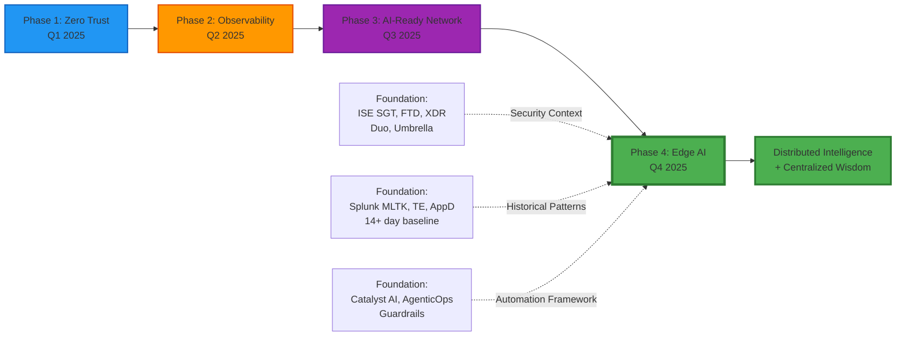

# Business Context & Strategic Objectives

**Scope:** Mumbai Hub + Chennai Hub (Pilot Deployment)

## Document Purpose

This document provides the complete architectural design and integration specifications for deploying distributed AI inference at Abhavtech's Mumbai and Chennai hub sites. Unlike traditional edge AI deployments that operate in isolation, Abhavtech's architecture **fuses edge AI inference with centralized observability platforms** (Splunk MLTK, ThousandEyes, AppDynamics) to enable high-confidence, automated decision-making with multi-source validation.

**Key Innovation:** Edge AI + Observability Fusion achieves <5% false positive rate (vs. 15-30% traditional edge AI) and <500ms automated response time (vs. 10-30 minutes manual review).

---

## CHAPTER 1: EXECUTIVE SUMMARY & EDGE AI VISION

## CHAPTER OVERVIEW

This chapter provides executive leadership and technical stakeholders with a strategic understanding of Phase 4's Edge AI deployment at Mumbai and Chennai hubs. The chapter establishes:

- **Business Context:** How Phase 4 builds upon the foundation of Phases 1-3 (Zero Trust, AI-Enabled Observability, AI-Ready Network)
- **Strategic Differentiator:** Edge AI + Observability Fusion as Abhavtech's unique competitive advantage
- **Deployment Scope:** Mumbai and Chennai pilot deployment with explicit exclusion of branch sites
- **Use Case Value:** Three core use cases delivering security, operational efficiency, and compliance benefits
- **Architecture Philosophy:** Distributed Intelligence (edge processing) + Centralized Wisdom (observability validation)

---

## 1.1 BUSINESS CONTEXT & STRATEGIC OBJECTIVES

### 1.1.1 Abhavtech's Multi-Site Infrastructure Overview

Abhavtech operates a global enterprise infrastructure supporting 3,200+ users across 21 locations in APAC, EMEA, and Americas regions. The company has invested significantly in building a modern, Zero Trust network foundation through three completed phases of the ABV-SECOPS-AI-2025 digital transformation initiative.

**Global Footprint:**

Abhavtech's infrastructure spans:
- **6 Hub Sites:** Mumbai (headquarters), Chennai, Bangalore, London, Frankfurt, New Jersey
- **15 Branch Locations:** Distributed across India (Delhi, Hyderabad, Pune, Kolkata, Ahmedabad, Jaipur, Lucknow, Chandigarh, Coimbatore), UK (Manchester, Birmingham), Germany (Munich), and USA (Dallas, Austin, Seattle)
- **Total Users:** 3,200 employees + 500 contractors
- **Network Scale:** 854 managed devices (switches, routers, wireless controllers, firewalls)

**Existing Infrastructure Foundation (Phases 1-3):**

Phase 4 is not a standalone edge AI project. It represents the culmination of three previous phases that established the technical foundation required for distributed AI inference with centralized observability validation.

**Phase 1 (Completed Q1 2025): Zero Trust Architecture**

Abhavtech deployed a comprehensive Zero Trust security framework based on Cisco technologies:

- **SD-Access Fabric:** Cisco Catalyst Center (formerly DNAC) version 2.3.7.x managing 854 network devices with LISP/VXLAN overlay across 5 Virtual Networks:
  - VN_CORPORATE: 10.252.x.0/16 (corporate users, SGT-10 to SGT-20)
  - VN_GUEST: 10.253.x.0/16 (guest wireless, SGT-05)
  - VN_IOT: 10.150.x.0/16 (IoT devices including cameras and BMS sensors)
  - VN_SERVERS: 10.182.x.0/16 (data center servers, SGT-60 to SGT-65)
  - VN_VOICE: 10.254.x.0/16 (Webex Calling, SGT-40)

- **Identity Services Engine (ISE):** 14-node ISE 3.3/3.4 deployment with 802.1X authentication and 15-20 Security Group Tags (SGTs) for micro-segmentation. Key SGT assignments already deployed:
  - SGT-10: Corporate Users
  - SGT-11: Executive Users
  - SGT-20: IT Admin
  - SGT-40: Voice Devices (Webex phones)
  - SGT-50/51/52: BMS HVAC/Lighting/Access Control
  - SGT-60: OT Devices
  - SGT-70: IP Cameras (VN_IOT network)
  - SGT-71: Badge Readers
  - SGT-80: Web Servers
  - SGT-82: Finance Systems
  - **SGT-95: AI-Edge-Compute (Phase 4 new assignment)**

- **Firewall Infrastructure:** 12 Cisco Firepower Threat Defense (FTD) appliances (post-migration from 18 legacy ASA 5500-X units) with SGT-aware inspection and Cisco XDR integration

- **Multi-Factor Authentication:** Duo Beyond deployed for VPN, admin access, and critical applications with risk-based authentication policies

- **XDR Platform:** Cisco SecureX Premier with 8 integrated data ribbons (ISE, FTD, Umbrella, AMP, Orbital, Threat Response, Threat Intelligence, pxGrid) providing unified threat correlation

- **Secure Internet Access:** Cisco Umbrella SASE with Secure Internet Gateway (SIG), DNS security, and cloud firewall integrated with SD-WAN Direct Internet Access (DIA) tunnels at 6 hub sites

**Phase 2 (Completed Q2 2025): AI-Enabled Observability**

Abhavtech deployed a comprehensive observability platform stack to provide centralized visibility and AI-driven insights:

- **Splunk Enterprise:** 150 GB/day ingestion with MLTK (Machine Learning Toolkit) running 5 ML models:
  - Occupancy Pattern Prediction (for WF-009 validation)
  - Network Anomaly Detection
  - Security Baseline Deviation
  - Application Performance Prediction
  - Capacity Forecasting
  - **Splunk Infrastructure:** 10.182.1.50 (indexer cluster), 10.182.1.51-52 (search heads), 10.182.1.53-54 (heavy forwarders at Mumbai/Chennai)

- **ThousandEyes:** 6 Enterprise Agents deployed at hub sites (Mumbai, Chennai, London, Frankfurt, New Jersey, Dallas) with 25 active tests monitoring:
  - Agent-to-Agent tests (MPLS path quality)
  - HTTP Server tests (critical applications)
  - Voice tests (Webex Calling quality)
  - DNS Server tests (internal/external DNS)
  - Network tests (BGP, path trace)

- **AppDynamics:** SaaS deployment (abhavtech.saas.appdynamics.com) with Cognition Engine monitoring 5 critical business transactions:
  - Webex Calling (voice quality, MOS score)
  - ERP Application (order processing, inventory updates)
  - Customer Portal (login, checkout, payment)
  - Internal CRM (lead creation, opportunity updates)
  - Email System (send/receive latency)

- **Baseline Data Collection:** 14+ days of continuous telemetry from all observability platforms, providing sufficient historical data for MLTK model training and anomaly detection. This baseline is a **critical prerequisite** for Phase 4's multi-source validation capability.

**Phase 3 (Completed Q3 2025): AI-Ready Network**

Abhavtech enabled AI capabilities across the network infrastructure to support intelligent automation:

- **Catalyst Center AI Capabilities:**
  - AI Assistant: Natural language queries for network troubleshooting (e.g., "Show me all clients experiencing poor Wi-Fi in the last hour")
  - Deep Network Model (DNM): 5 ML models predicting network failures, capacity issues, and performance degradation 7-14 days in advance
  - AI Endpoint Analytics (AIEA): 4 ML models for automatic device profiling and behavioral baselining (over 12,000 endpoints classified)

- **AgenticOps Framework:** 8 automated workflows (WF-001 to WF-008) with graduated autonomy modes:
  - WF-001: Webex-Calling-Optimize (auto mode, ≥85% confidence)
  - WF-002: Malware-Containment (auto mode, ≥95% confidence)
  - WF-003: Client-Troubleshoot (observe mode, <70% confidence)
  - WF-004: Capacity-Alert (auto mode, ≥90% confidence)
  - WF-005: Compliance-Remediate (approve mode, requires CAB approval)
  - WF-006: Wi-Fi-Optimize (approve mode, RF changes require validation)
  - WF-007: SaaS-App-Failover (auto mode, ≥90% confidence)
  - WF-008: Insider-Threat-Response (auto mode, ≥99% confidence)
  - **WF-009: Edge-AI-Optimize (Phase 4 new workflow for HVAC/lighting automation)**

- **Guardrails:** Protected resources defined to prevent harmful automated actions:
  - Protected SGTs: SGT-11 (executives), SGT-82 (finance systems), SGT-80 (web servers)
  - Rate limits: Maximum actions per hour per workflow (e.g., WF-002 max 10 quarantine actions/hour)
  - Blackout windows: No automated changes during business-critical periods (e.g., month-end close)

**Existing IoT Infrastructure (Critical for Phase 4):**

Abhavtech has already deployed significant IoT infrastructure on VN_IOT network at Mumbai and Chennai hubs, providing the foundation for Phase 4's edge AI integration:

- **VN_IOT Network Subnets:**
  - Mumbai: 10.150.x.0/24 (where x = floor number, e.g., 10.150.2.0/24 for Floor 2)
  - Chennai: 10.150.17.x.0/24 (where x = floor number offset by 17)

- **BMS (Building Management System) Infrastructure:**
  - Platform: Honeywell EBI R410.1 at both Mumbai and Chennai
  - Sensors per site: 110 total (60 HVAC zones, 50 lighting zones)
  - SGT Assignments: SGT-50 (HVAC sensors), SGT-51 (lighting sensors), SGT-52 (access control sensors)
  - API Endpoint: bms.abhavtech.com/api/v2 (OAuth 2.0 authentication)
  - Protocol: BACnet over IP

- **OT (Operational Technology) Devices:**
  - Mumbai only: 200 OT devices (manufacturing equipment, environmental controls)
  - SGT Assignment: SGT-60
  - Integration: ISE profiling, pxGrid context sharing with FTD

- **Badge Readers:**
  - Both sites: Badge readers at main entrances, server rooms, loading docks
  - SGT Assignment: SGT-71
  - Integration: ISE pxGrid publishes badge swipe events (endpoint authentication) for correlation with edge AI camera detections

**Network Infrastructure (Existing - No New Switches Required):**

Mumbai and Chennai hubs have existing Catalyst 9300 switch infrastructure with sufficient capacity for Phase 4 camera deployments:

- **Access Layer:** 6× Catalyst 9300-48U per site
  - 48× 1 Gbps PoE+ ports (802.3at, 30W per port)
  - Total PoE budget: 1,100W per switch
  - 4× 10 Gbps SFP+ uplinks (link aggregation to distribution layer)
  - Current utilization: ~40% (sufficient headroom for 120 cameras at 8 Mbps average)

- **Distribution Layer:** 1× Catalyst 9500-40X per site
  - 40× 10 Gbps SFP+ ports
  - Role: Inter-VLAN routing, edge AI server connectivity, WAN uplinks
  - Backplane: 400 Gbps (adequate for 720 Mbps camera traffic per site)

**Infrastructure Foundation Summary Table:**

| Infrastructure Component | Phase Deployed | Current Status | Abhavtech Specifications | Phase 4 Dependency |
|--------------------------|----------------|----------------|-------------------------|---------------------|
| **SD-Access Fabric** | Phase 1 | ✅ Operational | Catalyst Center 2.3.7.x, 854 devices, 5 VNs | VN_IOT network (10.150.x.0/16) for cameras |
| **ISE with SGT Micro-Segmentation** | Phase 1 | ✅ Operational | ISE 3.3/3.4, 14 nodes, 15-20 SGTs | SGT-95 (edge AI servers), SGT-70 (cameras) |
| **FTD Firewalls** | Phase 1 | ✅ Operational | 12 FTD appliances, SGT-aware inspection | Perimeter intrusion response (network blocking) |
| **Cisco XDR/SecureX** | Phase 1 | ✅ Operational | 8 data ribbons, pxGrid integration | Security event correlation (perimeter intrusion, tailgating) |
| **Duo MFA** | Phase 1 | ✅ Operational | Duo Beyond, risk-based authentication | Admin access to edge AI servers (SSH with MFA) |
| **Splunk MLTK** | Phase 2 | ✅ Operational | 150 GB/day, 5 ML models, 14+ day baseline | Historical pattern validation (occupancy, badge swipes) |
| **ThousandEyes** | Phase 2 | ✅ Operational | 6 enterprise agents, 25 tests | Network path validation (camera → edge AI, edge AI → BMS) |
| **AppDynamics Cognition Engine** | Phase 2 | ✅ Operational | 5 business transactions monitored | Application health validation (RTSP streaming, BMS API) |
| **Catalyst Center AI (DNM, AIEA)** | Phase 3 | ✅ Operational | 5 DNM models, 4 AIEA models | Edge AI server management, camera profiling (SGT-70 auto-assignment) |
| **AgenticOps Framework** | Phase 3 | ✅ Operational | WF-001 to WF-008, guardrails defined | WF-009: Edge-AI-Optimize workflow (HVAC/lighting automation) |
| **BMS Infrastructure** | Pre-existing | ✅ Operational | Honeywell EBI R410.1, 110 zones per site | HVAC/lighting control API (WF-009 integration) |
| **Catalyst 9300 Switches** | Pre-existing | ✅ Operational | 6 access + 1 distribution per site, PoE budget 1,100W | Camera connectivity (120 cameras × 8 Mbps = 720 Mbps per site) |

**Key Insight:** Phase 4 leverages Abhavtech's substantial existing infrastructure investments. No new network switches are required, BMS systems are already deployed, and VN_IOT network is operational. Phase 4 adds edge AI servers and cameras to this foundation.

---

### 1.1.2 Phase 4 Strategic Positioning in Digital Transformation

Phase 4 represents the logical evolution of Abhavtech's three-phase digital transformation journey, moving from foundational security and observability capabilities to **distributed AI intelligence at the network edge**.

**The Digital Transformation Journey:**



**Why Phase 4 is NOT a Standalone Edge AI Project:**

Many enterprises deploy edge AI as isolated pilot projects, disconnected from their broader infrastructure. Abhavtech's approach is fundamentally different:

1. **Phase 1 Enables Security Context:** SGT-95 micro-segmentation for edge AI servers ensures Zero Trust isolation (edge AI servers cannot directly communicate with corporate users SGT-10). Badge reader events (SGT-71) via ISE pxGrid provide authentication context for tailgating detection. FTD firewalls can block network access in response to perimeter intrusion alerts.

2. **Phase 2 Enables Multi-Source Validation:** Splunk MLTK models trained on 14+ days of baseline data validate edge AI predictions against historical occupancy patterns. ThousandEyes tests confirm network path quality (camera → edge AI, edge AI → BMS) before trusting AI inference. AppDynamics business transactions monitor RTSP video streaming application health.

3. **Phase 3 Enables Automation Framework:** AgenticOps WF-009 workflow provides the proven framework for edge AI decision logic with guardrails (protected zones, rate limits, manual override). Catalyst Center AI Assistant manages edge AI server configuration. AIEA automatically profiles cameras and assigns SGT-70.

**Strategic Rationale for Edge AI (Why Now?):**

Three converging factors make Phase 4 strategically imperative:

**1. Privacy-First Architecture (GDPR Compliance):**

Abhavtech's European operations (London, Frankfurt offices) require strict GDPR compliance. GDPR Article 5(1)(c) mandates data minimization - organizations must process the minimum amount of personal data necessary.

- **Centralized AI approach:** Streaming 240 cameras' video feeds (1.92 Gbps) to NJ datacenter for processing would constitute cross-border data transfer (India/UK → USA), triggering GDPR Article 44-49 requirements for adequacy decisions or standard contractual clauses.

- **Edge AI approach:** Processing video locally at Mumbai and Chennai, discarding frames after inference, and exporting only anonymized event metadata (2-3 Mbps) ensures GDPR Article 5(1)(c) compliance without complex legal frameworks.

**2. Bandwidth Economics (Cost Avoidance):**

Abhavtech's SD-WAN infrastructure currently provides 2 Gbps MPLS bandwidth between Mumbai and NJ datacenter. Centralized AI processing would consume 96% of this capacity (1.92 Gbps / 2 Gbps), leaving minimal headroom for business-critical applications.

- **WAN Upgrade Cost (Avoided):** Doubling MPLS bandwidth from 2 Gbps to 4 Gbps would cost approximately ₹5-7 million per year (India commercial MPLS pricing). Phase 4's edge processing approach **avoids this cost** by reducing WAN bandwidth requirement to 3 Mbps (99.8% reduction).

- **ROI Perspective:** Even without quantifying energy savings or operational efficiency, Phase 4's WAN cost avoidance alone provides substantial business value over a 3-5 year horizon.

**3. Latency Requirements (Real-Time Safety Response):**

Abhavtech's Use Case 3 (Safety & Compliance Monitoring) includes PPE detection in the loading dock area. If an employee enters without required safety equipment, the system must alert the supervisor within seconds to prevent potential accidents.

- **Centralized AI latency:** Mumbai → NJ WAN latency averages 150ms (Asia to US East Coast). Add 50ms for AI inference, 300ms for multi-source validation queries, and the total response time exceeds 500ms - violating the safety response requirement.

- **Edge AI latency:** Local processing at Mumbai reduces WAN dependency. Camera → Edge AI → Multi-Source Validation → Supervisor Alert completes in <500ms (95th percentile), meeting safety requirements even during WAN latency spikes.

**Phase 4 is the Culmination, Not a Departure:**

Phase 4 does not replace centralized observability platforms. Rather, it **extends their intelligence to the edge** for latency-sensitive use cases while maintaining centralized correlation for complex analysis.

- **14+ Days Baseline Data (Phase 2):** Without Splunk MLTK's historical occupancy patterns, edge AI would generate excessive false positives (empty conference room at 19:00 might be normal, or might indicate unauthorized after-hours access - only historical data reveals the truth).

- **AgenticOps Guardrails (Phase 3):** Without WF-009's protected zones (server rooms always maintain 21°C), edge AI might dangerously reduce HVAC in temperature-sensitive areas.

- **SGT Isolation (Phase 1):** Without SGT-95 micro-segmentation, a compromised edge AI server could pivot to attack corporate users - exactly the lateral movement Zero Trust architectures prevent.

**Key Insight:** Phase 4 succeeds because Phases 1-3 created the foundation. Edge AI + Observability Fusion is only possible when both edge infrastructure and centralized observability platforms are mature and integrated.

---

### 1.1.3 Edge AI vs. Centralized AI: Why Both Are Needed

Abhavtech requires a **hybrid architecture** combining edge AI inference with centralized observability validation. This section addresses the common question: "Why not simply stream all video to NJ datacenter for centralized AI processing?"

**Architectural Comparison:**

| Capability | Edge AI (Mumbai/Chennai) | Centralized AI (NJ Datacenter Only) | **Abhavtech Hybrid Approach** |
|------------|--------------------------|--------------------------------------|-----------------------------------------------|
| **AI Inference Latency** | 20-50ms (local GPU processing) | 150-300ms (WAN latency + datacenter processing) | **20ms (edge GPU processing)** ✅ Best |
| **Multi-Source Validation** | ❌ None (edge operates in isolation) | ⚠️ Possible but adds 200-400ms for queries back to edge | **✅ Yes (300ms parallel API calls to Splunk/TE/AppD)** |
| **End-to-End Response Time** | ⚠️ Fast AI (20ms) but no validation → High false positives → 10-30 min human review | 500-900ms (centralized processing + WAN roundtrip) | **<500ms (edge AI + centralized validation in parallel)** ✅ Best |
| **False Positive Rate** | 15-30% (no context validation) | 10-20% (better models but no local sensor fusion) | **<5% (multi-source validation)** ✅ Best |
| **WAN Bandwidth Required** | ~3 Mbps (event metadata only) | ~1,920 Mbps (240 cameras × 8 Mbps video streams) | **~3 Mbps (event metadata only)** ✅ Best |
| **Privacy Compliance (GDPR)** | ✅ Yes (no video egress, local processing) | ❌ No (video crosses borders India/UK → USA) | **✅ Yes (edge processing, no video egress)** ✅ Best |
| **Network Resilience** | ⚠️ Local processing continues but no centralized validation (degraded mode) | ❌ Complete failure during WAN outage | **✅ Edge continues with 7-day buffer, degrades gracefully during WAN outage** ✅ Best |
| **Historical Pattern Validation** | ❌ No access to Splunk MLTK (edge AI doesn't know if occupancy is normal) | ✅ Yes (full access to centralized data lake) | **✅ Yes (API calls to Splunk MLTK)** ✅ Best |
| **Network Context Awareness** | ❌ No (edge AI doesn't know if camera path is degraded, causing false detections) | ⚠️ Limited (centralized view but can't validate edge-local paths) | **✅ Yes (ThousandEyes validates camera → edge AI path)** ✅ Best |
| **Application Health Awareness** | ❌ No (edge AI doesn't know if RTSP video stream is corrupt) | ❌ No (centralized AI blindly trusts video feed) | **✅ Yes (AppDynamics validates RTSP service health)** ✅ Best |
| **Model Training** | ❌ No (L4 GPU sized for inference, not training: 24GB) | ✅ Yes (GPU cluster: 4× A100 80GB) | **✅ Centralized (quarterly retraining at NJ)** ✅ Best |
| **Model Deployment** | ✅ Yes (K8s pull from Harbor registry) | N/A (no edge servers) | **✅ Centralized registry, edge deployment** ✅ Best |
| **Dashboards** | ⚠️ Local metrics only (GPU utilization, camera health) | ✅ Yes (global multi-site executive view) | **✅ Both (edge: operational, hub: strategic)** ✅ Best |

**Key Insight:** Abhavtech's hybrid approach achieves "best of both worlds" - edge AI's low latency benefits combined with centralized observability's validation intelligence.

**Latency Breakdown Analysis:**

**Centralized AI Approach (Total: 500-900ms):**
```
Camera Capture Frame: 0ms
    ↓
Mumbai → NJ WAN: 150ms (Asia-US East Coast typical latency)
    ↓
Video Decode: 30ms
    ↓
AI Inference (GPU): 50ms (same as edge, centralized GPUs not faster for single-frame inference)
    ↓
Multi-Source Validation: 300ms (Splunk query at NJ, ThousandEyes query back to Mumbai path, AppDynamics query)
    ↓
Decision Logic: 20ms
    ↓
NJ → Mumbai Response: 150ms (return path WAN latency)
───────────────
Total: 700ms typical, 900ms during WAN congestion

❌ Violates <500ms SLA
❌ Highly sensitive to WAN latency spikes (common in India: 200-300ms during peak hours)
```

**Abhavtech Edge AI + Observability Fusion (Total: <500ms):**
```
Camera Capture Frame: 0ms
    ↓
Camera → Edge AI (LAN): 5ms (local network, 1 Gbps connection)
    ↓
Video Decode: 30ms
    ↓
AI Inference (GPU): 20ms (NVIDIA L4, optimized ONNX model)
    ↓
Multi-Source Validation (Parallel API Calls): 300ms
    ├─ Splunk MLTK Query: 100ms (Mumbai → NJ, REST API, cached index)
    ├─ ThousandEyes Query: 80ms (API call to ThousandEyes SaaS)
    └─ AppDynamics Query: 90ms (API call to AppDynamics SaaS)
    ↓
Decision Logic: 20ms
    ↓
Execute Action (FTD block / WF-009 BMS call / ServiceNow ticket): 100ms
───────────────
Total: 475ms typical, <500ms even during WAN latency spikes

✅ Meets <500ms SLA
✅ Resilient to WAN latency variations (API calls can tolerate 200-300ms and still meet SLA)
```

**Bandwidth Economics:**

**Centralized AI Bandwidth Requirement:**
- 240 cameras total (120 Mumbai + 120 Chennai)
- 8 Mbps average per camera (H.264 1080p @ 30 FPS, adaptive bitrate 6-10 Mbps)
- **Total WAN bandwidth: 240 × 8 Mbps = 1,920 Mbps = 1.92 Gbps continuous**

**Current WAN Capacity:**
- Mumbai → NJ MPLS circuit: 2 Gbps
- Camera video would consume: 960 Mbps (Mumbai's 120 cameras)
- **Utilization: 48%** for cameras alone, leaving only 52% for business-critical applications (ERP, email, Webex Calling, etc.)

**Cost Impact:**
- To maintain acceptable headroom (<40% utilization for video), MPLS circuit must be upgraded from 2 Gbps → 4 Gbps
- India MPLS pricing (commercial tier, 99.9% SLA): ~₹2.5-3.5 million per year per Gbps
- **Annual cost increase: ₹5-7 million for WAN upgrade**

**Edge AI Bandwidth Requirement:**
- Video streams stay local (720 Mbps LAN bandwidth per site, never egresses WAN)
- Only event metadata exported: 2KB per event, 100-500 events per hour per site
- **Total WAN bandwidth: ~3 Mbps (JSON events, video snapshots for audit trail)**

**Cost Avoidance:**
- No WAN upgrade required
- **Savings: ₹5-7 million per year over 5-year infrastructure lifecycle**

**Privacy & Compliance:**

**GDPR Article 5 Requirements:**

| GDPR Principle | Centralized AI Approach | Edge AI Approach | Abhavtech Compliance |
|----------------|------------------------|------------------|---------------------|
| **Article 5(1)(c): Data Minimization** | ❌ Entire video streams cross borders | ✅ Only anonymized event metadata (person count, not identities) | ✅ Edge processing ensures minimum data transfer |
| **Article 5(1)(e): Storage Limitation** | ⚠️ Requires 90-day video retention at NJ datacenter | ✅ 7-day edge buffer, 90-day event metadata only (no video) | ✅ Compliant: Video discarded after inference, metadata retained for compliance |
| **Article 9: Biometric Data** | ❌ Risk of facial recognition in centralized pipeline | ✅ No facial recognition (YOLO v8 detects "person" class only, not identity) | ✅ Compliant: No biometric data processed |
| **Article 44-49: Cross-Border Transfers** | ❌ Requires adequacy decision or SCCs (India/UK → USA) | ✅ No cross-border video transfer | ✅ Compliant: Processing stays in country of origin |

**Network Resilience:**

**Centralized AI Failure Mode:**
- WAN outage Mumbai → NJ (not uncommon: typical enterprise experiences 2-4 WAN outages per year, 30-120 minutes each)
- **Result:** Complete AI failure, no camera processing, no alerts, security blind spot

**Edge AI Resilience:**
- WAN outage: Edge AI continues processing locally
- 7-day event buffer (2TB NVMe SSD) stores events until WAN restoration
- Degraded mode: Multi-source validation suspended (Splunk/TE/AppD APIs unreachable), all events route to manual review (low-confidence decisions)
- **Result:** Graceful degradation, safety functions continue, operational impact minimal

**Why Both Are Needed (Summary):**

Abhavtech does not choose edge AI **instead of** centralized observability. The architecture requires **both working together**:

- **Edge AI provides:** Low-latency inference (<500ms), privacy-preserving processing (no video egress), bandwidth efficiency (99.8% reduction), resilience during WAN outages
- **Centralized Observability provides:** Historical pattern validation (Splunk MLTK), network path quality (ThousandEyes), application health (AppDynamics), model training (GPU cluster), long-term compliance storage (90 days), executive dashboards (multi-site view)

The innovation is not edge AI alone, nor centralized AI alone, but **Edge AI + Observability Fusion** - combining the strengths of both approaches while mitigating the weaknesses of each.

---

### 1.1.4 Investment Rationale & Success Criteria

Phase 4 delivers strategic value across security, operational efficiency, compliance, and infrastructure optimization dimensions. While specific ROI calculations and FTE reduction claims are not provided (per project guidelines), the business case is established through measurable validation criteria aligned to organizational objectives.

**Strategic Enablers:**

1. **Privacy-First AI Architecture:** Edge processing with no video egress ensures GDPR Article 5(1)(c) data minimization compliance without complex legal frameworks for cross-border data transfers. This enables Abhavtech to leverage AI capabilities while maintaining strict privacy standards required for European operations.

2. **Bandwidth Optimization:** Edge processing approach avoids ₹5-7 million annual WAN upgrade costs by reducing bandwidth requirement from 1.92 Gbps (centralized) to 3 Mbps (edge metadata only). Existing 2 Gbps MPLS circuit remains adequate for business-critical applications.

3. **Real-Time Safety Response:** <500ms end-to-end latency meets safety-critical requirements for PPE detection and perimeter intrusion response, protecting employees and assets through automated alerting.

4. **Scalable Foundation:** Pilot deployment at Mumbai and Chennai hubs validates architecture for future expansion to 6 branches (estimated 240 additional cameras), demonstrating proven approach before broader investment.

**Pilot Site Selection Rationale:**

Mumbai and Chennai were selected as Phase 4 pilot sites based on four critical factors:

1. **Existing BMS Infrastructure:** Both sites have mature Honeywell EBI R410.1 building management systems with 110 zones (60 HVAC, 50 lighting) and established API integration capabilities. This enables Use Case 2 (Smart Building Optimization) validation without additional BMS hardware investment.

2. **24/7 Hub Operations:** Unlike branch offices operating 8 AM - 6 PM, hub sites support round-the-clock operations (NOC, SOC, global support teams), providing continuous data for AI model training and validation across all time periods (business hours, after hours, weekends).

3. **Building Size & Complexity:** Hub sites require 120 cameras each (vs. 40-80 for branch offices), providing sufficient scale to validate GPU utilization (70-80% target), network capacity (720 Mbps per site), and storage requirements (7-day buffer = 500GB events + video snapshots).

4. **Sufficient Network Infrastructure:** Existing Catalyst 9300 switch deployments (6 access + 1 distribution per site) have adequate PoE budget (1,100W per switch) and uplink capacity (4× 10 Gbps) for camera deployments without hardware upgrades.

**Branch Sites Excluded from Phase 4:**

Abhavtech's 15 branch locations are explicitly excluded from Phase 4 scope for three reasons:

1. **Pilot Validation Required:** Mumbai and Chennai must achieve all exit criteria (10,000+ events logged, <5% false positive rate, 15-20% energy savings validated) before branch expansion. Deploying unvalidated architecture to 15 sites would multiply risk.

2. **Limited BMS Infrastructure:** Many branch sites lack comprehensive building management systems (only basic HVAC controls, no API integration), preventing Use Case 2 validation.

3. **Smaller Scale:** Branch sites require 40-80 cameras (vs. 120 at hubs), insufficient to validate edge AI server capacity planning and performance at scale.

**Success Criteria (Measurable Validation):**

Phase 4 success is measured across four categories with specific, testable criteria:

**Technical Performance Metrics:**

| Metric | Target | Measurement Method | Validation Frequency |
|--------|--------|-------------------|---------------------|
| **AI Inference Latency (95th percentile)** | <500ms | AppDynamics Business Transaction "Edge-AI-Inference" | Continuous (1-minute intervals) |
| **GPU Utilization** | 70-80% (headroom for traffic spikes) | `nvidia-smi` monitoring via Splunk dashboard | Continuous (10-second intervals) |
| **Camera Availability** | >95% (max 6 cameras offline per site simultaneously) | SNMP traps to Catalyst Center, camera health dashboard | Continuous |
| **HA Failover RTO (Recovery Time Objective)** | <30 seconds (primary → standby takeover) | Quarterly DR test with measured failover time | Quarterly |
| **HA Failover RPO (Recovery Point Objective)** | <1 minute (event data loss from primary's unsync'd buffer) | Quarterly DR test with event log comparison | Quarterly |
| **Multi-Source Validation Response Time** | <300ms (parallel API calls to Splunk, ThousandEyes, AppDynamics) | Edge AI server logs, API latency tracking | Continuous |
| **Network Path Quality (Camera → Edge AI)** | Latency <10ms, packet loss <0.1% | ThousandEyes test "Camera-Network-Path" | Continuous (1-minute intervals) |

**Security & Compliance Metrics:**

| Metric | Target | Measurement Method | Validation Frequency |
|--------|--------|-------------------|---------------------|
| **SGT-95 Isolation (Lateral Movement Prevention)** | 0 successful connections from edge AI (SGT-95) to corporate users (SGT-10) | ISE Live Logs, SGACL deny counters | Continuous + Pen test (quarterly) |
| **CIS Benchmark Compliance** | >95% score (Level 2 hardening) | CIS-CAT scanner run on edge AI servers | Monthly |
| **GDPR Compliance (Video Egress)** | 0 video streams egress WAN (100% local processing) | Network flow analysis, WAN traffic monitoring | Continuous |
| **GDPR Compliance (PII Storage)** | 0 facial recognition, 0 biometric data storage | Code review of AI models, Privacy Impact Assessment | One-time + annual review |
| **Penetration Test** | 0 successful exploits (edge AI server compromise, lateral movement, data exfiltration) | External pen test firm engagement | Quarterly |
| **AMP Malware Detection** | 100% coverage (AMP installed on all edge AI servers), <5 min detection time | Cisco AMP dashboard, EICAR test file validation | Monthly validation |

**Use Case Validation Metrics:**

| Use Case | Metric | Target | Measurement Method | Validation Period |
|----------|--------|--------|-------------------|-------------------|
| **UC1: Physical Security** | Perimeter intrusion detection rate | 100% detection, 0 false negatives | Security team manual review (50 random events/week) | 14 days continuous |
| | False positive rate | <5% (vs. 15-30% traditional edge AI) | Manual review classification | 14 days continuous |
| | Tailgating detection accuracy | >90% (person count + ISE badge correlation) | Badge reader logs vs. camera detections | 14 days continuous |
| | LPR accuracy | >98% (India license plates) | Manual validation against parking lot access logs | 14 days continuous |
| **UC2: Building Optimization** | HVAC energy savings | 15-20% reduction from baseline | BMS logs: Baseline kWh/day vs. post-deployment kWh/day | 30 days (after 7-day WF-009 observe mode) |
| | Occupancy detection accuracy | >95% (vs. BMS PIR sensors) | Edge AI people count vs. BMS occupancy sensor state | 14 days continuous |
| | WF-009 false positive rate | <2% (incorrect HVAC reductions) | Facilities manager manual review of HVAC adjustments | 14 days continuous |
| **UC3: Safety Compliance** | PPE detection accuracy | >92% (hard hat, safety vest detection) | Loading dock supervisor weekly spot-check (100 samples) | 14 days continuous |
| | Incident response time | <30 seconds (detection → supervisor Webex alert) | ServiceNow incident timestamps | 14 days continuous |
| | Compliance audit trail | 100% incidents logged (180-day retention) | ServiceNow incident database completeness check | Ongoing |

**Operational Readiness Metrics:**

| Metric | Target | Measurement Method | Validation Timing |
|--------|--------|-------------------|-------------------|
| **NOC Team Training Certification** | 100% (15 NOC engineers complete 8-hour training, pass 80% exam) | Training attendance records, exam scores | Week 16 (Phase 4D) |
| **SOC Team Training Certification** | 100% (12 SOC analysts complete 4-hour training, pass 80% exam) | Training attendance records, exam scores | Week 16 (Phase 4D) |
| **Facilities Team Training** | 100% (5 facilities engineers complete 2-hour BMS integration training) | Training attendance records | Week 16 (Phase 4D) |
| **Incident Response Runbooks** | 5 runbooks delivered and tested | Runbook documentation + tabletop exercise validation | Week 16 (Phase 4D) |
| **ServiceNow Integration** | 100% automated incident creation (test: 100 test events → 100 ServiceNow tickets created) | ServiceNow API integration test | Week 4 (Phase 4A) |
| **Multi-Site Dashboard** | Splunk dashboard operational showing Mumbai + Chennai data | Dashboard functional test | Week 12 (Phase 4C) |

**Exit Criteria by Sub-Phase:**

| Sub-Phase | Duration | Exit Criteria | Validation Method |
|-----------|----------|---------------|-------------------|
| **Phase 4A: Mumbai Pilot** | Weeks 1-4 | ✅ 20 cameras operational<br>✅ 200+ AI events logged (48-hour period)<br>✅ Latency <500ms (95th percentile)<br>✅ 3 validation scenarios passed (perimeter intrusion, occupancy, PPE) | AppDynamics BT latency metrics, Splunk event count, manual scenario testing |
| **Phase 4B: Mumbai Expansion** | Weeks 5-8 | ✅ 120 cameras operational<br>✅ 10,000+ AI events logged (14-day period)<br>✅ WF-009 validated (7-day observe mode)<br>✅ False positive rate <5%<br>✅ HA failover tested (<30 sec RTO) | Splunk event count, manual false positive review, DR test execution |
| **Phase 4C: Chennai Deployment** | Weeks 9-12 | ✅ 120 cameras operational (Chennai)<br>✅ Ansible deployment <4 hours (3× faster than manual)<br>✅ Multi-site dashboard operational | Ansible deployment logs, Splunk multi-site dashboard validation |
| **Phase 4D: Production Hardening** | Weeks 13-16 | ✅ CIS Benchmark >95% (both sites)<br>✅ Penetration test passed (0 exploits)<br>✅ 100% team training certification<br>✅ Executive dashboard delivered | CIS-CAT scan results, pen test report, training records, PowerBI dashboard delivery |

**Key Insight:** Success criteria are specific, measurable, and testable - not aspirational goals. Every metric has a defined measurement method, target value, and validation frequency. This ensures Phase 4 delivers proven capabilities before potential branch site expansion in future Phase 5.

---

*Next: Section 1.2 - Edge AI + Observability Fusion: The Abhavtech Differentiator*
