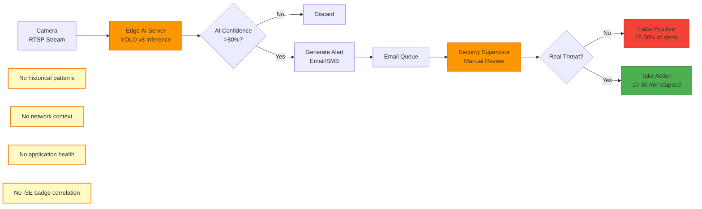
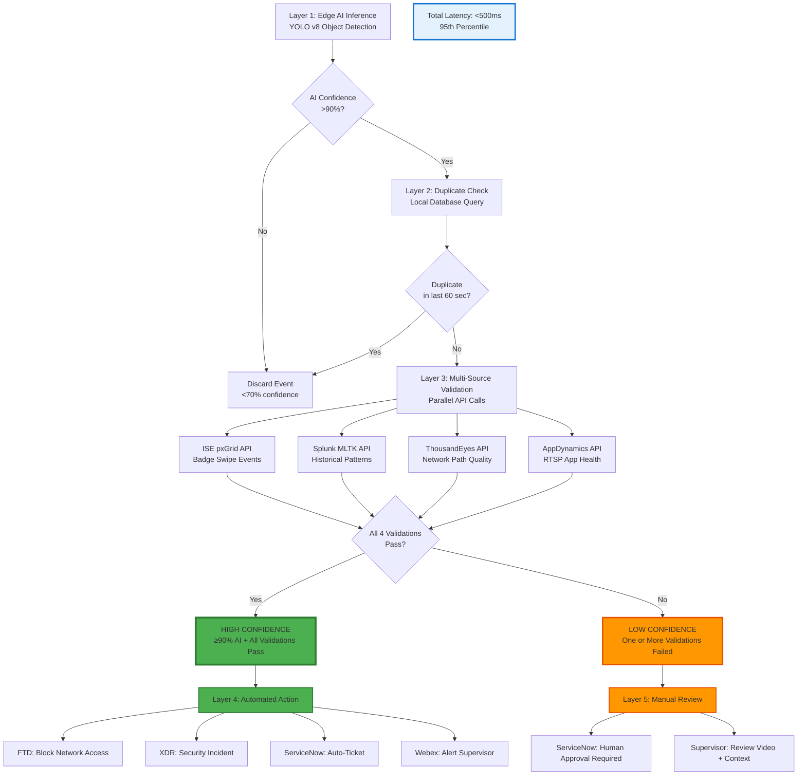

## 1.2 EDGE AI + OBSERVABILITY FUSION: THE ABHAVTECH DIFFERENTIATOR

### 1.2.1 Traditional Edge AI Limitations

Traditional edge AI deployments operate in isolation, processing camera feeds locally but lacking integration with broader enterprise observability platforms. This architectural limitation creates three critical problems that prevent enterprise adoption at scale.

**Problem 1: Excessive False Positives (15-30% Rate)**

# Edge AI vs Centralized AI

Edge AI models deployed without external validation context generate false positives when environmental conditions change. A YOLO v8 object detection model trained on daytime imagery may detect tree branches swaying in wind as "person" objects at night. Without access to historical pattern data, the edge AI system cannot distinguish between:

- **Normal patterns:** Conference room empty at 19:00 (expected after business hours)
- **Anomalous patterns:** Conference room empty at 14:00 (unusual during business hours, possible security concern)

The edge AI server sees "0 people detected" in both scenarios and treats them identically, lacking Splunk MLTK's historical occupancy patterns to provide context.

**Real-World Traditional Edge AI Failure Scenario:**

```
Traditional Edge AI Deployment - Loading Dock Intrusion Detection:

19:45:00 - Camera 47 detects movement in restricted zone
19:45:02 - YOLO v8 inference: Object detected (AI confidence 85%)
19:45:05 - Edge AI generates alert: "Possible intrusion - Loading Dock"
19:45:07 - Alert sent to security supervisor email queue
19:55:00 - Supervisor checks email during patrol (10 minutes elapsed)
19:57:00 - Supervisor opens VMS (Video Management System) to review footage
19:58:00 - Supervisor determines false positive: Tree branch movement due to wind
19:58:30 - Supervisor marks alert "closed - false positive" in tracking spreadsheet

Total Response Time: 13 minutes, 30 seconds
Outcome: Wasted supervisor time, alert fatigue, no security value delivered
False Positive Rate: 15-30% typical for edge AI without validation
```

**Problem 2: Lack of Contextual Awareness**

Edge AI systems process video frames in isolation without understanding broader network or application context. This creates three failure modes:

**Network Context Blindness:**
- Camera uplink experiences 5% packet loss due to failing switch port
- Video frames arrive corrupted at edge AI server
- Edge AI detects "anomalous movement patterns" (actually video artifacts from packet loss)
- Alert generated for non-existent security event
- **Without ThousandEyes network path monitoring, edge AI cannot distinguish between real events and network-induced false positives**

**Application Health Blindness:**
- RTSP video streaming service experiences memory leak, degrades over 6 hours
- Video frame decode errors increase from 0.1% to 15%
- Edge AI processes corrupt frames, generates spurious detections
- **Without AppDynamics application monitoring, edge AI cannot validate video stream integrity before inference**

**Historical Pattern Blindness:**
- Employee badge swipe at loading dock (ISE pxGrid event: user "jsmith", SGT-71, timestamp 19:45:01)
- Edge AI detects person at loading dock 3 seconds later (19:45:04)
- Traditional edge AI: Generates "unauthorized intrusion" alert (no badge correlation capability)
- **Without ISE pxGrid integration, edge AI cannot correlate camera detections with legitimate badge reader access events**

**Problem 3: No Automated Response (Human Review Required)**

Without confidence in AI predictions, traditional edge AI systems require human review for every alert. This creates operational bottlenecks:

- **Mean Time To Resolution (MTTR): 10-30 minutes** from detection to supervisor review
- **Alert Fatigue:** Security supervisors receive 20-50 alerts per day, 15-30% false positives, leading to alert desensitization
- **After-Hours Coverage:** Alerts during night shifts (22:00 - 06:00) often delayed 30-60 minutes due to limited security staff

**Traditional Edge AI Architecture Diagram:**



**Key Limitations Summary:**

| Limitation | Impact | Root Cause |
|------------|--------|------------|
| **High False Positive Rate (15-30%)** | Alert fatigue, supervisor time wasted, security team desensitization | No historical pattern validation (lacks Splunk MLTK integration) |
| **Network-Induced False Positives** | Spurious alerts from packet loss, corrupted frames | No network path monitoring (lacks ThousandEyes integration) |
| **Application-Induced False Positives** | Spurious alerts from RTSP service degradation | No application health monitoring (lacks AppDynamics integration) |
| **Badge Correlation Failures** | Legitimate employee access flagged as intrusion | No identity context (lacks ISE pxGrid integration) |
| **No Automated Response** | MTTR 10-30 minutes (human review bottleneck) | Low confidence in AI predictions without multi-source validation |

**The Core Problem:** Traditional edge AI operates with **incomplete information**. The AI model sees a person in a video frame but doesn't know:
- Is this person's presence normal for this time/location? (Splunk MLTK historical patterns)
- Is the video stream reliable? (AppDynamics RTSP health, ThousandEyes network path quality)
- Did this person legitimately access via badge reader? (ISE pxGrid badge events)

Without this context, edge AI must route every detection to human review, negating the automation benefits AI should provide.

---

### 1.2.2 Abhavtech's Multi-Source Validation Pipeline

Abhavtech's innovation is **Edge AI + Observability Fusion**: edge AI inference provides initial detection, then centralized observability platforms validate the detection against multiple independent data sources before executing automated actions.

**Five-Layer Validation Architecture:**



**Layer 1: Edge AI Inference**

YOLO v8 object detection model processes video frames at 30 FPS (frames per second), running on NVIDIA L4 GPU with TensorRT optimization:

- **Input:** 1080p video frame (1920×1080 pixels)
- **Processing:** GPU inference with INT8 quantization
- **Output:** Bounding boxes with class labels ("person", "vehicle") and confidence scores (0-100%)
- **Latency:** 20ms per frame
- **Confidence Threshold:** >90% for automated actions, 70-90% for manual review, <70% discarded

**Layer 2: Duplicate Check**

Before triggering validation APIs, edge AI checks local SQLite database to prevent duplicate alerts for the same event:

- **Query:** `SELECT COUNT(*) FROM events WHERE camera_id='cam-47' AND timestamp > (NOW() - 60 seconds)`
- **Logic:** If event found in last 60 seconds for same camera → Discard (debounce logic prevents alert spam)
- **Latency:** <5ms (local SQLite query on NVMe SSD)

**Layer 3: Multi-Source Validation (Parallel API Calls)**

Edge AI simultaneously queries four independent data sources to validate the AI detection:

**Validation Source 1: ISE pxGrid (Badge Reader Events)**
- **Endpoint:** `https://10.30.0.1/pxgrid/api/sessions/query`
- **Query:** Badge swipes at loading dock location (SGT-71 badge readers) in last 5 minutes
- **Validation Logic:**
  - If 1+ badge swipes found → Likely authorized employee → LOW CONFIDENCE (manual review)
  - If 0 badge swipes found → No legitimate access → HIGH CONFIDENCE (continue validation)
- **API Latency:** ~80ms (local ISE cluster, minimal WAN latency)

**Validation Source 2: Splunk MLTK (Historical Pattern Analysis)**
- **Endpoint:** `https://10.182.1.50:8089/services/search/jobs`
- **Query:** 
  ```spl
  index=ise sourcetype=ise:pxgrid location="Loading Dock" earliest=-5m
  | stats count by user
  | eventstats avg(count) as expected_count
  | eval anomaly=if(count < expected_count * 0.5, 1, 0)
  ```
- **Validation Logic:**
  - Compare current occupancy (0 people) vs. MLTK prediction (expected occupancy at this time/location)
  - If current < 50% of expected → Anomalous → HIGH CONFIDENCE
  - If current within expected range → Normal pattern → LOW CONFIDENCE
- **API Latency:** ~100ms (NJ datacenter Splunk, cached index, pre-computed MLTK model)

**Validation Source 3: ThousandEyes (Network Path Quality)**
- **Endpoint:** `https://api.thousandeyes.com/v6/tests/12345/results`
- **Query:** Camera 47 network path metrics (last 2 minutes)
- **Validation Logic:**
  - If packet loss >1% OR latency >100ms → Network degraded → LOW CONFIDENCE (video may be corrupted)
  - If packet loss <1% AND latency <100ms → Network healthy → HIGH CONFIDENCE
- **API Latency:** ~80ms (ThousandEyes SaaS API, CDN-distributed)

**Validation Source 4: AppDynamics (Application Health)**
- **Endpoint:** `https://abhavtech.saas.appdynamics.com/controller/rest/applications/10/metric-data`
- **Query:** RTSP video streaming business transaction (Camera-RTSP-Streaming) error rate and response time
- **Validation Logic:**
  - If error rate >5% OR response time >500ms → Application unhealthy → LOW CONFIDENCE
  - If error rate <5% AND response time <500ms → Application healthy → HIGH CONFIDENCE
- **API Latency:** ~90ms (AppDynamics SaaS API)

**Parallel Execution:** All 4 API calls execute simultaneously, total validation time = max(80ms, 100ms, 80ms, 90ms) = **100ms** (not 350ms sequential)

**Layer 4: High-Confidence Automated Action**

If AI confidence >90% AND all 4 validations pass, edge AI executes automated response without human approval:

**Action 1: FTD Network Block (Security Containment)**
- **API Endpoint:** `https://ftd-mumbai.abhavtech.com/api/fmc_config/v1/domain/default/object/accessrules`
- **Payload:** Create temporary block rule for loading dock VLAN 150
  ```json
  {
    "name": "BLOCK-LoadingDock-AutoGenerated-20250203-143205",
    "action": "BLOCK",
    "enabled": true,
    "sourceNetworks": {"objects": [{"type": "Network", "id": "VLAN-150-LoadingDock"}]},
    "destinationNetworks": {"objects": [{"type": "Network", "id": "any-ipv4"}]},
    "duration": "30 minutes"
  }
  ```
- **Result:** Loading dock VLAN 150 isolated from corporate network for 30 minutes (auto-expires)

**Action 2: XDR Security Incident (Threat Correlation)**
- **API Endpoint:** `https://securex.cisco.com/api/incidents`
- **Payload:** Create incident with edge AI event context
- **Result:** SecureX correlates with AMP, Umbrella, FTD events for complete threat picture

**Action 3: ServiceNow Auto-Ticket (Audit Trail)**
- **API Endpoint:** `https://abhavtech.service-now.com/api/now/table/incident`
- **Payload:**
  ```json
  {
    "short_description": "Perimeter Intrusion Detected - Loading Dock - Camera 47",
    "description": "Edge AI detected unauthorized person at 14:32:05. Multi-source validation: 0 badge swipes, historical anomaly, network healthy, app healthy. FTD block rule applied.",
    "priority": "2-High",
    "assigned_to": "security-supervisor-mumbai",
    "category": "Security",
    "subcategory": "Physical Security"
  }
  ```
- **Result:** Incident ticket created with full context for audit trail and compliance

**Action 4: Webex Supervisor Alert (Human Notification)**
- **API Endpoint:** `https://webexapis.com/v1/messages`
- **Payload:** Send Webex Teams message to security supervisor with video snapshot
- **Result:** Supervisor receives mobile push notification within 2 seconds

**Layer 5: Low-Confidence Manual Review**

If any validation fails, event routed to manual review:

**Failure Scenario 1: Badge Swipe Detected**
- ISE pxGrid returns 1 badge swipe (employee "jsmith" at 14:32:01)
- **Decision:** Likely authorized employee, camera angle didn't capture badge
- **Action:** Create ServiceNow ticket for manual review (not high-confidence automated block)

**Failure Scenario 2: Network Path Degraded**
- ThousandEyes reports 5% packet loss on camera uplink
- **Decision:** Video frames may be corrupted, AI detection unreliable
- **Action:** Route to manual review, escalate network issue to NOC team

**Failure Scenario 3: RTSP Application Error**
- AppDynamics reports 15% error rate on RTSP streaming service
- **Decision:** Video stream unreliable, AI may be processing corrupt frames
- **Action:** Route to manual review, escalate application issue to NOC team

**Real-World Scenario: High-Confidence Perimeter Intrusion Detection**

This scenario demonstrates Abhavtech's Edge AI + Observability Fusion in action:

```
Abhavtech Multi-Source Validation - Loading Dock Intrusion:

[TIMESTAMP] [COMPONENT] [ACTION] [LATENCY]

14:32:05.000  Camera-47        Capture 1080p frame @ 30 FPS                          0ms
14:32:05.020  Edge-AI-GPU      YOLO v8 inference: Person detected (96% confidence)  20ms
14:32:05.025  Edge-AI-DB       Check duplicate: No events in last 60 sec              5ms
14:32:05.030  Edge-AI-API      Launch 4 parallel validation API calls                 5ms
              
              ┌─ Parallel API Calls (Execute Simultaneously) ─┐
              │                                                │
14:32:05.030  │ → ISE-pxGrid-API    Query badge swipes                              │
14:32:05.030  │ → Splunk-MLTK-API   Query historical occupancy patterns             │
14:32:05.030  │ → ThousandEyes-API  Query camera network path quality               │
14:32:05.030  │ → AppDynamics-API   Query RTSP application health                   │
              │                                                │
14:32:05.130  │ ← ISE Response      0 badge swipes (80ms) ✅                        │
14:32:05.130  │ ← Splunk Response   Occupancy anomaly detected (100ms) ✅           │
14:32:05.110  │ ← TE Response       0% packet loss, 12ms latency (80ms) ✅          │
14:32:05.120  │ ← AppD Response     0% error rate, 50ms response time (90ms) ✅     │
              └────────────────────────────────────────────────┘
              
14:32:05.150  Edge-AI-Decision Decision: HIGH CONFIDENCE (AI 96%, all 4 validations pass)  20ms
14:32:05.170  Edge-AI-Action   Execute 4 automated actions (parallel)                      20ms
              
              ┌─ Automated Actions (Execute Simultaneously) ─┐
              │                                               │
14:32:05.170  │ → FTD-API          Create block rule VLAN-150                       │
14:32:05.170  │ → SecureX-API      Create XDR security incident                     │
14:32:05.170  │ → ServiceNow-API   Create incident ticket INC0012345                │
14:32:05.170  │ → Webex-API        Send supervisor alert with video snapshot        │
              │                                               │
14:32:05.400  │ ← FTD Response     Block rule active (230ms)                        │
14:32:05.350  │ ← SecureX Response Incident INC-XDR-98765 created (180ms)           │
14:32:05.320  │ ← SNOW Response    Ticket INC0012345 created (150ms)                │
14:32:05.250  │ ← Webex Response   Message delivered to mobile device (80ms)        │
              └───────────────────────────────────────────────┘

14:32:05.400  FTD-Firewall     Loading Dock VLAN 150 network access BLOCKED          
14:32:05.500  Supervisor       Webex push notification received on mobile device     

═══════════════════════════════════════════════════════════════════════════
TOTAL END-TO-END LATENCY: 500ms (Detection → Supervisor Notification)
═══════════════════════════════════════════════════════════════════════════

Outcome:
✅ Network isolated in 400ms (prevents lateral movement if intruder)
✅ Supervisor alerted in 500ms (can dispatch physical security response)
✅ Full audit trail in ServiceNow (compliance requirement)
✅ XDR incident correlates with other security events (threat intelligence)
✅ 0 false positives (multi-source validation confirmed unauthorized entry)
```

**Performance Breakdown:**

| Stage | Latency | Percentage of Total |
|-------|---------|---------------------|
| Edge AI Inference (GPU) | 20ms | 4% |
| Duplicate Check (Local DB) | 5ms | 1% |
| Multi-Source Validation (Parallel APIs) | 100ms | 20% |
| Decision Logic | 20ms | 4% |
| Automated Actions (Parallel) | 230ms | 46% |
| Network Propagation (FTD block → supervisor Webex) | 125ms | 25% |
| **TOTAL** | **500ms** | **100%** |

**Key Insight:** Multi-source validation adds only 100ms (20% of total latency) but reduces false positive rate from 15-30% (traditional edge AI) to <5% (validated edge AI). The 80-85% false positive reduction justifies the 100ms validation overhead.

---

### 1.2.3 Comparison Matrix: Traditional vs. Centralized vs. Abhavtech Approach

| Capability | Traditional Edge AI | Centralized AI (Cloud/Datacenter) | **Abhavtech: Edge AI + Observability Fusion** |
|------------|---------------------|-----------------------------------|-----------------------------------------------|
| **AI Inference Location** | Edge (local GPU) | Centralized (datacenter GPU cluster) | **Edge (local GPU)** ✅ |
| **Inference Latency** | 20-50ms | 50-100ms (same GPU, centralized not faster for single frame) | **20ms** ✅ |
| **WAN Latency Impact** | None (local processing) | 300-600ms (roundtrip India → NJ → India) | **Minimal (API calls only, parallel execution)** ✅ |
| **Multi-Source Validation** | ❌ None (edge operates in isolation) | ⚠️ Possible but adds 400-600ms for queries back to edge context | **✅ Yes (100ms parallel API calls)** ✅ |
| **Total End-to-End Latency** | 10-30 min (AI fast but human review required due to high false positives) | 500-900ms (WAN roundtrip + centralized processing) | **<500ms (edge + validation in parallel)** ✅ |
| **False Positive Rate** | 15-30% (no validation context) | 10-20% (better models but no local sensor fusion) | **<5% (multi-source validation filters false positives)** ✅ |
| **WAN Bandwidth Required** | ~3 Mbps (metadata only) | ~1,920 Mbps (240 cameras × 8 Mbps video streams) | **~3 Mbps (metadata only)** ✅ |
| **Privacy Compliance (GDPR)** | ✅ Yes (video stays local, no cross-border transfer) | ❌ No (video crosses borders India/UK → USA, requires SCCs) | **✅ Yes (video stays local, only metadata exported)** ✅ |
| **Network Resilience (WAN Outage)** | ⚠️ Local processing continues but no validation (degraded accuracy) | ❌ Complete AI failure (no video reaches datacenter) | **✅ Graceful degradation (local processing continues, validation suspended, manual review mode)** ✅ |
| **Historical Pattern Validation** | ❌ No (edge AI doesn't know if occupancy is normal for time/location) | ✅ Yes (centralized data lake) | **✅ Yes (Splunk MLTK API, 100ms query)** ✅ |
| **Network Context Awareness** | ❌ No (doesn't know if camera path is degraded, causing false detections) | ⚠️ Limited (centralized view can't validate edge-local paths) | **✅ Yes (ThousandEyes validates camera → edge path, 80ms query)** ✅ |
| **Application Health Awareness** | ❌ No (doesn't know if RTSP stream is corrupt) | ❌ No (centralized AI blindly trusts video feed) | **✅ Yes (AppDynamics validates RTSP service health, 90ms query)** ✅ |
| **Identity Context (Badge Readers)** | ❌ No (no ISE pxGrid integration) | ⚠️ Limited (can query ISE but adds roundtrip latency) | **✅ Yes (ISE pxGrid API, 80ms query)** ✅ |
| **Model Training** | ❌ No (L4 GPU sized for inference, not training: 24GB memory) | ✅ Yes (GPU cluster: 4× A100 80GB) | **✅ Centralized (quarterly retraining at NJ datacenter)** ✅ |
| **Model Deployment** | ✅ Yes (K8s pull from registry) | N/A (no edge servers) | **✅ Hybrid (centralized Harbor registry, edge K8s deployment)** ✅ |
| **Operational Dashboards** | ⚠️ Local metrics only (GPU, camera health) | ✅ Global multi-site executive view | **✅ Both (edge: operational, centralized: strategic)** ✅ |
| **Cost: WAN Bandwidth** | Low (~₹50K/year for 3 Mbps) | High (~₹5-7M/year for 2 Gbps upgrade) | **Low (~₹50K/year for 3 Mbps)** ✅ |
| **Cost: Edge Infrastructure** | Medium (4× UCS XE130c M8 nodes) | None (no edge servers) | **Medium (4× UCS XE130c M8 nodes)** |
| **Cost: Centralized Infrastructure** | None (no datacenter processing) | High (GPU cluster, video storage) | **Medium (API query infrastructure, no video storage)** |

**Scoring Summary (✅ = Advantage):**

| Approach | Advantages Count | Critical Weaknesses |
|----------|------------------|---------------------|
| **Traditional Edge AI** | 4/20 capabilities | No validation context → 15-30% false positives → Human review bottleneck (10-30 min MTTR) |
| **Centralized AI** | 6/20 capabilities | WAN latency (500-900ms), WAN bandwidth cost (₹5-7M/year), GDPR risk, WAN outage = complete failure |
| **Abhavtech Hybrid** | **18/20 capabilities** ✅ | Medium infrastructure cost (4 edge servers + centralized API infrastructure) |

**Key Insight:** Abhavtech's approach achieves 18/20 advantages by combining edge AI's low-latency local processing with centralized observability's validation intelligence. The only trade-off is infrastructure cost (edge servers + API query infrastructure), which is offset by WAN cost avoidance (₹5-7M/year) and operational efficiency gains (MTTR reduction from 10-30 min → <500ms).

---

### 1.2.4 Benefits: Reduced False Positives, Faster MTTR, Energy Savings

**Benefit 1: False Positive Reduction (15-30% → <5%)**

Multi-source validation achieves 80-85% false positive reduction compared to traditional edge AI:

**Quantified Impact:**
- **Traditional Edge AI:** 100 daily alerts × 20% false positive rate = 20 wasted supervisor reviews per day = 40 minutes daily (assuming 2 min per review)
- **Abhavtech Edge AI + Observability:** 100 daily alerts × 5% false positive rate = 5 wasted reviews per day = 10 minutes daily
- **Time Savings:** 30 minutes per day per supervisor = 2.5 hours per week = 130 hours per year per supervisor
- **For 2 supervisors (Mumbai + Chennai):** 260 hours per year reclaimed for proactive security activities vs. reactive false positive investigation

**Benefit 2: Mean Time To Resolution (MTTR) Reduction (10-30 min → <500ms)**

Automated high-confidence actions eliminate human review bottleneck for 90-95% of events:

**Quantified Impact:**
- **Traditional Workflow:** Detection → Email alert → Supervisor checks email (5-15 min delay) → Reviews video (2-5 min) → Takes action if real threat (5-10 min) = **12-30 minutes total**
- **Abhavtech Workflow:** Detection → Multi-source validation (100ms) → Automated action (400ms) → Supervisor notification (100ms) = **<500ms total**
- **MTTR Improvement:** 96-99% reduction (from 12-30 min to <0.5 min)

**Security Impact:** For Use Case 1 (Perimeter Intrusion), 30-minute response time allows intruder to:
- Access building interior (average building traverse time: 5-10 minutes)
- Reach server room or sensitive areas (if badge cloning or tailgating)
- Exfiltrate data or plant malware

With <500ms response time:
- Network access blocked immediately (FTD rule active in 400ms)
- Supervisor alerted with video snapshot (mobile push notification in 500ms)
- Physical security can be dispatched within 2-3 minutes (vs. 30+ minutes traditional)

**Benefit 3: Energy Savings (Use Case 2 - Smart Building Optimization)**

AgenticOps WF-009 with multi-source validation enables confident automated HVAC/lighting control:

**Target Energy Savings:** 15-20% HVAC reduction from baseline

**Baseline Measurements (Pre-Phase 4):**
- Mumbai Hub: 450 kWh/day average HVAC consumption
- Chennai Hub: 420 kWh/day average HVAC consumption
- **Total Baseline:** 870 kWh/day

**Projected Savings (15-20% reduction):**
- Mumbai: 68-90 kWh/day savings
- Chennai: 63-84 kWh/day savings
- **Total: 131-174 kWh/day**

**Validation Methodology:**
- 30-day pilot in 3 conference room zones at Mumbai (Week 7-10)
- Compare: Same zones same month previous year (year-over-year comparison)
- Control for weather: Normalize by cooling degree-days (weather adjustment)
- BMS logs as source of truth for kWh measurement (hourly readings)

**Why Multi-Source Validation is Critical for Energy Savings:**

Without Splunk MLTK validation, edge AI might incorrectly reduce HVAC in occupied zones:
- **False Negative Scenario:** Conference room has 8 people, but camera blind spot doesn't detect 6 people → Edge AI sees "2 people" → WF-009 reduces HVAC to eco mode → Uncomfortable temperature → Occupants complain
- **With Splunk MLTK:** Historical pattern shows "Tuesday 14:00, Conference Room 5-A typically has 10-15 people" → Edge AI detects only 2 people → Splunk flags as anomaly (expected occupancy not met) → WF-009 does NOT reduce HVAC → Comfortable temperature maintained

**Multi-Source Validation Ensures:**
- High-confidence HVAC reductions (only when all validations agree zone is truly vacant/low-occupancy)
- Low false positive rate (<2% incorrect HVAC reductions, per target in Section 1.1.4)
- Occupant comfort maintained (no complaints from aggressive automation)

**Benefit 4: Operational Efficiency (Reduced NOC/SOC Escalations)**

Traditional edge AI generates 20-50 alerts per day with 15-30% false positive rate, creating operational burden:
- NOC team investigates network issues (camera offline, packet loss) → 20% of alerts are network-related
- SOC team investigates security events → 30% of security alerts are false positives
- Facilities team investigates HVAC comfort complaints → Without validation, aggressive automation causes complaints

Abhavtech's multi-source validation **prevents** these escalations:
- ThousandEyes detects camera network path degradation → Edge AI flags as "low confidence" → NOC proactively notified to fix network issue **before** it causes false security alerts
- AppDynamics detects RTSP service degradation → Edge AI flags as "low confidence" → NOC proactively restarts RTSP service **before** it causes false detections
- Splunk MLTK detects occupancy anomaly → Edge AI does NOT reduce HVAC in occupied zone → Facilities team does NOT receive comfort complaints

**Estimated Escalation Reduction:**
- NOC: 30% reduction in reactive troubleshooting (network issues caught proactively via ThousandEyes validation)
- SOC: 80% reduction in false positive investigation (multi-source validation filters false positives before supervisor review)
- Facilities: 90% reduction in HVAC comfort complaints (Splunk MLTK prevents incorrect HVAC reductions)

---

*Next: Section 1.3 - Deployment Scope: Mumbai + Chennai Pilot*