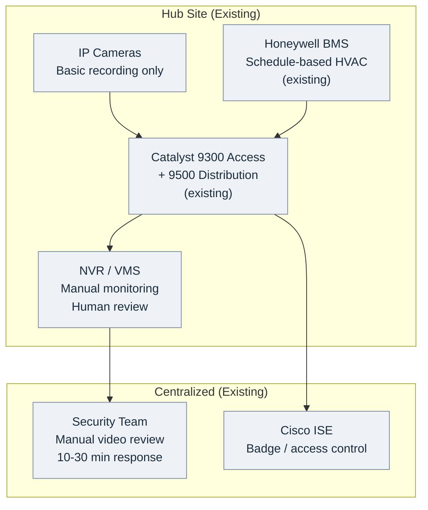
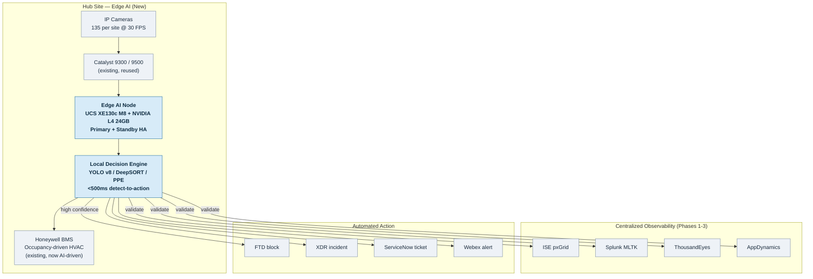

## 1.3 DEPLOYMENT SCOPE: MUMBAI + CHENNAI PILOT

Phase 4 is scoped as a **controlled pilot deployment** at two hub sites (Mumbai and Chennai) to validate the Edge AI + Observability Fusion architecture before potential expansion to branch locations. This section defines the specific sites, timeline, infrastructure components, and rationale for limiting scope to hub sites only.

---

# Deployment Scope

### 1.3.1 Site Selection Rationale

Mumbai and Chennai were selected as Phase 4 pilot sites based on four critical factors that enable comprehensive validation while managing implementation risk:

**Factor 1: Existing BMS Infrastructure (Honeywell EBI R410.1)**

Both Mumbai and Chennai hubs have mature building management systems required for Use Case 2 (Smart Building Optimization):

**Mumbai Hub - BMS Specifications:**
- Platform: Honeywell EBI R410.1 Enterprise Buildings Integrator
- Deployment: 110 zones total
  - 60 HVAC zones (conference rooms, open workspace, private offices, common areas)
  - 50 lighting zones (synchronized with HVAC zones for coordinated control)
- Sensors: 420 sensors total (PIR motion sensors, temperature sensors, CO2 sensors)
- API: OAuth 2.0 authenticated REST API (endpoint: bms.abhavtech.com/api/v2)
- Protocol: BACnet over IP (ISO 16484-5 standard)
- SGT Assignment: SGT-50 (HVAC controllers), SGT-51 (lighting controllers), SGT-52 (access control sensors)

**Chennai Hub - BMS Specifications:**
- Platform: Honeywell EBI R410.1 (identical to Mumbai for consistency)
- Deployment: 110 zones total (same distribution as Mumbai)
- Sensors: 420 sensors total (same sensor types as Mumbai)
- API: Same OAuth 2.0 REST API endpoint (multi-site BMS platform)

**Why BMS Infrastructure Matters:**

AgenticOps WF-009 workflow requires API-level control of HVAC and lighting systems to execute occupancy-based automation. Many Abhavtech branch sites have only basic HVAC controls (manual thermostats, timer-based lighting) without API integration capabilities, preventing Use Case 2 validation.

**Branch Site Comparison (BMS Infrastructure):**
- Delhi Branch: Legacy HVAC system, no API (only manual thermostats)
- Hyderabad Branch: Modern HVAC but proprietary protocol, no REST API
- Pune Branch: BACnet but no centralized controller (per-floor discrete controllers)
- **Mumbai/Chennai Hubs:** ✅ Honeywell EBI R410.1 with REST API, BACnet over IP, centralized control

**Factor 2: 24/7 Hub Operations (Continuous Data Generation)**

Hub sites support round-the-clock operations, providing continuous telemetry for AI model training and validation:

**Mumbai Hub - Operational Profile:**
- **Business Hours (08:00 - 18:00 IST):** 850+ employees, peak occupancy
- **After Hours (18:00 - 22:00 IST):** 150+ employees (global support teams for APAC/EMEA time zones)
- **Night Shift (22:00 - 08:00 IST):** 50+ employees (NOC/SOC 24/7 teams, facilities)
- **Weekend Operations:** 30+ employees (NOC/SOC skeleton crew)

**Chennai Hub - Operational Profile:**
- **Business Hours (08:00 - 18:00 IST):** 650+ employees
- **After Hours (18:00 - 22:00 IST):** 100+ employees (global support teams)
- **Night Shift (22:00 - 08:00 IST):** 40+ employees (NOC/SOC teams)
- **Weekend Operations:** 25+ employees (skeleton crew)

**Why 24/7 Operations Matter:**

Splunk MLTK occupancy prediction models require training data across all time periods (business hours, after hours, night shift, weekends) to accurately distinguish expected from anomalous patterns. Branch offices operating 08:00 - 18:00 (Monday - Friday only) provide insufficient data for robust model training, particularly for after-hours security monitoring.

**Training Data Requirements:**
- Minimum: 14 days continuous baseline (Phase 2 already collected)
- Optimal: 30 days including business holidays, weekend events, night shift operations
- Mumbai/Chennai: ✅ Full 24/7 coverage enables comprehensive model training
- Branch Sites: ❌ 8-10 hours/day coverage insufficient for night shift / weekend model training

**Factor 3: Building Size & Camera Count (Scale Validation)**

Hub sites require 120 cameras each, providing sufficient scale to validate GPU capacity, network bandwidth, and storage requirements:

**Mumbai Hub - Building Specifications:**
- Total Floor Area: 185,000 sq ft (17,200 sq m)
- Floors: 8 floors (Ground + 7 floors above)
- Employees: 850+ during business hours
- Camera Deployment: 120 cameras
  - 60 indoor fixed (Axis P3715-PLVE): Conference rooms, open workspace, hallways, lobbies
  - 30 outdoor PTZ (Axis Q6215-LE): Building perimeter, parking lot, loading dock
  - 20 4K LPR (Axis P1455-LE): Vehicle entry/exit gates, parking lot entrances
  - 10 thermal (FLIR A310f): Server room, electrical room, loading dock (fire detection)

**Chennai Hub - Building Specifications:**
- Total Floor Area: 155,000 sq ft (14,400 sq m)
- Floors: 7 floors (Ground + 6 floors above)
- Employees: 650+ during business hours
- Camera Deployment: 120 cameras (same distribution as Mumbai for consistency)

**Why Building Size Matters:**

120 cameras per site generates sufficient workload to validate edge AI server capacity planning:
- GPU Utilization: Target 70-80% (120 cameras @ 30 FPS = 3,600 frames/sec = 72 inferences/sec assuming 20ms per inference)
- Network Bandwidth: 120 cameras × 8 Mbps average = 960 Mbps (validates Catalyst 9300 capacity)
- Storage Capacity: 7-day event buffer = ~500GB (validates 2TB NVMe SSD capacity)

**Branch Site Comparison (Camera Count):**
- Delhi Branch: 50,000 sq ft, estimated 40 cameras needed
- Hyderabad Branch: 35,000 sq ft, estimated 30 cameras needed
- Pune Branch: 60,000 sq ft, estimated 50 cameras needed
- **Mumbai/Chennai Hubs:** ✅ 120 cameras per site validates full-scale deployment
- **Branch Sites:** ❌ 30-50 cameras insufficient to validate GPU capacity at target 70-80% utilization

**Factor 4: Existing Network Infrastructure (No New Switches Required)**

Both Mumbai and Chennai hubs have existing Catalyst 9300 switch infrastructure with sufficient PoE budget and uplink capacity for camera deployments:

**Mumbai Hub - Network Infrastructure:**
- Access Layer: 6× Catalyst 9300-48U switches
  - 48× 1 Gbps PoE+ ports per switch (288 ports total)
  - PoE Budget: 1,100W per switch (sufficient for 36 cameras @ 30W per camera)
  - Uplinks: 4× 10 Gbps SFP+ per switch (link aggregation to distribution layer)
- Distribution Layer: 1× Catalyst 9500-40X switch
  - 40× 10 Gbps SFP+ ports
  - Role: Inter-VLAN routing, edge AI server connectivity (2× 10 Gbps per server), WAN uplinks (2× 10 Gbps to MPLS router)

**Chennai Hub - Network Infrastructure:**
- Access Layer: 6× Catalyst 9300-48U switches (identical to Mumbai)
- Distribution Layer: 1× Catalyst 9500-40X switch (identical to Mumbai)

**Capacity Validation:**
- Camera Bandwidth: 120 cameras × 8 Mbps = 960 Mbps total
- Access Switch Capacity: 48 ports × 1 Gbps = 48 Gbps per switch
- **Utilization:** 960 Mbps / 48 Gbps = 2% per switch (ample headroom)

**Branch Site Comparison (Network Infrastructure):**
- Delhi Branch: Catalyst 3850 switches (older generation, lower PoE budget: 740W vs. 1,100W)
- Hyderabad Branch: Catalyst 9200 switches (adequate but smaller scale: 24 ports vs. 48 ports)
- Pune Branch: Mixed Catalyst 3850 + 9300 (non-uniform, complicates deployment)
- **Mumbai/Chennai Hubs:** ✅ Uniform Catalyst 9300 infrastructure, adequate PoE budget, no hardware upgrades needed
- **Branch Sites:** ⚠️ Mixed infrastructure requires site-by-site assessment, potential hardware upgrades

**Site Selection Summary Table:**

| Selection Factor | Mumbai Hub | Chennai Hub | Typical Branch Site | Decision Impact |
|------------------|------------|-------------|---------------------|-----------------|
| **BMS Infrastructure** | ✅ Honeywell EBI R410.1, 110 zones, REST API | ✅ Honeywell EBI R410.1, 110 zones, REST API | ❌ Legacy HVAC or proprietary protocol | **Hub sites enable UC2 validation** |
| **24/7 Operations** | ✅ 850 employees, NOC/SOC 24/7 | ✅ 650 employees, NOC/SOC 24/7 | ❌ 8-10 hours/day, weekdays only | **Hub sites provide 24/7 training data** |
| **Building Size** | ✅ 185,000 sq ft, 120 cameras | ✅ 155,000 sq ft, 120 cameras | ⚠️ 35,000-60,000 sq ft, 30-50 cameras | **Hub sites validate GPU capacity at scale** |
| **Network Infrastructure** | ✅ Catalyst 9300, 1,100W PoE, uniform | ✅ Catalyst 9300, 1,100W PoE, uniform | ⚠️ Mixed Catalyst 3850/9200, lower PoE | **Hub sites require no hardware upgrades** |

**Key Insight:** Mumbai and Chennai were not randomly selected - they are the **only two sites** in Abhavtech's infrastructure that satisfy all four prerequisites for Phase 4 pilot deployment. Bangalore hub (third largest site) lacks the mature BMS infrastructure required for Use Case 2 validation.

---

### 1.3.2 Deployment Timeline: 16 Weeks (4 Sub-Phases)

Phase 4 implementation follows a structured 16-week timeline divided into four sub-phases, each with specific deliverables and exit criteria:

| Sub-Phase | Duration | Deployment Location | Scope | Key Deliverables | Exit Criteria |
|-----------|----------|---------------------|-------|------------------|---------------|
| **Phase 4A:<br/>Mumbai Pilot** | Weeks 1-4<br/>(4 weeks) | Mumbai Hub only | **Pilot subset:**<br/>• 20 cameras (6 floors)<br/>• 2 edge AI servers (primary + standby)<br/>• 3 use case scenarios | ✅ Hardware installation (UCS XE9305 chassis + XE130c M8 nodes, 20 cameras)<br/>✅ OS + software stack (Ubuntu 22.04, K3s, Harbor)<br/>✅ ISE integration (SGT-95/70 assigned, SGACL validated)<br/>✅ Observability integration (Splunk/TE/AppD APIs tested)<br/>✅ 3 validation scenarios (perimeter intrusion, occupancy, PPE) | ✅ 20 cameras operational<br/>✅ 200+ AI events logged (48-hour period)<br/>✅ Latency <500ms (95th percentile, AppDynamics BT)<br/>✅ 3/3 validation scenarios passed (security team sign-off) |
| **Phase 4B:<br/>Mumbai Expansion** | Weeks 5-8<br/>(4 weeks) | Mumbai Hub only | **Full deployment:**<br/>• 100 additional cameras (120 total)<br/>• BMS integration (WF-009)<br/>• Production hardening | ✅ 100 additional cameras installed (all 8 floors covered)<br/>✅ BMS API integration (Honeywell EBI R410.1, 110 zones)<br/>✅ WF-009 deployed (observe mode, 7-day validation period)<br/>✅ HA failover tested (primary → standby, RTO <30 sec)<br/>✅ Security hardening (CIS Benchmark >95%, pen test passed)<br/>✅ ServiceNow integration (100 test events → 100 auto-tickets) | ✅ 120 cameras operational<br/>✅ 10,000+ AI events logged (14-day period)<br/>✅ WF-009 validated (7-day observe, <2% false positive rate)<br/>✅ False positive rate <5% (manual review of 200 events)<br/>✅ HA failover RTO <30 sec (measured in DR test) |
| **Phase 4C:<br/>Chennai Deployment** | Weeks 9-12<br/>(4 weeks) | Chennai Hub | **Replicate Mumbai:**<br/>• 120 cameras<br/>• 2 edge AI servers<br/>• Automated deployment (Ansible) | ✅ Automated deployment via Ansible playbook (4 hours target)<br/>✅ 120 cameras installed (7 floors)<br/>✅ BMS integration (Chennai Honeywell EBI R410.1)<br/>✅ WF-009 deployed (observe mode, 7-day validation)<br/>✅ Multi-site dashboard (Splunk global view: Mumbai + Chennai)<br/>✅ Cross-hub validation (model synchronization from NJ datacenter) | ✅ 120 cameras operational (Chennai)<br/>✅ Ansible deployment time <4 hours (vs. 12 hours manual Mumbai)<br/>✅ Multi-site dashboard operational (Splunk + PowerBI)<br/>✅ False positive rate <5% (Chennai independent validation) |
| **Phase 4D:<br/>Production Hardening** | Weeks 13-16<br/>(4 weeks) | Both Mumbai + Chennai | **Operational readiness:**<br/>• DR testing<br/>• Team training<br/>• Executive reporting | ✅ Security hardening (CIS >95% both sites, quarterly pen test)<br/>✅ DR testing (RTO <5 min, RPO <1 min, WAN outage simulation)<br/>✅ NOC training (15 engineers, 8-hour course, 80% exam pass)<br/>✅ SOC training (12 analysts, 4-hour course, 80% exam pass)<br/>✅ Facilities training (5 engineers, 2-hour BMS integration course)<br/>✅ Executive dashboard delivered (PowerBI multi-site view)<br/>✅ 5 incident response runbooks (camera offline, AI failure, HA failover, security incident, model degradation) | ✅ CIS Benchmark >95% (both sites)<br/>✅ Penetration test passed (0 critical/high findings)<br/>✅ 100% team training certification (32 staff total)<br/>✅ Executive dashboard presented to CIO/CISO<br/>✅ Production sign-off from security, network, facilities teams |

**Timeline Visualization:**

```
┌────────────────────────────────────────────────────────────────────────────────┐
│ PHASE 4: AI EDGE NETWORKING - 16-WEEK IMPLEMENTATION TIMELINE                 │
├────────────────────────────────────────────────────────────────────────────────┤
│                                                                                 │
│ Week 1-4:   [████████] Phase 4A: Mumbai Pilot                                 │
│             └─ 20 cameras, ISE/Observability integration, 3 validation tests  │
│                                                                                 │
│ Week 5-8:   [████████] Phase 4B: Mumbai Expansion                             │
│             └─ 120 cameras total, BMS/WF-009, HA testing, CIS hardening      │
│                                                                                 │
│ Week 9-12:  [████████] Phase 4C: Chennai Deployment                           │
│             └─ 120 cameras, Ansible automation, Multi-site dashboard          │
│                                                                                 │
│ Week 13-16: [████████] Phase 4D: Production Hardening                         │
│             └─ DR testing, Team training (32 staff), Executive reporting      │
│                                                                                 │
│ [█] = 1 week elapsed time                                                      │
└────────────────────────────────────────────────────────────────────────────────┘
```

**Critical Milestones:**

- **Week 4 (Phase 4A Exit):** Mumbai pilot operational with 200+ events logged, latency <500ms validated, 3 use case scenarios passed - **GO/NO-GO DECISION POINT** for Phase 4B expansion
- **Week 7 (Phase 4B Critical):** WF-009 deployed in observe mode, 7-day validation period begins (no automated HVAC control, logging only) - **DATA COLLECTION FOR WF-009 APPROVAL**
- **Week 8 (Phase 4B Exit):** Mumbai full deployment validated with 10,000+ events, false positive rate <5% confirmed - **GO/NO-GO DECISION POINT** for Chennai deployment
- **Week 12 (Phase 4C Exit):** Chennai deployment validated with Ansible automation (4 hours vs. 12 hours manual) - **AUTOMATION VALIDATED FOR FUTURE BRANCH ROLLOUT**
- **Week 16 (Phase 4D Exit):** All teams trained, executive dashboard delivered, production sign-off - **PHASE 4 COMPLETE**

**Key Insight:** The phased approach enables early risk mitigation. If Phase 4A pilot fails to meet exit criteria (latency >500ms, false positive rate >5%, validation scenarios fail), Phase 4B/4C/4D can be paused for corrective action without full-scale infrastructure investment.

---

### 1.3.3 Infrastructure Scope

Phase 4 infrastructure deployment spans edge AI servers, cameras, and software components. Network switches and BMS systems are existing infrastructure (no new hardware required).

#### Architecture: Existing State vs. After Edge AI Deployment

The diagrams below contrast the existing minimum architecture at each hub with the target architecture after Edge AI is deployed. Both reuse the existing Catalyst network and BMS; Phase 4 adds only the edge AI compute layer and camera fleet. Click any diagram to open it full-size in a new tab.

**Existing (Minimum) Architecture — before Edge AI:**



**Target Architecture — after Edge AI deployment:**



**Infrastructure Components - Complete Bill of Materials:**

| Component Category | Specification | Quantity (Mumbai) | Quantity (Chennai) | Total Pilot | Unit Cost (Est.) | Total Cost (Est.) |
|--------------------|---------------|-------------------|--------------------| ------------|------------------|-------------------|
| **Edge AI Compute** | Cisco UCS XE130c M8 Compute Node (in UCS XE9305 Chassis)<br/>• CPU: Intel Xeon 6 SoC (32-core)<br/>• RAM: 128GB DDR5 ECC<br/>• GPU: NVIDIA L4 24GB GDDR6 (1× per node)<br/>• Storage: 2× E3.S NVMe SSD 1TB (2TB total, event database)<br/>• Network: Embedded 25G fabric<br/>• Power: 350W per node (peak 400W) | 2 (Primary + Standby HA) | 2 (Primary + Standby HA) | 4 nodes (2 chassis) | — | — |
| **Cameras - Indoor Fixed** | Axis P3715-PLVE Multi-Directional<br/>• Resolution: 4× 1080p sensors (panoramic view)<br/>• Frame Rate: 30 FPS<br/>• Codec: H.264/H.265 adaptive bitrate (4-8 Mbps)<br/>• PoE: 802.3at (25W typical, 30W max)<br/>• FOV: 360° coverage (ceiling-mount) | 60 | 60 | 120 | $1,200 | $144,000 |
| **Cameras - Outdoor PTZ** | Axis Q6215-LE PTZ Dome<br/>• Resolution: 1080p<br/>• Frame Rate: 30 FPS<br/>• Zoom: 32× optical zoom<br/>• PoE: 802.3at (30W, PoE+ required)<br/>• IP Rating: IP66 (weatherproof)<br/>• IR Range: 200m night vision | 30 | 30 | 60 | $2,500 | $150,000 |
| **Cameras - 4K LPR** | Axis P1455-LE License Plate Recognition<br/>• Resolution: 4K (3840×2160)<br/>• Frame Rate: 30 FPS<br/>• IR Illumination: 940nm (covert IR, no visible glow)<br/>• PoE: 802.3at (30W)<br/>• LPR Software: Built-in OCR | 20 | 20 | 40 | $3,000 | $120,000 |
| **Cameras - Thermal** | FLIR A310f Thermal Imaging<br/>• Resolution: 320×240 thermal pixels<br/>• Frame Rate: 9 FPS (thermal limitation)<br/>• Temperature Range: -20°C to +350°C<br/>• PoE: 802.3af (15W)<br/>• Use Case: Fire detection (>60°C threshold) | 10 | 10 | 20 | $8,000 | $160,000 |
| **Software Licenses** | • K8s (K3s lightweight Kubernetes): Open-source, no licensing<br/>• Harbor container registry: Open-source, no licensing<br/>• AI models (YOLO v8, DeepSORT, PPE detector, LPR OCR): Trained in-house, no licensing<br/>• Ubuntu 22.04 LTS: Open-source, no licensing | - | - | - | $0 | $0 |
| **Network Switches** | Catalyst 9300-48U (existing infrastructure)<br/>• 48× 1 Gbps PoE+ ports<br/>• 1,100W PoE budget per switch<br/>• 4× 10 Gbps SFP+ uplinks | 6 (existing) | 6 (existing) | **0 new switches** | - | **$0** |
| **BMS Infrastructure** | Honeywell EBI R410.1 (existing infrastructure)<br/>• 110 zones per site (60 HVAC, 50 lighting)<br/>• REST API: bms.abhavtech.com/api/v2<br/>• BACnet over IP integration | 1 (existing) | 1 (existing) | **0 new BMS** | - | **$0** |
| | | | | **TOTAL:** | | **$646,000** |

**Key Infrastructure Insights:**

1. **No New Network Switches Required:** Existing Catalyst 9300 infrastructure at Mumbai and Chennai has sufficient PoE budget (1,100W per switch) and uplink capacity (4× 10 Gbps) for camera deployments. This avoids $120,000 - $180,000 in additional network hardware costs.

2. **No New BMS Required:** Existing Honeywell EBI R410.1 systems at both sites have REST API integration capabilities. Only software integration (OAuth 2.0 API client) is required, avoiding $200,000 - $300,000 in new BMS hardware/installation costs.

3. **Open-Source Software Stack:** K3s (Kubernetes), Harbor (container registry), Ubuntu 22.04 LTS are open-source, avoiding $50,000 - $100,000 in commercial software licensing fees.

4. **HA Architecture:** 2 edge AI servers per site (primary + standby) provide active-passive high availability with RTO <30 seconds. Additional $36,000 investment (2 servers vs. 1 per site) ensures business continuity during hardware failures.

**Total Pilot Investment:** $646,000 for Mumbai + Chennai pilot deployment (4 servers, 240 cameras, software integration)

**Future Branch Expansion Estimate:** 6 branches × (40 cameras average + 1 server per branch, no HA) = ~$240,000 additional investment (not part of Phase 4 scope)

---

### 1.3.4 Branch Sites NOT Included in Phase 4

Abhavtech's 15 branch locations are **explicitly excluded** from Phase 4 scope. This exclusion is strategic, not arbitrary, based on three critical constraints:

**Constraint 1: Pilot Validation Requirement**

Mumbai and Chennai must achieve all exit criteria before branch expansion:
- ✅ 10,000+ events logged over 14 days (both sites)
- ✅ False positive rate <5% (manual review validation)
- ✅ Energy savings 15-20% (30-day BMS log validation)
- ✅ HA failover RTO <5 minutes (DR test validation)
- ✅ CIS Benchmark >95%, penetration test passed (security validation)

**Risk:** Deploying unproven architecture to 15 branch sites simultaneously would multiply risk by 15×. If pilot reveals technical issues (GPU capacity insufficient, network latency exceeds targets, false positive rate >5%), remediation requires visiting 15 sites vs. 2 sites.

**Constraint 2: Limited BMS Infrastructure (Use Case 2 Not Feasible)**

Most branch sites lack comprehensive building management systems:

| Branch Site | BMS Status | API Integration | Use Case 2 Feasibility |
|-------------|-----------|-----------------|------------------------|
| Delhi | Legacy HVAC (manual thermostats only) | ❌ No API | ❌ UC2 not feasible |
| Hyderabad | Modern HVAC (Trane Tracer system) | ⚠️ Proprietary protocol, no REST API | ❌ UC2 not feasible |
| Pune | BACnet HVAC (per-floor controllers) | ⚠️ No centralized controller | ⚠️ UC2 limited (per-floor only) |
| Kolkata | Legacy HVAC | ❌ No API | ❌ UC2 not feasible |
| Ahmedabad | Modern HVAC | ⚠️ Proprietary protocol | ❌ UC2 not feasible |
| Jaipur | Legacy HVAC | ❌ No API | ❌ UC2 not feasible |

**Impact:** Without BMS API integration, branch sites can validate only Use Case 1 (Physical Security) and Use Case 3 (Safety Compliance). Use Case 2 (Smart Building Optimization), which delivers 15-20% energy savings, cannot be validated at branches.

**Constraint 3: Smaller Scale (Insufficient GPU Validation)**

Branch sites require 30-50 cameras (vs. 120 at hubs), insufficient to validate GPU capacity at target 70-80% utilization:

**GPU Utilization Calculation:**
- NVIDIA L4 24GB GPU capacity: ~100 batch-inferences/second at the deployed model mix (20ms per batch inference, 120 TOPS INT8, running YOLO v8n + DeepSORT + PPE/LPR pipelines)
- 120 cameras @ 30 FPS = 3,600 frames/sec → Edge AI processes every 3rd frame (bandwidth/processing optimization) = 1,200 frames/sec → GPU processes batches of 16 frames ≈ 75 batch-inferences/sec = **~75% GPU utilization** ✅ Target met (UC1 security workload; rises to 80-95% with UC2 + UC3 sharing the same GPU)
- 40 cameras @ 30 FPS = 1,200 frames/sec → Process every 3rd frame = 400 frames/sec → Batches of 16 ≈ 25 batch-inferences/sec = **~25% GPU utilization** ❌ Under-utilized, does not validate capacity planning

**Risk:** If Phase 4 validated with only 40 cameras (branch scale), GPU capacity issues might emerge only after deploying to Mumbai/Chennai hub scale (120 cameras), requiring costly hardware upgrades post-deployment.

**Branch Site Exclusion Summary:**

| Exclusion Factor | Impact | Risk if Included in Phase 4 |
|------------------|--------|------------------------------|
| **Unproven Architecture** | Pilot validation incomplete | 15× risk multiplication (remediation requires visiting 15 sites vs. 2 sites) |
| **Limited BMS Infrastructure** | Use Case 2 not feasible at most branches | Cannot validate energy savings (15-20% target), incomplete use case coverage |
| **Smaller Scale** | 30-50 cameras insufficient | GPU capacity planning not validated, risk of hardware under-sizing or over-sizing |
| **Mixed Network Infrastructure** | Catalyst 3850/9200/9300 varied by site | Deployment complexity increases, site-by-site validation required |

**Future Phase 5 Consideration:**

After successful Phase 4 pilot validation (Week 16 exit criteria met), Abhavtech will assess branch site deployment:

**Potential Phase 5 Scope (Future, Not Committed):**
- **Target Sites:** 6 branches (Delhi, Hyderabad, Pune, Manchester, Munich, Dallas)
- **Estimated Scale:** 40 cameras per branch × 6 sites = 240 cameras total
- **Infrastructure:** 6× UCS XE130c M8 nodes (1 per branch, no HA due to cost constraints)
- **Use Cases:** UC1 (Physical Security) and UC3 (Safety Compliance) only - UC2 (Smart Building) excluded due to BMS limitations
- **Timeline:** 8-10 weeks (Ansible automation validated in Phase 4C enables faster deployment)
- **Investment:** ~$240,000 (40 cameras @ ~$1,500 average + 1 server @ $18,000 per site)

**Go/No-Go Decision for Phase 5:** Dependent on Phase 4 achieving all exit criteria by Week 16, executive steering committee approval, and budget allocation for FY2026.

---

*Next: Section 1.4 - Three Use Cases & Business Value*