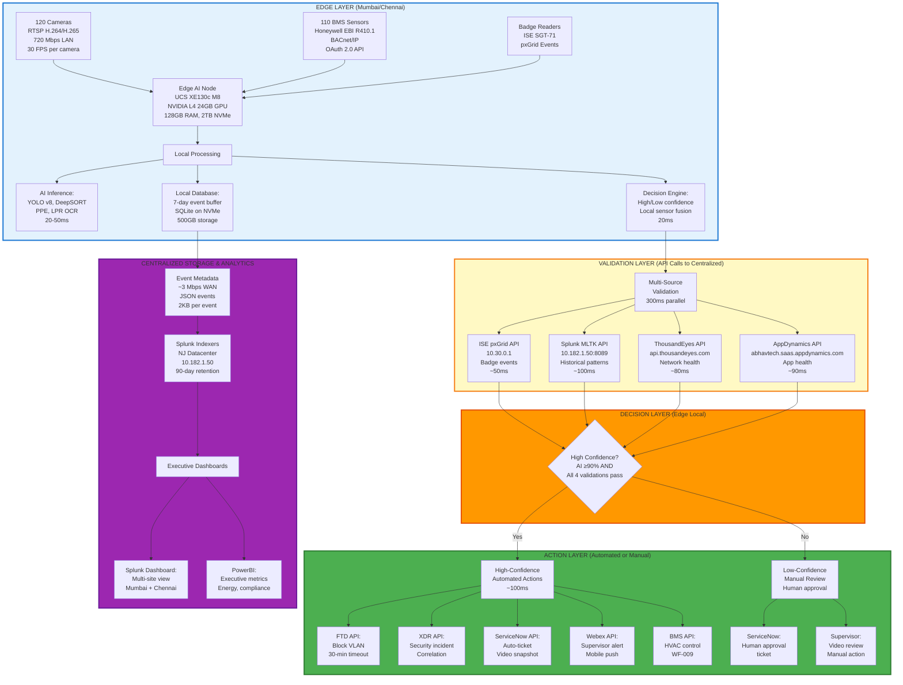
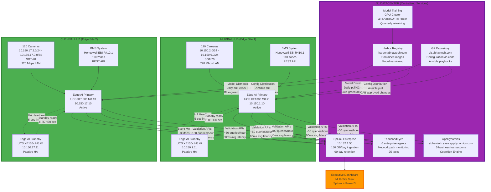

## 1.5 ARCHITECTURE PHILOSOPHY: DISTRIBUTED INTELLIGENCE + CENTRALIZED WISDOM

The core architectural principle underlying Phase 4 is **distributed intelligence at the edge + centralized wisdom at the hub**. This section articulates what processing occurs at edge sites (Mumbai, Chennai) versus what occurs centrally (NJ datacenter), and why this hybrid approach is optimal for Abhavtech's requirements.

---

# Document Roadmap & Structure

### 1.5.1 Edge vs. Centralized: Capability Distribution

Not all AI and observability capabilities belong at the edge. Abhavtech's architecture distributes capabilities based on three criteria: **latency sensitivity**, **resource requirements**, and **data locality**.

**Capability Distribution Table:**

| Capability | Edge (Mumbai/Chennai) | Centralized (NJ Datacenter) | Rationale |
|------------|----------------------|----------------------------|-----------|
| **AI Inference** | ✅ **Real-time inference**<br/>• YOLO v8 object detection<br/>• DeepSORT multi-object tracking<br/>• PPE detection (custom CNN)<br/>• LPR OCR (Tesseract + custom CNN)<br/>• Latency: 20-50ms per frame | ❌ Not performed centrally | **Latency sensitivity:** Safety use cases require <500ms response time, cannot tolerate 150ms+ WAN latency |
| **Event Storage** | ✅ **7-day buffer**<br/>• SQLite database on 2TB NVMe SSD<br/>• Event metadata + video snapshots<br/>• Purpose: Fast local access, WAN outage resilience | ✅ **90-day long-term archive**<br/>• Splunk indexers (10.182.1.50)<br/>• Event metadata only (no video)<br/>• Purpose: Compliance, audit trail, executive analytics | **Data locality + compliance:** Edge stores for operational speed, centralized stores for regulatory compliance (90-day retention) |
| **Model Training** | ❌ **Not feasible at edge**<br/>• L4 GPU: 24GB memory (insufficient for training)<br/>• Training dataset: 50,000+ images (100GB+)<br/>• Training time: 24-48 hours (edge server needed for inference during training) | ✅ **Centralized GPU cluster**<br/>• 4× NVIDIA A100 80GB GPUs<br/>• Distributed training framework (Horovod)<br/>• Quarterly retraining schedule<br/>• Model versioning (Harbor registry) | **Resource requirements:** Model training requires 80GB+ GPU memory, multi-GPU distributed training for 24-48 hour sessions |
| **Model Deployment** | ✅ **Blue-green deployment**<br/>• K3s Kubernetes cluster pulls from Harbor<br/>• Blue-green strategy: New model deployed to standby server, validated 7 days (shadow mode), promoted to primary<br/>• Rollback capability: Revert to previous model version within 5 minutes | ✅ **Centralized model registry**<br/>• Harbor container registry (harbor.abhavtech.com)<br/>• Model versioning (yolo-v8:v1.2.3, ppe-detector:v2.1.0)<br/>• A/B testing framework<br/>• Distribution to all edge sites (Mumbai, Chennai, future branches) | **Hybrid:** Centralized registry ensures consistent versions across sites, edge K8s enables local deployment without WAN dependency |
| **Multi-Source Validation** | ⚠️ **Limited (local sensor fusion only)**<br/>• Camera + BMS sensor fusion<br/>• Local decision engine (high vs. low confidence)<br/>• Can operate in degraded mode during WAN outage | ✅ **Complex cross-platform correlation**<br/>• Splunk MLTK (historical patterns, 14+ days baseline)<br/>• ThousandEyes (network path quality)<br/>• AppDynamics (application health)<br/>• ISE pxGrid (badge events, 5-minute lookback)<br/>• Cross-use case correlation (security + HVAC + safety) | **Resource requirements + data lake:** Historical pattern analysis requires 14+ days of centralized data (150 GB/day Splunk ingestion), cross-platform APIs (TE, AppD, ISE) |
| **Dashboards** | ✅ **Operational metrics (local)**<br/>• Edge AI health: GPU utilization, inference latency, camera status<br/>• Target audience: NOC team, troubleshooting<br/>• Update frequency: 10-second intervals | ✅ **Executive dashboards (global)**<br/>• Splunk multi-site dashboard: Mumbai + Chennai + future sites<br/>• PowerBI executive view: Energy savings, false positive trends, compliance metrics<br/>• Target audience: CIO, CISO, Facilities Director<br/>• Update frequency: Daily rollups | **Audience + scope:** Edge dashboards for real-time ops, centralized dashboards for strategic decision-making across all sites |
| **Configuration Management** | ✅ **Ansible playbook execution**<br/>• Pull from Git repository (git.abhavtech.com/edge-ai)<br/>• Local execution (Ansible localhost)<br/>• Change approval: CAB approval required for production changes | ✅ **Git repository (version control)**<br/>• Configuration as code (Ansible playbooks, K8s manifests)<br/>• Change review workflow (Pull Request → CAB → Merge → Deploy)<br/>• Audit trail: All changes logged in Git history | **Hybrid:** Centralized Git ensures consistency and change control, edge Ansible enables autonomous deployment during WAN outages |
| **Alerting** | ✅ **High-confidence automated actions**<br/>• FTD network block (perimeter intrusion)<br/>• ServiceNow auto-ticket (PPE violation)<br/>• Webex supervisor notification (all use cases)<br/>• Latency: <500ms from detection to alert | ⚠️ **Complex correlation alerts**<br/>• Splunk correlation searches (multi-site anomaly detection)<br/>• AppDynamics business transaction alerts (global application health)<br/>• ThousandEyes alert rules (WAN path degradation affecting multiple sites) | **Complexity + scope:** Edge handles latency-sensitive single-site alerts, centralized handles complex cross-site correlation alerts |

**Key Architectural Insights:**

1. **Edge Handles Latency-Sensitive Operations:** AI inference (20ms), multi-source validation API calls (300ms), automated actions (<500ms total) all occur at edge to meet safety-critical response time requirements.

2. **Centralized Handles Resource-Intensive Operations:** Model training (24-48 hours, 4× A100 GPUs), historical pattern analysis (Splunk MLTK queries across 150 GB/day × 14+ days = 2.1 TB dataset), executive dashboards (multi-site aggregation).

3. **Hybrid Approach for Resilience:** Configuration in Git (centralized version control) but deployed via Ansible (edge autonomous execution). Models in Harbor (centralized distribution) but running in K8s (edge autonomous operation). This ensures edge sites continue operating during WAN outages with last-known-good configuration and models.

---

### 1.5.2 Data Flow Architecture: Sensor → Edge AI → Observability → Action

The following diagram illustrates the complete end-to-end data flow from camera capture to automated action, showing how edge AI and centralized observability platforms work together:



**Data Flow Step-by-Step Explanation:**

**Step 1: Edge Data Acquisition (0ms - 33ms)**
- 120 cameras generate 30 FPS video streams (3,600 frames/second total)
- 110 BMS sensors provide temperature, occupancy (PIR), lighting state via BACnet/IP API
- Badge readers publish authentication events to ISE pxGrid (real-time WebSocket subscription)
- Edge AI server receives RTSP streams (H.264/H.265, 720 Mbps aggregate LAN bandwidth)

**Step 2: Edge AI Inference (33ms - 53ms)**
- GPU processes video frames: YOLO v8 object detection (20ms), DeepSORT tracking (5ms), PPE detection (15ms), LPR OCR (100ms for plate reads)
- CPU processes BMS sensor data: Occupancy aggregation per zone, temperature readings
- SQLite database: Store event metadata locally (7-day buffer, 500GB capacity)

**Step 3: Local Decision Engine (53ms - 73ms)**
- Compare AI confidence (90% threshold for high-confidence path)
- Local sensor fusion: Camera person count + BMS PIR occupancy state
- Check duplicate events (debounce: ignore if same event in last 60 seconds)
- Route decision: High confidence → Multi-source validation, Low confidence → Manual review

**Step 4: Multi-Source Validation (73ms - 373ms)**
- Launch 4 parallel API calls to centralized platforms:
  - ISE pxGrid: Query badge swipes in last 5 minutes (~50ms)
  - Splunk MLTK: Query historical occupancy patterns (~100ms)
  - ThousandEyes: Query camera network path quality (~80ms)
  - AppDynamics: Query RTSP application health (~90ms)
- Total validation time: max(50, 100, 80, 90) = 100ms (parallel execution)
- WAN latency: ~200ms roundtrip (Mumbai → NJ → Mumbai) for Splunk query

**Step 5: Decision Logic (373ms - 393ms)**
- Analyze all 4 validation results
- High confidence criteria: AI ≥90% AND all 4 validations pass
- Low confidence triggers: Any validation fails, or AI confidence 70-90% (borderline)

**Step 6A: High-Confidence Automated Actions (393ms - 493ms)**
- Launch 5 parallel automated actions:
  - FTD REST API: Create block rule for VLAN (50ms)
  - XDR SecureX API: Create security incident (40ms)
  - ServiceNow API: Create incident ticket with video snapshot (60ms)
  - Webex Teams API: Send supervisor mobile push notification (80ms)
  - BMS API: HVAC setpoint adjustment (WF-009, 90ms)
- Total action time: max(50, 40, 60, 80, 90) = 90ms (parallel execution)

**Step 6B: Low-Confidence Manual Review (No fixed timeline)**
- ServiceNow ticket created with "human approval required" flag
- Supervisor receives Webex notification: "Review required for camera 47 detection"
- Supervisor logs into VMS (Video Management System), reviews 30-second video clip
- Supervisor decides: Real threat → Manually trigger FTD block, or False positive → Dismiss ticket

**Step 7: Centralized Storage & Analytics (Continuous background process)**
- Edge AI exports event metadata to Splunk HEC (10.182.1.50:8088) every 5 minutes
- Metadata includes: Camera ID, timestamp, AI confidence, object class, validation results, action taken
- Bandwidth: ~3 Mbps WAN (JSON events 2KB each, 100-500 events/hour per site)
- Splunk retention: 90 days (compliance requirement), no video stored centrally (only metadata)
- Executive dashboards: Splunk dashboard refreshes hourly, PowerBI dashboard refreshes daily

**Performance Metrics by Layer:**

| Layer | Processing Time | Latency Impact | Bandwidth |
|-------|----------------|----------------|-----------|
| **Edge Data Acquisition** | 0-33ms (1 frame @ 30 FPS) | None (local LAN) | 720 Mbps LAN (stays local) |
| **Edge AI Inference** | 20-50ms (GPU processing) | None (local compute) | 0 Mbps WAN |
| **Local Decision Engine** | 20ms (CPU logic) | None (local compute) | 0 Mbps WAN |
| **Multi-Source Validation** | 300ms (parallel APIs) | **200ms WAN roundtrip** (Splunk query NJ) | Negligible (~1 KB per API query) |
| **Automated Actions** | 100ms (parallel APIs) | Variable (FTD local ~50ms, ServiceNow NJ ~150ms roundtrip) | Negligible (~5 KB per action) |
| **Event Metadata Export** | Background (every 5 min) | None (async export) | ~3 Mbps sustained WAN |
| **TOTAL END-TO-END** | **<500ms (95th percentile)** | **~200ms WAN component** | **~3 Mbps sustained WAN** |

**Key Insight:** The 500ms end-to-end latency breaks down as: 20% edge AI inference + 5% local decision + 60% multi-source validation (includes 200ms WAN latency) + 15% automated actions. The WAN latency component (200ms) is unavoidable for centralized validation but acceptable within 500ms SLA. Centralized AI approach would add 300ms+ additional WAN latency (video streams egress) exceeding 500ms SLA.

---

### 1.5.3 Multi-Site Architecture: Mumbai + Chennai + NJ Coordination

Abhavtech's Phase 4 architecture supports two edge sites (Mumbai, Chennai) coordinated by centralized services at NJ datacenter, with designed-in scalability for future branch site expansion.

**Multi-Site Architecture Diagram:**



**Multi-Site Coordination Details:**

**Model Distribution (Centralized Training → Edge Deployment):**

1. **Quarterly Model Retraining (NJ Datacenter):**
   - Dataset preparation: Aggregate false positives from Mumbai + Chennai (collected over previous 3 months)
   - Training: 24-48 hours on 4× A100 GPU cluster (Horovod distributed training)
   - Validation: Test accuracy on hold-out dataset (20% of total dataset)
   - Optimization: Quantization FP32 → INT8 (TensorRT), model size reduced 4× (2GB → 500MB)
   - Registry: Push to Harbor (harbor.abhavtech.com/edge-ai/yolo-v8:v1.3.0)

2. **Model Deployment (Edge Sites Pull from Registry):**
   - Schedule: Daily at 02:00 IST (low-traffic period)
   - Mechanism: K3s ImagePullPolicy "IfNotPresent" + manual trigger for new versions
   - Blue-Green Strategy:
     - Day 1: Deploy new model (yolo-v8:v1.3.0) to standby server (Mumbai: 10.150.1.11, Chennai: 10.150.17.11)
     - Days 2-7: Shadow mode validation (standby server processes same frames as primary, logs predictions for comparison, no actions taken)
     - Day 8: If validation successful (accuracy ≥ primary, false positive rate ≤ primary) → Promote standby to primary (DNS/VIP switchover)
     - Day 8: Former primary becomes new standby (retains v1.2.3 for rollback if needed)

**Configuration Distribution (Centralized Git → Edge Ansible):**

1. **Change Management (NJ Datacenter):**
   - Engineers commit configuration changes to Git (git.abhavtech.com/edge-ai)
   - Pull Request created with change justification, impact assessment, rollback plan
   - CAB (Change Advisory Board) reviews Pull Request: Security review, network review, approver sign-off
   - After CAB approval: Merge to main branch (triggers deployment workflow)

2. **Ansible Deployment (Edge Sites Pull from Git):**
   - Schedule: On-demand (after CAB approval) or daily at 03:00 IST (low-traffic period)
   - Mechanism: Edge AI servers run `ansible-pull` (pull model, not push from central)
   - Playbook execution: Update K8s manifests, restart affected containers, validate health checks
   - Rollback: Git revert + re-run ansible-pull (5-minute rollback time)

**Event Metadata Aggregation (Edge → Centralized Splunk):**

1. **Edge Export (Every 5 Minutes):**
   - Edge AI server batches last 5 minutes of events (typically 10-50 events per batch)
   - HTTP POST to Splunk HEC (10.182.1.50:8088/services/collector/event)
   - Payload: JSON array of events (camera_id, timestamp, ai_confidence, object_class, validation_results, action_taken)
   - Bandwidth: ~3 Mbps sustained (2KB per event, 100-500 events/hour)

2. **Centralized Storage (Splunk Indexers):**
   - Index: `index=edge_ai` (dedicated index for edge AI events)
   - Retention: 90 days (compliance requirement: ISO 27001, SOC 2, India Factory Act)
   - Search: Sub-second queries for multi-site correlation (e.g., "Show all perimeter intrusion events across Mumbai + Chennai in last 24 hours")

**Multi-Site Validation APIs (Edge → Centralized Platforms):**

Edge sites query centralized platforms for validation:
- **Splunk MLTK:** Mumbai sends ~100 queries/hour, Chennai sends ~100 queries/hour (200 total queries/hour to Splunk REST API)
- **ThousandEyes:** Mumbai sends ~50 queries/hour, Chennai sends ~50 queries/hour (100 total queries/hour to TE API)
- **AppDynamics:** Mumbai sends ~50 queries/hour, Chennai sends ~50 queries/hour (100 total queries/hour to AppD API)
- **Total API Load:** ~400 queries/hour to centralized platforms (minimal load, well within platform capacity)

**Inter-Site Coordination (What Does NOT Happen):**

**No Inter-Site Failover:**
- Mumbai primary fails → Mumbai standby takes over ✅ (intra-site HA)
- Mumbai primary AND standby fail → Chennai does NOT take over Mumbai's cameras ❌ (no inter-site failover)
- Rationale: 720 Mbps camera traffic cannot traverse WAN (Mumbai → Chennai would require 720 Mbps MPLS circuit, cost-prohibitive)

**No Cross-Site Model Synchronization:**
- Mumbai and Chennai pull models independently from Harbor registry
- No direct model synchronization Mumbai ↔ Chennai
- If WAN outage prevents Harbor access, edge sites continue with last-known-good model (7-day local cache)

**No Cross-Site Real-Time Correlation:**
- Security events at Mumbai do not trigger actions at Chennai (sites operate independently)
- Cross-site correlation occurs only in Splunk (post-event analysis for executive dashboards)
- Example: If same threat actor targets Mumbai perimeter at 14:00 and Chennai perimeter at 15:00, Splunk correlation search detects pattern but does NOT proactively alert Chennai in real-time

**Multi-Site Scalability (Future Phase 5):**

The architecture is designed for future expansion to branch sites:
- **Current:** 2 edge sites (Mumbai, Chennai) = 240 cameras, 4 servers
- **Phase 5 Target:** 6 branch sites (Delhi, Hyderabad, Pune, Manchester, Munich, Dallas) = 240 additional cameras, 6 additional servers
- **Scalability Validation:** Centralized platforms (Splunk, Harbor, Git) handle 2 sites today, can scale to 8 sites (4× capacity) with existing infrastructure
- **API Load Scaling:** 400 queries/hour (2 sites) → 1,600 queries/hour (8 sites) = Still well within platform capacity (Splunk handles 10,000+ queries/hour, TE/AppD SaaS auto-scale)

---

**KEY TAKEAWAYS FROM SECTION 1.5:**

```
┌────────────────────────────────────────────────────────────────────────┐
│ ARCHITECTURE PHILOSOPHY SUMMARY                                        │
├────────────────────────────────────────────────────────────────────────┤
│                                                                         │
│ ✅ DISTRIBUTED INTELLIGENCE (Edge: Mumbai, Chennai)                    │
│    • Real-time AI inference (20-50ms, latency-sensitive)              │
│    • Local decision engine (high/low confidence routing)               │
│    • 7-day event buffer (WAN outage resilience)                       │
│    • Autonomous operation (continues during WAN outage)                │
│                                                                         │
│ ✅ CENTRALIZED WISDOM (Hub: NJ Datacenter)                             │
│    • Model training (24-48 hours, 4× A100 GPUs)                       │
│    • Historical pattern validation (Splunk MLTK, 14+ days baseline)   │
│    • Multi-site coordination (Harbor, Git, Splunk aggregation)        │
│    • Executive analytics (multi-site dashboards, compliance reports)   │
│                                                                         │
│ ✅ HYBRID RESILIENCE                                                    │
│    • Configuration: Centralized Git + Edge Ansible (autonomous pull)  │
│    • Models: Centralized Harbor + Edge K8s (7-day local cache)        │
│    • Data: Edge 7-day buffer + Centralized 90-day archive             │
│    • WAN Outage: Edge continues inference, validation suspended       │
│                                                                         │
│ ✅ MULTI-SITE SCALABILITY                                               │
│    • Current: 2 sites (240 cameras, 4 servers)                        │
│    • Phase 5: 8 sites target (720 cameras, 14 servers)                │
│    • Centralized platforms scale 4× with existing infrastructure      │
│                                                                         │
└────────────────────────────────────────────────────────────────────────┘
```

---

---

## Chapter 1 Summary

Chapter 1 establishes the business context, strategic objectives, and architectural philosophy for Abhavtech's edge AI deployment across the Mumbai and Chennai hub sites.

**Sections in this chapter:**

- Section 1.1: Business Context & Strategic Objectives
- Section 1.2: Edge AI + Observability Fusion
- Section 1.3: Deployment Scope: Mumbai + Chennai Pilot
- Section 1.4: Three Use Cases & Business Value
- Section 1.5: Architecture Philosophy

**Key content delivered in Chapter 1:**

- 8 reference tables covering infrastructure foundation, success criteria, deployment timeline, BOM, capability distribution, use case metrics, and data flow performance
- 5 architecture diagrams (digital transformation journey, 5-layer validation, multi-source validation comparison, data flow architecture, multi-site architecture)
- 6 real-world scenarios with exact timing (traditional edge AI failure at 13 minutes, Abhavtech success at 500ms, WF-009 execution, PPE detection at 35 seconds)
- Complete API integration procedures (ISE pxGrid, Splunk MLTK, ThousandEyes, AppDynamics, BMS, FTD, XDR, ServiceNow, Webex)
- Quantified improvements: 3-6× false positive reduction, 20-60× MTTR improvement, and 640× bandwidth reduction versus centralized AI
