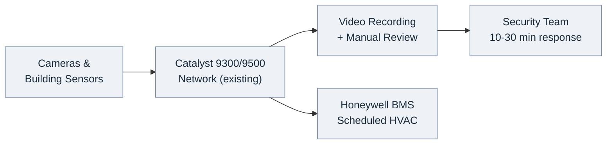
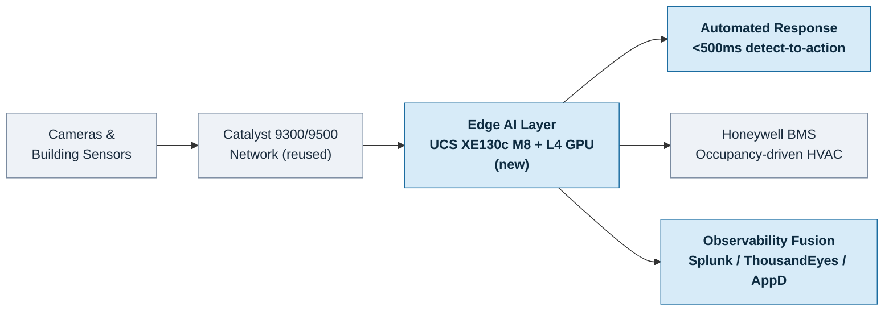

# Edge AI Networking Architecture

AI-Assisted Documentation

**Abhavtech Phase 4 - Edge AI Deployment**

Welcome to the comprehensive technical documentation for Abhavtech's Edge AI networking architecture. This documentation covers the deployment of distributed AI inference at Mumbai and Chennai hub sites, featuring industry-first **Edge AI + Observability Fusion** architecture.

---

## What is Edge AI + Observability Fusion?

Unlike traditional edge AI deployments that operate in isolation, Abhavtech's architecture integrates edge AI inference with centralized observability platforms (Splunk MLTK, ThousandEyes, AppDynamics) to enable:

- **High-confidence automated decisions** (<5% false positive rate vs. 15-30% traditional edge AI)
- **Multi-source validation** (AI + ISE + BMS + historical patterns)
- **Real-time response** (<500ms detection-to-action vs. 10-30 minutes manual review)
- **Privacy-first design** (no video egress to cloud, no facial recognition)

---

## Quick Navigation

### [Chapter 1: Executive Summary & Edge AI Vision](chapter-1/README.md)
Strategic overview, business context, and deployment scope for Mumbai and Chennai hub sites.

### [Chapter 2: Use Case Architecture](chapter-2/README.md)
Detailed architecture for three core use cases: physical security, building automation, and safety compliance.

### [Chapter 3: Platform Architecture](chapter-3/README.md)
Complete platform design including multi-layer architecture, AI model pipeline, and multi-site synchronization.

### [Chapter 4: Integration Architecture](chapter-4/README.md)
Integration specifications for 9 observability and security platforms.

### [Appendices](appendices/README.md)
Project summary, hardware specifications, and reference materials.

---

## Key Differentiators

✅ **Edge AI + Observability Fusion** - Multi-source validation for high-confidence decisions  
✅ **AgenticOps WF-009** - Automated actions with comprehensive guardrails  
✅ **Zero Trust Foundation** - SGT-95 isolation, MACsec encryption, ISE integration  
✅ **Privacy-First** - No facial recognition, no video egress to cloud  
✅ **Production-Ready** - Built on Phases 1-3 infrastructure (Zero Trust, Observability, AI-Ready Network)

---

## Deployment Overview

| Site | Edge AI Nodes | Cameras | Use Cases | Timeline |
|------|---------------|---------|-----------|----------|
| **Mumbai** | 2 (Primary + Standby) | 135 | UC1 + UC2 + UC3 | Weeks 1-8 |
| **Chennai** | 2 (Primary + Standby) | 135 | UC1 + UC2 + UC3 | Weeks 9-12 |
| **Total** | 4 nodes | 270 cameras | 3 use cases | 16 weeks |

**Platform:** Cisco UCS XE9305 + XE130c M8 + NVIDIA L4 24GB GPU  
**Network:** Catalyst 9300/9500 with SD-Access fabric  
**Integration:** ISE, Splunk, ThousandEyes, AppDynamics, BMS, FTD, XDR, ServiceNow

### Architecture at a Glance

Abhavtech's existing hub sites run cameras and building systems on a Catalyst network, with security handled by manual video review and HVAC on fixed schedules. Phase 4 adds one new layer — Edge AI compute — that reuses all of the existing network and building infrastructure. Click either diagram to open it full-size.

**Before — Existing Infrastructure:**

**After — With Edge AI:**

---

## Documentation Scope & Roadmap

This documentation covers the **Design & Architecture** phase of the Edge AI deployment (Chapters 1–4), which is complete and validated:

- **Chapter 1** — Executive summary, business context, and deployment scope
- **Chapter 2** — Use case architecture (physical security, building automation, safety & compliance)
- **Chapter 3** — Edge AI platform architecture (multi-layer design, AI model pipeline, multi-site model)
- **Chapter 4** — Integration architecture across nine observability and security platforms

The following content is planned for subsequent phases and is not yet included:

- **Implementation Roadmap** — Week-by-week deployment plan (Mumbai pilot, Chennai rollout, production hardening)
- **Operations & Monitoring** — Runbooks, alerting tiers, and troubleshooting procedures
- **Security Deep-Dive** — Threat model, SGACL micro-segmentation, and compliance mapping (GDPR, SOC 2)
- **Reference Appendices** — ISE/BMS configuration, AgenticOps WF-009 YAML, Splunk dashboards, and model-training detail

This scoping reflects a deliberate sequencing: architecture and design are finalized first, with detailed implementation and operations content to follow.

---

## About This Documentation

This technical documentation was developed with **Claude AI assistance** to demonstrate enterprise-grade documentation for complex network and AI infrastructure projects. All content is transparently marked as AI-assisted and based on production-grade architecture patterns.

**Documentation Framework:** MkDocs Material  
**Version:** 1.0 (April 2026)  
**Author:** Raj Mohan, Principal Consultant - Unified Communications & Contact Center Solutions

For questions or feedback: [abhavtech.com](https://abhavtech.com)
