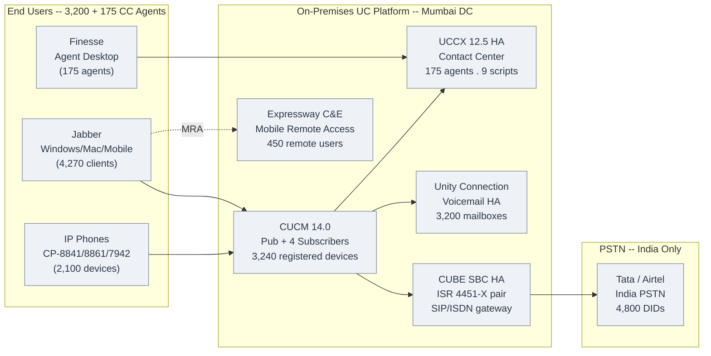
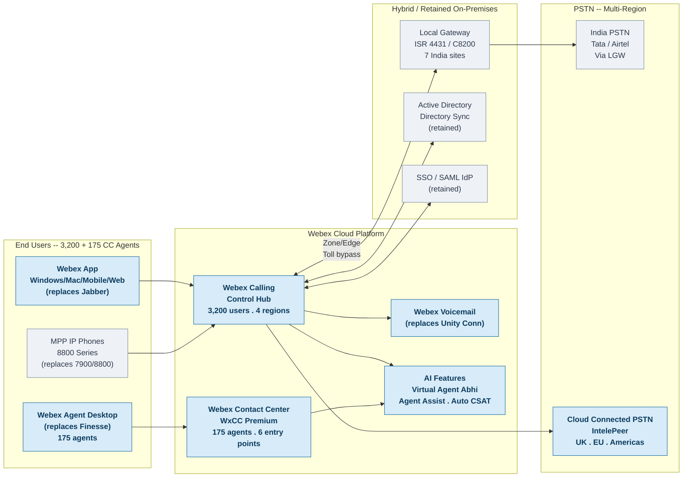

# CUCM & UCCX to Webex Calling & Contact Center Migration

AI-ASSISTED DOCUMENTATION

**Author: Rajmohan M &nbsp;|&nbsp; Website: [abhavtech.com](https://abhavtech.com)**

> Enterprise migration from on-premises Cisco UC to Webex cloud -- 3,200 users . 175 CC agents . 12 global sites . India DoT/TRAI . EMEA GDPR . AI-powered contact center

!!! warning "Knowledge-Sharing Documentation"
    This documentation is produced for illustrative and knowledge-sharing purposes only. It is not formally reviewed, not production-ready, and should not be applied directly to any live environment. All telephone numbers are fictional. Validate all designs independently with qualified engineers and legal/compliance teams.

---

## Architecture at a Glance

### Before -- Existing On-Premises Infrastructure

*Grey = existing on-premises infrastructure. Click diagram to zoom.*

---

### After -- Webex Cloud Platform

*Grey = existing/reused components. **Blue = newly added Webex cloud components.** Click diagram to zoom.*

---

## Migration Scope

| Metric | Value |
|---|---|
| **Total Sites** | 12 global locations |
| **Calling Users** | 3,200 (Phase 1 -- CUCM -> Webex Calling) |
| **CC Agents** | 175 (Phase 2 -- UCCX -> Webex Contact Center) |
| **India Sites** | 7 (Mumbai HQ + Chennai + Bangalore + Delhi + Noida + Pune + Hyderabad) |
| **EMEA Sites** | 2 (London + Frankfurt) |
| **Americas Sites** | 2 (New Jersey + Dallas) |
| **PSTN -- India** | Local Gateway (Tata/Airtel) -- retained for DoT/TRAI compliance |
| **PSTN -- EMEA/Americas** | Cloud Connected PSTN (IntelePeer) |
| **Migration Duration** | 14 weeks (Phase 1) + 10 weeks (Phase 2) |

---

## Documentation Structure

### [Webex Calling ->](chapter2-calling-design/README.md)
Discovery & assessment . Architecture . Location design . Dial plan . PSTN . Feature migration . Coexistence . **Feature Gap Bridge** (survivability, CSS, Extension Mobility, voicemail, MCT)

### [Contact Center ->](chapter3-contact-center/README.md)
UCCX current state . WxCC architecture . Entry points . Queue & team design . Flow Designer / IVR migration . Agent desktop . Digital channels . AI features . CC compliance by region

### [Compliance & Network ->](chapter4-compliance/README.md)
India DoT/TRAI toll bypass . EMEA GDPR data residency . Security architecture . DNS & firewall . Zone/Edge configuration . QoS

### [Implementation ->](chapter6-implementation/README.md)
Control Hub setup . PSTN configuration . Configuration templates

### [Migration Execution ->](chapter7-migration/README.md)
Pre-migration . Site-by-site cutover runbooks . Webex Calling cutover . WxCC cutover (Phase 2) . Rollback . Go-live validation . Hypercare

### [Operations & AI ->](chapter8-operations/README.md)
Monitoring . User onboarding . Change management . Troubleshooting . Virtual Agent "Abhi" . Agent Assist . AI roadmap

### [Appendices ->](appendices/README.md)
Glossary . Checklists (CUCM-Webex + UCCX-WxCC) . India telecom reference . EMEA certifications . DNS & firewall templates . Jabber migration (10F/10G) . Specialty devices (10H) . AI observability (10I)

---

## Key Design Decisions

| Decision | Rationale |
|---|---|
| **India PSTN -- LGW retained** | DoT/TRAI toll bypass requires geographic DID calls to egress from local telecom circle |
| **EMEA PSTN -- CCPP** | No LGW regulatory requirement; Cloud Connected PSTN simpler and cheaper |
| **ITN numbers for India WFH** | Exempt from toll bypass -- no LGW required for remote workers |
| **Zone/Edge -- mandatory India** | Required for geographic DID compliance; not needed for EMEA |
| **Phased migration (Ch1 -> Ch2)** | CUCM first to stabilise calling before migrating contact centre |
| **WxCC Premium licence** | Required for digital channels (chat/email/WhatsApp) and AI features |

---

## Regional Compliance Summary

| Region | Compliance Type | Requirement | Solution |
|---|---|---|---|
| **India** | DoT/TRAI Toll Bypass | Geo DIDs must egress from local circle | Local Gateway per telecom circle |
| **India WFH** | DoT/TRAI | Exempt from toll bypass | ITN numbers (9XXXXXXXXX) |
| **UK** | UK GDPR | Data residency in UK | Webex Calling Region: UK (London DC) |
| **Germany** | EU GDPR + BSI C5 | Data residency in EU | Webex Calling Region: EU (Frankfurt DC) |
| **Americas** | SOC 2 / standard | Standard cloud compliance | Webex Calling Region: US |

---

*© 2025-2026 AbhavTech | Part of the AbhavTech technical documentation portfolio | [abhavtech.com](https://abhavtech.com)*
